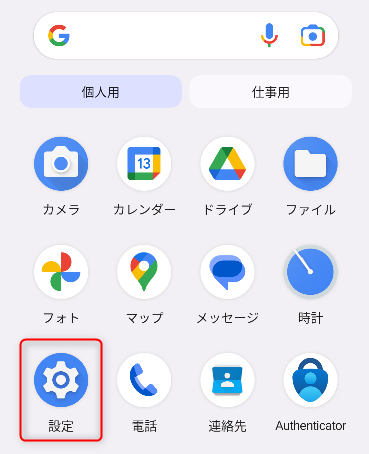
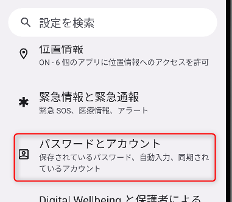
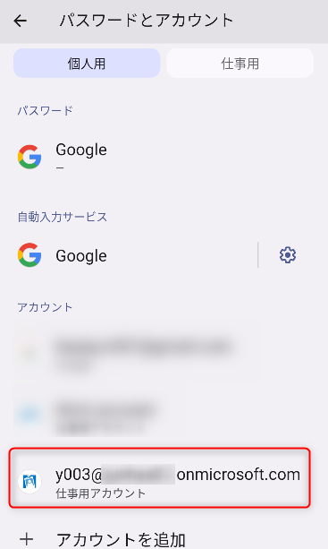
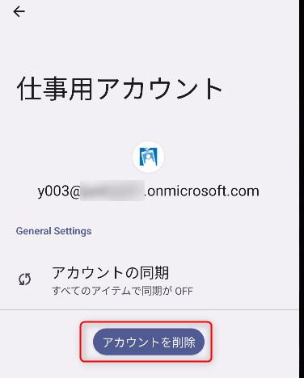
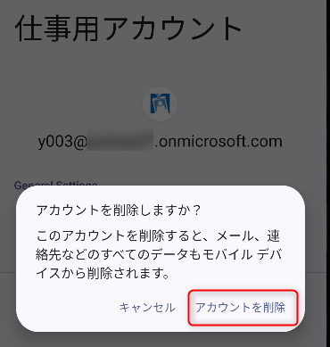
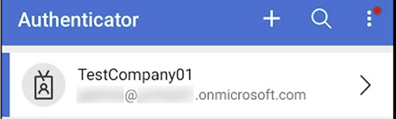
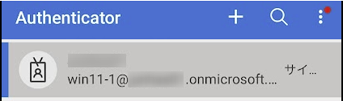
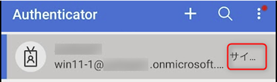

# Android 版 Microsoft Authenticator アプリのグレーアウトしたアカウントの削除方法
こんにちは、Azure & Identity サポート チームの長谷川です。
Android の Microsoft Authenticator アプリにグレーアウトしたアカウントが残り続けている場合があります。グレーアウトしたアカウントは MFA で利用しないため消して整理したいと思われる方も多いと思いますが、この削除方法が少々わかりにくくなっています。
本記事でこの Android 上の Microsoft Authenticator アプリでグレーアウトしたアカウントの削除方法を紹介します。
<!-- more -->

なお、Android はその独自のカスタマイズ性により、利用しているデバイスによって UI が若干異なることがありますので、その点留意ください。本記事の画像は Android 13 の Pixel 8 で作成しています。

##  グレーアウトしたアカウントの削除方法
1. Android 端末の設定アプリを起動します。

2. [パスワードとアカウント] を選択します。

3. アカウントの一覧から削除したいアカウントを選択します。 (※端末によっては [仕事用アカウント] に集約されている場合があります)

4. [アカウントを削除] を選択します。

5. 表示されるポップアップでも [アカウントを削除] を選択します。

6. Microsoft Authenticator アプリ上で対象のグレーアウトしたアカウントが消えていることを確認してください。

## 参考画像
グレーアウトしていない場合

グレーアウトしている場合

## グレーアウトしているアカウントの 「サイ...」 はどんな意味？
グレーアウトしているアカウントに下図のように 「サイ...」 という文字が表示されていることがあります。

これは 「サインイン」 の文字が見切れているとご理解ください。

この状態で再度このアカウントをタップするとサインインが発生し、MFA が要求されます。他の MFA の認証方法がセットアップ済みの場合などその MFA に応答することができた場合はグレーアウトしていない状態になり、再度この Microsoft Authenticator アプリを MFA に利用することができるようになります。

## おわりに
Microsoft Authenticator アプリは弊社の認証だけではなく他社の MFA にも利用できる便利なフリーソフトです。本記事を参考に是非ご活用いただければと思います。
製品動作に関する正式な見解や回答については、お客様環境などを十分に把握したうえでサポート部門より提供しますので、ぜひ弊社サポート サービスをご利用ください。