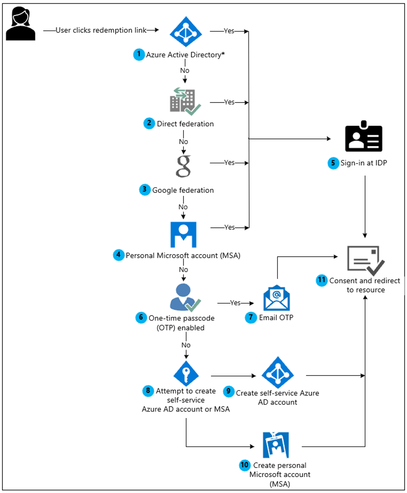
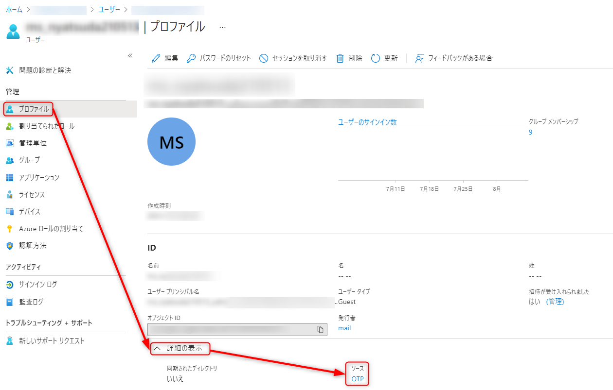

こんにちは、日本マイクロソフト Azure Identity チームの谷津田です。

今回はゲストユーザーの招待において、2021 年 10 月以降にサポートされなくなる動作のアナウンスがありましたので、そのアナウンスついてご案内いたします。
まず、今回の動作変更の詳細については、以下の公開情報でご確認いただけます。
https://docs.microsoft.com/ja-jp/azure/active-directory/external-identities/redemption-experience

> [!IMPORTANT]
> 2021 年 10 月 以降、Microsoft では、B2B コラボレーション シナリオ向けのアンマネージド Azure AD アカウントとテナントを作成することによる招待の利用をサポートしなくなります。 準備として、お客様は、電子メール ワンタイム パスコード認証をオプトインすることをお勧めします。

 これはゲスト ユーザー招待時の動作が一部変更になることを示しております。

本ブログでは、アナウンス内容に関連する以下の内容について上から順にご案内いたしますので、適宜必要な情報をご確認ください。
- [変更による既存ユーザーへの影響](#変更による既存ユーザーへの影響)
- [お勧めと記載の電子メール ワンタイム パスコード認証 (OTP) について](#お勧めと記載の電子メール-ワンタイム-パスコード認証-OTP-について)
- [よくあるご質問](#よくあるご質問)

## 変更による既存ユーザーへの影響

今回のアナウンスは既に招待済みのゲストユーザーにおいては影響を与えることはありません。
あくまで、新規にゲストユーザーの招待を行う際において、招待するユーザーに紐づくテナントの状態に依存して影響があります。

影響の詳細について、ゲストユーザーの招待フローをベースにご紹介します。
以下が現在のゲストユーザーの招待フローです。

今回の影響は、フローの 9 において セルフサービスサインアップアカウントが作成される場合においてユーザーのホーム テナントが存在しない場合、あるいは検証済みのテナントではない場合に生じます。

フロー 9 について abc.onmicrosoft.com というテナントに user1@contoso.com というユーザーを招待しようとしたときを例に説明します。

### パターン 1 : 

- ＜前提条件＞

Azure AD にカスタム ドメインとして contoso.com というドメイン名を登録したテナントがすでに存在している。
contoso.com ドメイン名を登録したテナントには user1@contoso.com は存在しない。

- ＜動作＞
contoso.com が紐づいている Azure AD 上に user1@contoso.com が自動で作成されます。この動作は 2021 年 10 月以降も変わりません。

### パターン 2 : 

- ＜前提条件＞
Azure AD にカスタム ドメインとして contoso.com というドメイン名を登録したテナントが存在していない。
user1@contoso.com は Azure AD のアカウントとして Azure AD のどのテナントにも存在しない。

- ＜動作＞ 
現状は contoso.com が紐づくセルフ サインアップ テナントが自動で作成され、その自動で作成されたテナントに user1@contoso.com が自動で作成されます。2021 年 10 月以降は、このパターンでの自動テナント作成が行われなくなり、結果的にゲスト ユーザーの招待は失敗する見込みです。

なお、セルフサービス サインアップとは、電子メール ドメインに基づいた ID がどの Azure AD にも存在しない場合に自動でユーザーが作成されることを指します。
後述に関連する公開情報もございますので、必要に応じご確認いただけると幸いです。

公開情報では、"サポートされない" という記載になっておりますが、該当の動作については廃止される可能性はございますので、ゲストユーザー招待に関する運用においては可能な限り、該当の動作を避けるようにワンタイム パスコードなどをご利用くださいますようお願い申し上げます。

## お勧めと記載の電子メール ワンタイム パスコード認証 (OTP) について

アナウンスの後半部分に記載の 電子メール ワンタイム パスコード認証については、Azure AD にアカウンがない、Microsoft アカウントがないなどの状況で、アカウントを作成することなく、招待元 Azure AD (リソーステナント) にアクセスできる機能となります。
これまでは、ゲスト招待されたユーザーが Azure AD に所属しないユーザーの場合、上図のフローの通り、フロー 9 で もしくは フロー 10 で パスワードをもつアカウントを作成する必要がありました。
電子メール ワンタイム パスコード認証を利用した場合には、リソーステナントにユーザーのソースが OTP として作成されます。

## よくあるご質問

### Q1. 電子メール ワンタイム パスコード認証を利用したユーザーが Azure Portal にサインインできない場合にどうしたらよいでしょうか？

A1. 電子メール ワンタイム パスコード認証で作成されたゲストユーザーのサインインの動作において、https://azure.portal.com にアクセスできない動作は想定されます。
OTP のユーザーについては、招待を行ったテナント (リソーステナント) の情報を URL に含む形式でアクセスする必要があります。
そのため、URL として、アクセスしたいテナントを指定する際に、例えば、https://portal.azure.com/xxx.onmicrosoft.com のような URL を指定することで、ログインすることが可能です。

### Q2. Azure AD ポータルの External Identities の [すべてのプロバイダー] の Email one-time passcode (Preview)  の設定値で "2021 年 10 月以降、ゲストのメール ワンタイム パスコードが自動的に有効になります。" になっていますが、有効になった際に既存のゲストユーザーにも影響ありますでしょうか？

A2. 結論からお伝えしますと、既存のユーザーへの影響はありません。
ゲストユーザーの招待におけるフローが変更されるという内容になり、新規でゲストユーザーを招待する際にのみ影響があります。
”ゲストのメール ワンタイム パスコードが自動的に有効になる” という設定には、ゲストユーザー招待のフローにおいて、上図のフロー 6 でテナントの設定で自動で YES のフローに流れるというものになります。

### Q3. 今回の変更について、新規で作成される Azure テナントの ワンタイムパスワード パスコードの設定値はどうなりますか？

A3. 2021 年 10 月以降、電子メール ワンタイム パスコード機能は、新規に作成されるテナントにおいて、既定値として有効になることが期待される動作となります。

### Q4. OTP を有効し、ゲストユーザーを作成した後に、テナントの設定で OTP を無効にしましたが、OTP で作成したユーザーはどうなりますか？

A4. 結論からお伝えいたしますと、OTP として作成されたユーザーは、テナント (リソーステナント) へアクセスすることはできません。
そのため、ゲストユーザーの状態引き換え状態をリセットする必要があります。

### Q5. 電子メール ワンタイム パスコード認証を利用することでセキュリティの強化に繋がりますか？

A5. はい、ワンタイムパスワードを利用しない場合と比較し、以下のシナリオでセキュリティ強化に繋がります。 
まず、ワンタイムパスコードを利用しない場合、ホームテナントに所属するユーザーが会社を退職した際に、ホームテナントに該当のユーザーが残っている場合には、退職者は自身の会社 (ホームテナント) のユーザー名とパスワードを利用し、ホームテナントおよびリソーステナントにアクセスすることが可能です。
一方で、ワンタイムパスコードを利用すると、ホームテナントに所属するユーザーが会社を退職した場合、退職者は会社のメールアドレスを利用できなくなるためワンタイムパスコードを受け取ることができず、リソーステナントにアクセスすることはできなくなります。このような状況において、セキュリティの強化に繋がります。
後述に関連する公開情報もございますので、必要に応じご確認ください。

### 公開情報

- [セルフサービス サインアップ]
Azure Active Directory のセルフサービス サインアップについて
https://docs.microsoft.com/ja-jp/azure/active-directory/enterprise-users/directory-self-service-signup

- [ゲストユーザーの招待]
B2B コラボレーションの招待の利用
https://docs.microsoft.com/ja-jp/azure/active-directory/external-identities/redemption-experience

- [よくあるご質問の Q1 関連]
B2B ゲスト ユーザーのワンタイム パスコード認証
https://docs.microsoft.com/ja-jp/azure/active-directory/external-identities/one-time-passcode

> [!NOTE]
> ワンタイム パスコードのユーザーは、テナントのコンテキストを含むリンクを使用してサインインする必要があります (たとえば、https://myapps.microsoft.com/?tenantid=<tenant id> や https://portal.azure.com/<tenant id>、または検証済みのドメインの場合は https://myapps.microsoft.com/<verified domain>.onmicrosoft.com)。

- [よくあるご質問の Q4 関連]
電子メール ワンタイム パスコードを無効にする
https://docs.microsoft.com/ja-jp/azure/active-directory/external-identities/one-time-passcode#disable-email-one-time-passcode
 > [!NOTE]
 > お使いのテナントで電子メール ワンタイム パスコード機能が有効になっているときに、それを無効にした場合、ワンタイム パスコードを利用していたゲスト ユーザーは全員サインインできなくなります。 別の認証方法を使用してもう一度サインインできるように、利用状態をリセットすることができます。

- [よくあるご質問の Q5 関連]
ワンタイム パスコードのゲスト ユーザーに対するユーザー エクスペリエンス
https://docs.microsoft.com/ja-jp/azure/active-directory/external-identities/one-time-passcode#user-experience-for-one-time-passcode-guest-users
> [!NOTE]
> ワンタイム パスコードのゲスト ユーザーに対するユーザー エクスペリエンス
> セッションの有効期限により、ゲスト ユーザーが自分の会社を退職したりアクセスを必要としなくなったときに特に、セキュリティが強化されます。

以上の情報がご参考になれば幸いです。
ご不明な点がございましたら弊社サポートまでお気軽にお問い合わせください !