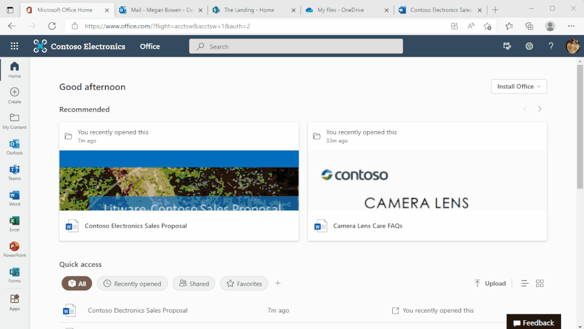

# Microsoft 365 Web アプリでアカウントの切り替えが可能に

こんにちは、Azure Identity サポート チームの 高田 です。

本記事は、2022 年 4 月 27 日に米国の Azure Active Directory Identity Blog で公開された [Announcing account switching for Microsoft 365 web apps!](https://techcommunity.microsoft.com/t5/azure-active-directory-identity/announcing-account-switching-for-microsoft-365-web-apps/ba-p/3290634) を意訳したものになります。

不明点がありましたら、弊社サポート チームまでお問い合わせください。

----

皆さん、こんにちは。

本日、Micorosft 365 においてアカウントの切り替えが可能となったことをお知らせいたします。この機能についてはお客様より強いご要望いただいていたもので、サインアウトしてサインインしなおすのはもう不要となります。複数の Azure Active Directory カウント間で、もしくは複数の Microsoft アカウント間で、それかその組み合わせでも切り替えをご利用いただけます。

Office.com や Web 版の Word、Excel、PowerPoint、Outlook、OneDrive、SharePoint を含む Microsoft 365 Web アプリにてご自身でアカウントの切り替えをお試しいただけます。アカウントの切り替え機能についいて詳細を確認されたい場合は、Microsoft 365 チームが執筆した [詳細なブログ記事](https://techcommunity.microsoft.com/t5/microsoft-365-blog/announcing-account-switching-for-microsoft-365-web-apps/ba-p/3290787) をご覧ください。

クリック一つでアカウントの切り替えができる機能は、Office デスクトップ アプリでもすでに利用可能です。Teams を含めて、今後より多くのデスクトップもしくはモバイル アプリでこの機能が提供される予定です。

フィードバックやご提案がありましたら、ぜひお知らせください。[Azure AD フィードバック フォーラム](https://feedback.azure.com/forums/169401-azure-active-directory) まで投稿いただければと思います。

Alex Simons (Twitter: [@Alex_A_Simons](http://twitter.com/alex_a_simons))  
Corporate Vice President of Program Management  
Microsoft Identity Division