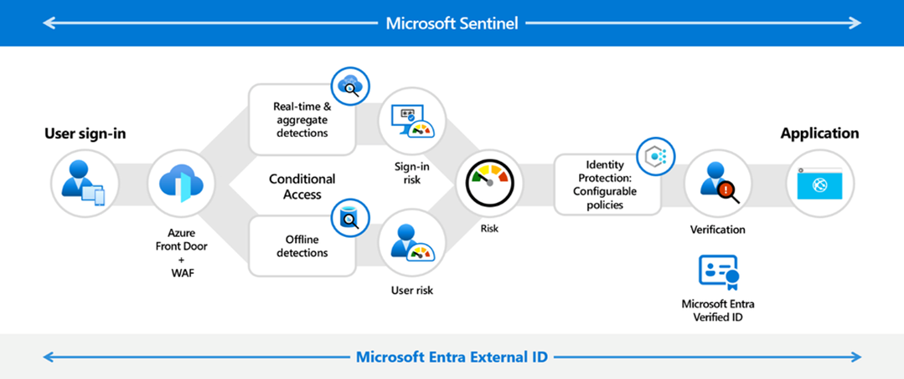
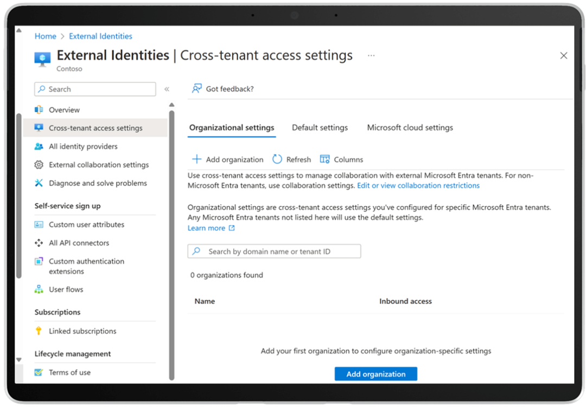
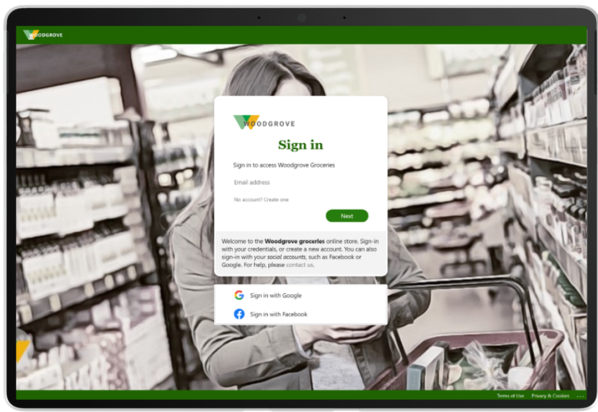
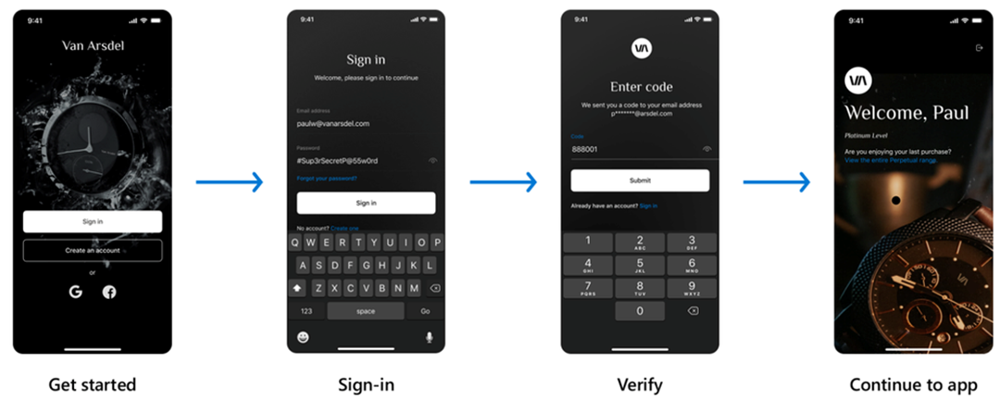

# Microsoft Entra External ID が一般提供 (GA) されました

こんにちは、Azure Identity サポート チームの 川里 です。

本記事は、2024 年 5 月 1 日に米国の Microsoft Entra (Azure AD) Blog で公開された [Announcing General Availability of Microsoft Entra External ID - Microsoft Community Hub](https://techcommunity.microsoft.com/t5/microsoft-entra-blog/announcing-general-availability-of-microsoft-entra-external-id/ba-p/3974961) を意訳したものになります。ご不明点等ございましたらサポート チームまでお問い合わせください。
 
----

次世代の顧客 ID アクセス管理 (CIAM: Customer Identity Access Management) 機能を実現する開発者向けソリューションである「**Microsoft Entra External ID**」が **5 月 15 日から一般公開 (GA) されたこと** をお知らせします。External ID では パートナー向けアプリケーション、企業のお客様向けアプリケーション、消費者向けアプリケーションを構築するいずれの場合においても、安全かつシンプルに CIAM をカスタマイズすることができます。

## Microsoft Entra External ID
 
**External ID のアプリケーションへのアクセスをセキュリティで保護し、カスタマイズ可能にします。**
 

 
Microsoft Entra External ID を使用すると、次のことが実現できます。
 
- ひとつのソリューションですべての ID を保護 
- セキュアな協業を効率的に実現
- エンド ユーザーにストレスを与えない 
- セキュアなアプリケーションの開発を加速 

## ひとつのソリューションですべての ID を保護

顧客、パートナー、ビジネス顧客などの外部の ID とそのアクセス ポリシーの管理は、特にユーザー数が増え、セキュリティ要件が進化する複数のアプリケーションを管理する場合、管理者にとって複雑でコストがかかりがちです。External ID を使用すると、すべての ID 管理を Microsoft Entra のセキュリティと信頼性の下に統合できます。Microsoft Entra を用いることで、すべての ID の種類を管理するための統一された一貫性のあるエクスペリエンスが提供され、コストと複雑さを軽減しながら ID 管理を簡素化できます。 
 
External ID を Entra ID と同じスタック上に構築することで、迅速なイノベーションが可能になり、管理者は、業界をリードする適応性のあるアクセス ポリシー、不正防止、検証可能な資格情報、既定で用意されている ID ガバナンスなど、現在使用している Microsoft Entra の機能を外部の ID にも拡張できます。早期導入いただいたお客様は、単一のプラットフォームからすべての ID タイプを管理できるため、CIAM ソリューションとして External ID を選択しました。 

**「Komatsu は、すべての外部向けアプリケーションに Entra External ID を使用しています。これにより、お客様に素晴らしい体験を提供するとともに、ビジネスがしやすい信頼できるパートナーであることをお客様に示すことができています。」**  
**Michael McClanahan 氏 (副社長, トランスフォーメーション担当兼 CIO)**

## セキュアな協業を効率的に実現

消費者と企業顧客の境界は曖昧になりつつあり、パートナーと従業員の境界も曖昧になっています。法人顧客やパートナーなどの外部のユーザーとの協業を行う際には困難が伴うことがあります。業務を遂行するために適切な内部リソースにアクセスする必要がありますが、セキュリティ リスクを軽減し、内部データを保護するために、そのアクセスが不要になったら適宜削除する必要があります。変化の激しい世界では、信頼できる協業関係であっても、最小特権の保護、強力なガバナンス、全体を通したブランディングが必要です。[Microsoft Entra ID Governance](https://learn.microsoft.com/ja-jp/entra/id-governance/manage-guest-access-with-access-reviews) を使用すると、従業員と同じライフサイクル管理とアクセス管理機能をビジネス ゲストにも活用できます。ゲスト ガバナンス機能は、世界中の Entra のお客様によって既に広く使用されている [B2B コラボレーション機能](https://learn.microsoft.com/ja-jp/entra/external-id/what-is-b2b) を補完し、協業を安全かつシームレスに実現します。  

たとえば、新しいキャンペーンで外部のマーケティング代理店と協業したい場合があるとします。B2B コラボレーション機能にて、代理店のスタッフをゲストとしてテナントに招待し、コミュニケーション用の Teams チャネル、プロジェクト管理用の SharePoint サイト、ファイル共有用の OneDrive フォルダーなどの関連リソースへのアクセスを割り当てることができます。[テナント間アクセス設定](https://learn.microsoft.com/ja-jp/entra/external-id/cross-tenant-access-overview) を使用すると、特定の外部テナントのどのユーザーがリソースにアクセスできるかをきめ細かく制御したり、内部ユーザーがアクセスできる外部組織を制御したりできます。 [External ID の ID ガバナンス](https://techcommunity.microsoft.com/t5/microsoft-entra-blog/microsoft-entra-id-governance-licensing-for-business-guests/ba-p/3575579) は、非アクティブな状態が一定期間続いた場合や、プロジェクトが完了したタイミングで、自動的にアクセス権をレビューし取り消します。これにより、スムーズに協業しながら、許可された外部ユーザーのみが内部リソースとデータにアクセスできるようにすることができます。 

## エンド ユーザーにストレスを与えない 

パーソナライズされた柔軟なユーザー エクスペリエンスは、お客様が製品を採用し、継続利用するために不可欠です。External ID を使用すると、安全な認証エクスペリエンスを Web アプリやモバイル アプリにネイティブに統合することで、サインイン時のエンド ユーザーの負担を軽減できます。 External ID では、Google、Facebook などのソーシャル ID、ローカル アカウント、フェデレーション アカウント、さらには検証可能な資格情報など、[さまざまな認証](https://learn.microsoft.com/ja-jp/entra/external-id/identity-providers) オプションを活用して、エンドユーザーが簡単にサインアップ/サインインできるように構成可能です。External ID を使用すると、エンドユーザーにブランドを印象付け、プロファイリング機能と併せてユーザーに使いやすい魅力的なエクスペリエンスを作成し、エンド ユーザーの満足度とブランドへの愛着を高めることができます。 

External ID を使用すると、エンド ユーザー データを収集して分析し、プライバシー規制に準拠しながらユーザーの一連の体験を改善することで、エンド ユーザー体験をさらにパーソナライズおよび最適化できます。[ユーザー インサイト ダッシュボード](https://learn.microsoft.com/ja-jp/entra/external-id/customers/how-to-user-insights) では、ユーザー アクティビティとサインアップ/サインインの傾向を確認でき、データを使用してエンド ユーザー体験の戦略を評価および改善できます。  

## セキュアなアプリケーションの開発を加速

ID は最新のアプリケーションの基盤となる構成要素ですが、多くの開発者は ID とセキュリティをアプリに統合した経験がほとんどないという状況です。External ID を使用すると、数回クリックするだけで ID を Web アプリケーションやモバイル アプリケーションに簡単に統合可能です。開発者は、Microsoft Entra ポータルから直接、または [Visual Studio Code](https://learn.microsoft.com/ja-jp/entra/external-id/customers/visual-studio-code-extension) などの開発者ツール内で、初めてのアプリケーション作成を数分で開始できます。先日、[ネイティブ認証](https://learn.microsoft.com/ja-jp/entra/external-id/customers/concept-native-authentication) が Android と iOS をサポートすることを発表しました。これにより開発者は API または Microsoft Authentication Library (MSAL) を使用して、モバイル アプリ、思いどおりにサインアップとサインインのユーザー体験を構築できるようになりました。 

**「モバイル アプリのサインイン体験を設計および構築するには、数か月かかることもありましたが、Microsoft Entra External ID の Native Auth を使用すると、わずか 1 週間で機能的に同等で、さらに安全なソリューションを構築できました。」**  
**Gary McLellan 氏 (エンジニアリング フレームワークおよびコア モバイル アプリ責任者、Virgin Money)**

Microsoft Entra の信頼性と回復性に支えられ、さらに開発者は増大するユーザーのニーズにも対応できるように設計されたグローバルな分散アーキテクチャを利用して、アプリの開発を進められるのです。負荷がピークの場合も、何百万人ものユーザーを処理可能であるため、エンド ユーザー体験が中断されたり、セキュリティを損なうことはありません。

## ぜひお試しください！
 
現在、2024 年 7 月 1 日まで、すべての機能の無料試用版を延長しています。 [Microsoft Entra External ID](https://aka.ms/ExternalIDConsumerApps) を使用して、今すぐ外部向けアプリケーションをセキュリティで保護しましょう。
 
7 月 1 日以降も無料で開始でき、ビジネスの成長に合わせて使用した分だけお支払いいただけます。Microsoft Entra External ID のベースとなる料金体系は、最初の 50,000 人の月間アクティブ ユーザー (MAU) に対して無料となっており、それ以降の追加のアクティブ ユーザーは、月間アクティブ ユーザー (MAU) あたり 0.03 米国ドルです (2025 年 5 月までは、 MAU あたり 0.01625 米国ドルの発売割引価格です)。External ID の料金とアドオンについて詳しくは、[よくある質問](https://learn.microsoft.com/ja-jp/entra/external-id/customers/faq-customers) をご覧ください。

*Azure AD External Identities P1/P2 SKU に基づく Azure AD B2C または B2B コラボレーションの既存のサブスクリプションは引き続き有効であり、移行は必要ありません。アップグレード オプションが利用可能になり次第、お知らせします。マルチテナント組織の場合、UserType が外部メンバーである ID は、外部 ID MAU の一部としてカウントされません。[詳細情報はこちらをご参照ください](https://learn.microsoft.com/ja-jp/entra/external-id/customers/faq-customers)。

## 詳細情報

External ID について詳しく知りたい場合は、次のリソースを確認ください。 
 
- [ウェブサイト](https://www.microsoft.com/ja-jp/security/business/identity-access/microsoft-entra-external-id)
- [ドキュメント](https://learn.microsoft.com/ja-jp/entra/external-id/)
- [デベロッパー センター](https://developer.microsoft.com/ja-jp/identity/external-id)
