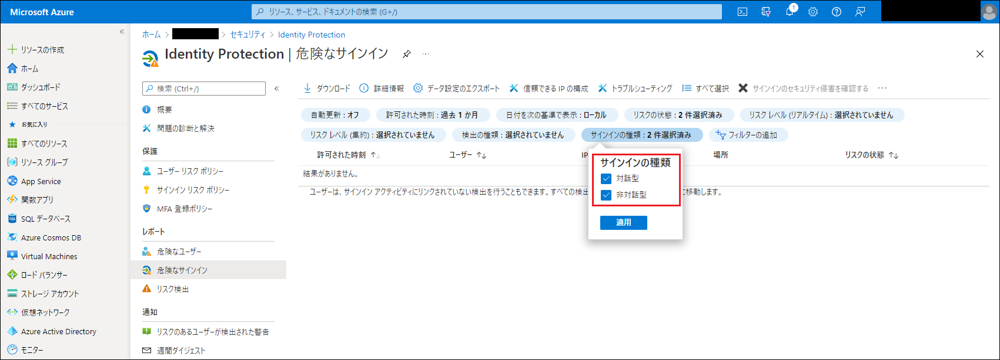

# Identity Protection のシグナル品質と表示の向上

こんにちは、Azure Identity サポート チームの 村上 です。

本記事は、2021 年 9 月 23 日に米国の Azure Active Directory Identity Blog で公開された [Announcing Improved Identity Protection Signal Quality and Visibility](https://techcommunity.microsoft.com/t5/azure-active-directory-identity/announcing-improved-identity-protection-signal-quality-and/ba-p/2464410) を意訳したものになります。ご不明点等ございましたらサポート チームまでお問い合わせください。

---

皆さん、こんにちは。

本日は、Identity Protection のリスク評価とレポート表示の改善をご紹介します。これらの改善により、新たな攻撃ベクターをより検知できるようになり、それによりお客様が最も重要なアラートに集中できるようになります。検出のシグナル品質を向上させることにより、低リスクに該当するサインインのアラート量を 60 % 以上削減するとともに、セッション クッキーの [見慣れないサインインプロパティ] を導入し、さらに非対話型のリスクのあるサインインをレポートに表示できるように改善しました。

以下では、Identity Security チームのシニア プログラム マネージャーである Sarah Handler と、同チームのデータ サイエンティストである Feifan Jian が、これらの改善点とその背景にあるデータ サイエンスをご紹介します。

---

皆さん、こんにちは。

今回ご紹介する改善点は、組織のより良い ID 保護、そして調査におけるユーザー体験の向上です。ID ベースの攻撃は、昨年から進化および拡大しています。この攻撃に対応するため、私たちチームはアラートの検知範囲を拡大するとともに、より信頼性の高いアラートを表示するようにし、お客様が重要な問題に集中できるようシステムを改善しました。 

まず、見慣れないサインインのプロパティが検出する範囲を拡大することにより、非対話型のサインインを検出することができるようになりました。見慣れないサインインのプロパティは、ユーザーの現在のサインインと過去のサインインの傾向がどれだけ異なるかをリアルタイムに評価します。以前までは、上記の検出は対話型のサインインに対してのみ行われていましたが、現在はセッション クッキーも評価に含むよう改善しました。ほとんどのテナントでは、この機能によって見慣れないサインインのプロパティの検出数が大幅に増加することはありませんが、見慣れないサインインのプロパティのフラグが立てられた非対話型のサインインは、トークンのリプレイ攻撃の可能性があるため、より慎重に確認する必要があります。

非対話型の見慣れないサインインのプロパティの検出結果は、[リスク検出] および [危険なサインイン] のレポートで確認可能です。危険なサインイン レポートでは、既定で対話型および非対話型の両方を表示するようにいたしました。下図のとおり、[サインインの種類] フィルターを使用することで、表示を切り替えることができます。

(Azure Active Directory > セキュリティ > Identity Protection > 危険なサインイン)

さらに、危険なサインインのうち、低リスクに該当する信号対雑音比 (S/N 比) を大幅に改善しました。多くのお客様より、調査する際に低リスクのサインインが多すぎるというご意見をいただいておりました。管理者やセキュリティ担当者が、最も重要な検出に集中できるようにするため、シグナル品質と検出方法を改善いたしました。その結果、低リスクの危険なサインインに対するアラート数を **60% 以上削減し、同時に精度を大幅に向上させました。**
 
今回の変更を担当したデータ サイエンティストの Fefian Jian 氏に、どのように実現したかを聞いてみましょう。

## 変更の裏側: 今回の改善を支えるデータ サイエンス

Identity Protection の検知システムは、リアルタイム (認証時) とオフライン (認証後) の両方で実行され、サインインやユーザーが侵害されているかどうかを判断します。認証後に実行されるオフライン機械学習モデルは、サインインを複数の異なる機能とアルゴリズムで採点し、侵害されたサインインかどうかを判断します。このモデルの出力は、サインインのリスク レベルを集約したものであり、つまりサインインが侵害されているかどうかの最新の評価結果となります。

今回、オフラインの機械学習モデルに変更を加えることで、精度を向上させ、リスクの低い危険なサインインのノイズ (アラート) を低減しました。この変更により、**リスクが少ないサインインのアラート数が 60% 以上減少**し、アラートの質を意味する精度が **100％ 向上**しました。つまり、お客様の環境においてリスクの低い危険なサインインのアラート数が減り、検知の質は向上するということになります。

## これらの改善された機能を是非ご利用ください

ご案内した改善は Identity Protection に自動的に展開されており、本日から機能をご利用することができます。お客様の環境を最大限に保護し、リスク評価の恩恵を得るためには、条件付きアクセス ポリシーを設定することで、組織内の危険なサインインや危険なユーザーを自動的に修復することをお勧めします。詳しくは、[方法:リスク ポリシーを構成して有効にする](https://docs.microsoft.com/ja-jp/azure/active-directory/identity-protection/howto-identity-protection-configure-risk-policies) をご覧ください。 

よりセキュアな環境にしましょう！

Sarah Handler (@sarahhandler)  
Senior Program Manager  
Microsoft Identity Security and Protection Team  

Feifan Jian  
Data Scientist II  
Microsoft Identity Security and Protection Team
