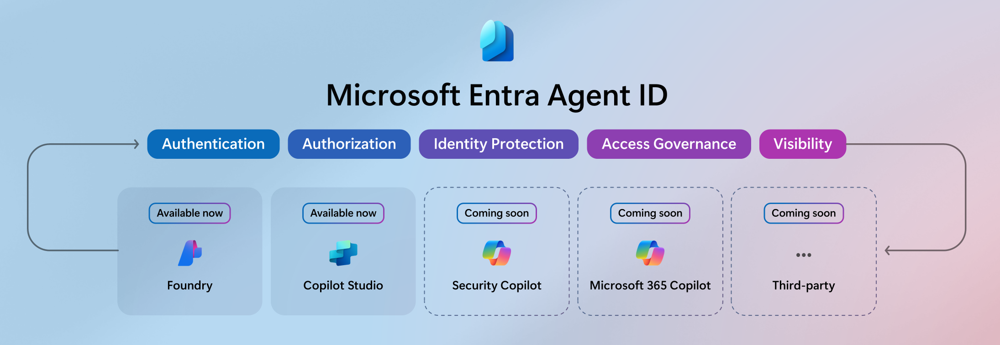
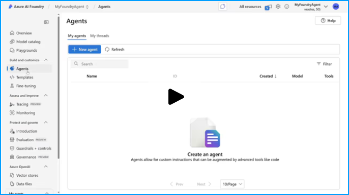
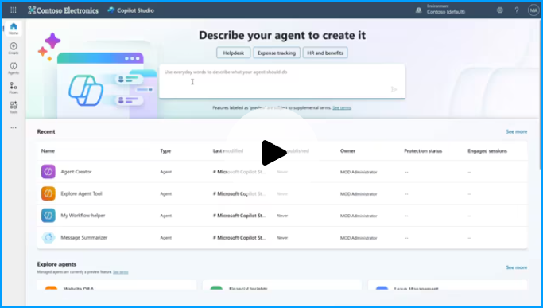
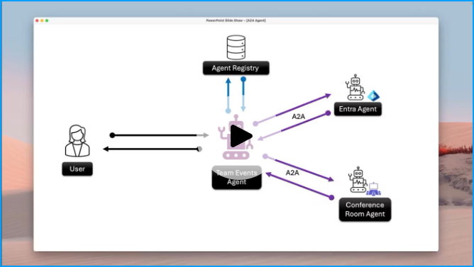

# Microsoft Entra ID でサービス プリンシパルが必須に

こんにちは、Azure Identity サポート チームの 高田 です。

本記事は、2025 年 5 月 19 日に米国の Microsoft Entra (Azure AD) Blog で公開された [Announcing Microsoft Entra Agent ID: Secure and manage your AI agents](https://techcommunity.microsoft.com/blog/microsoft-entra-blog/announcing-microsoft-entra-agent-id-secure-and-manage-your-ai-agents/3827392) の抄訳です。ご不明点等ございましたらサポート チームまでお問い合わせください。

----

## 組織が持つ AI エージェントの可視化は人に紐づかない ID に対する包括的な ID およびアクセス管理ソリューションの最初のステップ
 
皆さん、こんにちは！ 

AI エージェントはもはや単なるツールではなく、我々がより知的かつ生産的に働けるようそのスピードを加速するようなものとなる、新しい時代に突入しています。一方で、AI エージェントの構築と導入を進める中で、これらの人間以外の存在を追跡するのがかなり大変だということが分かってきました。これらのエージェントが非常に強力なのは、複雑なタスクを自律的に処理し、仮想のチームメイトのように振る舞う能力があるからですが、それが逆にリスクともなりえるのです。そのため、エージェントの ID を追跡し、そのライフサイクルと権限を管理し、組織のリソースへのアクセスを慎重に保護することが重要です。 

弊社が掲げる目標はシンプルで、皆様が従業員の ID に期待しているものと同じ保護および制御を、新しいデジタル チームメイトである AI エージェントにも提供するということです。これを念頭に置いて、[本日 Microsoft Build で発表された](https://aka.ms/SecurityforAIBuildnews) **Microsoft Entra Agent ID** のパブリック プレビューについて詳しく共有いたします。この最初のリリースでは、[Microsoft Copilot Studio](https://aka.ms/Build2025/CopilotStudioBlog) と [Azure AI Foundry](https://aka.ms/Build25/HeroBlog/Foundry) 全体で作成されたすべてのエージェント ID に対して、それらを統合するディレクトリが導入されました。つまり、エージェントが開発者によって構築されたのか、非開発者 (IT を利用するユーザー) によって構築されたのかに関係なく、Microsoft Entra 管理センターでそれらのエージェントを表示し、安全に管理できるようになります。 

今後 6 か月の間に、Microsoft Entra Agent ID のアクセス管理、セキュリティ、ID ガバナンス機能をさらにリリースし、さらに Security Copilot、Microsoft 365 Copilot、およびサードパーティ ソリューションのエージェントのサポートもリリースする予定です。

## 試してみるには

組織が AI ソリューションを採用する際には、ID の可視化機能が非常に重要で、どのエージェントが貴社環境にアクセスできるかを明確に確認できる必要があります。本日より、Microsoft Entra 管理センターに新しいアプリケーションの種類が追加され、これらのエージェント ID をフィルターして表示できるようになりました。エージェント ID のアプリケーションの種類を使用すると、ディレクトリ内で見つかったエージェント ID をすばやく一覧して棚卸しできます。 

お手元の環境で試してみるには、Microsoft Entra 管理センターにサインインし、[エンタープライズ アプリケーション](https://entra.microsoft.com/#view/Microsoft_AAD_IAM/StartboardApplicationsMenuBlade/~/AppAppsPreview) に移動します。リスト ビューの上部にあるフィルターから、[アプリケーションの種類] のドロップダウンを [エージェント ID (プレビュー)] に設定します。これによりエンタープライズ アプリケーションの一覧が絞り込まれ、テナントに登録されている AI エージェント (Copilot Studio または Azure AI Foundry を介して作成) が表示されます。

![エージェント ID は、Microsoft Entra 管理センターの [エンタープライズ アプリケーション] 内で表示でき、ここでは Microsoft Entra エージェント ID のパブリック プレビューのスクリーンショットが示されています。](./announcing-microsoft-entra-agent-id-secure-and-manage-your-ai-agents/pic2.png)

本日より、Azure AI Foundry と Copilot Studio にて作成されたすべてのエージェントは、作成者が誰であっても既定で Microsoft Entra 管理センターに表示されるようになります。ユーザー操作は必要はありません。

## 実際の動作

**Azure AI Foundry と Microsoft Entra エージェント ID のデモが以下です (元の英語記事が開きます):**

**Copilot Studio と Microsoft Entra Agent ID のデモが以下です (元の英語記事が開きます):**

## Microsoft Entra エージェント ID の今後

現在利用可能な機能は、AI エージェントの ID を保護し管理するとう長いロードマップの最初のステップです。お客様が可視化以上のものを必要としていることを弊社は理解しておりますので、AI エージェントとそれらがアクセスするリソースに対する制御を今後強化していくための次の機能の開発に取り組んでおります。

例えば、Microsoft Entra Agent ID の対象範囲を、Microsoft の AI プラットフォームを使用して構築されたエージェントだけでなく、他のさまざまな AI 開発ツールで構築されたエージェントにも拡大していく予定です。 

今後数か月以内に、ゼロ トラストのセキュリティ体制を強化し、開発者と ID 担当者がより生産的に過ごせるようにするエキサイティングな新機能を Microsoft Entra Agent ID に導入してまいります。

**開発者向け:**

- **既定で用意されたセキュリティ制御**: Microsoft Entra のエージェント ID は、特定のファイルや Teams チャネルへのアクセスなどエージェントが必要とするリソースに対して、Just-In-Time かつスコープの制限されたトークンを要求するという、最小特権のアプローチによって制御されます。
- **エンタープライズ レベルの迅速なオンボーディング**: エージェント ID は Microsoft Entra において独立した新しい ID であるため、ID 担当者は、アプリやユーザーに既に使用しているのと同じツールを使用して、組織内のエージェントを検出、承認、監査できます。追加のセキュリティ レビューなどは必要ありません。カスタムの OAuth フローもありません。
- **スケーラブルである**: 一度登録すれば、エージェントは他の Microsoft Entra テナントにも ID を持つことができます。それぞれのテナントで独自のポリシーを構成しつつ、コードベースおよびテレメトリは一つにとどめておくということが可能です。

**ID 管理者向け:**

- **より豊富なアクセス制御**: きめ細やかな条件付きアクセス ポリシーとアクセス許可を設定することで、リアルタイムのデータとコンテキストに基づいて、AI エージェントが必要なリソースにのみアクセスするように構成できます。
- **ライフサイクル管理の強化**: 最小特権のアクセスを最初から自動化して適用し、エージェント ID の作成から廃止まで、ユーザーやサービスと同じ厳格さで AI エージェント ID を管理できます。
- **監査と監視の拡張**: コンプライアンスとセキュリティの監視を実現するために、エージェントのアクティビティに関して詳細なログと可視化機能が提供されます。これにより、各エージェントがどのようなアクションを実行しているかを追跡できます。 

## 業界、パートナー、そして皆様とのコラボレーション

弊社は常に、セキュリティはチーム スポーツであると申し上げてきましたが、これは特に AI エージェントとその ID を保護する上で当てはまります。だからこそ、弊社はこれまで業界全体と連携して様々なことを成し遂げてきました。2 週間前ですが、Microsoft は [Agent2Agent (A2A) プロトコルのサポート](https://www.microsoft.com/en-us/microsoft-cloud/blog/2025/05/07/empowering-multi-agent-apps-with-the-open-agent2agent-a2a-protocol/) を発表し、業界と積極的に協力して、このプロトコルに加え、現在ポピュラーとなった MCP プロトコルについても、エンタープライズ グレードの ID サポートを設計してまいります。  

ここでは、実際のコードで動作する A2A のデモをご紹介します (元の英語記事が開きます)。このデモに際しては、Azure AI Foundry と Microsoft Entra エージェント ID を使用しており、Entra 内の登録情報から一連の Entra エージェントと会議室エージェントを取得して、それらを使用して会議室を予約し、さらにチーム メンバーを招待する Teams エージェントを作成しました。

本日、**ServiceNow および Workday との提携** についても発表いたします。その一環として、Microsoft Entra Agent ID を ServiceNow AI Platform および Workday Agent System of Record と統合します。これにより、人間の従業員と一緒に職務を遂行するエージェント ID の自動プロビジョニングが可能になります。並行して、ServiceNow と Workday のエージェント対応アプリケーションをそれぞれ Microsoft Entra Agent ID と統合し、ServiceNow または Workday で作成されたすべてのエージェントが独自の ID を持つようになります。 

弊社ビジョンは、包括的なエージェント ID とアクセス管理を提供し、AI が組織のワークフローにとって不可欠なものになるときに、お客様に安心していただけるようになるということです。Microsoft Entra Agent ID の今後の展開が非常に楽しみであり、いつものように、これらの新機能をぜひ皆様にお試しいただきたいと考えています。以下のコメントセクションでご意見をお聞かせください。 

皆様と共に、人間やエージェントのすべての ID が管理され保護されていることを確かなものにしていきましょう。

— Alex Simons  
Corporate VP, Microsoft Entra
