# MFA に Microsoft Authenticator アプリをセットアップする手順

こんにちは、Azure Identity サポート チームの 長谷川 です。

多くの方に Azure AD の MFA (多要素認証) を利用いただいておりますが、Azure AD の MFA で広く利用される認証方法として Microsoft Authenticator アプリがあります。
この Microsoft Authenticator アプリを利用する際は事前にセットアップが必要ですが、公開されているセットアップ手順はスクリーンショットなどが古いものとなっています。

そこでこの記事では、最新のスクリーン ショットを利用した Microsoft Authenticator アプリのセットアップ手順を紹介します。

## セットアップ手順
1. PC で https://aka.ms/mysecurityinfo にアクセスし Microsoft Authenticator アプリをセットアップしたいユーザーの ID/Password を入力してサインインします。

2. [サインイン方法の追加] を選択します。
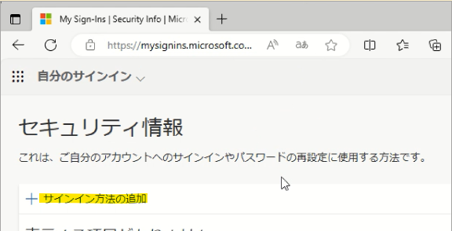

3. [方法を追加します] でプルダウンから [認証アプリ] を選択します。
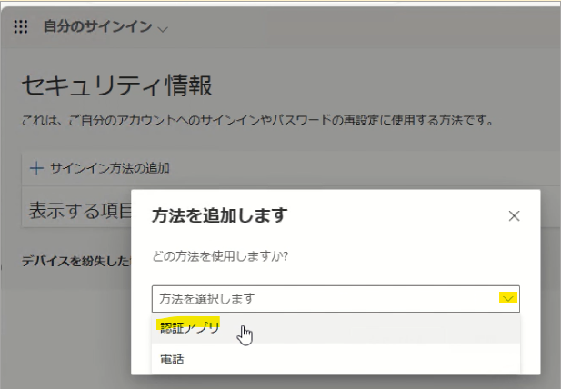

4. [追加] を選択します。
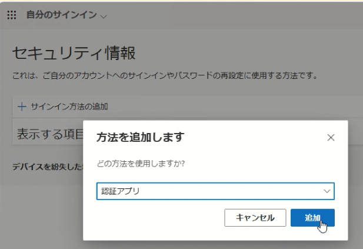

5. 次の画面で Microsoft Authenticator アプリのインストールが促されますのでスマートフォンの操作に移り、スマートフォンに Microsoft Authenticator アプリを未インストールの場合はインストールします。
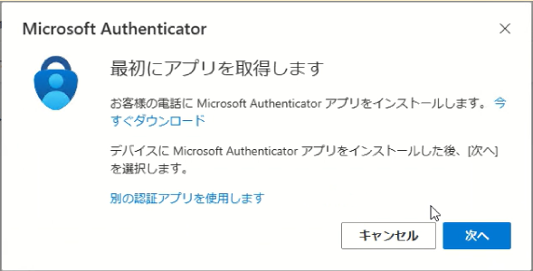

6. スマートフォン上で Microsoft Authenticator アプリをインストール完了後、続けて Microsoft Authenticator アプリを起動します。起動すると診断データの収集の確認メッセージが表示されますので [承諾する] を選択します。
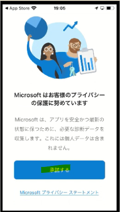
 
7. [Microsoft Authenticator の品質向上にご協力ください] は任意選択して [続行] を選択します。
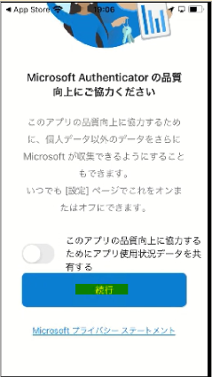

8. [デジタル ライフを保護する] は任意のためこのサンプルではいったん [スキップ] します。
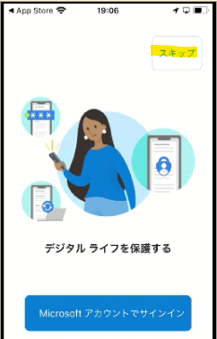

9. [初めてのアカウントを追加しますか？] で [アカウントの追加] を選択します。

10. [職場または学校アカウント] を選択します。
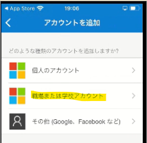

11. [QR コードをスキャン] を選択します。

12. ["Authenticator" がカメラへのアクセスを求めています] は [OK] を選択します。
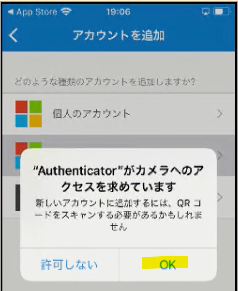

13. カメラでの撮影モードの状態になるのでいったん PC の操作に戻ります。
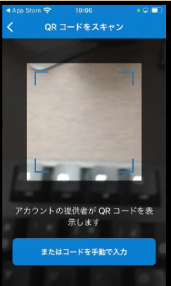

14.  [次へ] を選択します。

15. [アカウントのセットアップ] の画面で [次へ] を選択します。
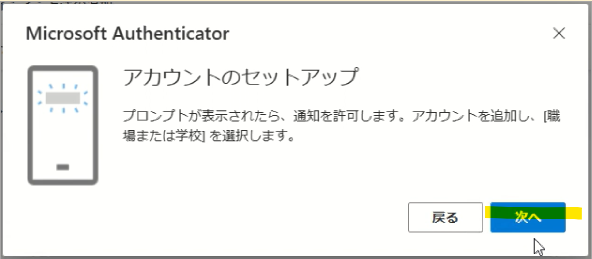

16. QR コードが表示されますので 手順 13 で撮影モードになっているスマートフォンで QR コードを撮影します。

17. ["Authenticator"は通知を送信します。よろしいですか？] で [許可] を選択します。
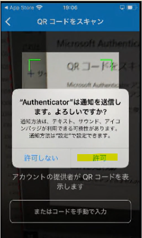

18. 以下のようにアカウントが追加されたら PC の操作に戻ります。

19. [次へ] を選択します。
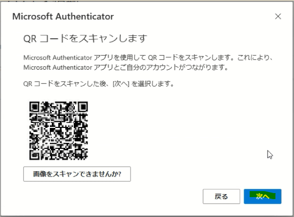

20. 実際に応答できるかのテストが始まります。PC 上の画面 (左) に表示された数字 (認証の都度変わります) を Microsoft Authenticator アプリ上で入力し [はい] を選択します。
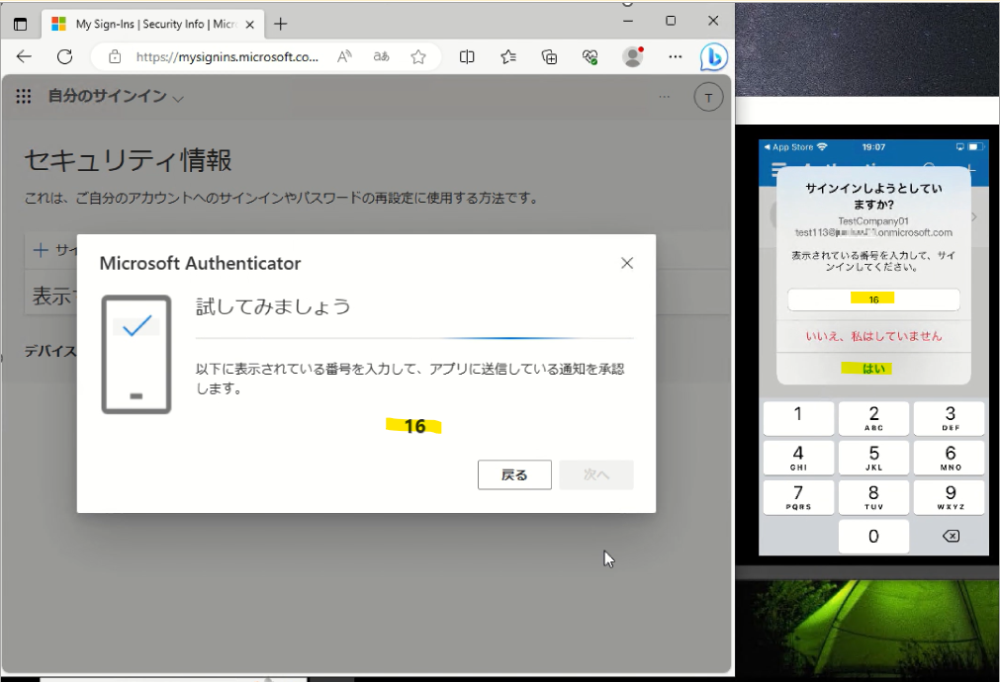

21. PC 上と Microsoft Authenticator アプリ上の両方に承認のメッセージが表示されますので PC 上で [次へ] を選択します。
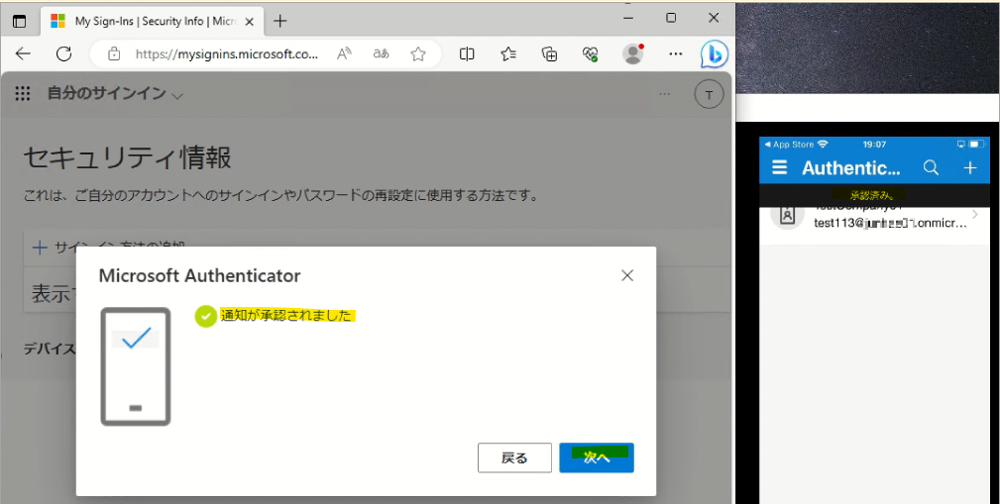

22. PC 上で Microsoft Authenticator アプリが追加されたことを確認してセットアップ作業終了です。

## おわりに

以上、MFA に Microsoft Authenticator アプリをセットアップする手順をお送りしました。
Microsoft Authenticator アプリは音声通話や SMS など電話網を利用した MFA よりもセキュアな認証方法です。本記事を活用して多くの方に Microsoft Authenticator アプリをご利用いただきセキュリティ向上の一役を担えれば嬉しく思います。
製品動作に関する正式な見解や回答については、お客様環境などを十分に把握したうえでサポート部門より提供しますので、ぜひ弊社サポート サービスをご利用ください。
