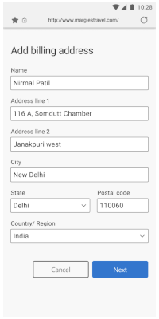
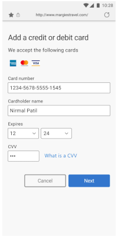
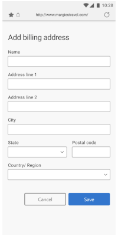
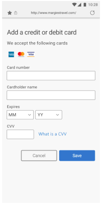
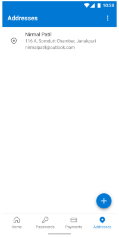

# Microsoft Authenticator による住所や支払い情報の自動入力 

こんにちは、Azure Identity サポート チームの 村上 です。 

本記事は、2021 年 10 月 25 日に米国の Azure Active Directory Identity Blog で公開された [Autofill your addresses and payment info with Microsoft Authenticator](https://techcommunity.microsoft.com/t5/azure-active-directory-identity/autofill-your-addresses-and-payment-info-with-microsoft/ba-p/2464379) を意訳したものになります。

--- 

皆さん、こんにちは。 

この度、[Microsoft Authenticator](https://aka.ms/AuthApp) を利用した住所や支払い情報の自動入力機能が一般公開されました。 

Microsoft Authenticator によりパスワードが自動入力できるのと同じように ([2021年 2 月に発表](https://techcommunity.microsoft.com/t5/azure-active-directory-identity/bg-p/Identity))、[Microsoft アカウント](https://go.microsoft.com/fwlink/?linkid=2144423) を使用して住所や支払い情報を自動入力できるようになりました。モバイル デバイスで自動入力データを同期していない場合は、Microsoft Authenticator を起動し、「パスワード」 タブに移動して、データの同期を開始できます。その際に、[Authenticator をデフォルトの自動入力プロバイダとして選択ください](https://go.microsoft.com/fwlink/?linkid=2172589)。  

## まず Authenticator に住所や支払い情報を保存します 

Android をご利用の場合、サイトやアプリで住所や支払い情報を入力した際、Authenticator にその情報を保存することができます。デスクトップの [Microsoft Edge](https://www.microsoft.com/en-us/edge?r=1) や [Microsoft Autofill Extension for Google Chrome](https://chrome.google.com/webstore/detail/microsoft-autofill/fiedbfgcleddlbcmgdigjgdfcggjcion) を含むデバイス間で住所が同期され、自動的に入力されます。 

## 次に Authenticator を使用して住所や支払い情報を自動入力します

Android をご利用の場合、Authenticator が住所、支払い情報、保存したパスワードを候補として提案し、お気に入りのアプリやサイトで自動入力できるようになりました。

 

 

**補足**: iOS プラットフォームは全てのサードパーティに制限をかけており、自動入力プロバイダーおよびパスワード マネージャーが自動入力できるのはパスワードのみです。その他 (住所など) のデータは自動入力されません。このため、Microsoft Authenticator（およびその他サードパーティの自動入力プロバイダー) を iOS 上で利用した場合、 上記の Android のような機能をご利用できません。iOS では、 Authenticator を使って住所を同期することのみ可能です。同期された住所は、iOS デバイス上でアクセスするアプリやサイトに Authenticator からコピーすることができます。

デスクトップ端末で Google Chrome をお使いの場合、Google Chrome ウェブ ストアで提供されている [Microsoft Autofill Extension](https://go.microsoft.com/fwlink/?linkid=2174025) を使って、住所や支払い情報を自動入力することができます。

すべての自動入力データは、デバイスとクラウドの両方で暗号化されています。さらに、Authenticator を使用して支払い情報を自動入力する際には、生体認証が必要になります。

自動入力は、個人の [Microsoft アカウント](https://go.microsoft.com/fwlink/?linkid=2144423) を使用してデータを同期します。職場や学校のアカウント (Azure Active Directory アカウントなど) とは同期しません。Microsoft Authenticator に [パスワード]、[支払い]、[住所] タブが表示されない場合、お客様の組織が個人の Microsoft アカウントを使用した自動入力を無効にしている可能性があります。詳細は [こちら](https://go.microsoft.com/fwlink/?linkid=2172589)をご覧ください。

 

皆様のご意見、ご感想をお待ちしております。

Alex Simons ([@Alex_A_Simons](https://twitter.com/Alex_A_Simons))  
Corporate VP of Program Management  
Microsoft Identity Division
