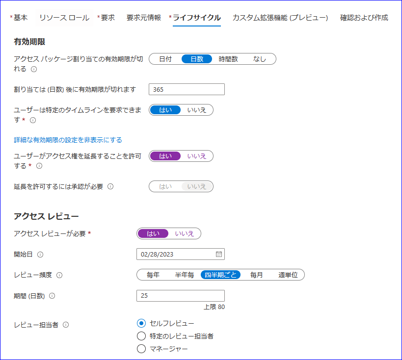
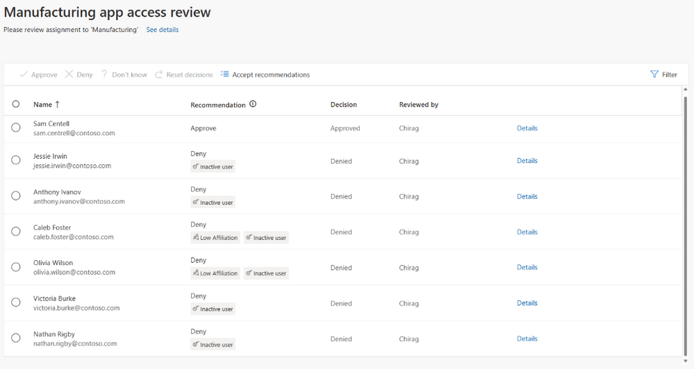

# オンプレミス アプリケーションのガバナンスと自動プロビジョニング

こんにちは、Azure Identity サポート チームの 高田 です。

本記事は、2023 年 2 月 8 日に米国の Azure Active Directory Identity Blog で公開された [Automate provisioning and governance of your on-premises applications](https://techcommunity.microsoft.com/t5/microsoft-entra-azure-ad-blog/automate-provisioning-and-governance-of-your-on-premises/ba-p/2466935) を意訳したものになります。ご不明点等ございましたらサポート チームまでお問い合わせください。

---

この度、Microsoft Entra Identity Governance を使用したオンプレミス アプリケーションへのプロビジョニングの一般提供を発表いたします。カスタム コードを必要とせず、オンプレミス アプリケーションのプロビジョニングを自動化し、ユーザーのライフサイクルを管理することができるようになりました。

すでに多くの方が Microsoft Entra Identity Governance を使用し、[既定で提供されているコネクター](https://learn.microsoft.com/ja-jp/azure/active-directory/saas-apps/tutorial-list) を活用して何百もの SaaS アプリケーションに [簡単に ID をプロビジョニング](https://learn.microsoft.com/ja-jp/azure/active-directory/app-provisioning/user-provisioning) しています。[SQL](https://learn.microsoft.com/ja-jp/azure/active-directory/app-provisioning/tutorial-ecma-sql-connector) データベースや [LDAP](https://learn.microsoft.com/ja-jp/azure/active-directory/app-provisioning/on-premises-ldap-connector-configure) ディレクトリ (Active Directory Domain Services を除く) にユーザー ID を保存しているオンプレミス アプリや、[SCIM](https://learn.microsoft.com/ja-jp/azure/active-directory/app-provisioning/on-premises-scim-provisioning) 標準をサポートしているオンプレミス アプリに対し、Azure Active Directory (Azure AD) から ID を直接プロビジョニングすることができるようになりました。つまり、Microsoft Entra Identity Governance を使用すれば、すぐに使えるオンプレミス コネクターを活用して、カスタム コード無しにオンプレミス アプリケーションへのアクセスを管理できるのです。

ここで例として、Contoso という企業が [Microsoft Entra Identity Governance](https://learn.microsoft.com/ja-jp/azure/active-directory/governance/identity-governance-overview) を使用して、重要な製造プロセスを管理するオンプレミス アプリケーションへのアクセスを提供する例を説明します。このアプリケーションは組織内に何年も前から存在しています。このアプリケーションは、ユーザー管理のための最新の SCIM API をサポートしていませんが、ユーザー アクセスの管理には OpenLDAP サーバーを利用しています。Microsoft Entra Identity Governance を使用することで、Contoso は以下のことが可能になります。 

- アプリケーションへのアクセス許可設定を自動化することで、従業員の生産性を向上させる。
- クラウドベースのプロビジョニング ソリューションを導入し、コストを管理する。
- 定期的なアクセス権の確認と取り消しを行い、リスクを管理する。

Contoso の管理者は、以下の簡単な 3 つのステップで、ユーザーがオンプレミス アプリケーションにアクセスできるようにし、同時に必要な統制プロセスを実現できました。

## 1. アプリケーション アクセスの構成

従業員が組織に参加すると、[Workday](https://learn.microsoft.com/ja-jp/azure/active-directory/saas-apps/workday-inbound-cloud-only-tutorial) で採用済みとしてマークされ、Azure AD にてアカウントが自動的にプロビジョニングされます。管理者はエンタイトルメント管理で [アクセス パッケージ](https://learn.microsoft.com/ja-jp/azure/active-directory/governance/entitlement-management-access-package-create) を構成しています。製造部門で新しい従業員が採用されると、アクセス パッケージを通じて製造アプリへのアクセス権が　[自動的に](https://jpazureid.github.io/blog/azure-active-directory/dynamic-automated-access-with-entitlment-management/) 割り当てられます。従業員が退職したり、転職したりすると、その割り当てが自動的に削除され、そのアプリケーションにアクセスできなくなります。

製造部門に所属していないユーザーで、製造アプリに期間限定でアクセスする必要がある人もいます。この要件に対応するため、Contoso の管理者はもう一つ別のポリシーを構成しており、それにより他の従業員がアクセス パッケージを介してアプリケーションへのアクセスを要求できるようにしています。

アクセスが必要なすべてのユーザーは、自動的にアクセス権を付与されるか、セルフ サービスで必要なアクセス権を要求することができます。

## 2. アカウントのプロビジョニングを自動化

製造業アプリはオンプレミスに存在し、SCIM などの最新規格には対応していませんが、アクセス制御に OpenLDAP サーバーを使用しています。管理者は Azure AD が提供する [汎用的な LDAP コネクター](https://learn.microsoft.com/ja-jp/azure/active-directory/app-provisioning/on-premises-ldap-connector-configure) を使用し、プロビジョニングを設定します。アクセス パッケージを通じて製造アプリケーションへのアクセスを許可されたユーザーは、自動的にアカウントがプロビジョニングされます。  

Contoso の管理者は、アプリケーションを改変することなく、すぐに使える LDAP コネクタを利用し、プロビジョニングを自動化することができるのです。

## 3. 定期的なアクセス権のレビューと承認

製造アプリにはビジネス クリティカルなデータがあり、Contoso 社はコンプライアンス プロセスの一環として、製造部門以外の従業員に定期的にアクセスの必要性の確認と正当な理由の提示を求めることが必要とされています。Contoso の管理者は、アプリにアクセスできる製造部門以外のユーザーに対して、多段階のアクセス レビューを設定しました。まず、従業員がアクセスが必要であることを自身で確認し、その後、最終承認のためにアプリケーションの所有者にレビューが転送されます。 アクセス レビューが完了しないユーザーは、自動的にアプリケーションから削除されます。

適切なアクセス制御とレビューが実施され、「なぜ」アクセス許可が存在するのかが証明できるため、これにより内部および外部の監査要件が満たされます。

Azure AD の [エンタイトルメント管理](https://learn.microsoft.com/ja-jp/azure/active-directory/governance/entitlement-management-overview)、[プロビジョニング](https://learn.microsoft.com/ja-jp/azure/active-directory/governance/what-is-provisioning)、[アクセス レビュー](https://learn.microsoft.com/ja-jp/azure/active-directory/governance/access-reviews-overview) 機能を併用することで、SaaS とオンプレミスの両方のアプリケーションへのアクセスを提供しながら、統制とセキュリティの要件を同時に満たすことが可能になります。今すぐこの新機能を有効にし、SaaS アプリケーションと同じ方法でオンプレミス アプリケーションへのアクセスを管理ください。

これは、Microsoft Entra Identity Governance のオンプレミス サポートの始まりに過ぎません。PowerShell、Web サービス、その他のビジネス アプリケーションへのカスタム コネクタを使用したプロビジョニング機能など、さらに投資を続け、Microsoft Identity Manager (MIM) を使用しているお客様がプロビジョニング機能を Microsoft Entra Identity Governance に移行できるようにしてまいります。

これらの新機能に関するご意見は、[Azure フォーラム](https://aka.ms/AzureADFeedback) または Twitter で [@AzureAD](https://twitter.com/azuread) のタグを付けてお寄せください。
