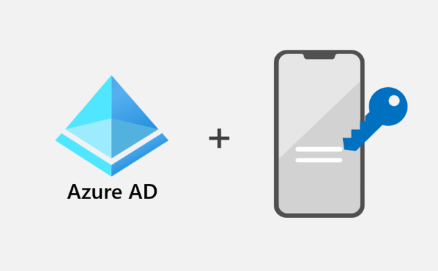
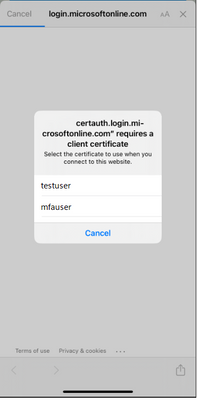
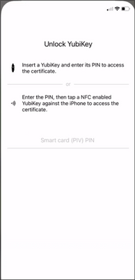
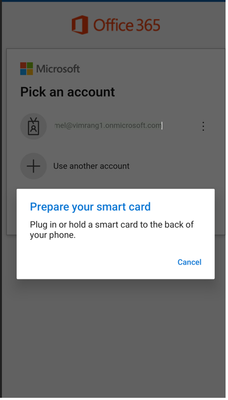
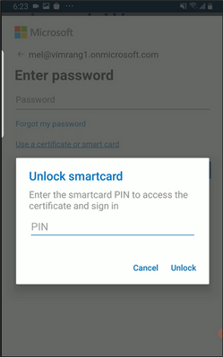

# モバイル デバイスでの Azure AD 証明書ベースの認証が GA となりました！

こんにちは、Azure Identity サポート チームの 高田 です。

本記事は、2023 年 5 月 4 日に米国の Microsoft Entra (Azure AD) の Discussion で公開された [Azure AD Certificate-Based Authentication (CBA) on Mobile now Generally Available!](https://techcommunity.microsoft.com/t5/microsoft-entra-azure-ad-blog/azure-ad-certificate-based-authentication-cba-on-mobile-now/ba-p/1144695) を意訳したものになります。ご不明点等ございましたらサポート チームまでお問い合わせください。

---

Ignite 2022 では、[大統領令 14028](https://jpazureid.github.io/blog/azure-active-directory/identity-innovation-for-a-more-secure-nation/)「国家のサイバーセキュリティの改善」に対するマイクロソフトのコミットメントの一環として、Azure Active Directory (Azure AD) の証明書ベース認証 (CBA) の GA を発表しました。このたび、**モバイルでの Azure AD CBA サポート** の **GA** を発表できることを嬉しく思います。

iOS および Android デバイスにおいて、デバイス上の証明書に加え、USB や NFC 経由で YubiKeys のような外部ハードウェア セキュリティ キーの両方をサポートします。BYOD (Bring Your Own Device) が増加する中、この機能により、ユーザーのモバイル デバイスに証明書をプロビジョニングしなくても、モバイルに対してフィッシング耐性のある多要素認証 (MFA) を要求できるようになります。

今回は、モバイルでの Azure AD CBA のサポートについて、Microsoft Entra のプロダクト マネージャーである Vimala Ranganathan を招き、モバイルでのフィッシング耐性ある MFA の詳細を解説してもらいます。

お客様のフィードバックや提案をお待ちしています！Twitter (@azuread) までご連絡ください。

Alex Simons ([@Alex_A_Simons](https://twitter.com/alex_a_simons))  
Corporate Vice President  
Microsoft Identity Division

---

みなさん、こんにちは。  

USB と NFC を介したハードウェア セキュリティ キー上の証明書を使用して、iOS および Android デバイス上で **Azure AD CBA** の **GA** を開始したことについて、さらに詳しくお伝えしたいと思います。

米国のサイバーセキュリティに関する [大統領令 14028](https://www.whitehouse.gov/briefing-room/presidential-actions/2021/05/12/executive-order-on-improving-the-nations-cybersecurity/) は、すべてのデバイス プラットフォームでフィッシング耐性のある MFA の使用を要求しています。お客様は、ハードウェア セキュリティ キーに証明書をプロビジョニングし、それを iOS や Android デバイス上で Azure AD での認証に使用することができるようになりました。モバイル デバイスにおけるマイクロソフトの証明書ベースのソリューションは、ハードウェア セキュリティキーと相まって、シンプルかつ便利で、Federal Information Processing Standards (FIPS) 認定のフィッシング耐性ある MFA 方式です。  

iOS 16 と iPadOS 16.1 で、Apple は NFC または CCID クラスに準拠したリーダーを使用した物理的なスマートカード認証のネイティブ サポートを追加しました。これにより、Azure AD に対して CCID 互換のスマートカードを認証に使用できるようになりました。

最新の [Microsoft Authentication Library](https://learn.microsoft.com/ja-jp/azure/active-directory/develop/msal-overview) (MSAL) を使用する Microsoft のファーストパーティ アプリを含むすべてのネイティブ アプリで、モバイル デバイス上での [YubiKey](https://www.yubico.com/products/) を使用した Azure AD CBA がサポートされます。また、最新の MSAL を利用していないすべてのアプリでも、最新の Microsoft Authenticator ([Android](https://play.google.com/store/apps/details?id=com.azure.authenticator&gl=US) または [iOS/iPadOS](https://apps.apple.com/app/microsoft-authenticator/id983156458)) を使用したブローカー認証のフローで Yubikey を用いた Azure AD CBA がサポートされます。

## iOS デバイス上での YubiKey を使用した Azure AD CBA

iOS が YubiKey を認識しない場合は、[Yubico Authenticator App](https://apps.apple.com/us/app/yubico-authenticator/id1476679808%22HYPERLINK%20%22https://apps.apple.com/us/app/yubico-authenticator/id1476679808) を使用して YubiKey の公開証明書を iOS キーチェーンにコピーします (スマートカード証明書の秘密鍵が YubiKey からコピーされることはありません)。

サインインするには、ユーザーは証明書選択画面から YubiKey の証明書を選択し、YubiKey を挿入するか、NFC 対応の YubiKey をタップして、YubiKey Authenticator 経由で PIN を入力し、認証フローを完了します。

## Android デバイス上での YubiKey を使用した Azure AD CBA

Android モバイルでの YubiKey による Azure AD CBA は、最新の MSAL を使用することで利用可能であり、YubiKey Authenticator アプリは Android においては必要ありません。  

Azure AD CBA を行うには、物理的なスマートカード上の証明書使用するか、USB 経由で YubiKey を接続するか、もしくは NFC を使用して、YubiKey から証明書を選択し、PIN を入力します。これでアプリケーションへの認証が完了します。

また、Azure AD CBA と YubiKeys については、こちらで詳しく解説しています:

- Azure AD CBA: http://aka.ms/aadcba
- iOS 上での Azure AD CBA: [iOS デバイスにおける Azure Active Directory の証明書ベースの認証](https://learn.microsoft.com/ja-jp/azure/active-directory/authentication/concept-certificate-based-authentication-mobile-ios)
- Android 上での Azure AD CBA: [Android デバイスにおける Azure Active Directory の証明書ベースの認証](https://learn.microsoft.com/ja-jp/azure/active-directory/authentication/concept-certificate-based-authentication-mobile-android)
- YubiKey: [Meet the YubiKey - Strong Two-Factor Authentication Solution](https://www.yubico.com/why-yubico/)

## 今後について

[Azure Active Directory Community](https://feedback.azure.com/d365community/forum/22920db1-ad25-ec11-b6e6-000d3a4f0789) でフィードバックをお寄せください！弊社では今後、証明書の選択画面に表示される証明書をフィルタリングする機能を追加するとともに、モバイル上での Azure AD CBA にて他のスマートカード プロバイダーを利用できるようにする対応にも取り組んでいます。  

大統領令 14028 に対するマイクロソフトのコミットメントについては、[こちら](https://www.microsoft.com/en-us/security/blog/2022/02/17/us-government-sets-forth-zero-trust-architecture-strategy-and-requirements/) をご確認ください。
