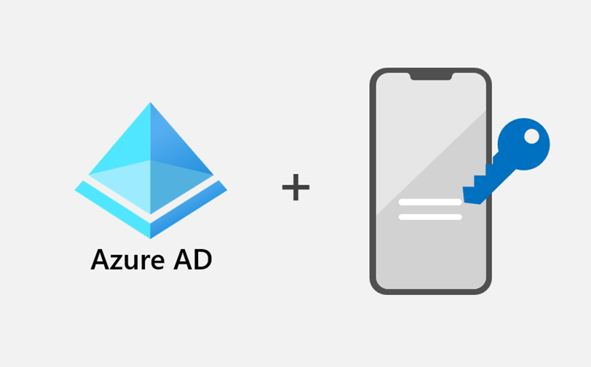
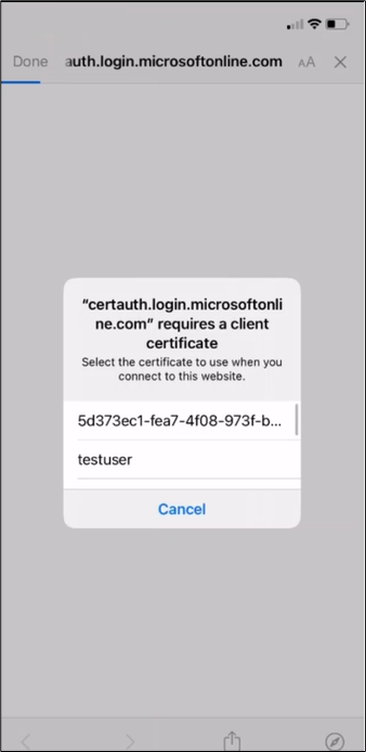
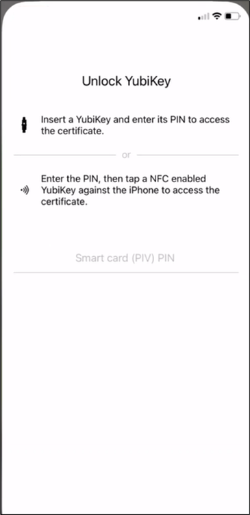
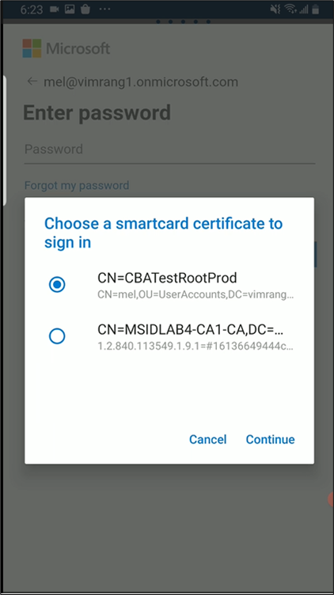
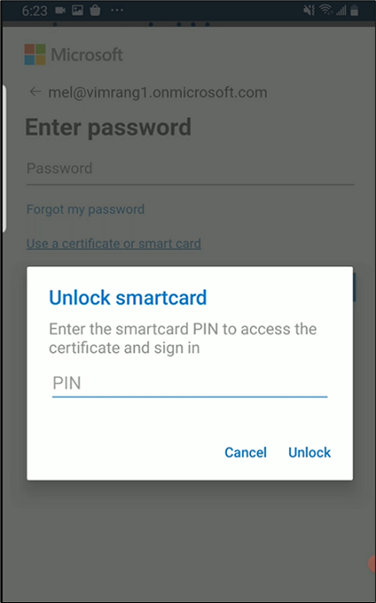

こんにちは、Azure Identity サポート チームの 高田 です。

本記事は、2022 年 11 月 2 日に米国の Azure Active Directory Identity Blog で公開された [Azure AD Certificate-based Authentication (CBA) on Mobile](https://techcommunity.microsoft.com/t5/microsoft-entra-azure-ad-blog/azure-ad-certificate-based-authentication-cba-on-mobile/ba-p/2365672) を意訳したものになります。

---

# モバイル端末での Azure AD 証明書ベース認証 (CBA)

Ignite 2022 では、大統領令 14028 (Improving the Nation's Cybersecurity) への Microsoft のコミットメントの一環として、Azure Active Directory (Azure AD) の証明書ベース認証 (CBA) の一般提供を開始することを発表しました。今回、ハードウェア セキュリティキー (YubiKey) 上の証明書を使用した iOS および Android デバイスでの Azure AD CBA のサポートについてパブリック プレビューを発表することができ、大変うれしく思っています。

BYOD (Bring Your Own Device) が増加する中、この機能により、ユーザーのモバイル デバイスに証明書をプロビジョニングすることなく、モバイルにおいてフィッシング耐性のある MFA を要求することができるようになります。今回は、モバイルでの Azure AD CBA のサポートについて、Microsoft Entra のプロダクト マネージャーである Vimala Ranganathan を招き、モバイルでのフィッシング耐性 MFA の詳細について解説します。

皆様のご意見をお待ちしております。

Alex Weinert (twitter: [@Alex_t_weinert](https://twitter.com/alex_t_weinert))

---

皆様こんにちは。

ハードウェア セキュリティ キー上の証明書を使用した iOS および Android デバイス上の **Azure AD CBA** のパブリック プレビューについて、詳しくご紹介します。

米国のサイバー セキュリティに関する [大統領令 14028](https://www.whitehouse.gov/briefing-room/presidential-actions/2021/05/12/executive-order-on-improving-the-nations-cybersecurity/) は、すべてのデバイス プラットフォームでフィッシング耐性のある MFA を使用することを要求しています。モバイルでは、顧客が個人のモバイル デバイスにユーザー証明書をプロビジョニングして認証に使用することができますが、これは主に管理されたモバイル デバイスで実現可能なものです。しかし、今回のパブリック プレビューでは、BYOD のサポートが可能になりました。お客様は、ハードウェア セキュリティ キーに証明書をプロビジョニングし、iOS および Android デバイスの Azure AD による認証に使用できるようになりました。

Microsoft のモバイルにおける証明書ベースのソリューションは、ハードウェア セキュリティ キーと併せて利用することで、シンプルで便利、なおかつ FIPS (Federal Information Processing Standards) 認定のフィッシング耐性のある MFA 方式です。

すべてのブラウザベースの Web アプリとネイティブ アプリ (最新の [Microsoft Authentication Library](https://learn.microsoft.com/ja-jp/azure/active-directory/develop/msal-overview) (MSAL) を使用する Microsoft 製ファーストパーティ アプリを含む) において、モバイル デバイス上で [YubiKey](https://www.yubico.com/products/) を用いた Azure AD CBA with がサポートされます。また、最新の MSAL を利用していないすべてのアプリにおいても、最新の Microsoft Authenticator ([Android](https://play.google.com/store/apps/details?id=com.azure.authenticator&gl=US) または [iOS/iPadOS](https://apps.apple.com/app/microsoft-authenticator/id983156458)) を利用したブローカー認証フローで Yubikey を用いた Azure AD CBA がサポートされます。

## Yubikey を用いた iOS 上での Azure AD CBA の動作

使用に当たり、最初の登録として、ユーザーは [Yubico Authenticator for iOS](https://apps.apple.com/us/app/yubico-authenticator/id1476679808) アプリを使用して YubiKey の公開証明書を iOS キーチェーンにコピーする必要があります (スマートカード証明書の秘密情報が YubiKey の外に漏れることはありません)。

サインインするには、ユーザーは証明書の選択画面から YubiKey の証明書を選択し、YubiKey を挿入するか NFC 対応の YubiKey をタップし、YubiKey Authenticator 経由で PIN を入力して、認証フローを終了します。

## Yubikey を用いた Android 上での Azure AD CBA の動作

Android のモバイル デバイスでの YubiKey による Azure AD CBA サポートは、最新の MSAL によって有効化されるため、YubiKey Authenticator アプリは Android では必須ではありません。

ユーザーは YubiKey を USB 経由で接続し、Azure AD CBA を開始します。YubiKey から証明書を選び、PIN を入力してアプリケーションで認証を受けることができます。

このパブリック プレビューについて詳細をご要望の場合は、Yubico が 11 月 3 日 9 AM (PST) から提供予定のウェビナー "New solutions to prevent phishing with Azure AD and YubiKeys" にご参加ください。[こちら](https://www.brighttalk.com/webcast/15793/562225?utm_source=brighttalk-portal&utm_medium=web&utm_campaign=channel-page&utm_content=upcoming) から参加登録いただけます。

Azure AD CBA と Yubikey についての詳細はこちらもどうぞ:

- Azure AD CAB: http://aka.ms/aadcba 
- iOS における Azure AD CBA: [Azure Active Directory certificate-based authentication on iOS devices](https://learn.microsoft.com/en-us/azure/active-directory/authentication/concept-certificate-based-authentication-mobile-ios)
- Android における Azure AD CBA: [Azure Active Directory certificate-based authentication on Android devices](https://learn.microsoft.com/en-us/azure/active-directory/authentication/concept-certificate-based-authentication-mobile-android)
- Yubikey: Meet the YubiKey - [Strong Two-Factor Authentication Solution](https://www.yubico.com/why-yubico/)

## 今後について

引き続き [Azure Active Directory コミュニティ](https://feedback.azure.com/d365community/forum/22920db1-ad25-ec11-b6e6-000d3a4f0789) までフィードバックをお寄せください。弊社では継続して Yubikey に対する NFC のサポートに取り組んでおり、モバイル上での Azure AD CBA に他のスマートカード提供元を統合すべく取り組んでおります。大統領令 14028 への弊社のコミットメントについては [こちら](https://www.microsoft.com/en-us/federal/CyberEO.aspx) もご覧ください。

Vimala