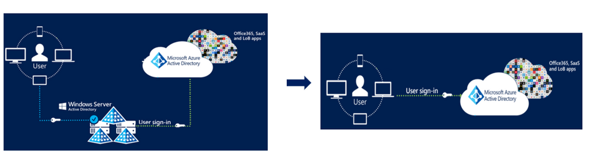
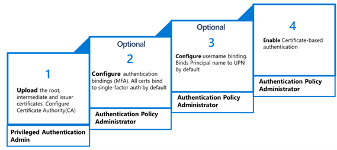
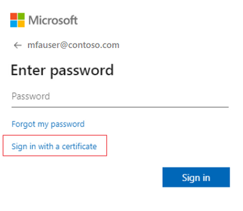

---
title: Azure AD 証明書ベース認証 パブリック プレビューのご案内

date: 2022-02-21 09:00
tags:
  - Azure AD
  - US Identity Blog
---

# Azure AD 証明書ベース認証 パブリック プレビューのご案内

こんにちは、Azure Identity サポート チームの 村上 です。

本記事は、2022 年 2 月 14 日に米国の Azure Active Directory Identity Blog で公開された [Azure AD Certificate-Based Authentication now in Public Preview
](https://techcommunity.microsoft.com/t5/azure-active-directory-identity/azure-ad-certificate-based-authentication-now-in-public-preview/ba-p/2464390) を意訳したものになります。ご不明点等ございましたらサポート チームまでお問い合わせください。

---

皆さん、こんにちは。

本日、当社の商用および米国政府クラウドにおいて、Azure Active Directory 証明書ベース認証 (**Azure AD CBA**) がパブリック プレビューとなりましたことを発表でき、大変嬉しく思います。

2021 年 5 月、バイデン大統領は大統領令 14028 号 [国家のサイバー セキュリティの改善](https://www.whitehouse.gov/briefing-room/presidential-actions/2021/05/12/executive-order-on-improving-the-nations-cybersecurity/) を発表し、連邦政府に対して、職員、ビジネス パートナー、そしてベンダーに対するフィッシング耐性のある多要素認証 (MFA) を含むゼロ トラスト アーキテクチャを導入するよう求めました。

「段階的な改善では、必要なセキュリティを確保できません。その代わりに、連邦政府は、アメリカの生活様式を支える重要な組織を守るため、大胆な改革と大規模な投資を行う必要があるのです。」
バイデン大統領、大統領令 14028 号

当社は政府と連携した経験をもとに、PIV/CAC カードは、連邦政府内で使用される最も一般的な認証方法であると理解しています。

すべてのお客様にとって重要なことですが、**Azure AD に対して直接 X.509 証明書を使用して認証できる** ことは、**PIV / CAC カード** を使用している連邦政府組織や、大統領令 14028 の要件に準拠しようとしている組織にとっても特に重要です。
 
以下では、当社 ID セキュリティ チームのプロダクト マネージャーである Vimala Ranganathan より、詳細を説明いたします。

Alex Simons (Twitter: [@Alex_A_Simons](https://twitter.com/alex_a_simons)

Corporate Vice President Program Management 

Microsoft Identity Division 

------

皆さん、こんにちは。

アイデンティティ PM チームの Vimala です。

以下に、Azure AD CBA (Azure AD 証明書ベース認証) について説明させていただきます。
Azure AD CBA は、国家サイバー セキュリティ大統領令へのコミットメントの一環として、政府機関のお客様が PIV / CAC カードを使用して、フィッシング防止の MFA 認証を容易に満たすことができるよう支援します。Azure AD のユーザーは、スマート カードやデバイスの X.509 証明書を使用して、ブラウザやアプリケーションのサインインの際、Azure AD に対して直接認証することができます。

主なメリットは、以下の通りです。
- フィッシングに強い証明書ベースの認証により、より高いセキュリティを実現（ID 攻撃の大半は、パスワードに関連しています）
- フィッシュ耐性 MFA に関する大統領令 14028 号の要件を容易に満たすことができます
- オンプレミスのフェデレーション インフラにかかるコストとリスクを排除します
- Azure AD でのきめ細かなコントロールによる、簡素化された管理体験を実現します

SAP 社は素晴らしいパートナー企業であり、Azure AD CBA のパブリック プレビューを実現する上で、重要なフィードバックを提供いただきました。

「CBA は、SAP 製品の中核をなす歴史的なものです。証明書ベースの認証は 1999 年から SAP で使用しており、複数回にわたって移行および導入をしてきました。Azure AD にこれらの機能がネイティブに備わることで、長期的には ADFS を引退させることができ、Azure AD は我々が利用する最後のフェデレーション エンドポイントとなるのです。」
SAP 社 アイデンティティ アーキテクト Sven Frank 氏

**Azure AD 証明書ベース認証 (Azure AD CBA) とは何ですか？**

ご存知のように、これまで Azure AD に対して X.509 証明書を使用する認証には、AD FS などの連携 ID プロバイダ (IdP) が必要でした。本日ご紹介する Azure AD CBA パブリック プレビューでは、お客様は連携プロバイダを必要とせず、Azure AD に対して直接認証することができるようになります。    

図 1 : 簡素化されたアーキテクチャ

**証明書ベースの認証方式管理**

下図は、管理者が CBA を有効にする手順を示しています。

詳細につきましては、こちらの公開情報をご覧ください： http://aka.ms/AADCBA 

**エンド ユーザー体験**

エンド ユーザーとして、UPN（User Principal Name）を入力すると、パスワード画面に「Sign in with a certificate」のリンクが表示されます。

図 2 : 証明書を利用したサインイン

正しいクライアント証明書を選択するよう促され、選択することでアプリケーションへの認証が完了します。

注：テナントで CBA が有効になっている場合、テナント内のすべてのユーザーのサインイン ページに「証明書を使用してサインインする」というリンクが表示されます。これは、CBA のスコープ内のユーザーのみが Azure AD に対して正常に認証でき、それ以外のユーザーには失敗が表示されます。

**今後について** 

Windows スマート カード ログオン、第二認証要素としての CBA 、信頼できる発行者リストの制限撤廃、証明書失効リスト（CRL）など、さらなる素晴らしい機能の開発に取り組んでいます。
 
これらの新機能に関するご意見は、Azure フォーラムまたは Twitter で [@AzureAD](https://twitter.com/azuread) 宛てにお寄せください。
 
大統領令 14028 号の詳細については、[こちら](https://www.microsoft.com/en-us/federal/CyberEO.aspx) をご確認ください。

Vimala Ranganathan
