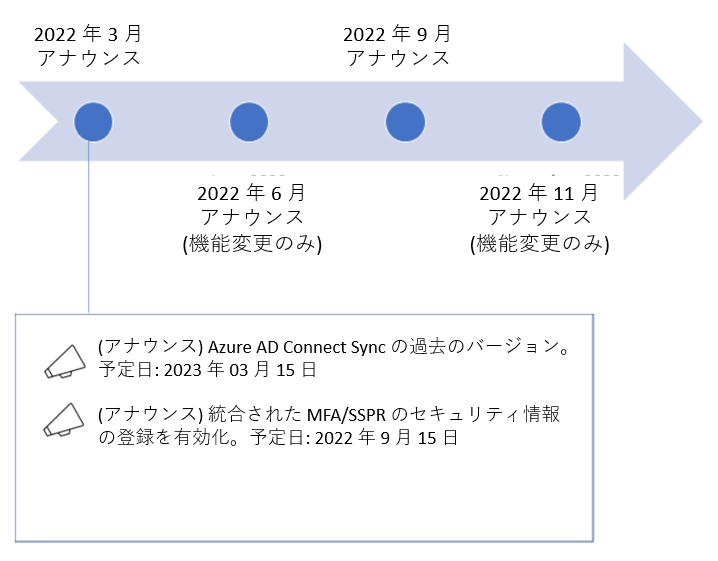

# Azure AD の変更管理を簡素化します

こんにちは、Azure Identity サポート チームの 高田 です。

本記事は、2022 年 3 月 1 日に米国の Azure Active Directory Identity Blog で公開された [Azure AD: Change Management Simplified](https://techcommunity.microsoft.com/t5/azure-active-directory-identity/azure-ad-change-management-simplified/ba-p/2967456) を意訳したものになります。ご不明点等ございましたらサポート チームまでお問い合わせください。

---

皆さん、こんにちは。

クラウド サービスでは、現実として急激な変化が日々生じています。Azure AD だけでも、新機能のリリース、既存機能の変更、廃止やサポート終了など、毎年数百の変更が行われています。これらの変更を管理することがますます難しくなっているというお客様の声を受け、本日より Azure AD の変更管理を簡素化することにしました。

年間を通じて新しい機能を提供し続ける一方で、機能の廃止や製品のサポート終了については、1 年に 2 回 (毎年 3 月と 9 月) に発表することとし、サポート終了までのタイムラインも一貫したものにします (一部の例外を除く)。この新しいモデルにより、お客様は製品や機能の変更を予測することができ、より新しく、より安全な技術を速やかに採用することができるようになります。

2022 年 3 月の発表に含まれる非推奨の情報一覧は以下のとおりです。

- 2022 年 6 月 30 日に予定されていた Azure AD Graph API の [リタイア](https://techcommunity.microsoft.com/t5/azure-active-directory-identity/update-your-applications-to-use-microsoft-authentication-library/ba-p/1257363) は **延期** となりました。Azure AD Graph API のように特に重要な依存関係のあるコンポーネントから移行するのは容易ではないというお客様のフィードバックに耳を傾け、少なくとも今年末まではリタイアの時期を遅らせることにしました。移行を支援する追加のツールの情報を含め、今年半ばにリタイアに関する最新情報を提供する予定です。詳細については、[Azure AD Graph アプリを Microsoft Graph に移行する - Microsoft Graph | Microsoft Docs](https://docs.microsoft.com/ja-jp/graph/migrate-azure-ad-graph-overview) を参照ください。
- Azure AD Graph および MSOnline PowerShell の [ライセンス割り当て API](https://jpazureid.github.io/blog/azure-active-directory/operating-license-with-microsoft-graph/) と PowerShell コマンドレットについては引き続き 2022 年 8 月 26 日にリタイアする予定です。Microsoft Graph からライセンス管理 API にアクセスするようアプリを移行ください。詳しくは、[Microsoft Graph からライセンス管理 API にアクセスするようアプリを移行する](https://jpazureid.github.io/blog/azure-active-directory/operating-license-with-microsoft-graph/) をご覧ください。
- Azure AD の管理に Azure AD PowerShell や MSOnline PowerShell モジュールを使っている方は、ぜひ Microsoft Graph PowerShell SDK をお試しくださいとちうことを [以前にお伝え](https://techcommunity.microsoft.com/t5/azure-active-directory-identity/automate-and-manage-azure-ad-tasks-at-scale-with-the-microsoft/ba-p/1942489) しました。Microsoft では現在および今後の PowerShell への投資をすべて Microsoft Graph PowerShell SDK に対して行っており、これは今後も変わりはありません。6 月 30 日に Azure AD Graph API を廃止しないという発表を受け、今後の弊社の目標は Azure AD Graph API と MSOnline モジュールに依存する既存のスクリプトならびに PowerShell プロセスを Microsoft Graph PowerShell SDK に移行するため、そのガイダンスとツールを提供することとなります。これは、 2022 年 12 月以降に **2 つの PowerShell モジュール (MSOL & AAD) が非推奨となる予定** であるためです。詳しくは [こちら](https://docs.microsoft.com/en-us/powershell/microsoftgraph/migration-steps?view=graph-powershell-beta) と [こちら](https://docs.microsoft.com/en-us/graph/migrate-azure-ad-graph-faq) をご確認ください。
- ADAL のサポート終了は、6 月 30 日から 2022 年 12 月に延長されます。 ADAL のアプリは引き続き動作しますが、サポートやセキュリティ修正サポート終了後は提供されません。 また、ADAL への機能追加や新しいプラットフォームへの対応などのリリースは予定されていません。詳しくは、[Update your applications to use Microsoft Authentication Library and Microsoft Graph API](https://techcommunity.microsoft.com/t5/azure-active-directory-identity/update-your-applications-to-use-microsoft-authentication-library/ba-p/1257363) を参照ください。
- パブリック クラウドのレガシーな TLS 1.0 および 1.1 プロトコルの廃止を開始し、今年中に段階的に廃止を進めていく予定です。詳しくは、[Azure AD TLS 1.0/1.1 は非推奨になるため TLS 1.2 サポートを有効にする - Active Directory | Microsoft Docs](https://docs.microsoft.com/ja-jp/troubleshoot/azure/active-directory/enable-support-tls-environment?tabs=azure-monitor) を参照ください。
- Azure AD Connect Sync の過去のバージョンは、それより新しいバージョンが出た日から 12 ヶ月後に非推奨となります。[Azure AD Connect Sync サーバーをアップグレードするには、[Azure AD Connect: 旧バージョンから最新バージョンにアップグレードする](https://docs.microsoft.com/ja-jp/azure/active-directory/hybrid/how-to-upgrade-previous-version) をご覧ください。  
- 2020 年 8 月以前に作成された有効なテナントについて、MFA と SSPR の統合されたセキュリティ情報登録ページを有効にする予定です。このユーザー体験の詳細については、[Azure Active Directory での統合されたセキュリティ情報の登録の概要](https://docs.microsoft.com/ja-jp/azure/active-directory/authentication/concept-registration-mfa-sspr-combined) をご覧ください。
- Azure Key Vault チームは、お客様のシークレット、キー、および証明書が誤って削除されないよう保護するために、すべてのキー コンテナーにソフト デリートの保護を適用することに取り組んでいます。ソフト デリートは、削除されたキー コンテナーに加え、キー コンテナー内に保存されたシークレットを最大 90 日間復元可能にする機能で、お客様は削除されたシークレットをご自身で復元することが可能です。既存のすべてのキー コンテナーのリソースに対し、2025 年 2 月 1 日までにソフト デリートが自動的に有効になります。ソフト デリートは有効化のみが可能です。つまり一度有効にすると、この機能を無効にすることはできません。詳しくは [すべてのキー コンテナーでの論理的な削除の有効化](https://docs.microsoft.com/en-us/azure/key-vault/general/soft-delete-change) をご覧ください。

**2022 年の変更に関するお知らせのタイムライン:**

