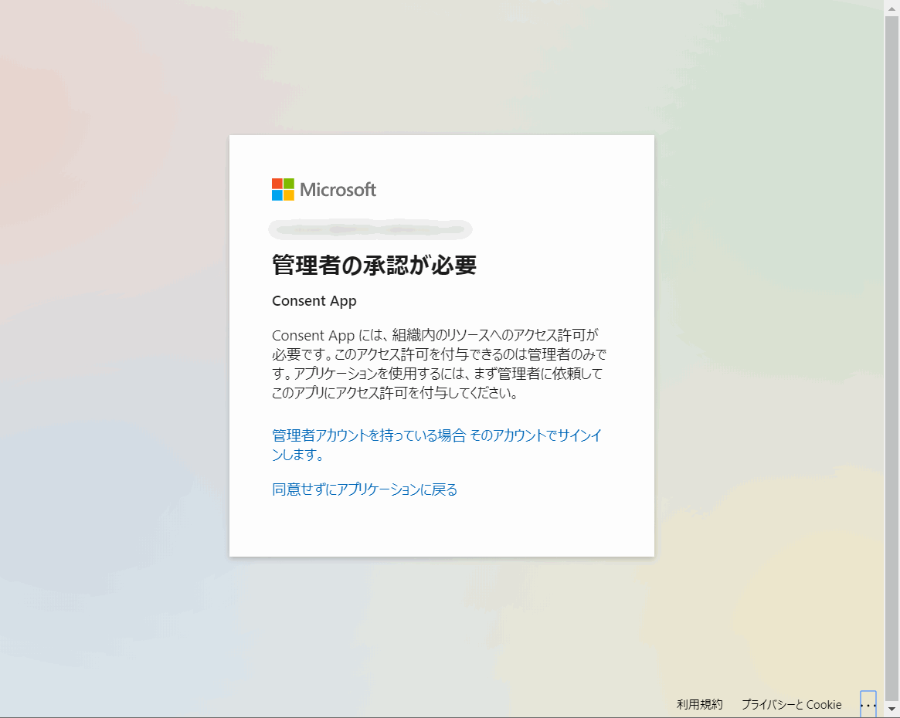
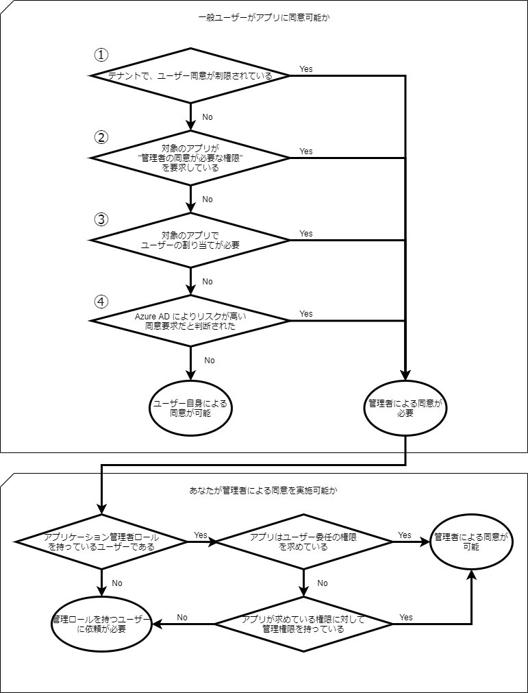
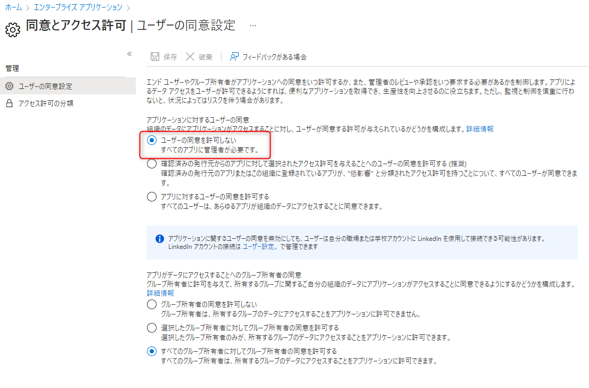
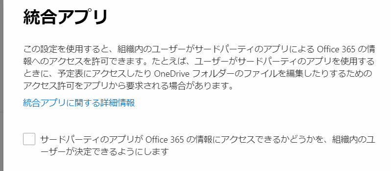
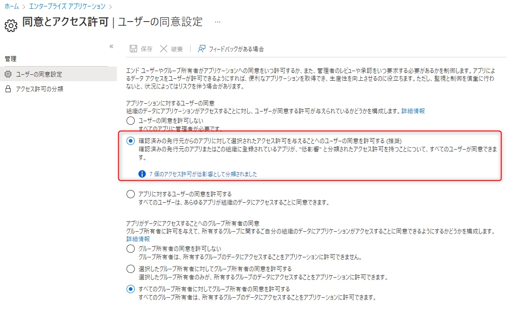
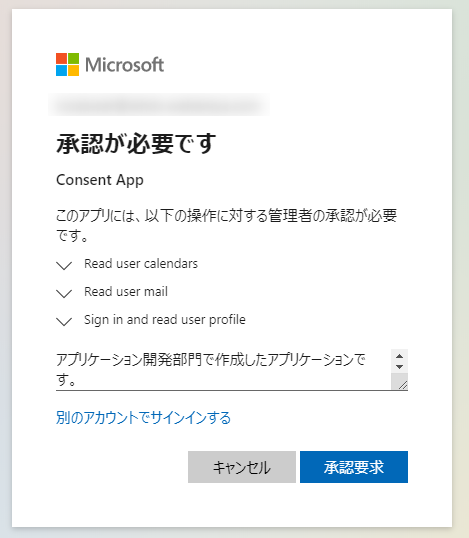
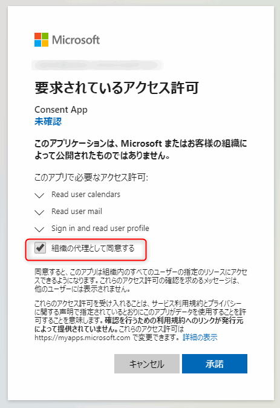
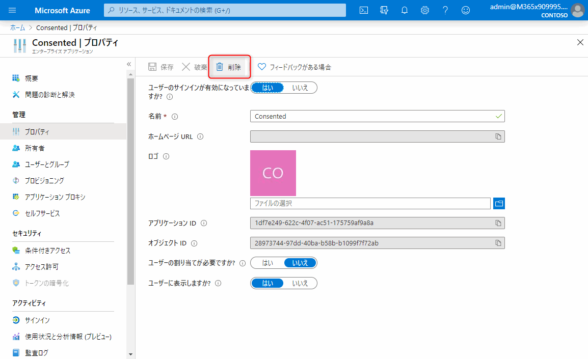

# 「管理者の承認が必要」 のメッセージが表示された場合の対処法

こんにちは。Azure Identity チームの埴山です。  
今回は、Azure AD の同意のフレームワークについて解説します。

早速ですが、皆さんはアプリケーションを利用しようと思った際に、以下のように、"管理者の承認が必要" と表示されてしまったことは無いでしょうか。

あるいは、以下のような同意画面を見たことはないでしょうか。

多くはアプリケーションを利用する際に表示される画面ですが、皆さんはこの画面の意味がお分かりでしょうか。

この画面は、Azure AD の同意のフレームワークと呼ばれる仕組みで、ユーザーがアプリケーションに対し、安全に権限を委任するための仕組みです。

今回は、この同意のフレームワークについて、どのような機能であり、"管理者の承認が必要" と表示されたときには、どのように対処すればよいのか、次の順番で解説します。

1. 何のための機能なのか
2. アプリケーションに同意を行うことで何が起きるのか
3. どのような同意の種類があるのか
4. 管理者の同意が必要と表示された際の対処法
5. 管理者による同意の付与手順
6. アプリケーションに同意済みの権限を確認する
7. アプリケーションに付与した権限を取り消す

トラブルシューティングの方法と、[同意の手順](#5-管理者による同意の付与手順)だけ確認したい方は、[管理者の承認が必要と表示された際の対処法](#4-管理者の同意が必要と表示された際の対処法) の項目を確認ください。

## 1. 何のための機能なのか

Microsoft のサービスを始め、クラウド サービスが普及した現代では、皆さんは日々の業務に多くのサービスを利用しているものと存じます。
多くの業務を効率的に行うには、サービス間の連携がますます重要になっています。

アプリケーションの連携の例として [Power Automate](https://flow.microsoft.com/ja-jp/) では Microsoft 製品や 3rd パーティーの製品を連携し、業務フローを自動化することが可能です。たとえば、特定のタイトルが含まれたメールを、Exchange Online で受信したら、Teams に通知を送る、といったことが簡単に実現できます。

一方、3rd パーティーの製品内で、Office 365 のデータや機能を利用したいこともあるでしょう。例えば、Slack 内で Teams のビデオ会議を行う、といったことが可能です。
このように、別のアプリケーションから Azure や Office 365 のデータを呼び出すには、Power Automate や、Slack といったアプリケーションがメールボックスの中身を見たり、Teams の機能を呼び出せるようにする必要があります。

しかし、連携したいアプリケーションに対し、ID やパスワードといった認証情報をすべて渡してしまっては、対象のアプリケーションは完全にユーザーになり替わって、すべてのデータにアクセスすることが可能になってしまいます。認証情報をすべて渡すのではなく、アプリケーションに必要な権限のみを委任する方法が必要であることが理解できると思います。

そこで、Azure AD では OAuth (おーおうす) というプロトコルを利用した同意のフレームワークをつかい、必要な権限のみをアプリケーションに付与することができるようになっています。

同意のフレームワーク内では Office 365 のデータや機能を、Azure AD により保護されたリソースと呼び、Azure AD ではリソースにアクセスを行う権限を、スコープという範囲で管理しています。
上図でアプリケーションが必要とする権限のみを与えるためには、Exchange Online というリソースの読み込みスコープ権限をアプリケーションに付与します。

ここでは細かいプロトコルの詳細については説明しませんが、[認証と承認に関するドキュメント](https://docs.microsoft.com/ja-jp/azure/active-directory/develop/authentication-vs-authorization)などで詳しく説明されていますので、興味のある方はご覧ください。

## 2. アプリケーションに同意を行うことで何が起きるのか

次にアプリケーションに同意することでどうなるのかを見ていきます。まずは、アプリケーションに与える権限の種類について押さえておきましょう。

アプリケーションに与える権限として、大きく 2 つの種類があります。ユーザー委任の権限と、アプリケーション権限です。

ユーザー委任の権限は、アプリケーションがユーザーの代わりに、リソースにアクセスするための権限です。
アプリケーションが権限を得るには、リソースを所持するユーザーの同意が必要です。
このユーザー同意が求められた画面が冒頭の画像です。画像にあるようにユーザーが保持している権限の中で、具体的にどのような権限をアプリケーションに委任するのかが項目として表示されています。画像ですと Read your calendars などがありますが、同意が得られると、アプリケーションは、ユーザーの代わりに予定表を読み取れるようになります。

ユーザーがサインインしてアクセスするアプリケーションの多くは、ユーザー委任の権限でアクセス権を要求します。

次にアプリケーションの権限ですが、これは、特定のスコープの範囲で Azure AD 内のすべてのリソースにアクセスすることが可能です。
権限としては同じ名前でも、ユーザー委任の権限と、アプリケーション委任の権限では、行えることが違いますのでご注意ください。

また、アプリケーションがリソースにアクセスするフローも異なります。ユーザー委任の権限が、ユーザーのサインイン後に初めてリソースにアクセスできるのに対し、アプリケーションの権限では[アプリケーションに与えられた認証情報で認証](https://docs.microsoft.com/ja-jp/azure/active-directory/develop/v2-oauth2-client-creds-grant-flow)し、リソースへのアクセスが可能です。

## 3. どのような同意の種類があるのか

### 3-1. ユーザーの同意と管理者の同意

アプリケーションに対する権限の委任を行うには、以下のような同意画面で [承諾] をクリックし、同意を完了させる必要があります。

実はこの同意の方法にも、一般ユーザーによるユーザーの同意と、管理者による管理者の同意の 2 つの種類があります。

その名の通り、ユーザーの同意は一般ユーザー権限で行うことが出来、**ユーザー委任の権限のみ** に同意可能です。

管理者の同意は、次の 3 つのケースで必要になります。

- テナントの設定でユーザーには同意を許可していない
- 一部の高い権限を要求するユーザー委任の権限 (例えば `SecurityEvents.Read.All` といった権限) に同意を付与する
- アプリケーション権限の要求に対して同意を付与する

ここまでの話を、いったんまとめると以下のような対応表になります。

| 権限の種類   | 同意可能なユーザー |
|:---:|:---:|
| ユーザー委任 | 一般ユーザー / 管理者 |
|ユーザー委任 (一部の権限) | 管理者 |
| アプリケーション権限 | 管理者 |

管理者の同意が必要な権限については、[Microsoft Graph のアクセス許可のリファレンス](https://docs.microsoft.com/ja-jp/graph/permissions-reference) に、"管理者の同意が必要" が "はい" と表記されておりますので、アプリに必要な権限に対し、管理者の同意が必要かどうか確認できます。

### 3-2. アプリケーションがアクセスできるデータの範囲

ここまでで権限の種類と、同意の種類がそれぞれ 2 つ存在することを説明しましたが、それぞれのパターンでアプリケーションがどの範囲のリソースにアクセス可能かを確認しましょう。
ユーザー委任の権限の場合、アプリケーションがアクセスできるデータの範囲は、**"許可されたスコープ"** の範囲、かつ、**"サインインしているユーザーが持つ権限の範囲"** のリソースにアクセスが可能です。

例えば、ユーザーのメールを取得する、`Mail.Read` の権限を要求するアプリは、サインインユーザーがアクセスできるメールボックスに対し、読み取り権限が与えられます。
そのため、サインイン ユーザーがアクセス出来ないデータにアクセスすることはありません。必ず、スコープの範囲とサインイン ユーザーが保持するユーザー権限の両方を満たすリソースがアクセス可能な範囲です。

一方、アプリケーションの権限で、Mail.Read の権限を要求するアプリは、テナントに登録されているすべてのメールボックスに対し、アクセスが可能です。そのため、この権限を付与するには、相応の管理権限が必要です。

## 4. 管理者の同意が必要と表示された際の対処法

ここまで、Azure AD の同意のフレームワークについての概要を説明しましたが、 管理者の承認が必要と表示された際の、対処方法について説明します。とは言っても、ほとんどの場合 "管理者の承認が必要" と表示された場合、テナントの管理者による同意を行うしかありません。

ただし、管理者による同意が求められる理由についてはいくつかありますので主な理由を紹介します。まずは以下のフロー図を確認ください。

管理者の同意が求められる ①～④ のパターンについて、以下に説明します。

### ①テナントでユーザー同意が制限されている場合

テナントでユーザー同意が制限されている場合、一般ユーザーによるアプリの同意を行うことは出来ません。この場合、アプリが管理者による同意が必要のないユーザー委任の権限のみを要求している場合でも、管理者による同意が必要となります。
ユーザーの同意が制限されている環境かどうかは、Azure ポータルの [エンタープライズ アプリケーションの同意とアクセス許可](https://portal.azure.com/#blade/Microsoft_AAD_IAM/ConsentPoliciesMenuBlade/UserSettings) より確認できます。

[アプリケーションに対するユーザーの同意] の設定が [アプリに対するユーザーの同意を許可する] の場合、ユーザー同意が可能です。設定が [ユーザーの同意を許可しない] の場合、ユーザーによる同意が制限されているため、アプリへの権限を付与するためには管理者の同意が必要です。

上記 [アプリに対するユーザーの同意を許可する] と [ユーザーの同意を許可しない] の設定は、以下の Microsoft 365 管理ポータルの、[統合アプリの設定](https://admin.microsoft.com/Adminportal/Home?source=applauncher#/Settings/Services/:/Settings/L1/IntegratedApps) のチェックの有無と同等です。

一方、同意とアクセス許可で設定可能な [確認済みの発行元からのアプリに対して選択されたアクセス許可を与えることへのユーザーの同意を許可する (推奨)] はこれらの中間の選択肢です。

この推奨設定では、一般ユーザーは[発行者確認](https://docs.microsoft.com/ja-jp/azure/active-directory/develop/publisher-verification-overview)が行われたアプリ、または自テナントに登録されたアプリのみに同意が可能となります。それに加え管理者が事前に [低影響 として分類したアクセス許可](https://docs.microsoft.com/ja-jp/azure/active-directory/manage-apps/configure-permission-classifications?tabs=azure-portal) にのみユーザーが同意可能となります。例えば一般的なアプリのサインインに必要な `openid`, `profile`, `email`, `offline_access` は許可し `Mail.Read` のように組織のデータにアクセスする権限は禁止するといった設定が可能です。

推奨設定では発行者確認が行われていないサード パーティ製アプリや、発行者確認は行われているものの低影響として分類された権限以上のアクセス許可を求めるアプリに対しては、ユーザー同意が制限されます。

[同意とアクセス許可] の設定によりユーザー同意が制限された場合、アプリを利用するためには、後述の手順で[管理者による同意を行う](#5-管理者による同意の付与手順)ことを検討ください。

### ②アプリが管理者の同意が必要な権限を要求している場合

一部の高い権限をもつユーザー委任の権限をアプリが求めている場合、あるいは、アプリケーション権限を要求している場合、管理者による同意が必要です。後述の手順で[管理者による同意を行う](#5-管理者による同意の付与手順)ことを検討ください。

### ③対象のアプリでユーザーの割り当てが必要と設定されている

あまり多くないパターンではありますが、対象のアプリケーションでユーザーの割り当てを有効にしている場合、ユーザーによるアプリの同意は行えません。この場合、管理者がユーザーに替わり、あらかじめアプリに同意を行う必要があります。

ユーザーの割り当てが必要ですか？ の設定が [はい] となっているアプリが、リソースへのアクセスを要求している場合は、後述の手順で[管理者による同意を行う](#5-管理者による同意の付与手順)ことを検討ください。

### ④対象のアプリが求める API の同意要求が、Azure AD により、リスクが高いと判断された場合

同意の要求を行っているアプリが、過度に多くの権限を要求しているなど、組織のデータを不正に取得しようとしている悪質なアプリの可能性があると Azure AD が判断した場合、ユーザーによる同意付与を無効化し、管理者の同意を要求する場合があります。[risk-based step-up consent](https://docs.microsoft.com/en-us/azure/active-directory/manage-apps/configure-risk-based-step-up-consent) 機能と呼ばれ、既定で ON になっています。

また、2020 年 11 月以降に新しく登録された発行元が確認済みでないほとんどのマルチテナント アプリからの API の同意要求が、Azure AD にリスクが高いと判断されるようになりました。
同意画面には、以下のようにこれらのアプリにはリスクが伴い、未確認の発行元からのものであることをユーザーに通知する警告が表示されます。

発行元が未確認であるアプリが信頼できる場合、後述の手順で[管理者による同意を行う](#5-管理者による同意の付与手順)ことを検討ください。

一方で、他テナントのユーザーが利用するマルチテナント アプリケーションの公開を検討している場合、アプリケーションを安心して利用いただくためにも[発行者の確認](https://docs.microsoft.com/ja-jp/azure/active-directory/develop/publisher-verification-overview)を検討ください。

## 5. 管理者による同意の付与手順

管理者による同意が必要ないくつかのパターンを紹介しましたが、実際にアプリを利用するために行う、管理者の同意付与手順はどのパターンでも同様です。
手順については後述いたしますが、ユーザーからの申請をもとに同意を実施するのは少々手間がかかりますし、申請フローの整備など運用面でもコストがかかります。
そこで、具体的な同意の手順を紹介する前に、ユーザーからの権限申請から、管理者への通知、そしてレビューと承認プロセスを提供する`管理者の同意ワークフロー`機能を紹介します。

### 管理者の同意ワークフローを利用して、同意要求に応答する

管理者の同意ワークフローを利用すれば、ユーザーが管理者の同意が必要なアプリケーションにアクセスした際に、管理者に対し同意を行うよう "要求" をすることが可能になります。

同意要求有効化するには、[エンタープライズ アプリケーションのユーザー設定](https://portal.azure.com/#blade/Microsoft_AAD_IAM/StartboardApplicationsMenuBlade/UserSettings/menuId/) より、[ユーザーは、自分が同意できないアプリに対して管理者の同意を要求できます] の設定を [はい] に設定します。

また、[管理者の同意要求を確認するユーザーの選択] で、アプリケーション管理者、クラウド アプリケーション管理者以上のディレクトリ ロールを持つユーザーを、同意要求を受け取るユーザーとして設定します。

管理者の同意要求 (プレビュー) 機能を有効化した状態で、管理者の同意が必要なアプリケーションにアクセスした場合、以下のような画面が表示されます。

承認要求をクリックすることで、管理者にメール通知が送られ、管理者はメールのリンクから管理者の同意を行えます。新しい申請プロセスを有効化することで、ユーザーが利用したいアプリケーションを、管理者が把握し、同意を行う判断が出来ます。

詳しくは、[管理者の同意ワークフローの構成 - Azure Active Directory | Microsoft Docs](https://docs.microsoft.com/ja-jp/azure/active-directory/manage-apps/configure-admin-consent-workflow) を確認ください。

### 従来の同意手順

同意のワークフローを利用しない場合、ブロックされたアプリを利用するには、管理者自身で同意を実施する必要があります。
手順としては、以下の 3 パターンがありますので順に説明します。

1. アプリケーションに管理ユーザーでアクセスを行い、組織の代理として同意するにチェックをいれて同意を付与する
2. エンタープライズ アプリケーションの、API のアクセス許可より同意を付与する
3. 同意エンドポイントへアクセスを行い、同意を付与する

### 必要な権限

まず、アプリケーションに同意を行えるユーザーは、最低限アプリケーション管理者、あるいは、クラウド アプリケーション管理者のディレクトリ ロールが必要です。加えて、アプリケーション権限を要求するアプリに同意を行うには、求められている権限に対する管理ロールが必要です。たとえば、アプリケーション権限でメールの読み書き権限を求めるアプリに対しては、Exchange 管理者ロールが必要です。

また、Microsoft Graph API のアプリケーション権限に対し管理者の同意を与えるには、グローバル管理者ロールが必要です。

### パターン 1. アプリケーションに管理ユーザーでアクセスを行い、組織の代理として同意するにチェックをいれて同意を付与する

1. 利用したいアプリケーションに管理者としてサインインを行います。
2. 同意画面にて、[組織の代理として同意する] のチェックボックスをオンにして、承諾を選択します。

3. チェックをつけ忘れて承諾した場合には、後述の手順にて Azure ポータルより同意の付与を行います。

### パターン 2. エンタープライズ アプリケーションの、API のアクセス許可より同意を付与する

すでに、アプリケーションが Azure ポータルのエンタープライズ アプリケーションに登録されている場合に利用できる手順です。多くの場合、自テナントでアプリの登録を行った場合、この手順で同意できます。
連携アプリの構成によってはパターン 2 では必要な権限に同意できない場合があるため、可能であれば、まずはパターン 1 の手順をお試しください。

1. Azure ポータル (https://portal.azure.com/) にグローバル管理者としてサインインします。
2. 左ペインから Azure Active Directory を選択します。
3. エンタプーライズ アプリケーションを選択します。
4. 検索ボックスに当該のアプリケーション ID もしくは、アプリケーション名を入力し、当該のアプリケーションを選択します。
5. [アクセス許可] を選択し、[“tenant名” に管理者の同意を与えます] ボタンをクリックします。

6. 同意画面が表示されますので、[承諾] をクリックします。

### パターン 3. 同意エンドポイントへアクセスを行い、同意を付与する

通常は上述の 2 つの手順にて、アプリケーションに同意を行うことが多いですが、アプリケーションの提供元によっては、同意のエンドポイントを利用し、事前に管理者による同意を行うよう指定されているものがあります。

同意のエンドポイントについて、詳しくは Microsoft ID プラットフォームのスコープ、アクセス許可、および同意ドキュメント内の [管理者の同意エンドポイントを使用する](https://docs.microsoft.com/ja-jp/azure/active-directory/develop/v2-permissions-and-consent#using-the-admin-consent-endpoint) を確認ください。

### 6. アプリケーションに同意済みの権限を確認する方法

アプリケーションに同意を行うと、アプリは付与された権限の範囲で Azure AD で保護されたリソースにアクセスすることが可能です。
実際に、どのユーザーが (あるいは管理者が) アプリに同意を行っているかは、Azure AD のエンタープライズ アプリケーション、対象のアプリより確認できます。

1. Azure ポータル (https://portal.azure.com/) にグローバル管理者としてサインインします。
2. 左ペインから Azure Active Directory を選択します。
3. エンタープライズ アプリケーションを選択します。
4. 検索ボックスに当該のアプリケーション ID もしくは、アプリケーション名を入力し、当該のアプリケーションを選択します。
5. [アクセス許可] を選択します。

ユーザー委任の権限は、[ユーザーの同意] タブから確認できます。
[許可元] をクリックいただくと、それぞれの API の許可に対し、どのユーザーが同意済みか確認できます。

一方、管理者の同意が完了している場合には、[管理者の同意] タブに同意済みの権限一覧が表示されます。
[種類] が [Delegated] となっているものが、ユーザー委任の権限、Application となっているものがアプリケーション権限の API のアクセス許可です。

### 7. アプリケーションに付与した API の権限を取り消す方法

アプリケーションに付与した API の権限を取り消すには、エンタープライズ アプリケーションよりアプリを削除いただくことが有効です。

1. Azure ポータル (https://portal.azure.com/) にグローバル管理者としてサインインします。
2. 左ペインから Azure Active Directory を選択します。
3. エンタープライズ アプリケーションを選択します。
4. 検索ボックスに当該のアプリケーション ID もしくは、アプリケーション名を入力し、当該のアプリケーションを選択します。
5. [プロパティ] を選択します。
6. [削除] を選択し、確認画面で [はい] をクリックし、エンタープライズ アプリケーションを削除します。

エンタープライズ アプリケーションを削除することで、アプリに付与したすべての権限が削除されます。また、[ユーザーのサインインが有効になっていますか ?] の設定を [いいえ] に設定することで、一時的に権限を無効にすることも可能です。

## FAQ

最後によくある質問と、その回答を紹介します。

#### すでに 3rd パーティ製アプリを利用している環境で、ユーザー同意の設定を後からオフにしました。現在アプリを利用しているユーザーは、引き続きアプリを利用できますか。

はい、ユーザー同意の設定をオフに頂いた場合でも、すでに同意済みの権限については、引き続きアプリケーションは利用できます。同意の設定を変更する前にアプリに一度もアクセスしたことがないユーザーは、管理者の同意が完了するまでアプリにアクセスすることは出来ません。

#### テナントで同意済みの API の権限とアプリを一覧表示することは出来ますか。

[Get-AzureADPSPermissions](https://docs.microsoft.com/ja-jp/microsoft-365/security/office-365-security/detect-and-remediate-illicit-consent-grants?view=o365-worldwide#steps-for-doing-this-with-powershell) を実行することで、テナントで同意済みの API の権限とアプリを一覧表示することが可能です。

