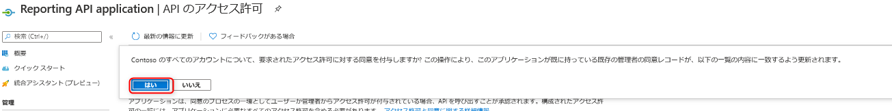
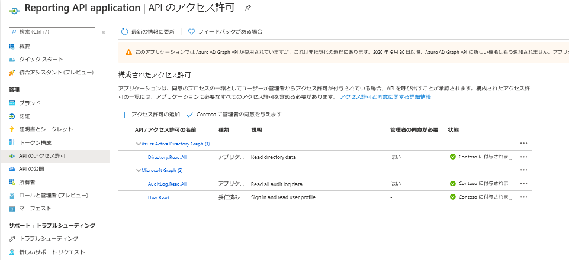

# 最終サインイン日時を一括で取得する方法

こんにちは、Azure Identity サポート チームの谷です。  
以前の記事 [Get last-sign-in activity reports](https://github.com/jpazureid/get-last-signin-reports) でユーザーの最終サインイン日時の取得をご紹介させていただきましたが、下記の制約がありました。  
 - サインイン ログの保存期間により、30 日以上前のサインイン日時は確認できません。  
 - サインインのログから一覧を取得しているため、厳密な ”最終アクセス日時” とは異なります。  

新たに Microsoft Graph API の lastSignInDateTime プロパティを取得することで、上述の制約を解消し、実際に Azure AD に長期間サインインを行っていないユーザーを取得することが可能となりました。
  
 Azure AD で非アクティブなユーザー アカウントを管理する  
 https://docs.microsoft.com/ja-jp/azure/active-directory/reports-monitoring/howto-manage-inactive-user-accounts  
  
本記事では、組織内のユーザーとその最終サインイン日時、最後に利用したクラウド アプリケーションを一覧で CSV 形式ファイルで取得するまでをお纏めしました。  
  
取得までに事前設定する箇所は [前回の記事](https://github.com/jpazureid/get-last-signin-reports) と同じ内容となります。  
今回は参考手順を一通り、記載しますので、実際の環境で利用する際に参考にしていただければ幸いです。  

大きく分けて、実施する手順は下記となります。  
  
## A. キーまたは証明書の準備 (デバイス側で実施)

## B. Azure AD にアプリケーションの登録 ([Azure Portal](https://portal.azure.com/) で実施)

## C. スクリプトの準備、実行 (デバイス側で実施)
  
  
  
具体的な手順は下記となります。  
  
## A. キーまたは証明書の準備 (デバイス側で実施) *今回は証明書を利用する手順です
  
1. まず本ページ上部下記より設定に必要なファイルを ZIP ファイルでダウンロードします。

  
2. 作業用のディレクトリをデバイス上の任意のディレクトリに作成します。* 今回の例は C:\SignInReport 
3. ダウンロードしたファイルを展開し、各ファイルを 2. で作成したディレクトリに保存します。
4. PowerShell で CreateAndExportCert.ps1 スクリプト ファイルを実行します。
```PowerShell
cd c:\SignInReport 
./CreateAndExportCert.ps1
```
5.  処理に必要なライブラリを取得するために、 GetModuleByNuget.ps1 スクリプト ファイルを実行します。
```PowerShell
./GetModuleByNuget.ps1
```

## B. Azure AD にアプリケーションの登録 ([Azure Portal](https://portal.azure.com/) で実施)

下記にて詳細を記載させていただいていますが、実際の画面例を今回は紹介していきます。
Azure AD Reporting API にアクセスするための前提条件  
https://docs.microsoft.com/ja-jp/azure/active-directory/active-directory-reporting-api-prerequisites-azure-portal  

1. Azure Portal から [Azure Active Directory](https://portal.azure.com/#blade/Microsoft_AAD_IAM/ActiveDirectoryMenuBlade/Overview) を開き、[アプリの登録] をクリックします。  
  

  
2. [新規登録] をクリックします。

  
3. [アプリケーションの登録] 画面に下記のように設定し、"登録" をクリックします。
設定項目 :    
 名前 : Reporting API application  
 このアプリケーションを使用したりこの API にアクセスしたりできるのはだれですか ? : この組織ディレクトリのみに含まれるアカウント (Contoso のみ - シングル テナント)  
 リダイレクト URI (省略可能) : https://localhost  

  
4. 続けて、登録したアプリケーションにアクセス許可を付与します。  
   [API のアクセス許可] をクリックします。(アプリの登録後数分お待ちください)

  
5. [アクセス許可の追加] をクリックします。

  
6. 下記のアクセス許可を付与します。  
 - Microsoft Graph すべての監査ログ データの読み取り  
  
Microsoft Graph のアクセス許可を追加します。  


  
7. 下記のボタン " ～ に管理者の同意を付与します" をクリックし、管理者の同意の付与します。



  
8. 続けて、証明書のアップロードをします。
 [証明書とシークレット] を選択します。  
  
[証明書のアップロード] をクリックします。  

手順 A. で準備した証明書を選択します。  

追加が完了すると有効期限、証明書の拇印が表示されます。  

  
9. 設定は上記で完了です。下記のアプリケーション情報を控えておきます。

  
## C. スクリプトの準備、実行 (デバイス側で実施)

1. ダウンロードした GetLastLogin.ps1 スクリプト ファイルを編集します。
2. 8 行目から 12 行目の項目を編集します。
```PowerShell
# Authorization & resource Url
$tenantId = "{上述 9. の手順のディレクトリ (テナント) ID}" 
$resource = "https://graph.microsoft.com" 
$clientID = "{上述 9. の手順の アプリケーション (クライアント) ID}"
$outfile = "CSV ファイルを指定します。(例 : C:\SignInReport\lastLogin.csv)"
```

3. 上記完了後に、下記のコマンドを実行します。
```PowerShell
.\GetLastLogin.ps1 -authMethod Cert -clientSecretOrThumbprint　<アップロードした証明書の拇印の値>
```
証明書の拇印は B の手順 8. の  [証明書とシークレット] から確認可能です。  
コマンド実行完了するまで時間を要します。  

4. 出力したファイルを確認します。  
サンプル  

  
Last sign-in event date in UTC が "This user never had sign in activity event." はサインインした記録がないユーザーとなります。  
定期的に各ユーザーの日時を確認し、長期間使用していないユーザーやゲストユーザーを確認し、必要に応じて、削除等の処理を実施いただければ幸いです。

