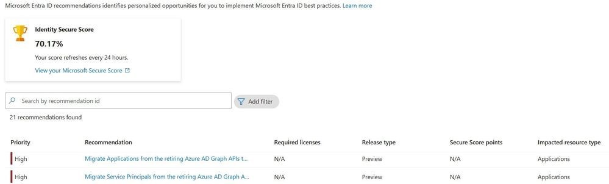

# Azure AD Graph API の廃止

こんにちは、Azure Identity サポート チームの 中村 です。 
 
本記事は、2024 年 7 月 1 日に米国の Microsoft Entra Blog で公開された [June 2024 update on Azure AD Graph API retirement - Microsoft Community Hub](https://techcommunity.microsoft.com/t5/microsoft-entra-blog/june-2024-update-on-azure-ad-graph-api-retirement/ba-p/4094534) を意訳したものになります。ご不明点等ございましたらサポート チームまでお問い合わせください。

---

1 年前、私たちは Azure AD Graph API サービスの非推奨化に関する 3 年間の通知期間が完了したという最新情報を共有しました。Azure AD Graph API サービスは、現在、リタイアメント サイクルに入っており、リタイアメント (停止) は段階的に行っていく予定です。このリタイアメント サイクルの最初の段階では、新しく作成されたアプリケーションは、Azure AD Graph APIへのリクエストに対してエラー（HTTP 403）を受け取るようになる予定です。この最初の段階の日付は 2024 年 6 月 30 日から 2024 年 8 月 31 日に変更されており、この最初の段階では 2024 年 8 月 31 日以降に作成されたアプリケーションのみが影響を受ける予定です。2025 年 1 月 31 日以降は、Azure AD Graph の延長アクセスを許可するように設定されていない限り、新規および既存のすべてのアプリケーションで、Azure AD Graph API へのリクエストがエラーになります。 

お客様の環境で、まだ Azure AD Graph API を使用しているソフトウェアを開発または配布している場合は、中断を避けるために、Azure AD Graph API の廃止に向けて今すぐ対処する必要があります。以下に記載しておりますとおり、アプリケーションを Microsoft Graph に移行するか (強く推奨)、拡張機能用にアプリケーションを構成し、お客様が変更に備えられるようにする必要があります。Azure AD Graph API を使用するベンダーから提供されたアプリケーションを使用している場合は、ソフトウェア ベンダーと協力して、Microsoft Graph API に移行したバージョンに更新ください。  

お客様環境では、Microsoft Graph への移行が完全に完了していないアプリケーションがあるかと思います。[authenticationBehaviors プロパティ](https://learn.microsoft.com/ja-jp/graph/applications-authenticationbehaviors?tabs=http) を通じて、2025 年 6 月 30 日までアプリケーションが Azure AD Graph API を使用できるようにするオプション設定を提供しています。Azure AD Graph は 2025 年 6 月 30 日以降に完全に廃止され、アプリケーションの設定にかかわらず、この時点で API へのリクエストは機能しなくなります。 

## テナント内で Azure AD Graph API を使用しているアプリケーションを探すにはどのようにすればよいですか？ 

[Microsoft Entra の推奨設定機能](https://learn.microsoft.com/ja-jp/entra/identity/monitoring-health/overview-recommendations) は、テナントが安全で健全な状態にあることを確認するための推奨事項を提供するのと同時に、Entra ID で利用可能な機能の価値を最大化するのに役立ちます。

お客様のテナントで Azure AD Graph API  をアクティブに使用しているアプリケーションとサービス プリンシパルに関する情報を表示する 2 つの Entra 推奨事項が用意されています。これらの新しい推奨事項は、影響を受けるアプリケーションとサービス プリンシパルを特定し、Microsoft Graph に移行する取り組みを支援します。 



詳細は、[Microsoft Graph API への移行に関する推奨事項](https://learn.microsoft.com/ja-jp/entra/identity/monitoring-health/recommendation-migrate-to-microsoft-graph-api) を参照ください。 

## Azure AD Graph アクセスの拡張機能のためのアプリケーションの構成 

お客様環境で作成されたアプリケーションに、2025 年 6 月 30 日まで Azure AD Graph API にアクセスするための拡張機能を持たせるには、作成後にアプリケーションの構成を変更する必要があります。この構成の変更は [authenticationBehaviors](https://learn.microsoft.com/ja-jp/graph/applications-authenticationbehaviors?tabs=http) インターフェイスを介して行われます。blockAzureADGraphAccess フラグを false に設定することで、新しく作成されたアプリケーションは、廃止サイクルが進むまで Azure AD Graph API を引き続き使用することができます。  

> [!NOTE]
> この最初の段階では、2024 年 8 月 31 日以降に作成されたアプリケーションのみが影響を受けます。既存のアプリケーションは、authenticationBehaviors プロパティが構成されていない場合でも、Azure AD Graph API を引き続き使用できます。この変更がロールアウトされますと、テストのために blockAzureADGraphAccess を true に設定したり、既存のアプリケーションで Azure AD Graph API を使用しないようにしたりすることもできます。 

### Microsoft Graph REST API の例 

シングル アプリケーションの authenticationBehaviors プロパティを読み取ります。

```
GET https://graph.microsoft.com/beta/applications/afe88638-df6f-4d2a-905e-40f2a2d451bf/authenticationBehaviors
```

authenticationBehaviors プロパティを設定して、新しいアプリケーションに拡張 Azure AD Graph アクセスを許可します。

```
PATCH https://graph.microsoft.com/beta/applications/afe88638-df6f-4d2a-905e-40f2a2d451bf/authenticationBehaviors  
Content-Type: application/json 
{ 
    "blockAzureADGraphAccess": false 
} 
```

### Microsoft Graph PowerShell の例 

シングル アプリケーションの authenticationBehaviors プロパティを読み取ります。

```powershell
Import-Module Microsoft.Graph.Beta.Applications 

Connect-MgGraph -Scopes "Application.Read.All" 
Get-MgBetaApplication -ApplicationId afe88638-df6f-4d2a-905e-40f2a2d451bf -Property "id,displayName,appId,authenticationBehaviors" 
```

authenticationBehaviors プロパティを設定して、新しいアプリケーションに拡張 Azure AD Graph アクセスを許可します。

```powershell
Import-Module Microsoft.Graph.Beta.Applications  

Connect-MgGraph -Scopes "Application.ReadWrite.All"  

$params = @{  
    authenticationBehaviors = @{  
        blockAzureADGraphAccess = $false  
    }  
}  

Update-MgBetaApplication -ApplicationId $applicationId -BodyParameter $params
```

### 2024 年 8 月 31 日以降 Azure AD Graph を使用するアプリケーションはどうなりますか？

Azure AD Graph API を使用し、この日付より前に作成された既存のアプリケーションは、廃止サイクルのこの段階では影響を受けません。

2024 年 8 月 31 日以降に作成されたアプリケーションでは、アプリケーションの authenticationBehaviors のプロパティで blockAzureADGraphAccess 属性が false に設定されていない限り、Azure AD Graph API  に要求を行うときにエラーが発生します。 

### 2025 年 1 月 31 日以降 Azure AD Graph を使用するアプリケーションはどうなりますか？

2025 年 1 月 31 日以降、アプリケーションの authenticationBehaviors プロパティで blockAzureADGraphAccess 属性が false に設定されていない限り、新規および既存のすべてのアプリケーションで、Azure AD Graph API へのリクエスト時にエラーが発生します。 

### 2025 年 6 月 30 日以降 Azure AD Graph を使用するアプリケーションはどうなりますか？

2025 年 6 月 30 日以降、Azure AD Graph API  はどのアプリケーションでも使用できなくなり、アプリケーションの authenticationBehaviors 構成に関係なく、Azure AD Graph API への要求はエラーを受け取ります。 

## Azure AD Graph の現在のサポート

Azure AD Graph API は廃止サイクルにあり、セキュリティ関連の修正プログラム以外の SLA やメンテナンスのコミットメントはありません。 

## Microsoft Graph について

Microsoft Graph は、現在利用が推奨される API です。Microsoft Graph は、Entra と Microsoft Teams や Microsoft Intune のような Microsoft 365 サービスにアクセスするための単一の統合エンドポイントを提供します。すべての新機能は、Microsoft Graph を通じてのみ利用できます。また、Microsoft Graph は Azure AD Graph よりも安全性と柔軟性があります。 

Microsoft Graph は、Azure AD Graph で利用可能であったすべての機能と、ID の保護や認証方法などの新しい API を備えています。クライアント ライブラリは、再試行処理、セキュア リダイレクト、透過的認証、ペイロード圧縮などの機能を既定でサポートしています。 

## Azure AD と Microsoft Online PowerShell モジュールはどうなりますか？

2024 年 3 月 30 日をもって、AzureAD、AzureAD Preview、Microsoft Online (MSOL) の PowerShell モジュールは非推奨となっており、セキュリティ修正のみのサポートとなっております。これらのモジュールは、2025 年 3 月 30 日以降に廃止され、動作しなくなります。これらを Microsoft Graph PowerShell に移行する必要があります。詳細については、こちらの更新情報をご確認ください。

## 利用可能なツール

- [Azure AD Graph から Microsoft Graph にアプリを移行する](https://learn.microsoft.com/ja-jp/graph/migrate-azure-ad-graph-overview)
- [Azure AD Graph アプリ移行計画のチェックリスト](https://learn.microsoft.com/ja-jp/graph/migrate-azure-ad-graph-planning-checklist)
- [Azure AD Graph から Microsoft Graph への移行に関する FAQ](https://learn.microsoft.com/ja-jp/graph/migrate-azure-ad-graph-faq)
