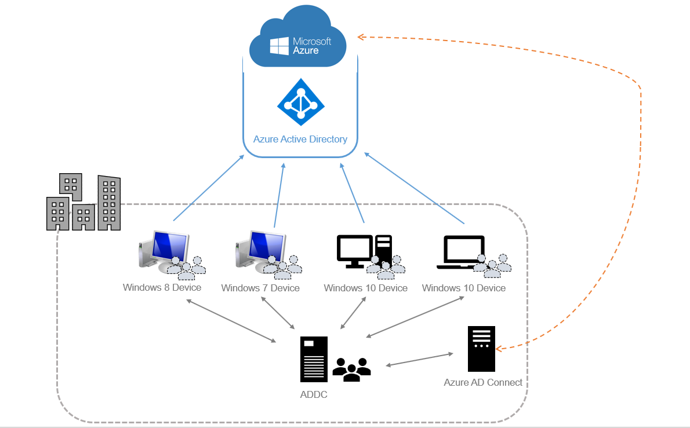
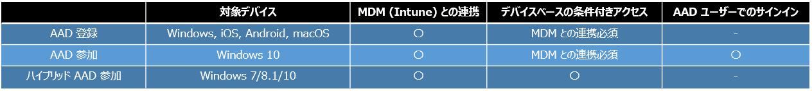

> 本記事は Technet Blog の更新停止に伴い https://blogs.technet.microsoft.com/jpazureid/2018/09/13/azure-ad-join-vs-azure-ad-device-registration/ の内容を移行したものです。
> 元の記事の最新の更新情報については、本内容をご参照ください。

# Azure AD 登録 と Azure AD 参加 の違い

こんにちは、Azure & Identity サポート チームの倉本です。

今回は、 Azure AD 登録 (registered) と Azure AD 参加 (Azure AD joined) の違いについて紹介します。
Azure AD へのデバイス登録の種類は複数あり、 その違いについてお問い合わせを多くお寄せいただいております。

それぞれについてどういった場面で利用されることが想定されているかを説明していきます。

Azure AD に登録されるデバイスの種類は下記の 3 種類となっています。

・ Azure AD 登録 (Azure AD registered)

・ Azure AD 参加 (Azure AD joined)

・ ハイブリッド Azure AD 参加 (Hybrid Azure AD joined)

まず先に大きく利用ケースを分けると下記のようになります。

BYOD デバイスの組織での管理

     Azure AD 登録

組織管理内の Windows デバイスからのアクセスのサポート

     Azure AD 参加 (オンプレ AD 環境を持たない場合)
     ハイブリッド Azure AD 参加 (オンプレ AD 環境を持っている場合)

ここからは、ユースケースとともに各登録の種類の詳細を説明させていただきます。

## Azure AD 登録 (Azure AD registered)

対象デバイス : Windows 10, Android, iOS, macOS

他の登録については、Windows デバイスのみが対象となっていますが、 Android, iOS, macOS をサポートしていることからも分かるように
Azure AD 登録は Bring Your Own Device (BYOD) ご利用時に使用することを想定した機能となります。

Azure AD 登録を構成することでユーザーは、個人のデバイスで組織の管理するクラウド アプリケーションにサインインできるようになり
組織の管理者は、 MDM と連携して組織に必要な設定を展開するなど、組織の要求するセキュリティ要件に満たすような構成をユーザーのデバイスに強制させることができます。

加えて、 Microsoft Intune などのモバイル デバイス管理 (MDM) ソリューションとの連携を実施させることで、条件付きアクセス ポリシーでのアクセス制御が可能になります。

## Azure AD 参加 (Azure AD joined)

対象デバイス : Windows 10

Azure AD 参加はオンプレ AD 環境を持たない組織、あるいはオンプレ AD 環境からクラウドへの完全移行を進めている組織でご利用いただくことを想定している機能となります。

Azure AD 参加を実施することで下記の機能を利用することが可能です。

- Microsoft Intune などのモバイル デバイス管理 (MDM) ソリューションとの連携による、条件付きアクセス ポリシーでのアクセス制御

- Azure AD ユーザーでの Azure AD 参加端末への Windows サインイン

- Window 10 デバイスへサインインを実施したユーザーの資格情報を利用したクラウド アプリケーションへの SSO (*)

※ 対象ブラウザー (IE /Edge)、対象アプリケーションに限定されます。

利用可能な機能を見ても分かる通り、 Azure AD 参加は Azure AD 登録の機能を包合した機能となっています。

Azure AD 参加により、オンプレ AD でドメイン参加ユーザーがオンプレ AD ドメイン参加しているデバイスに自由にサインインできるのと同じように Azure 上のユーザーで Azure AD 参加デバイスに自由にサインインすることができます。

オンプレ AD を持っていない組織でも、ローカル アカウントを使用するのではなく、 Azure AD 上のユーザーでデバイスにサインインできるようになるため、オンプレ AD と同様にユーザー アカウントを Azure AD 上で一元管理ができるようになります。

## ・ハイブリッド Azure AD 参加 (Hybrid Azure AD joined)

対象デバイス : Windows 10, Windows 8.1, Windows 7

ハイブリッド Azure AD 参加は、オンプレ AD を利用している組織が、 Azure AD 参加デバイスと同様のメリットを享受するために利用する機能です。
例えばハイブリッド Azure AD 参加済みデバイスを構成することで、ドメイン参加済みデバイスへの Windows サインイン後、 Azure へユーザー名・パスワードを入力することなくサインインができるようになる等のメリットがございます。

ハイブリッド Azure AD 参加の構成により、下記の機能を利用することが可能です。

・ 条件付きアクセス ポリシーでのハイブリッド Azure AD 参加構成済みデバイスを条件としたアクセス制御

・ ダウンレベル の Windows デバイス ( Windows 8.1 , Windows 7 ) の Azure AD への登録

・ Windows デバイスへサインインを実施したユーザーの資格情報を利用したクラウド アプリケーションへの SSO

Windows 8.1 や Windows 7 などのダウンレベルのデバイスをサポートしているのは ハイブリッド Azure AD 参加のみです。
オンプレ AD を利用している環境で Azure AD へのデバイスを登録して条件付きアクセスを利用したいというような場合には、ハイブリッド Azure AD 参加が必要です。

ハイブリッド Azure AD 参加を構成手順については、以下の弊社公開情報を参照ください。

https://docs.microsoft.com/ja-jp/azure/active-directory/devices/

以上の 3 つの機能はそれぞれ利用を想定している環境がございます。
そのため、ご利用いただいている環境、状況に合わせて最適なものを選択いただければと思います。

最後にそれぞれの機能を表にまとめておきます。

ご不明な点がございましたら弊社サポートまでお気軽にお問い合わせください。

上記内容が少しでも皆様の参考となりますと幸いです。
※本情報の内容（添付文書、リンク先などを含む）は、作成日時点でのものであり、予告なく変更される場合があります。
