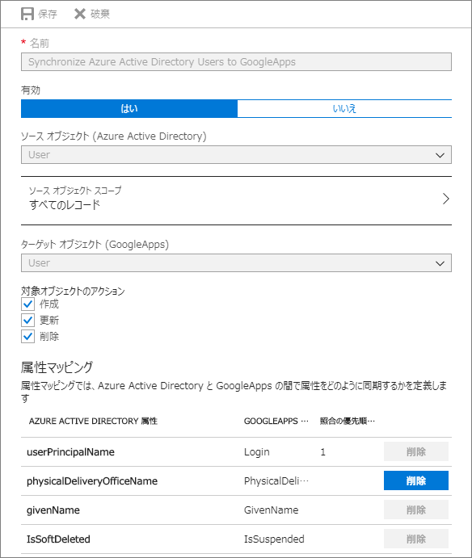
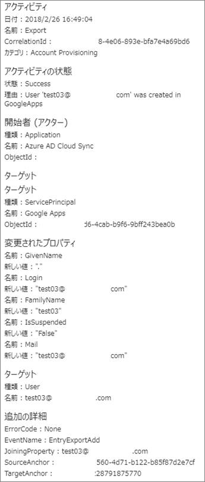

> 本記事は Technet Blog の更新停止に伴い https://blogs.technet.microsoft.com/jpazureid/2018/04/03/azure-ad-provisioning/ の内容を移行したものです。
> 元の記事の最新の更新情報については、本内容をご参照ください。

# Azure AD プロビジョニング機能について

こんにちは、 Azure & Identity サポート チームの平形です。

今回は、Azure AD のプロビジョニング機能についてご紹介します。

プロビジョニングは Azure AD と連携する主に他社から提供されている SaaS アプリケーションに Azure AD 上に存在するアカウント情報を自動で作成・更新・削除を行う機能です。

オンプレミスの Active Directory と Azure Active Directory 間は Azure AD Connect で同期できますが (Azure AD 視点でアカウントを利用できるようにするという意味でプロビジョニングと呼ぶこともできます)、更に Azure AD と連携している SaaS アプリケーションが利用するアカウント情報を同期させることで (今回の Blog で紹介するプロビジョニングです)、それぞれのアカウントを一元管理し、シングル サインオンを実現できます。

今回はプロビジョニング機能の概要とよくあるお問い合わせを紹介します。

プロビジョニングは大まかに分けると以下のフローに分けて処理が行われます。(括弧内は Azure AD 監査ログに出力されるアクティビティです)

### **プロビジョニングの初期同期**
1. テナント上のユーザー・グループ オブジェクト情報を属性マッピングで定義された値に基づき抽出する。 (Import)
2. 1. で抽出した属性を基に、対象の SaaS アプリケーション上に同様のユーザー・グループが存在しているかを確認する。同時にプロビジョニング対象のユーザー・グループであるかを確認し、対象外のものを列挙する。(Synchronization rule action)
3. プロビジョニングを行う対象のユーザー・グループ オブジェクトを SaaS アプリケーションに対して作成・更新・削除処理の命令として送信する。同期の結果を Azure AD 上に格納する。 (Export)

### **プロビジョニングの差分同期**
1. Azure AD 上で動作しているユーザー・グループ オブジェクトの更新状態を監視している Sync Engine によって検知されたオブジェクトとこれまでの同期の結果を比較し、変更のあったオブジェクトのみにプロビジョニングのチェック処理を行う。 (Import/Synchronization rule action)
2. プロビジョニング対象のオブジェクトを SaaS アプリケーション上に作成・更新・削除処理を行う。同期の結果を Azure AD に格納する。 (Export)

初期同期はプロビジョニングを初めて構成し、プロビジョニングを有効にしたタイミングで発生する以外に、属性マッピングの変更や、「現在の状態を消去して、同期を再開します」のチェックボックスを ON にした際にも発生します。

初期同期、差分同期の 1 で Azure AD のアカウントが SaaS アプリケーション上に存在するかの確認は、属性マッピングで定義した「照会の順序」にて設定した内容に基づいて実行されます。

照会の順序を複数設定した場合、照会の順序にて設定した番号の順に評価を行い、 1 つでも同一の値が SaaS アプリケーション上で見つかった場合には一意のアカウントとして更新処理が発生し、全く一致するアカウントがなかった場合はアカウントの新規作成を実施します。

照会の順序がどういうものか Azure AD Connect に詳しい方は、 Azure AD Connect の [SourceAnchor](https://docs.microsoft.com/ja-jp/azure/active-directory/connect/active-directory-aadconnect-design-concepts) を思いおこしてみてください。

それと同じ考え方です (ただ Azure AD Connect の場合には複数 SourceAnchor となるものを指定することはできませんが)。例えば Google Apps の場合、既定ではユーザー アカウントは Azure AD 上の userPrincipalName 属性を Google Apps 上の Login 属性とマッチングを行い、同一であれば同じアカウントであると判定します。

グループ アカウントの場合は Azure AD 上の mail 属性を、 Google Apps 上の Mail 属性とマッチングを行います。

** マッチングする属性や仕組みは連携アプリケーションによって異なります。

//参考: プロビジョニング設定画面

### よくあるお問い合わせ・ご質問
#### Q. プロビジョニング処理の結果を知りたい

#### A. プロビジョニングの設定画面、もしくは Azure AD 監査ログを参照ください。下記手順で監査ログの取得が可能です
1. Azure AD 管理ポータルに全体管理者権限を持つユーザーでサインインを行います。
2. 左ペイン上で [Azure Active Directory] を選択します。
3. [監査ログ] を選択します。

// 参考: Google Apps にアカウントが作成された際の監査ログ

#### Q. プロビジョニング対象に Azure AD のセキュリティ グループを割り当てているが、セキュリティ グループのメンバーを入れ替えても変更したユーザー情報が SaaS アプリケーションにプロビジョニングされない

#### A. グループの割り当てを一度解除し、再度グループの割り当てを実施ください

プロビジョニング設定を行う前にセキュリティ グループの割り当てを行っていた場合、 Azure AD 上のセキュリティ グループのメンテナンスを行ってもメンテナンスした結果がプロビジョニングの同期対象と認識しない事例があります。

本来、グループのメンバーを入れ替えても再割り当ての作業は必要無いのですが、このような事象が発生した場合にグループの割り当てを一旦解除し、再度同じグループを割り当てる操作は有効です。

割り当ての解除・再割り当てを実施しても事象が改善しない場合には弊社までお問い合わせください。

#### Q. 初期同期を発生させた際に監査ログ上にプロビジョニング対象のユーザー以外が出力されている

#### A. 初期同期時は Azure AD 上のすべてのアカウントに対して、差分同期の場合は変更が発生した Azure AD 上のアカウントに対して Import/Synchronization rule action 処理が発生するため、実際は同期対象外のユーザーについても監査ログ上には出力されます。
通常の同期時にも対象外のユーザーが監査ログ上残ることもありますが、 SaaS アプリケーションに対してプロビジョニングは行われません。プロビジョニングされたかにつきましては監査ログの “Export” という名前の処理結果を確認ください。

#### Q. プロビジョニング モードを「自動」から「手動」に変更したい。プロビジョニングを停止したい

#### A. 「プロビジョニング状態」を 「オフ」にすることでプロビジョニングを無効化できます。プロビジョニング モードを自動から手動に戻すことはできません。

#### Q. プロビジョニングがうまくいかなくなってしまった。初期同期を再度実行したりユーザー・グループの割り当てを再度行っても改善されない

#### A. Azure サポートの活用を検討ください。一般的に調査の際には次のような情報が必要です。
詳細はお問い合わせの後でご案内を差し上げていますが、現象の発生タイミング、発生頻度に関する情報と併せまして事前に用意いただければと思います。
- 監査ログ
- テナント ID ([Azure Active Directory] - [プロパティ] - [ディレクトリ ID] より確認可能です)
- プロビジョニングの設定画面

// 参考: プロビジョニングの設定画面

こちらでは同期の詳細を割愛しておりますが、お問い合わせ頂く際には同期の詳細結果も見えるように情報をお寄せください。

[参考情報]

Azure Active Directory による SaaS アプリへのユーザー プロビジョニングとプロビジョニング解除の自動化
https://docs.microsoft.com/ja-jp/azure/active-directory/active-directory-saas-app-provisioning

ご不明な点等がありましたら、ぜひ弊社サポート サービスをご利用ください。

※本情報の内容（リンク先などを含む）は、作成日時点でのものであり、予告なく変更される場合があります。
