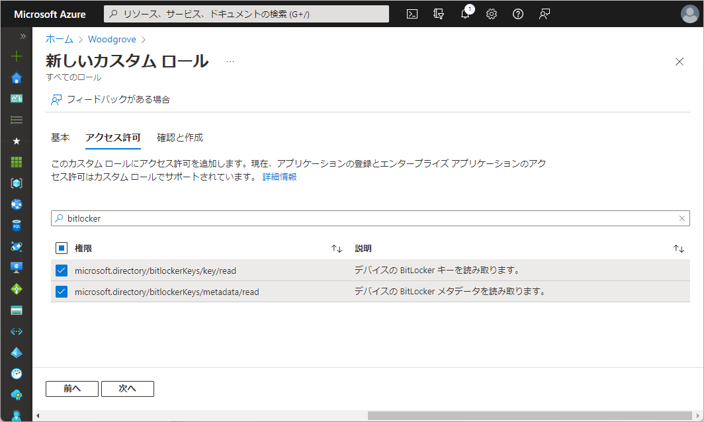

# Azure AD RBAC: デバイス用のカスタム ロールと管理単位が利用可能に

こんにちは、Azure Identity サポート チームの 高田 です。

本記事は、2022 年 3 月 31 日に米国の Azure Active Directory Identity Blog で公開された [Azure AD RBAC: Custom roles & administrative units for devices now available](https://techcommunity.microsoft.com/t5/azure-active-directory-identity/azure-ad-rbac-custom-roles-amp-administrative-units-for-devices/ba-p/3185209) を意訳したものになります。ご不明点等ございましたらサポート チームまでお問い合わせください。

---

皆さん、こんにちは。

この一連のブログの最初の投稿で、[アプリの管理を委任して行うためのカスタム ロールの一般的提供開始](https://jpazureid.github.io/blog/azure-active-directory/custom-roles-for-app-management-now-available/) について解説しました。今回、Azure Active Directory (Azure AD) のロールベースのアクセス制御 (RBAC) に関し、この続報として Azure AD でデバイス管理のきめ細かい委任を可能にするいくつかの新機能をご紹介いたします。これらの新機能を利用すると、以下のことが可能になります。

- デバイス オブジェクト用のアクセス許可を使用してカスタム ロールを作成する。
- デバイスを管理単位のメンバーとして追加し、管理単位の範囲内でデバイスを管理するための組み込みまたはカスタムのロールを割り当てる。

これらの新機能を使用してできることをいくつか見てみましょう。

以下の動画をご覧いただくことでも新機能をの動作をご確認いただけます。

[Device Management with Custom Roles and Administrative Unites (YouTube へのリンク)](https://youtu.be/sQD_6f3rg0k)

## カスタムロールの作成

デバイスのアクセス許可を使用してカスタム ロールを作成するには、[ロールと管理者] に進み、[+ 新しいカスタム ロール] を選びます。この例では、"BitLocker Recovery Key Reader" という、BitLocker の回復キーを読み取るカスタム ロールを作成します。

ロールの名前と説明を入力します。次に、カスタムロール用の新しいデバイスのアクセス許可を使用して、このロール用に BitLocker のアクセス許可のみを選択します。

最後に [次へ] をクリックしてロールを作成します。これで他の不要なアクセス許可は付与せず、BitLocker 回復キーの読み取りだけを委任するカスタムロールを作成できました。

## 管理単位にデバイスを追加する

ロールのアクセス許可をカスタマイズするだけでなく、管理単位を使用して、これらのアクセス許可を特定のデバイスのみに適用することも可能です。

以下の例では、"Service Department" という管理単位にデバイスが追加されています。[+ デバイスの追加] をクリックして、管理単位にデバイスを追加いただけます。

## カスタム ロールと管理単位を組み合わせて使用する

次に、[ロールと管理者] に移動して、作成したカスタム ロールを管理単位のスコープに割り当てられます。これにより、ロールの作成時に指定した BitLocker のアクセス許可を管理単位の中にあるデバイスにだけ適用できるようになります。

注意: カスタムロールの割り当てにおいては、[Privileged Identity Management の資格のある割り当て](https://docs.microsoft.com/ja-jp/azure/active-directory/privileged-identity-management/pim-how-to-add-role-to-user#assign-a-role-with-restricted-scope) を利用することを強くお勧めします。

以上になります！詳細については、[カスタム ロール](https://aka.ms/customrolesdevices) もしくは [管理単位](https://aka.ms/adminunitsdevices) のドキュメントもご覧ください。同様の機能については [PowerShell](https://docs.microsoft.com/ja-jp/powershell/azure/active-directory/overview?view=azureadps-2.0-preview) と [Microsoft Graph API](https://developer.microsoft.com/ja-jp/graph) からもご利用いただけます。

## 今後の取り組み

Azure AD RBAC に関連して今後も素晴らしい機能の発表にご注目ください。今しがたフィードバックや提案がございましたらぜひお知らせください。[Azure AD administrative roles のフォーラム](https://feedback.azure.com/forums/169401-azure-active-directory?category_id=166032) で共有いただければと思います。

Alex Simons (Twitter: [@Alex_A_Simons](https://twitter.com/Alex_A_Simons))  
Corporate VP of Program Management  
Microsoft Identity Division
