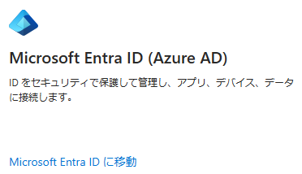

# Azure AD の名称変更のロールアウトとリソースについて

こんにちは、Azure Identity サポート チームの 中村 です。  

 
本記事は、2023 年 9 月 19 日に米国の Microsoft Entra (Azure AD) Blog で公開された [Azure AD Rename Rollout and Resources](https://techcommunity.microsoft.com/t5/microsoft-entra-azure-ad-blog/azure-ad-rename-rollout-and-resources/ba-p/2520432) を意訳したものになります。ご不明点等ございましたらサポート チームまでお問い合わせください。 

---



Azure Active Directory (Azure AD) から Microsoft Entra ID への名称変更は、[7 月 11 日の Azure AD の名称変更に関する発表](https://techcommunity.microsoft.com/t5/microsoft-entra-azure-ad-blog/azure-ad-is-becoming-microsoft-entra-id/ba-p/2520436) で説明された実施スケジュールに従って、現在 Microsoft のコンテンツと製品エクスペリエンスで展開されています。名称の更新の大部分は今年の 11 月中旬までに完了し、オンプレミス ソフトウェアの更新は 2024 年に完了すると予測しています。パートナー、アナリスト、インフルエンサーも、Azure AD の代わりに Microsoft Entra ID の名前を使い始めています。

Microsoft Azure、Azure Marketplace、Microsoft 365、Microsoft セキュリティ管理センターに新しい製品名とアイコンが表示されることに加えて、2023 年 10 月 1 日にサービス プラン (SKU) の表示名が Microsoft Entra ID Free、Microsoft Entra ID P1、Microsoft Entra ID P2 に更新されます。 

すでに発表されているように、これは単なる新しい名称であり、導入や日常業務への影響はなく、機能、ライセンス、サービス条件、サポートにも変更はありません。 

この移行期間中、多くのお客様やパートナーの皆様からいただいたフィードバックに感謝いたします。Microsoft Entra のネーミングを反映するために、自社のドキュメントやエクスペリエンスのアップデートを検討されている場合、そのご支援をするためのリソースをご用意しました。また、このコミュニティからの質問に基づき、名称変更について不明点を解消してまいります。

### お客様のコンテンツ内の Azure AD の名称を更新するためのリソース

名称変更が広く展開されている状況のため、お客様の組織でも、ドキュメントやコンテンツで Azure AD の名称を正確に更新したいとお考えと存じます。現在、Microsoft Learn 上の公開情報「[How to rename Azure AD](https://learn.microsoft.com/en-us/azure/active-directory/fundamentals/how-to-rename-azure-ad)」で、Microsoft のベスト プラクティス、ツール、ヒントを共有しています。 

組織のコンテンツ全体で必要に応じて名前を変更するのにこのドキュメントを活用いただければと思います。Azure AD という文字列や画像アイコンを見つけて更新するためのベストプラクティスも含まれています。もう 1 つの重要な参考ドキュメントとしては、Microsoft Learn の "[New name for Azure Active Directory](https://learn.microsoft.com/en-us/azure/active-directory/fundamentals/new-name)" があり、スタイル ガイド、更新された製品と機能の名前付けの包括的な用語集、名称変更の例外の一覧、新しい製品アイコンのダウンロード、Microsoft が名称変更を実施するための主要なマイルストーンのタイムラインが含まれています。 

これらのリソースを用いて、お客様の社内プロセスに沿ってアップデートの範囲と計画を進めていただければと思います。 

**以下ではコミュニティからのご質問に回答します：**

### 引き続き管理者の皆様は Azure ポータルを使用して Microsoft Entra ID を管理できます。 

Microsoft 365 管理センターで利用可能な ID の管理エクスペリエンスと同様に、Azure ポータルを好むお客様や、Microsoft Entra の機能の一部のみを必要とするお客様のために、Azure ポータルで Microsoft Entra ID を管理する機能を引き続きサポートします。Azure ポータルでの操作内容の変更は最小限とし、利便性を維持しつつ、Microsoft Entra ID が以前は Azure AD として提供されていたというメッセージをしばらくの間継続します。 

すべてのお客様に、包括的な [Microsoft Entra 管理センター](https://entra.microsoft.com/) のご利用をお勧めしますが、既存のポータル内で関連する ID エクスペリエンスを管理する機能は維持します。 

### オンプレミスの ID も Microsoft Entra ID で引き続きサポートされます。 

多くの組織が引き続きオンプレミス製品を利用いただしておりますので、オンプレミスの ID とアクセスの管理、および Azure やその他のクラウドへの接続のために、[Windows Server Active Directory](https://learn.microsoft.com/en-us/windows-server/identity/identity-and-access) を引き続きサポートし、強化していきます。 

Active Directory の名称は変更されません。Azure Active Directory の新しい名称として Microsoft Entra ID を採用するに際し多くのフィードバックをいただきました。多くのお客様にとって、この名称の変更により、オンプレミス (Active Directory) とマルチクラウド ID (Microsoft Entra ID) のソリューションをより明確に区別できるようになるはずです。 

### ID 開発者と DevOps エクスペリエンスの名称は変更されません。 

シームレスな移行を実現するため、既存のログイン URL、API、PowerShell コマンドレット、Microsoft Authentication Libraries (MSAL) はすべてそのままで、開発者エクスペリエンスやツールもそのままです。詳細はこちらをご覧ください: [What's changing for identity developer and devops experience? - Microsoft Entra | Microsoft Learn](https://learn.microsoft.com/en-us/azure/active-directory/fundamentals/new-name#whats-changing-for-identity-developer-and-devops-experience) 

顧客は詳細な技術面をほとんど意識していない (サインイン URL など) 事に加え、それら個別の技術は API と同じくブランド化されていません。例として、Microsoft Entra 条件付きアクセス (旧称 Azure AD 条件付きアクセス) の API が Microsoft Graph にどのように表示されるかを次に示します。 

```json
  "conditions": {"@odata.type": "microsoft.graph.conditionalAccessConditionSet"},  

  "createdDateTime": "String (timestamp)",  

  "displayName": "String",  

  "grantControls": {"@odata.type": "microsoft.graph.conditionalAccessGrantControls"},  

  "id": "String (identifier)",  

  "modifiedDateTime": "String (timestamp)",  

  "sessionControls": {"@odata.type": "microsoft.graph.conditionalAccessSessionControls"},  

  "state": "string"
```

ソース: [conditionalAccessPolicy resource type - Microsoft Graph v1.0 | Microsoft Learn](https://learn.microsoft.com/en-us/graph/api/resources/conditionalaccesspolicy?view=graph-rest-1.0)

### Azure AD PowerShell コマンドレットは改名されません。

現在、ID タスクを管理するための PowerShell モジュールとして、2024 年 3 月に廃止予定の Azure AD PowerShell モジュールと Microsoft Graph PowerShell モジュールの 2 つを提供しています。 

Azure AD PowerShell for Graph モジュールでは、ほぼすべての [Azure AD コマンドレット](https://learn.microsoft.com/en-us/powershell/module/azuread/?view=azureadps-2.0) の名前に "AzureAD "が入っています。これらは変更されることはなく、正式な製品名が Microsoft Entra ID になった現在も、同じコマンドレットを使い続けることができます。 

6 月に、Microsoft Graph チームの Kristopher Bash が、[Azure AD Graph の廃止と Azure AD PowerShell モジュールの非推奨に関する最新情報](https://techcommunity.microsoft.com/t5/microsoft-entra-azure-ad-blog/important-azure-ad-graph-retirement-and-powershell-module/ba-p/3848270) を公開しました。いずれのモジュールも Microsoft Graph テクノロジーに移行できるように、数年という計画で廃止される予定であり、Kristopher の記事では、そのタイミングとお客様側で利用できる情報を明確にし、さらに、移行期間中にお客様と弊社が最大限協力するという弊社のコミットメントを示しています。 

Azure AD PowerShell の廃止日は、2024 年 3 月 30 日を予定しています。それ以降も動作はしますが、サポートは制限されます。 

今後、Microsoft Entra ID を操作するための推奨モジュールとして、Microsoft Graph PowerShell を試すことをお勧めします。皆様からのフィードバックに基づき、Azure AD PowerShell から Microsoft Graph PowerShell に [移行](https://learn.microsoft.com/en-us/powershell/microsoftgraph/migration-steps?view=graph-powershell-1.0) する際にスムーズに移行できるよう [Microsoft Graph PowerShell で Microsoft Entra ID を管理する機能を引き続き追加していきます](https://learn.microsoft.com/en-us/powershell/azure/active-directory/migration-faq?view=azureadps-2.0#what-is-microsoft-doing-about-the-gaps-in-functionality-between-azure-ad-and-microsoft-graph-powershell-modules)。 

### すべての人があらゆる場所でセキュアなアクセスを実現できるよう注力 

Azure AD の名称変更は、ID とアクセス管理の状況が時間とともにどのように変化してきたかを示すものです。ファイアウォールの内側で ID を管理する時代を経て、現在は信頼性の高い相互作用を複雑に組み合わせて実現することが可能となり、人々は安全にコラボレーションし、生産性を高めることができるようになりました。従来の ID およびアクセス管理サービスでは、もはや十分ではありません。 

弊社は、Microsoft Entra IDという名称が、製品のマルチクラウドおよびマルチプラットフォーム機能をより正確に表し、オンプレミスの ID ソリューション Active Directory との混同を緩和すると共に、Microsoft Entra ID およびネットワーク アクセス製品を拡大する中で、あらゆる ID を保護し、あらゆるアクセス拠点を保護する、よりシンプルな方法を提供する道筋を作れると信じています。 

Microsoft Entra という製品群の名称が機能の明確化に役立っている例として、[Microsoft Entra 条件付きアクセス](https://learn.microsoft.com/en-us/azure/active-directory/conditional-access/overview) (旧 Azure AD 条件付きアクセス) があります。条件付きアクセス ポリシーを、ID と新しいセキュリティ サービスエッジ (SSE) の製品 ([Microsoft Entra Internet Access](https://www.microsoft.com/en-us/security/business/identity-access/microsoft-entra-internet-access) と [Microsoft Entra Private Access](https://www.microsoft.com/en-us/security/business/identity-access/microsoft-entra-private-access) ) 間で一貫して適用および活用できるようになりました。制御対象がクラウド　アプリケーションだけでなく [ネットワーク トラフィックにまで広がり](https://learn.microsoft.com/en-us/entra/global-secure-access/concept-universal-conditional-access)、ポリシーがアプリケーションやユーザー操作だけでなくトラフィックの種類に基づくようになりました。このことから、この製品横断的な機能には、統合された ID とネットワーク アクセスの名称である Microsoft Entra が使用されるようになりました。 

デジタル環境が拡大し、アクセス拠点が多様化するにつれて、弊社は革新を続け、製品ポートフォリオを拡大していきます。 

是非覚えていただきたいのは、アクセスを保護するための最も包括的なアプローチは、[Microsoft Entra](https://www.microsoft.com/en-us/security/business/microsoft-entra-pricing) であるということです。 

### Microsoft Entra ID のお客様への継続的なコミットメント 

Microsoft Entra IDは、グローバルで 72 万を超える様々な規模の組織にサービスを提供しており、[業界アナリストからリーダーとして認められ続けています](https://www.microsoft.com/en-us/security/business/identity-access/microsoft-entra-id)。新機能と機能改善は、名称変更に留まらず、お客様がより安全かつ効果的で、より柔軟に変化に対応できるようになることを支援します。四半期ごとに[新機能のリリースやアップデートについてブログでお知らせしています](https://techcommunity.microsoft.com/t5/microsoft-entra-azure-ad-blog/microsoft-entra-new-feature-and-change-announcements/ba-p/3796396) が、最近のハイライトをいくつかご紹介します: 

- [保護されたアクションのための条件付きアクセス](https://techcommunity.microsoft.com/t5/microsoft-entra-azure-ad-blog/conditional-access-for-protected-actions-is-now-generally/ba-p/3888723) が一般提供 (GA) されました。 
- [サインインエクスペリエンスにおける企業ブランディングの強化](https://techcommunity.microsoft.com/t5/microsoft-entra-azure-ad-blog/enhanced-company-branding-for-sign-in-experiences-now-generally/ba-p/3823765) が一般提供 (GA) されました。 
- [iOS および macOS ブラウザでの FIDO2 サポート](https://techcommunity.microsoft.com/t5/microsoft-entra-azure-ad-blog/advancing-modern-strong-authentication/ba-p/3773135) が一般提供 (GA) されました。 
- [継続的アクセス評価における場所に基づくポリシーの厳密な適用できる機能](https://techcommunity.microsoft.com/t5/microsoft-entra-azure-ad-blog/public-preview-strictly-enforce-location-policies-with/ba-p/3773133) が一般提供 (GA) されました。 
- [Microsoft Entra ID Protection](https://techcommunity.microsoft.com/t5/microsoft-entra-azure-ad-blog/bg-p/Identity) と [Microsoft Entra ID Governance](https://techcommunity.microsoft.com/t5/microsoft-entra-azure-ad-blog/microsoft-entra-id-governance-entitlement-management-new/ba-p/2466929) に新機能が追加されました。 

組織の従業員を保護し、アプリとデータへのアクセスを確保するための皆様の継続的な取り組みに感謝いたします。この名称の移行を最大限スムーズに実現できるよう、引き続き皆様のご意見をいただければ幸いです。 
