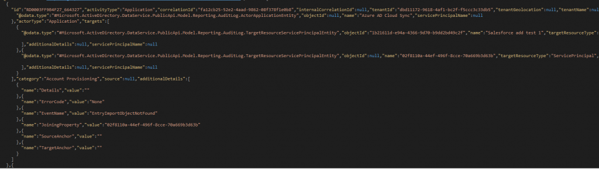

> 本記事は Technet Blog の更新停止に伴い https://blogs.technet.microsoft.com/jpazureid/2018/01/28/azure-ad-reporting-api/ の内容を移行したものです。
> 元の記事の最新の更新情報については、本内容をご参照ください。

# Azure AD Reporting API を利用して PowerShell より Azure AD のサインイン アクティビティ レポートと監査アクティビティ レポートを CSV ファイルで取得する方法

こんにちは、Azure & Identity サポート チームの 姚 (ヨウ) です。

Azure AD のサインイン アクティビティ レポートと監査アクティビティ レポートの保持期間は決まっており、例えばサインイン アクティビティであれば Azure AD Premium のライセンスがテナントに割り当てられていても 30 日です。

そのため、それ以前のデータを確認したい場合には、予めログをエクスポートしてバックアップしておく必要があります。

バックアップは、 Azure ポータルで行うことはできるのですが、手動で定期的にバックアップをすることは手間ですが、そのような場合には Azure Active Directory Reporting API を利用して PowerShell よりおこなうこともできます。

以下の公開情報では、それぞれのレポートを PowerShell スクリプトを用いて取得する方法を紹介しています。

- Azure Active Directory サインイン アクティビティ レポート API のサンプル

  https://docs.microsoft.com/ja-jp/azure/active-directory/active-directory-reporting-api-sign-in-activity-samples


- Azure Active Directory レポートの監査 API の例

  https://docs.microsoft.com/ja-jp/azure/active-directory/active-directory-reporting-api-audit-samples

しかし、上記の方法は、レポートを .json ファイル形式で保持し、取得する方法です。

json ファイル形式は以下のようになり、このままは利用しづらいフォーマットです。



ポータルからは以下のような .csv ファイル形式でダウンロードできますので、この形式で入手したいという要望をお持ちの方も多いと思います。


今回は PowerShell スクリプトで .csv ファイル形式で取得する方法を紹介します。


1. 以下の URL にアクセスし、 右上にある "Raw" を右クリックし、"対象をファイルの保存" をクリックし、azureadutils.psm1 をダウンロードします。

   https://github.com/AzureAD/azure-activedirectory-powershell/blob/gh-pages/Modules/AzureADUtils/AzureADUtils.psm1

2. 任意の一時フォルダーを作成し、AzureADUtils.psm1 をコピーします。

3. 管理者権限で PowerShell を起動し、AzureADUtils.psm1 をコピーした一時フォルダーに移動します。

4. 次のコマンドを実行し、 Execution Policy Change の画面が表示されましたら "Y" を入力します。
   ```powershell
   Set-ExecutionPolicy Unrestricted
   ```

5. 次のコマンドを実行し、モジュールをインポートします。このとき Security warning が表示された場合には "R" を入力します。
   ```powershell
   Import-Module .\AzureADUtils.psm1
   ```

6. 次のコマンドを実行し、モジュールをインストールします。ここでも Security warning が表示された場合には "R" を入力します。
   ```powershell
   Install-AzureADUtilsModule
   ```

7. これまでの PowerShell コンソールを終了し、新しい PowerShell を開始します。

8. 次のコマンドを実行し、再度モジュールをインポートします。ここでも Security warning が表示された場合には "R" を入力します。
   ```powershell
   Import-Module AzureADUtils
   ```

9. 以下のドキュメントに記載された手順に従って、アプリケーションを登録し、"構成設定を収集する" に従って必要な情報を取得します。

   Azure AD Reporting API にアクセスするための前提条件

   https://docs.microsoft.com/ja-jp/azure/active-directory/active-directory-reporting-api-prerequisites-azure-portal

10. テキスト エディターを開き、次の中身をコピーしたうえで、環境に合わせて赤字部分の内容を設定した上で、実行します。
これによりサインイン アクティビティ レポートと監査アクティビティ レポートを csv ファイルに取得できます。

### サインイン レポートの場合

```powershell
# Import AzureADUtils Module
Import-Module AzureADUtils

# Set parameters for the command
$ClientID     = "<アプリケーションのクライアント ID>" # 手順の 9 で作成したアプリケーションのクライアント ID です。
$ClientSecret = ConvertTo-SecureString -String "<アプリケーションのクライアント シークレット>" -AsPlainText -Force  # 手順の 9 で作成したアプリケーションのクライアント シークレットです。
$tenantdomain   = "<対象のテナント ドメイン名>" # 利用されている Azure AD のテナント名です。例えば contoso.onmicrosoft.com です。
$Credential = New-Object -TypeName "System.Management.Automation.PSCredential" -ArgumentList $ClientID, $ClientSecret

# Get Access Token
$AccessToken = Get-AzureADGraphAPIAccessTokenFromAppKey -TenantDomain $tenantdomain -ClientCredential $Credential

# Set date range
$daysago = "{0:s}" -f (get-date).AddDays(-<採取したいログの過去の日数>) + "Z"  # 例えば過去 30 日のデータを取得したい場合には $daysago = "{0:s}" -f (get-date).AddDays(-30) + "Z" とします。

#Getting logs
Invoke-AzureADGraphAPIQuery -TenantDomain $tenantdomain -AccessToken $AccessToken -GraphQuery "/activities/signinEvents?api-version=beta&`$filter=signinDateTime gt $daysago" | Export-Csv -Path "<出力ファイルのファイル名>.csv"
```

### 監査レポートの場合

```powershell
# Import AzureADUtils Module
Import-Module AzureADUtils

# Set parameters for the command
$ClientID     = "<アプリケーションのクライアント ID>"
$ClientSecret = ConvertTo-SecureString -String "<アプリケーションのクライアント シークレット>" -AsPlainText -Force
$tenantdomain   = "<対象のテナント ドメイン名>"
$Credential = New-Object -TypeName "System.Management.Automation.PSCredential" -ArgumentList $ClientID, $ClientSecret

# Get Access Token
$AccessToken = Get-AzureADGraphAPIAccessTokenFromAppKey -TenantDomain $tenantdomain -ClientCredential $Credential

# Set date range
$daysago = "{0:s}" -f (get-date).AddDays(-<採取したいログの過去の日数>) + "Z"

#Getting logs
Invoke-AzureADGraphAPIQuery -TenantDomain $tenantdomain -AccessToken $AccessToken -GraphQuery "/activities/audit?api-version=beta&`$filter=activityDate gt $daysago" | Export-Csv -Path "<出力ファイルのファイル名>.csv"
```

#### 参考情報

Azure AD のサインイン アクティビティ レポートと監査アクティビティ レポートについては、以下の公開情報も参考いただければと思います。

- Azure Active Directory レポートの保持ポリシー

    https://docs.microsoft.com/ja-jp/azure/active-directory/active-directory-reporting-retention

- Azure Active Directory 監査 API リファレンス

    https://docs.microsoft.com/ja-jp/azure/active-directory/active-directory-reporting-api-audit-reference

- Azure Active Directory サインイン アクティビティ レポート API リファレンス

    https://docs.microsoft.com/ja-jp/azure/active-directory/active-directory-reporting-api-sign-in-activity-reference

本ブログの情報がお客様の検証や運用のお役に少しでもお役に立てば幸いです。

製品動作に関する正式な見解や回答については、お客様環境などを十分に把握したうえでサポート部門より提供させていただきますので、ぜひ弊社サポート サービスをご利用ください。

※本情報の内容（添付文書、リンク先などを含む）は、作成日時点でのものであり、予告なく変更される場合があります。
