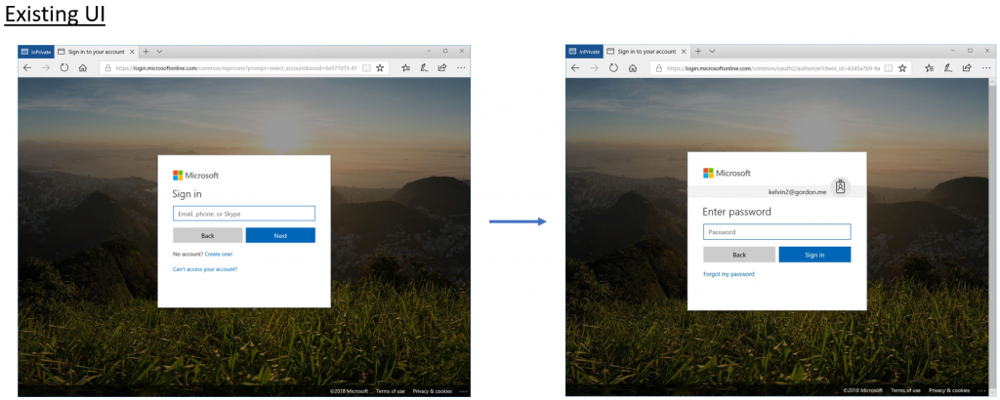
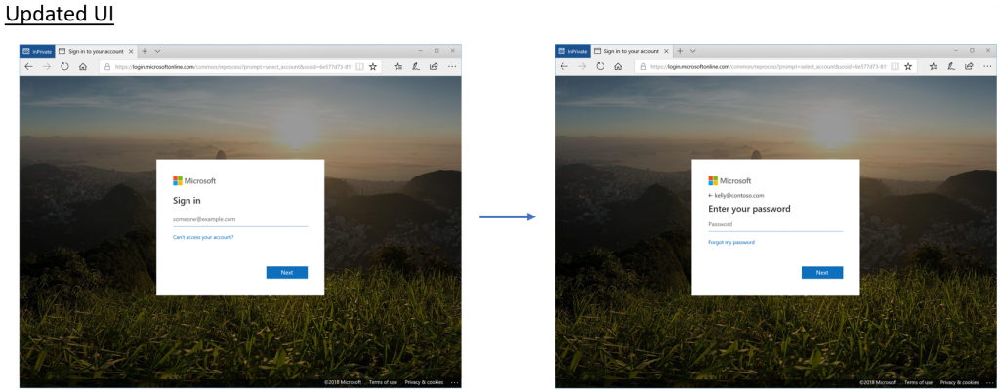
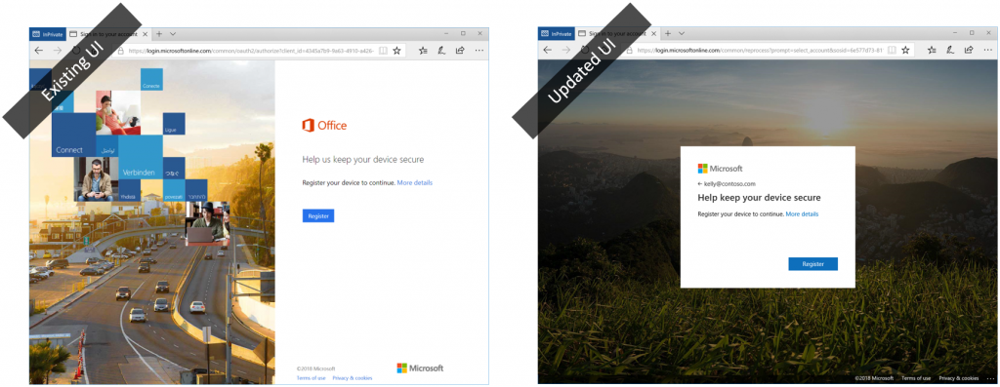
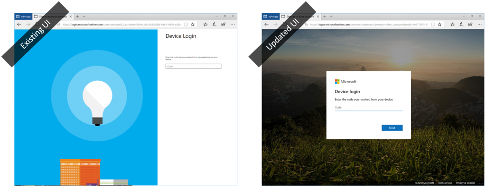

> 本記事は Technet Blog の更新停止に伴い https://blogs.technet.microsoft.com/jpazureid/2018/04/17/upcoming-improvements-to-the-azure-ad-sign-in-experience/ の内容を移行したものです。
> 元の記事の最新の更新情報については、本内容をご参照ください。

# Azure AD のサインイン画面に関するアップデートのお知らせ

こんにちは、Azure & Identity サポート チームの山口です。

本記事は、米国時間 2018 年 4 月 4 日に公開された [Upcoming improvements to the Azure AD sign-in experience - Enterprise Mobility + Security](https://cloudblogs.microsoft.com/enterprisemobility/2018/04/04/upcoming-improvements-to-the-azure-ad-sign-in-experience/) の抄訳です。

2017 年 11 月にサインイン画面の変更を実施しましたが、更にサイン画面の更新を予定していますので、そのお知らせと、イメージ画像がまとめられていますのでご紹介します。

## Upcoming improvements to the Azure AD sign-in experience

皆さん、こんにちは。
本日は、Azure AD のサインイン UX に関するアップデート情報をお知らせいたします。

前回のサインイン UX のアップデートでは、皆様から本当にたくさんのフィードバックをいただいておりましたが、なかでも「情報をもっと早い段階で知りたかった」という声が非常に多く寄せられました。

そのご指摘を踏まえ、今回はより速い段階で詳細な更新情報をお届けしたいと思います。

数か月前に [サインイン画面のデザイン変更](https://cloudblogs.microsoft.com/enterprisemobility/2017/08/02/the-new-azure-ad-signin-experience-is-now-in-public-preview/) をリリースし、新しい UI に向けてどのような改善ができるかについてフィードバックをいただいておりました。

そして次の変更では、わかりづらさを削減し、見た目をすっきりさせることに注力することにしました。

ユーザーがサインイン作業に集中できるよう、UI をよりシンプルなデザインにしました。

今回のアップデートは UI の改善だけであり、サインインの動作は変更しておりません。既存の会社のブランド設定はそのまま引き継がれますのでご安心ください。

変更点は以下の２点です。

### 1. UI 要素のレイアウトとスタイリングの更新

以下の画像が更新前と後の UI の違いを表すものです。

新しいスタイルの方（下側）は、多要素認証を含むすべての認証フローやパスワード変更画面が表示されるようになります。

### 2. すべての画面が新しいサインイン UX へ

昨年にサインイン画面を更新した際には、いくつかの画面は変わらずそのままでした。今回のアップデートではすべての画面が新しい UI に変わります。

#### 多要素認証 (MFA)

#### セルフ サービスによるパスワードのリセット (SSPR)

#### 条件付きアクセス：ポータルサイト アプリをインストールしてサインイン

#### 条件付きアクセス：デバイスを登録

#### デバイス ログイン

以上の変更は、ユーザーの皆さんに準備していただける期間を設けるため、徐々に適用していく予定です。

次の表は、この先数か月に実施が予定されている事項をまとめたものです。

|時期 |変更 |
|----|----|
|5 月上旬 |皆さんがアップデートに関して知っていただき準備する期間を設けるために、既存のサインイン ページに更新をお知らせするバナーをリリースします。そのバナーがどのようなものになるかについては、下の画像をご確認ください。|
|5 月中旬 |新しい UI のプレビュー版を体験していただけるリンクを通知バナーに表示します。このプレビュー版は、お使いのドキュメンテーションに変更が必要な方に対して、新しい UI のスクリーンショットを撮る機会の為に公開されます。プレビュー期間は、新しい UI から既存のもの変更できるリンクを用意いたします。 |
|6 月中旬 |新しいサインイン UI が一般公開されます。すべてのユーザに対して、新しい UI が既定のものとなります。 |

#### 変更をお知らせするバナー

さらに、ADFS の新しいウェブ テーマについても公開を予定しており、これによってフェデレーションによるシングルサインオンでも一貫したデザインの画面をご利用いただけるようになる見込みです。

この AD FS の新しいウェブテーマの情報については、近日公開を予定しています。

いつものように皆様からのフィードバックやご提案をお待ちしておりますので、もし何かご不明な点がありましたら [Azure Active Directory Forum](https://aka.ms/Sws1ht) でその意見をお知らせください！
ありがとうございました。

#### 原文著者

- Alex Simons (Twitter: @Alex_A_Simons)
- Director, Program Management
- Microsoft Identity Division
