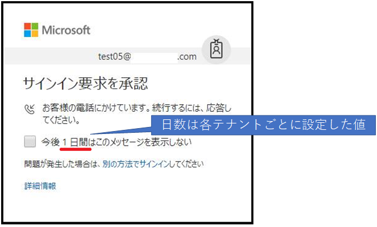
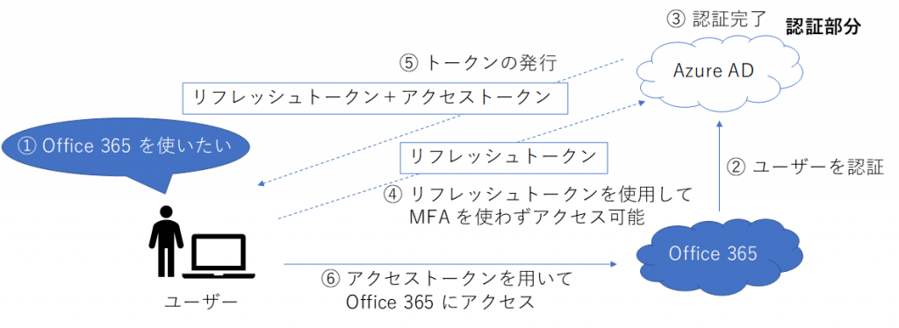

> 本記事は Technet Blog の更新停止に伴い https://blogs.technet.microsoft.com/jpazureid/2018/06/01/azure-mfa-%e3%82%92%e6%b1%82%e3%82%81%e3%82%89%e3%82%8c%e3%82%8b%e3%82%bf%e3%82%a4%e3%83%9f%e3%83%b3%e3%82%b0%e3%81%ab%e3%81%a4%e3%81%84%e3%81%a6/ の内容を移行したものです。
> 元の記事の最新の更新情報については、本内容をご参照ください。

# Azure MFA を求められるタイミングについて

こんにちは、Azure ID チームの田中です。

Azure AD では、ユーザー名、パスワードによるサインインだけでなく、多要素認証 (MFA) を簡単に構成することができます。  
私たちのサポートチームでは多要素認証 (MFA) についてよくお問い合わせをいただくのですが、今回は MFA を有効化しているのにも関わらず、MFA を求められないことがあるということで、Azure MFA を要求されないケースについて、その理由を含めて紹介します。

## MFA とは？

Multi-Factor Authentication の略で、ユーザー名・パスワードの認証にプラスして別の認証を求める機能を指します。

例えば社内ネットワーク以外からのアクセスであれば、ユーザー名とパスワードだけではなく、SMS 認証を強制することが可能になり、セキュリティをさらに高めることができます。  
Azure の機能では電話認証 (電話、SMS)、Authenticator アプリを使用した認証を提供しています。

・参考情報  
Azure Multi-Factor Authentication とは  
https://docs.microsoft.com/ja-jp/azure/active-directory/authentication/multi-factor-authentication

## Azure MFA を再び要求されないのは果たして安全なのか

初回 MFA を要求された後に MFA を求められなくなるシナリオとしては大きく分けて 2 つあります。

     A. MFA の画面で多要素認証の記憶がオンになっている
     B. 各種トークンが使用されている

ここではそれぞれのシナリオについて、その理由と解決策、セキュリティ面をご説明致します。

### A. MFA の画面で多要素認証の記憶がオンになっている

ユーザーが Azure AD で認証を行った際に多要素認証が発生すると下記の画面が表示される場合があります。

#### 理由

ここで「今後 1 日間はこのメッセージを表示しない」にチェックを入れた状態で多要素認証に成功すると、1 日間有効な多要素認証のトークンが永続クッキーとしてブラウザーに保存されます。  
これにより、 1 日間は同一ブラウザーを使用する限り多要素認証を要求されなくなります。

#### 解決策

MFA を再度強制したい場合は、次の優先順位で対処を行うと、再度 MFA を発生させることができます。

1. 多要素認証を行った時と異なるブラウザーを使用する、In Private モードを使用する
2. ブラウザーのキャッシュを削除する
3. 1 日待機する (日数は各テナントごとに設定した値になります)

クライアントが永続クッキーを保持している状態において、上記の対処方法を行うことで、クッキーを破棄させる、あるいはクッキーを利用させないようにし、再度 MFA を発生させることができます。

### B. 各種トークンが使用されている

#### 理由

認証が完了したアカウントに対して発行されるトークンには、アプリケーションに応じて使用されるトークンの種類が異なります。

- ブラウザー：セッショントークン
- 先進認証対応アプリケーション：アクセストークン、リフレッシュトークン

このトークンには MFA が完了しているという情報も含まれるため、トークンを利用して認証が継続する場合には MFA が求められることはありません。

例えば上記の流れのように、Office 2016 などで　Office 365 (認証部分は Azure AD) にアクセスする場合には、一度認証が完了すると、トークンが発行され、以降はこのトークンを利用して認証が求められることなくアクセスができます。

セッショントークン、アクセストークン、リフレッシュトークンの有効期限については下記記事をご参照ください。

[Azure AD が発行するトークンの有効期間について](./aad-token-lifetime.md)

また Windows 10 の場合には、Primary Refresh Token (PRT) を保持することができます。  
PRT は Azure AD に参加している場合に Windows 10 が保持するトークンで、Azure AD に参加あるいはハイブリッド Azure AD 参加が構成されている場合に関係してきます。

Azure AD へのデバイス参加については下記をご参照ください。

Azure Active Directory のデバイス管理の概要  
https://docs.microsoft.com/ja-jp/azure/active-directory/device-management-introduction  

PRT が利用可能であれば、Azure AD へのサインイン画面で "Windows に接続済み" というエントリが存在します。

PRT ("Windows に接続済み" と表示されているアカウント) を選択した場合、すでに保持している PRT を使用して Azure へのサインインが行われるため MFA は発生しません。

これは PRT には既にユーザー名、パスワード、MFA に成功したという情報が格納されているためであり、PRT を Azure AD に提示するということは、ユーザー名、パスワード、MFA は全てクリアしていることを示し、これ以上の資格情報が必要とされないためです。

リソースへのアクセス時には認可処理もあわせて行われますが、これは PRT を提示した後で行われますので、条件付きアクセスについては通常通り評価されます。

PRT を利用できるかは、Windows 10 であるか以外に、下記のようにアクセスする際のブラウザーにも依存するため、PRT を利用できないブラウザーを利用した場合には MFA が求められるという動作の違いが生じる可能性があります。

- PRT を利用できる: Edge、Internet Explorer 、プラグインを有効化した Chrome 等
- PRT を利用できない: In Private モードでのアクセスや、それ以外のブラウザー、アプリケーション

#### 解決策

MFA が求められない事象が発生した場合には、In Private モードで Azure にアクセスし、MFA が求められるか確認し、PRT やトークンの影響であるかを切り分けることが可能です。

なお、セッショントークンの場合には、ブラウザーのクッキーに保存されるため、ブラウザーのクッキーを削除することで破棄することができましたが、アクセストークン、リフレッシュトークンについては各アプリケーションごとで格納されます。

そのため、一元的に破棄する方法はなく、PRT についても破棄することはできません。  
(例外的に PRT はユーザーのパスワード変更を行うと、パスワード変更前に取得した PRT は利用できなくなり、新しい PRT を取得する際には MFA が発生します)。

### セキュリティ面

PRT を使用したサインインを行った後、ユーザーのパスワード変更を行わない限り PRT について破棄できないため、PRT のセキュリティ面で心配される方も多いと思います。

しかし、この PRT はローカル デバイスに存在する証明書の秘密鍵を用いて暗号化されているため、ユーザー名やパスワードを直接やり取りするようなことはありません。  
トークンのやり取りが安全に行われるように、暗号化されたトークン PRT が永続的に実現されています。

いかがでしたでしょうか。

MFA を設定しているにも関わらず初回しか聞かれない場合の多くは、今回解説しましたシナリオに該当していることが多いです。  
毎回サインインを行うたびに MFA を求められるとユーザーの利便性が落ちる可能性もございますので、どの程度の間隔で MFA を求められるように構成するかなどは展開環境に合わせてご検討いただければと思います。

製品動作に関する正式な見解や回答については、お客様環境などを十分に把握したうえでサポート部門より提供させせて頂きますので、ぜひ弊社サポート サービスをご利用ください。

※本情報の内容 ( 添付文書、リンク先などを含む ) は、作成日時点のものであり、予告なく変更される場合があります。
