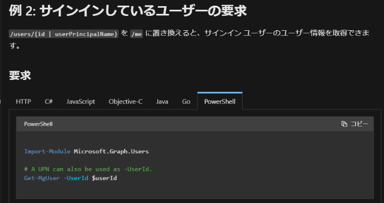

# MSOnline / AzureAD PowerShell から Graph PowerShell SDK への移行について 2_移行導入編

こんにちは、 Azure ID チームの小出です。

1_概要編の記事はすでにご覧いただけましたでしょうか。
最新のアップデートは、この記事にて随時アップデートを行う予定ですので、今後の情報をお待ちください。

今回は、 Graph PowerShell SDK モジュールへの移行について、実際に新しいモジュールを使用するにあたり、前提となる新旧モジュールの違いと、新しいコマンドの探し方をご案内します。

## 新旧モジュールの主な違い
以前の MSOnline / Azure AD モジュールと、新しい Microsoft Graph PowerShell SDK モジュールには、下記のような違いがあります。
インストールや接続面の違いについては、次回記事に詳細を記載予定ですので、併せてご確認ください。

|      項目                            |  MSOnline / AzureAD モジュール           |   Microsoft Graph PowerShell SDK                             | 
| ----------------------------------- | ---------------------------------------- | ------------------------------------------------------------ | 
| コマンドの命名規則                    | V1: xxx-Msolxxx (例： Get-MsolUser)   V2: xxx-AzureADxxx (例： Get-AzureADUser) |  xxx-Mgxxx (例: Get-MgUser) | 
| インストールすると                    | MSOnline / AzureAD モジュールがそれぞれインストールされる                        |  既定では Microsoft.Graph.xxxx のようなサブ モジュールが 38 個インストールされる  | 
| 必要な権限                           | ユーザーに割り当てられている AzureAD ロール                              |  User.Read.All などのアクセス許可 および Azure AD ロール（一部のコマンド）                | 
| Connect コマンド使用時の挙動          |  必ずサインイン画面が表示される                             |   2 回目以降は表示されないことがある                             | 
| サインインが完了した時の表示           |  サインインしたアカウントの情報が表示される | Welcome To Microsoft Graph! のメッセージが表示される（サインインしたユーザーの情報を確認する場合、 Get-Mgcontext のコマンド実行が必要）| 
| PowerShell プロンプトを閉じた時の挙動  |  セッションが終了し、新しい PowerShell プロンプトを開いた際には再度サインインが必要         |   キャッシュが残るため、事前に Disconnect-MgGraph コマンドで明示的に切断する必要がある。  新しい PowerShell プロンプトを開いた際には、Connect コマンドの実行は必要だが、ユーザー名やパスワードの入力画面が表示されないことがある   | 
|公開情報                              | コマンドごとに用意（ [Get-AzureADUser](https://docs.microsoft.com/ja-jp/powershell/module/azuread/get-azureaduser?view=azureadps-2.0)）  | コマンドごとに用意 + Graph API の公開情報も利用可能  （ [Get-MgUser](https://docs.microsoft.com/en-us/powershell/module/microsoft.graph.users/get-mguser?view=graph-powershell-1.0) および [ユーザーの取得](https://docs.microsoft.com/ja-jp/graph/api/user-get?view=graph-rest-1.0&tabs=http)）                              | 

## 新しいコマンドを探すためには
今使用しているスクリプトに、今後廃止予定のコマンドがあることが確認できたら、まずは置き換え先となる新しいモジュールのコマンドを探します。
最も簡単な方法は、[この公開情報](https://docs.microsoft.com/en-us/powershell/microsoftgraph/azuread-msoline-cmdlet-map?view=graph-powershell-1.0)を利用することです。

表形式でマッピング表があるため、現在使用しているコマンドを検索するだけで、簡単に対応コマンドを見つけることができます。
もし公開情報にコマンドがない場合、次に Graph API の公開情報があるか確認します。
たとえばユーザーの取得の場合、「ユーザー 取得 Graph API」などと検索し、[ユーザーの取得](https://docs.microsoft.com/ja-jp/graph/api/user-get?view=graph-rest-1.0&tabs=http) のような公開情報を探します。
公開情報を見つけたら、下記のように、言語ごとの書き方が案内されていることがあるため、 PowerShell 例文があるか確認し、コマンドを見つけます。

 PowerShell タブはないものの、HTTP タブにクエリの記載がある場合は、 Invoke-MgGraphRequest コマンドの -URL オプションにクエリを入れて実行することで、同様に実行することが可能です。

以上のような方法でも代替コマンドが確認できないものについては、技術サポートにお気軽にお問い合わせください。