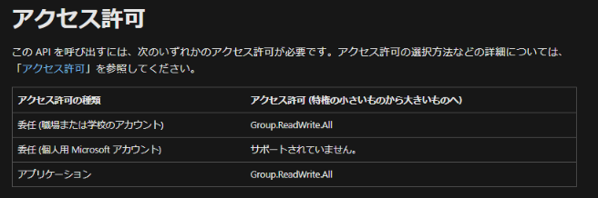
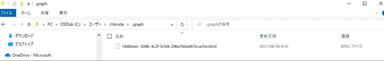

# MSOnline / AzureAD PowerShell から Graph PowerShell SDK への移行について 3_インストール・接続編

こんにちは、 Azure ID チームの小出です。
この記事は、MSOnline / AzureAD モジュール廃止について、1_概要編、 2_移行導入編の記事の続きとして連載しています。

今回は Microsoft Graph PowerShell SDK モジュールのインストール方法や、接続に関するよくある質問にお答えしたいと思います。

## モジュールのインストール
これまでのモジュールと同様に、 Install-Module コマンドでインストールします。
Graph PowerShell SDK のモジュールをインストールする場合、Install-Module Microsoft.Graph と実行します。

注意点としては、Install-Module Microsoft.Graph を実行すると、サブ モジュール 38 個をすべて含む形でインストールが行われます。（少し時間もかかります。）

特定のコマンドのみを使用したい場合、サブ モジュール単位でインストールすることもできますが、その場合は Microsoft.Graph.Authentication は必ずインストールしてください。

モジュールのインストールについての公開情報は、[Microsoft Graph SDK をインストールする](https://docs.microsoft.com/ja-jp/graph/sdks/sdk-installation#install-the-microsoft-graph-powershell-sdk) および [Install the Microsoft Graph PowerShell SDK](https://docs.microsoft.com/ja-jp/powershell/microsoftgraph/installation?toc=%2Fgraph%2Ftoc.json&view=graph-powershell-1.0)（英語）をご覧ください。

> Installing the main module of the SDK, Microsoft.Graph, will install all 38 sub modules. Consider only installing the necessary modules, including Microsoft.Graph.Authentication which is installed by default when you opt to install the sub modules individually. For a list of available Microsoft Graph modules, use Find-Module Microsoft.Graph*. Only cmdlets for the installed modules will be available for use.

>> （日本語：SDK のメインモジュールである Microsoft.Graph をインストールすると、38 個のサブモジュールがすべてインストールされます。サブモジュールを個別にインストールする場合は、デフォルトでインストールされる Microsoft.Graph.Authentication を含め、必要なモジュールのみをインストールすることを検討してください。利用可能な Microsoft Graph モジュールの一覧は、Find-Module Microsoft.Graph* を使用してください。インストールされたモジュールのコマンドレットのみが使用できるようになります。）

## 接続手順
これまでと同様に、 Connect コマンドを使用して接続します。
Connect-MsolService / Connect-AzureAD に対応する Microsoft Graph PowerShell SDK での接続コマンドは、 Connect-MgGraph / Connect-Graph コマンドです。

一例として、下記のように実行します。

実行例

``Connect-MgGraph -Scopes User.Read.All``

これまでのコマンドとは異なり、後ろに -Scopes オプションを使用して、権限を付与する必要があります。
-Scopes に指定する値は、必ずしも User.Read.All ではなく、接続後に使用するコマンドによって適宜変更が必要です。
たとえば、接続後にグループの削除のコマンドを実行する場合は、代わりに Group.ReadWrite.All を指定する必要があります。

API の公開情報には、組織アカウント、個人用アカウント、アプリケーションごとに、 API を呼び出すためのアクセス許可とサポート状況について記載されています。
事前に各 API の詳細（グループの削除の場合は [グループの削除](https://docs.microsoft.com/ja-jp/graph/api/group-delete?view=graph-rest-1.0&tabs=http) など）を確認し、必要なアクセス許可を確認してください。

なお、サインイン後、ユーザーが何の権限を持っているかを確認したい場合は、 (Get-MgContext).scopes コマンドをご利用ください。

## よくある質問
Q. Get-MgUser 等を使用した後、 Powershell プロンプトを閉じてから再度開くと、 Connect-Mggraph 実行時にパスワード入力画面にならずにサインインできてしまいます。動作の詳細をもう少し詳しく教えてください。

A. Connect-MgGraph コマンドを実行すると、実行した端末にキャッシュが保持されます。
具体的には、実行端末の C:\Users\＜User＞\.graph 内に、以下のように .bin3 ファイルが作成されます。

 
Connect-MsolService コマンドや、 Connect-AzureAD コマンドでは、一度 PowerShell を終了すれば、次回は再度サインイン画面が表示されますが、
Connect-MgGraph コマンドでは、PowerShell をいったん終了した場合でも、毎度サインイン画面は表示されません。

この場合、認証済みの資格情報を使用できてしまうため、一連のコマンドを実行した後は、 Disconect-MgGraph コマンドを実行ください。
なお、Disconect-MgGraph コマンドを実行すると、上記の .bin3 ファイルは表示されなくなります。（再度 Connect-MgGraph を実行してサインインすると、同じ場所にファイルが作成されます。）
 
また、Disconnect-MgGraph コマンドを実行しない場合、毎回サインイン画面が表示されないため、
認証済みの資格情報をそのまま使用できてしまうほかにも、たとえば異なるテナントに対し、意図しない操作を行ってしまう可能性も考えられます。

Get-Mgdomain コマンドや Get-MgOrganization コマンドを実行して、現在接続しているテナントを確認したり、 Get-MgContext コマンドを実行し、接続ユーザーの情報を確認したりすることも可能ですので、必要に応じてご利用ください。

