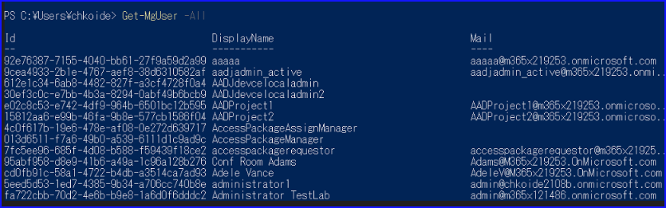
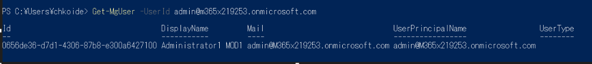
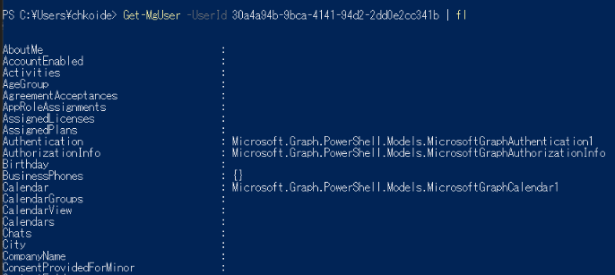
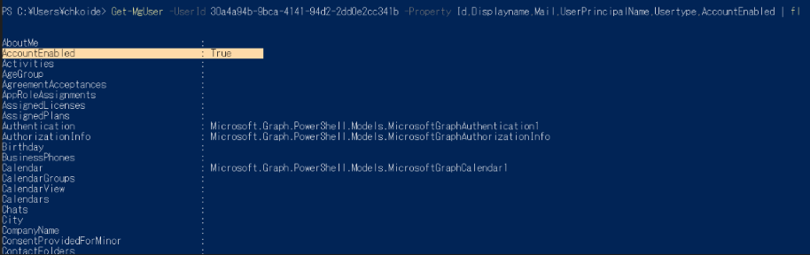
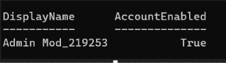
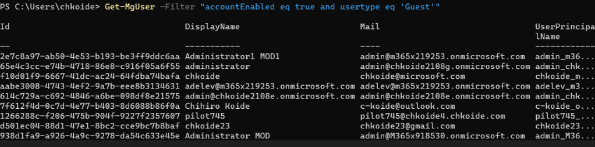
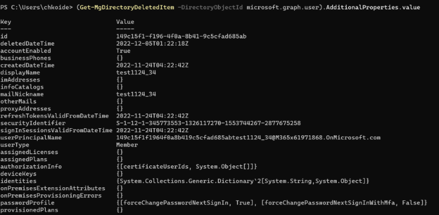
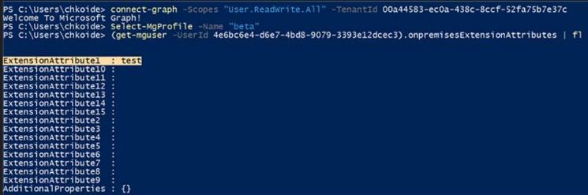
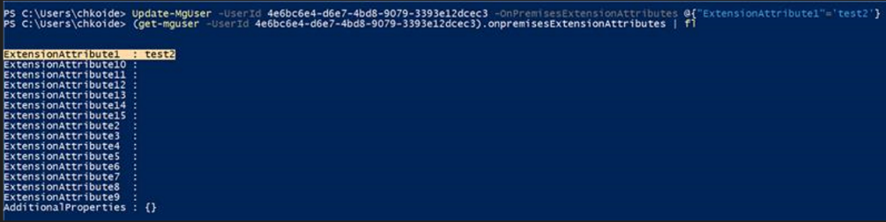

# MSOnline / AzureAD PowerShell から Graph PowerShell SDK への移行について 4_ユーザー管理

こんにちは、 Azure Identity サポート チームの小出です。

この記事は、この記事は、MSOnline / AzureAD モジュール廃止について、[1. 概要編](https://jpazureid.github.io/blog/azure-active-directory/azuread-module-retirement1/)、[2. 移行導入編](https://jpazureid.github.io/blog/azure-active-directory/azuread-module-retirement2/)、[3. インストール・接続編](https://jpazureid.github.io/blog/azure-active-directory/azuread-module-retirement3/) の続きとして連載しています。

4 回目となる今回からは、具体的に、新しい Microsoft Graph PowerShell SDK を使用したユーザーの管理方法についてご案内します。以前、[こちらの記事](https://jpazureid.github.io/blog/azure-active-directory/operating-license-with-microsoft-graph/) にて、ライセンス管理についてご案内させていただきましたが、今回はユーザー管理に特化してご紹介します。まだモジュールをインストールしていない場合や、 Connect-MgGraph コマンドを使用した接続方法が分からない場合などは、本シリーズの 2 と 3 をご確認ください。

## 目次

1. [ユーザーの取得](#idx1)
	- [テナントの全ユーザーを取得したい](#idx1-1)
	- [特定のユーザーを取得したい](#idx1-2)
	- [ゲスト ユーザーのみを取得したい)](#idx1-3)
	- [アカウントが有効なゲスト ユーザーのみを取得したい)](#idx1-4)
	- [特定のユーザーの extensionAttribute の値を取得したい](#idx1-5)
	- [削除済みユーザーを取得したい](#idx1-6)
2. [ユーザーの作成](#idx2)
3. [ユーザーの削除](#idx3)
4. [削除済みユーザーの完全削除と復元](#idx4)
5. [ユーザーの属性を更新する](#idx5)
6. [よくある質問](#idx6)

---

<h2 id="idx1">1. ユーザーの取得</h2>

これまでユーザー情報の取得にし使用していた Get-MsolUser や Get-AzureADUser コマンドは、 Get-MgUser コマンドに置き換えられます。ここでは様々なシナリオでユーザーを取得する方法についてご紹介します。

<h3 id="idx1-1">テナントの全ユーザーを取得したい</h3>

全てのユーザーを取得するには、-All オプションを使用します。Get-AzureADUser コマンドでは、-All $true とする必要がありましたが、新しいコマンドでは -All のみで動作します。-All を指定しない場合は、100 ユーザーなど一部の結果のみが返されます。 ユーザー数の非常に多い環境では -All オプションをつけると大量の結果が表示されますのでご注意ください。

```
Get-MgUser -All
```



<h3 id="idx1-2">特定のユーザーを取得したい</h3>

これまでのコマンドと同様に、 ObjectID や UPN を指定することで取得が可能です。

```
 Get-MgUser -UserId admin@m365x219253.onmicrosoft.com
```



上記で気になった方もいると思いますが、Usertype の中身が空になっていることにお気づきでしょうか。Get-MsolUser コマンドや Get-AzureADUser コマンドでは、何も指定しなくても、すべての属性の情報が一括で出力されていました。

 Microsoft Graph Powershell SDK では、属性によって下記のような特徴がある点を理解しておくと、「入れたはずの値が表示されない」といった混乱を避けることができます。

- Microsoft Graph PowerShell SDK にはバージョンがあり、v1.0 で取得できる属性値 beta でしか取得できない属性値がある
- Property オプションを使用して明示的に指定しないと、結果に表示されないものがある

そのため、たとえば下記のように実行すると、Usertype 属性が取得できるようになります。

```
 Get-MgUser -UserId admin@m365x219253.onmicrosoft.com -Property Id,Displayname,Mail,UserPrincipalName,Usertype
```


これは、| format-list を利用したときも同様で、| format-list 自体は新しいモジュールでも機能しますが、下記のように、必要な情報が出てこないことがあります。



AccountEnabled に値が入っていない！と疑問に思うかもしれませんが、Usertype と同様に下記のように実行すると、AccountEnabled の値も取得することが可能です。

```
Get-MgUser -UserId 30a4a94b-9bca-4141-94d2-2dd0e2cc341b -Property Id,Displayname,Mail,UserPrincipalName,Usertype,AccountEnabled | fl
```



もしくは、上記にて紹介した -Property オプションを使用したうえで、さらに Select を使用すると、表示される属性と値をカスタマイズできます。

```
Get-MgUser -UserId 2e7c8a97-ab50-4e53-b193-be3ff9ddc6aa -Property Id,Displayname,Mail,UserPrincipalName,Usertype,AccountEnabled | select displayname,accountenabled
```



次に、-Filter オプションをはじめとするオプションを活用できます。よくお問い合わせをいただく取得方法についてご案内します。

<h3 id="idx1-3">ゲスト ユーザーのみを取得したい</h3>

特定の条件を満たすユーザーのみを取得したい場合は -Filter オプションを使用します。usertype が Guest となっているユーザーをフィルターして表示しています。

```
 Get-MgUser -All  -Filter "usertype eq 'Guest'" -Property Id,displayname,Mail,Userprincipalname,Usertype
```


<h3 id="idx1-4">アカウントが有効なゲスト ユーザーのみを取得したい</h3>

-Filter の条件を 2 つ以上記載したいときは and でつなげると利用できます。

```
Get-MgUser -Filter "accountEnabled eq true and usertype eq 'Guest'"
```



<h3 id="idx1-5">特定のユーザーの extensionAttribute の値を取得したい</h3>

ExtensionAttribute1 などの属性は、ユーザーの onpremisesExtensionAttributes の配下に用意されているので、下記のように実行して取得します。

```
(get-mguser -UserId 4e6bc6e4-d6e7-4bd8-9079-3393e12dcec3).onpremisesExtensionAttributes | fl
```


こちらは beta のみ対応しておりますので、Connect-MgGraph での接続後、本コマンド実行前に Select-Mgprofile -name beta にてベータに切り替えを実施ください。

<h3 id="idx1-6">削除済みユーザーを取得したい</h3>

削除済みのオブジェクトを取得するコマンドは、Get-MgDirectoryDeletedItem です。-DirectoryObjectID オプションに microsoft.graph.user と記載すると、削除されたユーザー オブジェクトが返されます (これらは、いわゆるごみ箱にある状態のユーザーで、30 日後に完全に削除されると参照できなくなります)。

```
(Get-MgDirectoryDeletedItem -DirectoryObjectId microsoft.graph.user).AdditionalProperties.value
```



利用可能なパラメーターは Filter 以外にもありますが、各属性によってサポートされるオプションが異なります。下記のような公開情報を確認いただき、使用したい属性とオプションがサポートされているか、あらかじめご確認ください。

- [user リソースの種類 - プロパティ](https://learn.microsoft.com/ja-jp/graph/api/resources/user?view=graph-rest-1.0#properties)
- [ユーザーを一覧表示する - オプションのクエリ パラメーター](https://learn.microsoft.com/ja-jp/graph/api/user-list?view=graph-rest-1.0&tabs=powershell#optional-query-parameters)

<h2 id="idx2">2. ユーザーの作成</h2>

下記のように必要なパラメーターを記載して、 New-Mguser を使用すると新しいユーザーを作成できます。

```
$params = @{
	AccountEnabled = $true
	DisplayName = "Adele Vance22"
	MailNickname = "AdeleV22"
	UserPrincipalName = "AdeleV22@m365x61971868.onmicrosoft.com"
	PasswordProfile = @{
		ForceChangePasswordNextSignIn = $true
		Password = "xWwvJ]6NMw+bWH-d11"
		}
	}
New-MgUser -BodyParameter $params
```

もしくは、下記のように直接 New-Mguser コマンド内で必要な情報を記載することも可能です。

```
$PasswordProfile = @{
  Password = 'Passw0rd'
  }
New-MgUser -DisplayName 'Rene Magi' -PasswordProfile $PasswordProfile -AccountEnabled -MailNickName 'ReneMagi' -UserPrincipalName 'ReneMagi@m365x61971868.onmicrosoft.com'
```

以下の公開情報も併せてご確認ください。

- [New-MgUser](https://learn.microsoft.com/ja-jp/powershell/module/microsoft.graph.users/new-mguser?view=graph-powershell-1.0)
- [ユーザーを作成する](https://learn.microsoft.com/ja-jp/graph/api/user-post-users?view=graph-rest-1.0&tabs=http)

<h2 id="idx3">3. ユーザーの削除</h2>

Remove-MgUser コマンドにて削除可能です。

```
Remove-MgUser -UserId 282f0fb7-06a6-4a86-b3d5-01569d7393a1
```

<h2 id="idx4">4. 削除済みユーザーの完全削除と復元</h2>

削除されたユーザーは、30 日間の間、削除済みユーザーとして一時的に保存されます。30 日以内であれば、誤って削除してしまった場合でもこれらのユーザーを復元することが可能です。復元したい場合、 Restore-MgDirectoryDeletedItem コマンドを使用します。

```
Restore-MgDirectoryDeletedItem -DirectoryObjectId 282f0fb7-06a6-4a86-b3d5-01569d7393a1
```

[削除済みアイテムを復元する](https://learn.microsoft.com/ja-jp/graph/api/directory-deleteditems-restore?view=graph-rest-1.0&tabs=http) の公開情報も併せてご確認ください。

完全に削除したい場合、Remove-MgDirectoryDeletedItem コマンドを使用します。こちらのコマンドを実行すると、オブジェクトは完全に削除され復元できなくなるためご留意ください。

```
Remove-MgDirectoryDeletedItem -DirectoryObjectId 282f0fb7-06a6-4a86-b3d5-01569d7393a1
```

[アイテムを完全に削除する](https://learn.microsoft.com/ja-jp/graph/api/directory-deleteditems-delete?view=graph-rest-1.0&tabs=powershell) の公開情報も併せてご確認ください。

<h2 id="idx5">5. ユーザーの属性を更新する</h2>

Update-Mguser コマンドを利用して更新が可能です。たとえばユーザーの displayname とその他のメール (Othermails) を更新したい場合は下記のように実行します。

```
 Update-MgUser -UserId 2e7c8a97-ab50-4e53-b193-be3ff9ddc6aa -DisplayName test1228a -OtherMails @("bob@contoso.com", "admin@m365x219253.onmicrosoft.com")
```

一般的には上記のように、変更したい属性を指定して、新しい値を指定すれば更新できます。

時折ご質問をいただくものとして、extensionattribute 関連の属性を更新したいといったお問い合わせがよくあるため、以下に手順を例として案内します。 Extensionattribute の値を更新したい場合、事前に beta に切り替えてからコマンドを実行ください。

1. Connect-MgGraph にて接続します。
2. beta バージョンへ切り替えます。

	```
	Select-MgProfile -Name "beta"
	```

3. Get-Mguser コマンドを実行して、ユーザーの情報を取得します。
 
	```
	(Get-MgUser -UserId 4e6bc6e4-d6e7-4bd8-9079-3393e12dcec3).onpremisesExtensionAttributes | fl
	```

	以下の画面では、ユーザーの ExtensionAttribute1 の値に test という文字列が入っていることが確認できます。

	
 
4. 以下のコマンドを実行して、たとえば ExtensionAttribute1 の値を test2 に更新します。
 
	```
	Update-MgUser -UserId 4e6bc6e4-d6e7-4bd8-9079-3393e12dcec3 -OnPremisesExtensionAttributes @{"ExtensionAttribute1"='test2'}
	```

5. 値が test2 に更新されたことを確認します。

	

<h2 id="idx6">6. よくある質問</h3>

Q. Set-MsolUser コマンドで実施できた StrongAuthenticationRequirements の有効化や、StrongAuthenticationMethod を無効化する代替案はありますか？

A. いいえ、現状新しい Microsoft Graph PowerShell SDK では対応していません。[公開情報](https://learn.microsoft.com/ja-jp/graph/api/resources/authenticationmethods-overview?view=graph-rest-1.0) にも記載があります。

```
この機能は現在、StrongAuthenticationMethods プロパティを使用して、MSOLSet-MsolUser コマンドレットを使用してのみサポートされています。
```

StrongAuthenticationMethod については [公開情報 (英語)](https://learn.microsoft.com/en-us/graph/api/resources/authenticationmethods-overview?view=graph-rest-1.0) に記載があり、Microsoft Graph API (PowerShell SDK) を利用して、利用可能なすべての認証方法を個別に削除するというのが今後の正しい代替方法となります。

基本的なユーザー管理コマンドについて案内していますが、もし利用方法が不明なコマンドがございましたらお気軽にお問い合わせを起票ください。
