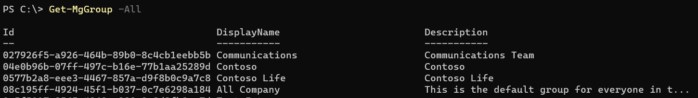
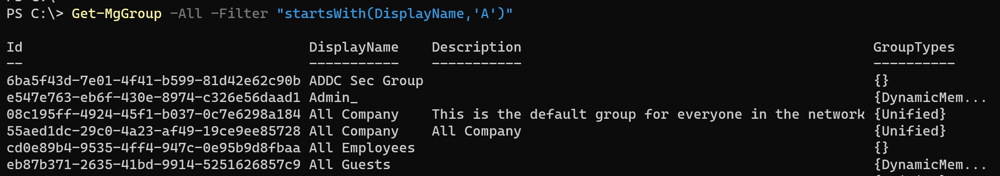
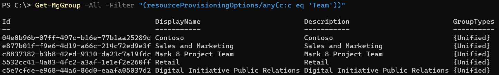
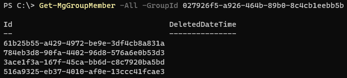
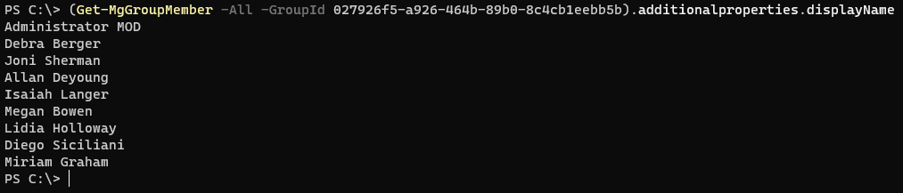
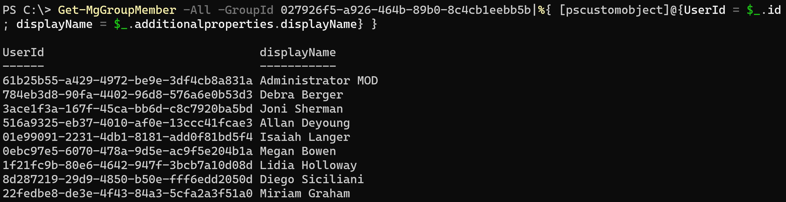
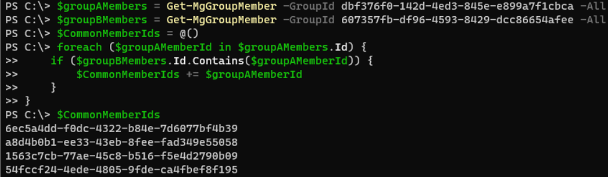
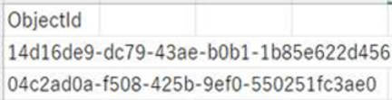
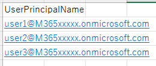
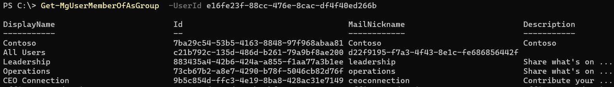

# MSOnline / AzureAD PowerShell から Graph PowerShell SDK への移行について 5_グループ管理

こんにちは、 Azure Identity サポート チームの三輪です。

この記事は、MSOnline / AzureAD モジュール廃止について、下記シリーズの続きとして連載しています。

[1_概要編](https://jpazureid.github.io/blog/azure-active-directory/azuread-module-retirement1/)  
[2_移行導入編](https://jpazureid.github.io/blog/azure-active-directory/azuread-module-retirement2/)  
[3_インストール・接続編](https://jpazureid.github.io/blog/azure-active-directory/azuread-module-retirement3/)  
[4_ユーザー管理](https://jpazureid.github.io/blog/azure-active-directory/azuread-module-retirement4/)

5 回目となる今回は、グループ管理についてご紹介します。

まだモジュールをインストールしていない場合や、 Connect-MgGraph コマンドを使用した接続方法が分からない場合などは、本シリーズの 2 と 3 をご確認ください。

## 目次

1. [グループの取得](#idx1)
	- [テナントの全グループを取得する場合](#idx1-1)
	- [特定のグループを取得する場合](#idx1-2)
	- [特定の条件に合うグループを取得する場合](#idx1-3)
2. [グループ メンバーの取得](#idx2)
	- [特定のグループのユーザーを取得する場合](#idx2-1)
	- [２つのグループに共通するメンバー](#idx2-2)
3. [グループ メンバーの追加および削除](#idx3)
	- [グループ メンバーの追加](#idx3-1)
	- [グループ メンバーの削除](#idx3-2)
4. [特定のユーザーが所属するグループ一覧の取得](#idx4)

---

<h2 id="idx1">1. グループの取得</h2>

以前、グループ情報を取得するのに利用していた Get-AzureADGroup や Get-MsolGroup は、Get-MgGroup コマンドに置き換わります。以下にいくつかのシナリオをベースに例を紹介いたします。

<h3 id="idx1-1">テナントの全グループを取得する場合</h3>

-All オプションを使用します。Get-AzureADGroup コマンドでは、 -All $true とする必要がありましたが、新しいコマンドでは -All のみで動作します。

```
Get-MgGroup -All
```



<h3 id="idx1-2">特定のグループを取得する場合</h3>

ObjectID を指定することで特定のグループの情報を取得が可能です。

```
Get-MgGroup -GroupId 027926f5-a926-464b-89b0-8c4cb1eebb5b
```


<h3 id="idx1-3">特定の条件に合うグループを取得する場合</h3>

Get-MgUser コマンドと同様に、-Filter オプション等を活用して、条件に合致するグループのみを表示させることが可能です。以下に例をご紹介します。

DisplayName が特定の文字列から始まるグループのみを取得する場合

```
Get-MgGroup -All -Filter "startsWith(DisplayName,'A')"
```



Teams が有効となっているグループのみを取得する場合

```
Get-MgGroup -All -Filter "(resourceProvisioningOptions/any(c:c eq 'Team'))"
```



利用可能なパラメーターは Filter 以外にもありますが、各属性によってサポートされるオプションが異なります。下記のような公開情報を確認いただき、使用したい属性とオプションがサポートされているか、あらかじめご確認ください。

- [group リソースの種類 - Microsoft Graph v1.0 | Microsoft Learn](https://learn.microsoft.com/ja-jp/graph/api/resources/group?view=graph-rest-1.0#properties)  
- [Get-MgGroup (Microsoft.Graph.Groups) | Microsoft Learn](https://learn.microsoft.com/en-us/powershell/module/microsoft.graph.groups/get-mggroup?view=graph-powershell-1.0)  
- [グループの一覧表示 - Microsoft Graph v1.0 | Microsoft Learn](https://learn.microsoft.com/ja-jp/graph/api/group-list?view=graph-rest-1.0&tabs=powershell)

<h2 id="idx2">2. グループ メンバーの取得</h2>

グループに所属するメンバーは、Get-MgGroup コマンドにで取得可能です。

<h3 id="idx2-1">指定したグループのメンバーを取得する</h3>

Get-MgGroupMember コマンドを用い、グループの ObjectID を指定します。

```
Get-MgGroupMember -All -GroupId 027926f5-a926-464b-89b0-8c4cb1eebb5b
```



グループに所属するメンバーの Id 以外の情報を取得したい場合は、以下のように additionalproperties を用いてメンバー情報を取得することが可能です。

```
(Get-MgGroupMember -All -GroupId 027926f5-a926-464b-89b0-8c4cb1eebb5b).additionalproperties.displayName
```



グループに所属するメンバーの Id と 表示名等、任意の複数の情報を取得したい場合には、以下のようにして抽出することも可能です。

```
Get-MgGroupMember -All -GroupId 027926f5-a926-464b-89b0-8c4cb1eebb5b|%{ [pscustomobject]@{UserId = $_.id; displayName = $_.additionalproperties.displayName} }
```

  

<h3 id="idx2-2">２つのグループに共通するメンバー</h3>

コマンドを組み合わせることで、2 つのグループに共通するユーザーのみを抽出することも可能です。以下の例では CommonMemberIds に共通するメンバーのリストが格納されます。

```
$groupAMembers = Get-MgGroupMember -GroupId dbf376f0-142d-4ed3-845e-e899a7f1cbca -All
$groupBMembers = Get-MgGroupMember -GroupId 607357fb-df96-4593-8429-dcc86654afee -All
$CommonMemberIds = @()
foreach ($groupAMemberId in $groupAMembers.Id) {
    if ($groupBMembers.Id.Contains($groupAMemberId)) {
        $CommonMemberIds += $groupAMemberId
    }
}
```



また、GroupA のメンバーではあるが、GroupB のメンバーではないユーザーを取得する際には、以下のようにスクリプトに ”!” を追加して抽出します。

```
$groupAMembers = Get-MgGroupMember -GroupId dbf376f0-142d-4ed3-845e-e899a7f1cbca -All
$groupBMembers = Get-MgGroupMember -GroupId 607357fb-df96-4593-8429-dcc86654afee -All
$NCommonMemberIds = @()
foreach ($groupAMemberId in $groupAMembers.Id) {
    if (!$groupBMembers.Id.Contains($groupAMemberId)) {
        $NCommonMemberIds += $groupAMemberId
    }
}
```

以下の公開情報も併せてご確認ください。

- [Get-MgGroupMember (Microsoft.Graph.Groups) | Microsoft Learn](https://learn.microsoft.com/en-us/powershell/module/microsoft.graph.groups/get-mggroupmember?view=graph-powershell-1.0)  
- [メンバーを一覧表示する - Microsoft Graph v1.0 | Microsoft Learn](https://learn.microsoft.com/ja-jp/graph/api/group-list-members?view=graph-rest-1.0&tabs=powershell)  

※ Get-MgGroupMember コマンドで取得できるのは、グループのダイレクト メンバーの一覧です。入れ子になったグループ内メンバーを含むすべてのメンバーを推移的に取得したい場合には、Get-MgGroupTransitiveMember を使用します。

- [Get-MgGroupTransitiveMember (Microsoft.Graph.Groups) | Microsoft Learn](https://learn.microsoft.com/en-us/powershell/module/microsoft.graph.groups/get-mggrouptransitivemember?view=graph-powershell-1.0)  
- [グループの推移性のメンバーを一覧表示する - Microsoft Graph v1.0 | Microsoft Learn](https://learn.microsoft.com/ja-jp/graph/api/group-list-transitivemembers?view=graph-rest-1.0&tabs=powershell)

<h2 id="idx3">3. グループ メンバーの追加および削除</h2>

<h3 id="idx3-1">グループ メンバーの追加</h3>

グループ メンバーの追加には New-MgGroupMember を用い、-GroupId としてグループの ObjectID を、-DirectoryObjectId として追加したいメンバーの ObjectID を指定します。

```
New-MgGroupMember -GroupId '872648e7-b23a-4328-bd46-f1bd431c2354' -DirectoryObjectId '8a7c50d3-fcbd-4727-a889-8ab232dfea01'
```

複数のユーザーを 1 つのグループに追加したい場合には、追加したいユーザーの ObjectID の一覧を作成し、-DirectoryObjectId として作成したユーザーの一覧を参照させます。

追加したいユーザーの ObjectID 一覧の csv ファイル例:



```
$GroupId = "872648e7-b23a-4328-bd46-f1bd431c2354"
Import-CSV "C:\Temp\Users.csv" | ForEach {New-MgGroupMember -GroupId $GroupId -DirectoryObjectId $_.ObjectId}
```

また、ユーザーの Object ID の代わりに ユーザーの UPN を使用したい場合には、[4_ユーザー管理操作の紹介](https://jpazureid.github.io/blog/azure-active-directory/azuread-module-retirement4/) で紹介した Get-MgUser コマンドと組み合わせて、以下のようにスクリプトを作成することも可能です。



```
$GroupId = "872648e7-b23a-4328-bd46-f1bd431c2354"
Import-CSV "C:\Temp\Users.csv" | ForEach {
    $UserId = (Get-MgUser -UserId $_.UserPrincipalName).id
    New-MgGroupMember -GroupId $GroupId -DirectoryObjectId $UserId
}
```

以下の公開情報も併せてご確認ください。

- [New-MgGroupMember (Microsoft.Graph.Groups) | Microsoft Docs](https://learn.microsoft.com/en-us/powershell/module/microsoft.graph.groups/new-mggroupmember?view=graph-powershell-1.0)  
- [メンバーを追加する - Microsoft Graph v1.0 | Microsoft Learn](https://learn.microsoft.com/ja-jp/graph/api/group-post-members?view=graph-rest-1.0&tabs=http)  

<h3 id="idx3-2">グループ メンバーの削除</h3>

グループ メンバーの削除には Remove-MgGroupMemberDirectoryObjectByRef を用い、グループの ObjectID および削除したいユーザーの Object ID を指定してグループ メンバーを削除します。

```
Remove-MgGroupMemberDirectoryObjectByRef -GroupId '872648e7-b23a-4328-bd46-f1bd431c2354' -DirectoryObjectId '8a7c50d3-fcbd-4727-a889-8ab232dfea01'
```

グループ メンバー削除に関しても、グループ メンバーの追加と同様、CSV ファイルを利用してのメンバーの一括削除や Get-MgUser とコマンドを組み合わせての UPN 指定によるメンバー削除が可能です。

以下の公開情報も併せてご確認ください。

- [Remove-MgGroupMemberDirectoryObjectByRef (Microsoft.Graph.Groups) | Microsoft Learn](https://learn.microsoft.com/en-us/powershell/module/microsoft.graph.groups/remove-mggroupmemberdirectoryobjectbyref?view=graph-powershell-1.0)  
- [メンバーを削除する - Microsoft Graph v1.0 | Microsoft Learn](https://learn.microsoft.com/ja-jp/graph/api/group-delete-members?view=graph-rest-1.0&tabs=http)  

<h2 id="idx4">4. 特定のユーザーが所属するグループ一覧の取得</h2>

特定のユーザーが所属するグループ一覧を取得するには、Get-MgUserMemberOfAsGroup を用い、ユーザーの ObjectID または UPN を指定します。

```
Get-MgUserMemberOfAsGroup -UserId e16fe23f-88cc-476e-8cac-df4f40ed266b
```



以下の公開情報も併せてご確認ください。

- [Get-MgUserMemberOfAsGroup (Microsoft.Graph.Users) | Microsoft Learn](https://learn.microsoft.com/en-us/powershell/module/microsoft.graph.users/get-mgusermemberofasgroup?view=graph-powershell-1.0)
- [ユーザーの直接メンバーシップを一覧表示する - Microsoft Graph v1.0 | Microsoft Learn](https://learn.microsoft.com/ja-jp/graph/api/user-list-memberof?view=graph-rest-1.0&tabs=http)
