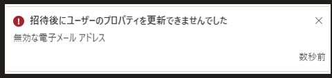

こんにちは、 Azure ID チームの小出です。

今回は、 Entra ID の設定やオブジェクト（ユーザーやグループ）に関する数や文字数の上限について、よくある質問をまとめてご案内します。  

## はじめに

弊社サポートにお問い合わせいただくお客様には、自社もしくは顧客の Entra ID テナント管理者様や、サービスの導入プロジェクトなどに参加されている方が多いことと思います。  

新規に Entra ID の利用を検討されている場合、設計フェーズにおいて、ご利用予定のサービスおよび機能について仕様や動作を確認されていることと思います。
また、すでにサービスをご利用いただいている状況であっても、運用改善などの観点からほかの機能を利用したい、もしくは Entra ID Premium の機能を検討しているといった理由で、最大どれくらいのリソースを作成できるかや、指定できる文字数に制限があるかなどを事前に確認されたいことがあるかもしれません。  

こうした「上限数を教えてください」「制限はありますか？」といったお問い合わせを最近よくいただいております。
上限や文字数の制限などの記載は、各サービスや機能ごとに用意されておりますため、お客様側で公開情報の中から確認いただくのは難しいこともあるかと思います。
そこで今回は、Entra ID のユーザーやグループをはじめとするオブジェクトと、基本的な設定の上限値について、よくある質問をまとめて案内します。  

## 公開情報

基本的な上限や制限についての情報は、[Microsoft Entra サービスの制限と制約の公開情報](https://learn.microsoft.com/ja-jp/entra/identity/users/directory-service-limits-restrictions) にて記載されていますので、併せてご確認ください。  

## 上限についてお問い合わせいただく前に

よくご質問いただく上限や制限について下記に情報をまとめておりますが、これ以外の設定および属性について確認されたいシナリオも多くあるものと認識しております。
本記事に記載されていない情報について確認されたい場合は、以下を確認のうえ、弊社サポートへお問い合わせください。
お問い合わせ時に下記内容について言及がない場合は、担当のサポート エンジニアよりお客様に詳細をヒアリングさせていただきます。

- 「グループを 10 万個つくりたい」もしくは「ユーザーを 20 万人作りたい」など、お客様側で想定している具体的な数字や利用シナリオをお問い合わせの際に併せて記載いただく。
- 具体的な数字の見積りが難しい場合、「40 万は超えなさそう」など、おおよそどの程度の規模を想定しているかを併せてお伝えいたいただく。

なお、オブジェクトによっては、明示的に上限が設定されていないものや特段制限のないものもあります。
このような場合、弊社検証環境などで動作を確認したり、開発部門に確認したりすることがありますが、状況によっては調査に時間がかかる場合もありますのであらかじめご了承ください。

## オブジェクト クォータ

Entra ID には、テナントに作成できるオブジェクト数に制限があります。この制限をディレクトリ クォータやオブジェクト クォータと呼んでいます。

このクォータには、「ユーザーが x 人まで、グループが x 個まで」といった個別の制限はないものの、Entra ID 上に登録されるオブジェクト全体 (ユーザー、グループ、デバイスや連絡先などのオブジェクトすべて) に対しては、既定では 5 万、カスタム ドメインの登録された環境では 30 万という制限があります。
この値に到達すると新しいオブジェクトが作成できなくなるため、個別に制限がない項目でも、テナント全体として上限があるような形となります。

クォータの概要と拡張方法については、[Azure AD ディレクトリ クォータの拡張について](https://jpazureid.github.io/blog/azure-active-directory/AzureAD-Quota-enhancements/?msclkid=61930279aa7511ec8665a6b82a07747a) の記事で案内しております。併せてご確認ください。  

## ユーザー オブジェクトに関する各種上限

### Q: Entra ID に作成できるユーザーの数に上限はありますか？

A. いいえ、作成できるユーザーの数に上限はありません。ただし、Entra ID に作成できるオブジェクト数である "オブジェクト クォータ" を超える数のユーザーは作成できません。

### Q. Azure ポータルに CSV を読み込んで、一括でユーザーを作成したいです。制限はありますか？

A. はい、 CSV からのインポートは最大 1 時間ほどかかります。5 万ユーザー程度は作成可能ですが、それ以上を作成する際は、分割してアップロードするか PowerShell などをご利用いただくことをお勧めします。[Azure Active Directory でのユーザーの一括作成](https://docs.microsoft.com/ja-jp/azure/active-directory/enterprise-users/users-bulk-add#bulk-import-service-limits) の公開資料も併せてご参照ください。

> ユーザー作成の一括操作は、それぞれ最大 1 時間かかる場合があります。 これにより、最小で 5 万ユーザーを一括作成できます。

### Q. Entra ID ユーザーに登録できる各種属性の文字数制限を教えてください。 

A. 下記の表を参考資料としてご利用ください。正式な公開情報に記載されていない属性のサイズは、変更される可能性がある点にご留意ください。

| 属性                         | 型                | 文字数・値の制限事項                                                                       | 
| ---------------------------- | ----------------- | ------------------------------------------------------------------------------------------ | 
| city                         | String            | 128 文字                                                                                   | 
| companyname                  | String            | 64 文字                                                                                    | 
| country                      | String            | 128 文字                                                                                   | 
| creationType                 | String            | Read-Only (ゲストユーザーの場合 Invitation という値が入る)                                 | 
| department                   | String            | 64 文字                                                                                    | 
| displayname                  | String            | 256 文字                                                                                   | 
| employeeId                   | String            | 16 文字                                                                                    | 
| externalUserState            | String            | Read-only (PendingAcceptance など招待の状態が入る)                                         | 
| faxNumber                    | String            | 64 文字                                                                                    | 
| givenName                    | String            | 64 文字                                                                                    | 
| id                           | String            | 123e4567-e89b-12d3-a456-426614174000 などの 16 進数の 32 文字 + 4 ハイフン の文字          | 
| imAddresses                  | String collection | Read-only                                                                                  | 
| jobTitle                     | String            | 128 文字                                                                                    | 
| mail                         | String            | メールアドレスの長さが最大 256 文字。メール アドレスのユーザー名部分の長さが最大 64 文字 | 
| mailNickname                 | String            | 64 文字                                                                                    | 
| mobilePhone                  | String            | 32 文字                                                                                    | 
| officeLocation               | String            | 128 文字                                                                                   | 
| onPremisesDistinguishedName  | String            | Read-only で AADC からのみ設定可能                                                         | 
| onPremisesDomainName         | String            | Read-only で AADC からのみ設定可能                                                         | 
| onPremisesImmutableId        | String            | Read-only で AADC からのみ設定可能                                                         | 
| onPremisesSecurityIdentifier | String            | Read-only で AADC からのみ設定可能                                                         | 
| otherMails                   | String            | 複数指定するメールアドレスのうち、個別のメールアドレスの長さが最大 256 文字                | 
| postalCode                   | String            | 40 文字                                                                                    | 
| preferredLanguage            | String            | en-us や ja-jp など                                                                        | 
| state                        | String            | 128 文字                                                                                   | 
| streetAddress                | String            | 1024 文字                                                                                  | 
| surname                      | String            | 64 文字                                                                                    | 
| usageLocation                | String            | 2 文字 (ISO 3166-1 alpha-2 (A2) two-letter country or region code)                         | 
| userPrincipalName            | String            | 64 文字 (@ の前部分)                                                                        | 
| userType                     | String            | Member or Guest のいずれかの値                                                             | 

### Q. Entra ID ユーザーのパスワードの文字数制限を教えてください。 

A. クラウド ユーザーの場合、全テナント共通で、8 文字から 256 文字までとなります (現時点ではこのポリシーを変更することはできません。)

### Q. ユーザーに Azure ロール (RBAC) を割り当てたいです。カスタム ロールを作りたいのですが、いくつまで作れますか。

A. 5000 個まで作ることができます。

### Q. ユーザーに Azure ロール (RBAC) を割り当てたいです。ロール割り当ての最大数はいくつですか？

A. ロール割り当ての最大数は 4000 です。
4000 を超えてしまう場合、現状割り当ての制限を緩和することができないため、グループでの付与などを行い、割り当て数を減らすことを検討してください。
割り当て上限については、[Azure RBAC の制限をトラブルシューティングする](https://learn.microsoft.com/ja-jp/azure/role-based-access-control/troubleshoot-limits?tabs=default) の下記記載を参照ください。

> 4,000 のサブスクリプション当たりのロール割り当ての制限は固定されており、増やすことはできません。

### Q. ユーザーに条件付きアクセスを割り当てたいです。いくつまで正しく動作しますか？

A.  1つのテナントには最大 195 個のポリシーを作成できます。この数までは割り当てできますが、あまり多くの条件付きアクセスを割り当てると管理が困難になります。[こちらの公開情報](https://learn.microsoft.com/ja-jp/azure/active-directory/conditional-access/plan-conditional-access#minimize-the-number-of-conditional-access-policies) を参考に、割り当てるポリシーを最小限にしてください。

## ゲスト ユーザーに関する各種上限

### Q. Entra ID には何人までゲスト ユーザーを招待できますか？

A. 特に制限はありません。ただし、ユーザー作成と同様にオブジェクト クォータを超えると招待できなくなります。

### Q. ゲスト ユーザーを一括で招待したいです。何人まで一度に招待できますか？

A. CSV をポータルにアップロードする方法の場合、CSV に記載可能な行数までは記載できます。ただし、ポータル上からアップロードする際の処理が最大 1 時間となるため、実際に登録できる最大数は 4 万件です。  
なお、PowerShell を使用し foreach 文などでループしている構成の場合、制限はありませんが、大量にコマンドを実行するとスロットリングが発生することがあるためご留意ください。  

詳細につきましては、[Azure Active Directory でのグループ メンバーの一括追加](https://docs.microsoft.com/ja-jp/azure/active-directory/enterprise-users/groups-bulk-import-members#bulk-import-service-limitss) の公開情報をご確認ください。  

> グループ メンバーの一覧をインポートする各一括アクティビティは、最大 1 時間実行できます。 これにより、最大 4 万人のメンバーの一覧をインポートできます。

### Q. ゲスト ユーザーを招待するとき、招待相手のメール アドレスの文字数は最大何文字ですか？ 
A.  @ の前の文字列を 64 文字以内にしてください。65 文字以上のメール アドレスを設定すると、以下のようにエラーが発生する動作を現時点で確認しております。

### Q. ゲスト ユーザーを招待するときにメールが飛ぶと思います。このメールにカスタマイズしたメッセージを入れたいのですが、何文字まで入れられますか？

A. 半角文字は 1 万程度、全角文字は 5000 文字程度までであれば招待できました。ただし、招待されたユーザーが確認しにくくなるため、あまり長いメッセージを入力することはお勧めしません。

## グループ オブジェクトに関する各種上限

### Q. Entra ID に登録できるグループの最大数はいくつですか？

A. 特に制限はありません。オブジェクト クォータを超えた数は登録できません。

### Q. グループの名前に設定できる文字数は最大いくつですか？

A. Azure ポータルから セキュリティ グループもしくは Microsoft 365 グループを作成する場合、最大 120 文字となります。

### Q. Microsoft 365 グループを作成しようとしています。グループのメール アドレスに指定できる文字数は最大いくつですか？

A. (@ の前の部分について) 最大 63 文字となります。

### Q. 1 つのグループに登録できる所有者は最大何人ですか？

A. 100 人です。

### Q. Microsoft 365 グループのうち、一部だけ有効期限を設定しています。最大いくつグループを選択できますか？

A. 最大 500 のグループを選択できます。

### Q 1 人のユーザーは、最大いくつのグループに参加できますか

A. [管理者向け Microsoft 365 グループの概要](https://docs.microsoft.com/ja-jp/microsoft-365/admin/create-groups/office-365-groups?msclkid=a63ca996ae6c11ec865707eba0b1824c&view=o365-worldwide#group-limits) の公開情報のとおり、最大 7000 個の Microsoft 365 グループに参加することができます。  

その他は 特に制限はありませんが、セキュリティ グループと Sharepoint online を使用している場合は、[Azure AD サービスの制限と制約](https://docs.microsoft.com/ja-jp/azure/active-directory/enterprise-users/directory-service-limits-restrictions?msclkid=4e123926ae6c11ecb510da31ce1d02f0) に記載されている下記点にご留意ください。

> セキュリティ グループを SharePoint Online と組み合わせて使用している場合、ユーザーは合計 2,049 のセキュリティ グループに参加できます。 これには、直接および間接グループ メンバーシップが両方とも含まれます。 この制限を超えると、認証と検索の結果は予測不能になります。

### Q. グループごとの最大メンバー数はいくつですか

A.  セキュリティ グループおよび M365 グループにはメンバー数の制限はありません。ただし、Microsoft 365 グループで同時通話をする場合は、最大 1000 人までとなります。

## 動的グループに関する各種上限

### Q. 動的グループは最大いくつ作成できますか

A. 最大 5000 個作成できます。

### Q. 動的グループに参加できるメンバーに上限はありますか

A. いいえ、上限はありません。オブジェクト クォータを超えないようご注意ください。

### Q 動的メンバーシップ クエリに記載できるルールの文字数に上限はありますか

A. はい、2048 文字以内に収まるようにルールを記載してください。動作上は 3072 文字まで登録できますが、2048 文字までが想定される文字数です。

--- 

今回は、ユーザーとグループに関する上限および制限についての記事をおまとめしておりますが、お客様のご要望に応じて、今後もアップデートや新しい記事を投稿予定です。

本記事に追加してほしい内容や、今後投稿してほしい内容のご要望などございました際には、お気軽にお問い合わせいただければ幸いです。
