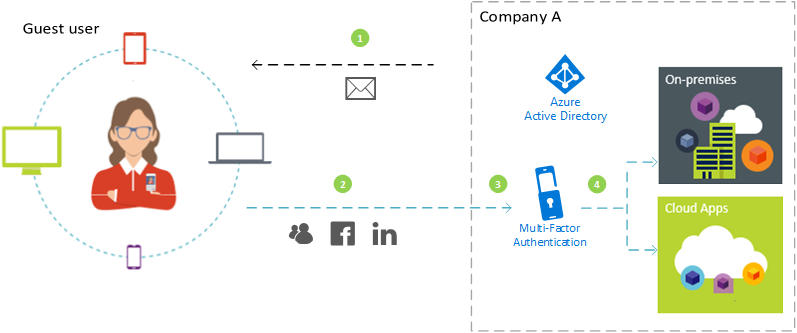
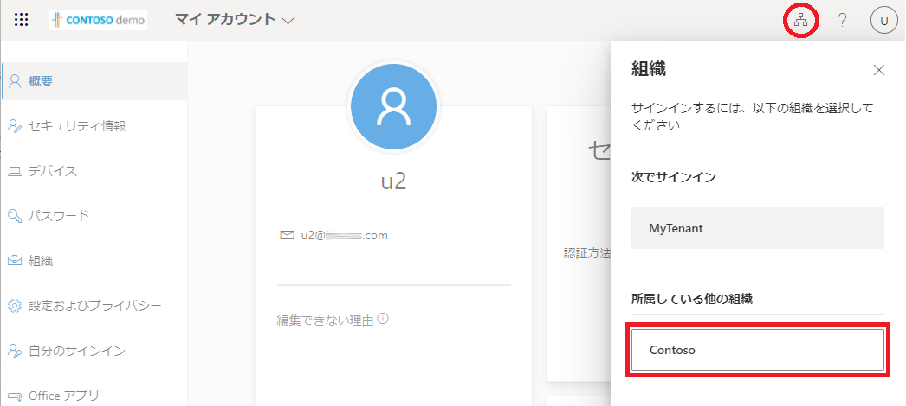
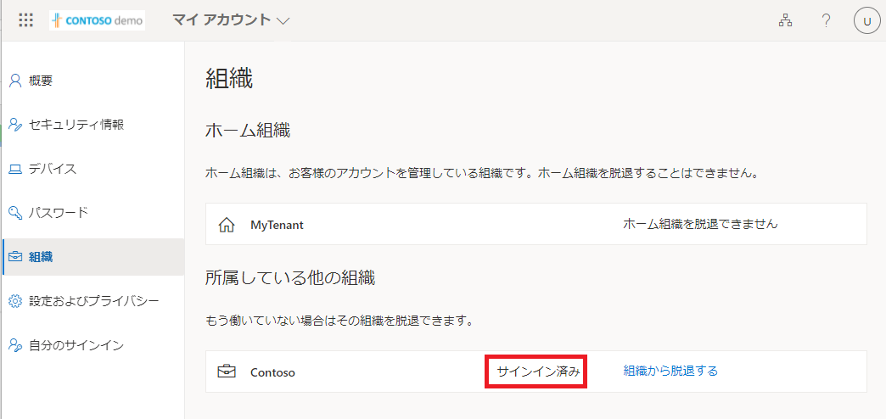
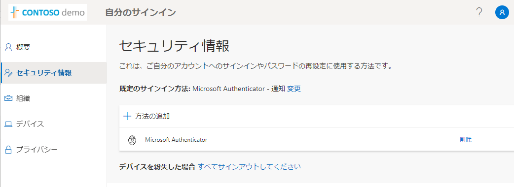

# Azure AD B2B の多要素認証について
こんにちは。 Azure Identity サポート チームです。
こちらのブログでは、 Azure AD B2B (Business-To-Business) コラボレーション機能 (以下、Azure AD B2B) の多要素認証について、下記 3 つのポイントを中心にご紹介いたします。
1. ゲスト ユーザーにおける認証方法の登録先テナントについて
2. ゲスト ユーザーによる登録済み認証方法の変更手順について
3. Azure B2B での例外的な多要素認証の動作について

## Azure AD B2B とは？
Azure AD B2B とは、外部の組織に属するユーザーのアカウントを貴社のテナントにゲスト ユーザーとして招待することで、貴社のアクセス制御のセキュリティを維持した状態でアプリまたサービスをゲスト ユーザーと安全に共有できる機能となります。

これによりゲスト ユーザーは、各自の職場または学校のアカウント、またソーシャル アカウントなどを使用して、招待されたテナントが提供するアプリとサービスにサインインすることが可能となり、組織の外部ユーザーのアカウント管理のオーバーヘッドが削減されます。
なお、 B2B についてのご説明は以下のブログにもおまとめしておりますので、機能のご紹介は以下を参照ください。

https://jpazureid.github.io/blog/azure-active-directory/what-is-b2b/

本ブログでは ユーザーのアカウントがメンバーとして所属している Azure AD を “ホーム テナント”、
そのユーザーがゲストとして招待された先の Azure AD を “リソース テナント” と記載します。
(* ゲスト ユーザーが利用するサービス、例えば SharePoint Online などのリソースが存在するテナントという意味でこのような表記としています。)

## 1. ゲスト ユーザーにおける認証方法の登録先テナントについて
テナント内のユーザーに対して条件付きアクセスなどを利用して多要素認証を要求した場合は、そのテナントに登録された多要素認証の方法が利用されていました。ゲストユーザーに対して条件付きアクセスで多要素認証を要求した時の動作はどうなるのでしょうか。

ゲスト ユーザーに対する多要素認証の要求については、基本的にユーザーがメンバーとして所属しているホーム テナントまた ID プロバイダー側ではなく、アクセス先のリソース テナントのポリシーに準拠します。
つまり、ゲスト ユーザーがリソーステナントのアプリまたサービスへアクセスした場合、ホーム テナントまた ID プロバイダー側で資格情報の確認が実施された後、リソース テナントに定義されている条件付きアクセスのポリシーなどにより多要素認証が要求されます。

以下に、ゲスト ユーザーとして招待されたテナントにおける多要素認証のフローをご紹介します。
 

1. 会社 A のテナントに属するアカウントから、外部ユーザーをゲスト ユーザーとしてテナントに招待します。
2. ゲスト ユーザーは、自身のアカウントにてホーム テナントまたは ID プロバイダー側で資格情報を使用してサインインします。
3. ゲスト ユーザーは、会社 A のアクセス制御のポリシーにより多要素認証を求められます。
4. ゲスト ユーザーは、会社 A で電話また認証アプリなどの認証情報の登録が要求され※3、多要素認証を完了することでアクセスが許可されます。

※3 ゲスト ユーザーはアクセス先のリソーステナント毎に認証情報の登録が必要です。

公開情報: チュートリアル: B2B ゲスト ユーザーに多要素認証を適用する
https://docs.microsoft.com/ja-jp/azure/active-directory/external-identities/b2b-tutorial-require-mfa

## 2. ゲスト ユーザーによる登録済み認証方法の変更手順について
上述の通り、ゲスト ユーザーは多要素認証の認証情報についてテナント毎に登録が必要となります。各テナントの認証情報については、以下の手順に沿ってゲスト ユーザー自身にてセキュリティ情報ページから認証情報の追加・変更をすることができます。

(1) マイアカウント ( https://myaccount.microsoft.com/) にアクセスし、ゲスト ユーザーのアカウントにてサインインを実施します。

(2) 画面右上にある組織のアイコン (下図赤丸) をクリックし、所属しているテナントの一覧から、ゲスト ユーザーとして招待されているテナントをクリックしてサインインしてください。
 ※下図の例では、ユーザーがメンバーとして所属するテナントが「MyTenant」、ゲスト ユーザーとして招待されているテナントが「Contoso」となります。
 

(3) 画面左側の [組織] をクリックし、ユーザーがゲストとして招待されているテナントにサインイン済みであることを確認します。
※サインイン状態のテナントには [サインイン済み] が表示されます。下図の例では「Contoso」にサインインしている状態です。
 

(4) 画面左側の [セキュリティ情報] をクリックすると、ゲスト ユーザーとして招待されたテナントで登録された認証情報が確認できます。
必要に応じて認証方法の追加 / 変更 / 削除 をクリックして設定内容を管理することが可能です。
※すでに認証情報が登録されている場合は多要素認証が要求されます。
  

## 3. Azure B2B での例外的な多要素認証の動作について
Microsoft アカウント には、Azure AD テナントとは別に Microsoft アカウント専用の 2 段階認証 (メール等) ※4 が存在します。
Microsoft アカウントをゲスト ユーザーとして Azure AD テナントへ招待した場合のみ、多要素認証の実装方法 (セキュリティの既定値群、または条件付きアクセス) に依存して、Azure AD テナント側の認証方法ではなく、 Microsoft アカウント 専用の 2 段階認証 (メール等) が利用される場合があります。

・リソーステナントの多要素認証が条件付きアクセスのポリシーにて実装されている場合
Azure AD アカウントのゲスト ユーザーと同様、Azure AD テナントのゲスト ユーザー (emailaddress#EXT#@domain 形式の UPN) としてリソーステナントに登録されている認証方法 (電話、認証アプリなど) が利用されます。

・リソーステナントでセキュリティの既定値群を有効とされている場合
Microsoft アカウント 側の 2 段階認証 (メール等) の認証方法が利用されます。

もしリソーステナントのゲスト ユーザーが利用できる認証方法を統一したいなどのご要望がある場合は、条件付きアクセスのポリシーにより多要素認証が求められるように構成することをお勧めいたします。

※4 Microsoft アカウント側でも 2 段階認証を登録する必要があります。
https://support.microsoft.com/ja-jp/account-billing/microsoft---c7910146-672f-01e9-50a0-93b4585e7eb4

以上の情報がご参考になれば幸いです。
ご不明な点がございましたら弊社サポートまでお気軽にお寄せください。