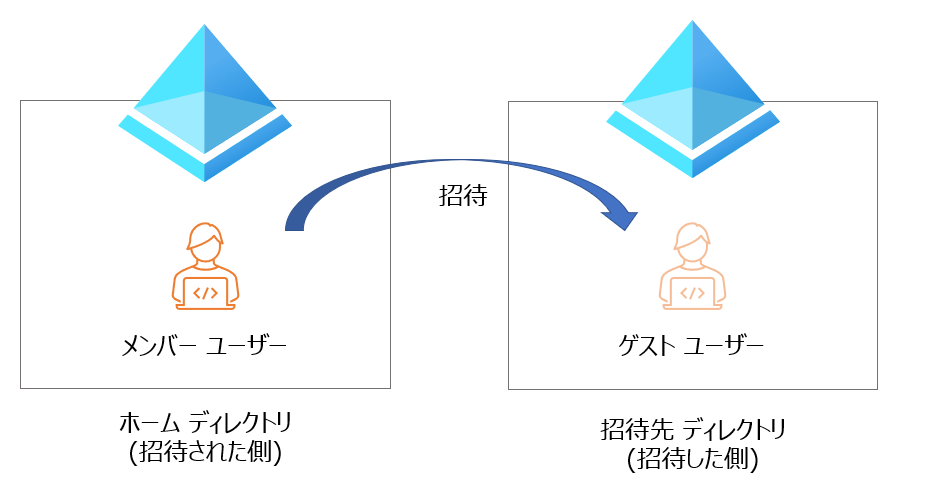
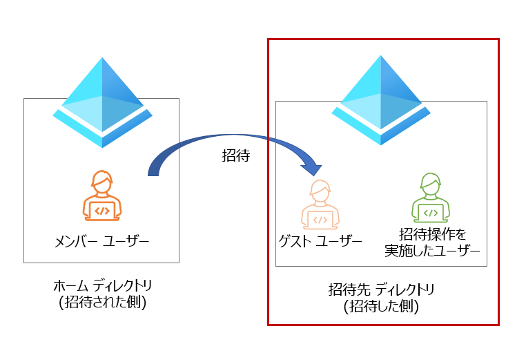
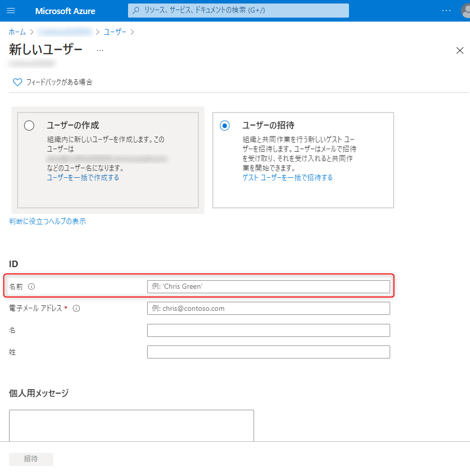
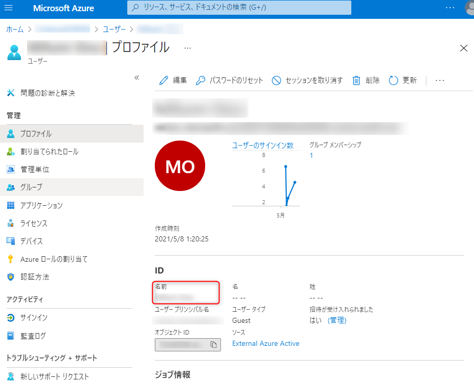
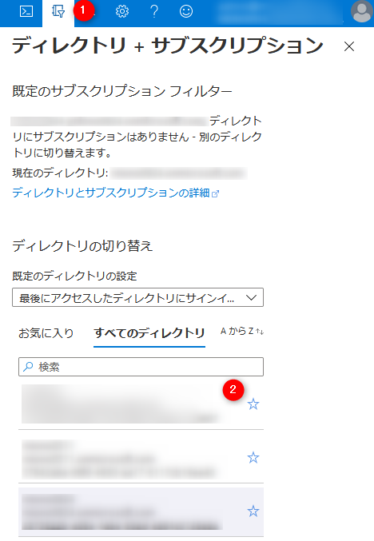

# Azure における ゲスト ユーザー招待 (B2B) のよくある質問

こんにちは。 Azure Identity サポート チームです。
こちらのブログでは、Azure における ゲスト ユーザー招待 (B2B) のよくある質問をお纏めいたしました。

それぞれ 招待をする側 と 招待された側にわけて記載をしておりますので、以下のリンクより参照いただけますと幸いです。

[1.招待した側のよくある質問](#1-招待した側のよくある質問)

[2.招待された側のよくある質問](#2-招待された側のよくある質問)

なお、B2B についてのご説明は以下のブログにもおまとめしておりますので、機能のご紹介は以下を参照ください。
[Azure AD B2B とは](https://jpazureid.github.io/blog/azure-active-directory/what-is-b2b/)

また、本ブログでは ユーザーが元々所属している Azure AD を "ホーム ディレクトリ"
そのユーザーが招待された先の Azure AD を "招待先ディレクトリ" と記載します。



## 1.招待した側のよくある質問



### Q. ゲスト ユーザーを招待した際に名前 (表示名) を指定しましたが、後日確認すると違う名前が表示されました。なぜですか?

A. ゲスト ユーザーの名前は、ユーザーが招待に承諾した際にホーム ディレクトリ側の情報で上書きします。
そのため、招待時に指定した名前は 招待への承諾時に変更されます。



ホーム ディレクトリとは異なる、招待先ディレクトリ独自の名前を設定する場合には、招待への承諾後に再度変更します。



### Q. 招待したゲスト ユーザーからサインインができないと連絡がありました。対処方法を教えて下さい

A. ゲスト ユーザーであっても、サインインはホーム ディレクトリにて行われます。
そのため、まずは招待したゲスト ユーザーが ホーム ディレクトリ にサインインができるかを切り分けてください。

"ホーム ディレクトリ" にもサインインができない場合には、"ホーム ディレクトリ" 側での対応が必要となりますので招待した側のディレクトリの管理者で対応できません。
一方、ホーム ディレクトリにはサインインができるが、"招待先ディレクトリ" にはサインインができない場合には、招待した側のディレクトリにて調査します。

ゲスト ユーザーのよくある サインインができない問題については、[2.招待された側のよくある質問](#2-招待された側のよくある質問) に記載しています。

### Q. 招待したいユーザーがメールを受信できないアカウントです。メールを受信できなければ、ゲスト ユーザーとして招待できませんか?

A. メールを受信できないユーザーであっても招待することが可能です。
( メールを受信できないユーザーとは  xxx@contso.onmicrosoft.com のような Azure AD 上のユーザーも含みます。)

メールを受信できないアカウントの場合、招待メールを受け取ることができないため、直接リンクを利用して招待に承諾します。
以下の URL をゲスト ユーザーに送付し、招待への承諾を依頼ください。
> https://portal.azure.com/<招待先ディレクトリのテナントID>

メールを利用しない招待については、以下公開情報を参照ください。
[Azure Active Directory B2B コラボレーションの招待の利用](https://docs.microsoft.com/ja-jp/azure/active-directory/external-identities/redemption-experience#redemption-through-a-direct-link)
( 直接リンクによる利用 の項 に記載があります)

### Q. 招待するユーザーのUPN とMail 属性の値が違います。どちらを利用するべきですか?

A.UPN を指定して招待ください。

[Q. 招待したいユーザーがメールを受信できないアカウントです。](#Q-招待したいユーザーがメールを受信できないアカウントです。メールを受信できなければ、ゲスト-ユーザーとして招待できませんか) の項 の通り、メールを受信できないユーザーであっても招待が可能です。
Mail 属性にて招待をした場合も招待に承諾することができ、ゲスト ユーザーとしてアクセスできますが、一部で 正常にサービスが利用できないという過去事例があります。
そのため、より安全に機能をご利用いただくためには、UPN を指定し招待ください。

### Q. ゲスト ユーザー招待時にメールを送信したくありません。メールを送らずに招待する方法はありますか?

A. Azure Portal など 画面からの招待では メールを送らずに招待することが出来ません。
メールを送らずに招待をしたい場合、PowerShell コマンドを利用します。

```cmd
# コマンドのインストール
Install-Module AzureAD

# ユーザーで認証
Connect-AzureAD

# メールを送らずに招待
New-AzureADMSInvitation -InvitedUserEmailAddress <招待するユーザーのUPN(メールアドレス形式)> -InvitedUserDisplayName <ゲスト ユーザーの表示名> -InviteRedirectUrl <招待へ承諾後、アクセスするURL>  -SendInvitationMessage $false
```

### Q. 招待を実施すると、"グループ電子メール アドレスはサポートされていません" とエラーになる


A. 招待時に指定したメールアドレスが 、Microsoft 365 ( Azure AD ) 上でグループのメールアドレスに指定されています。
ゲスト ユーザーとして招待が行えるのは ユーザーアカウントのみとなるため、別途 招待するユーザーにてアカウントを作成する必要があります。

(補足)
グループを指定して招待することで、そのグループに所属しているユーザーを一括で招待するといった機能もありません。
そのため、必ず ホーム ディレクトリ にてユーザー アカウント として作成されているアカウントを招待します。

### Q. ゲスト ユーザーの招待に有効期限はありますか?

A. Azure Portal や Teams からの招待では 、特に有効期限はありません。
ただし、SharePoint Online で招待した場合は既定で 90 日間の有効期限となります。

### Q. ゲスト ユーザーの Mail 属性 や ProxyAddress 属性が空になります。 なぜですか?

A. 連絡先 (コンタクト) として登録しているメールアドレスを指定し招待すると、Mail 属性 や ProxyAddress 属性が空 (未設定の状態) になります。
Mail 属性 や ProxyAddress 属性が空の場合、ユーザー検索時に メールアドレスで検索できないなどの影響があるため、メールアドレスを基に検索を行いたい場合には対処が必要になります。

対処としては、連絡先から該当メールアドレスを削除の上、ゲスト ユーザーの再招待を行う必要があります。
なお、連絡先の削除手順は それぞれ連絡先を追加した手順によって異なります。

【オンプレミス Active Directory より連絡先 を追加した場合】
オンプレミス Active Directory にて、 [Active Directory ユーザー と コンピューター] を起動します。
対象の連絡先を右クリックし、"削除 (D)" を実行します。


【 Microsoft 365 管理センターより連絡先 を追加した場合】
Microsoft 管理センター にて連絡先 (<https://admin.microsoft.com/Adminportal/Home#/Contact>) にアクセスし、対象の連絡先を検索します。
メールアドレスをチェックすることで "連絡先を削除" が表示されますので、クリックし連絡先を削除します。


## 2.招待された側のよくある質問


### アクセスができない際の対処

### Q. "ネットワーク管理者によってアクセスがブロックされました / 外部アクセスがポリシーによってブロックされています。アクセスするには、IT 部門にお問い合わせください。" と表示されアクセスできない


A.
原因 : ゲスト ユーザーが利用してい社内の NW 機器 によって アクセスできる ディレクトリが制限されています。
対処 : 利用しているネットワークの管理者に依頼の上、NW　機器 にアクセス先のテナント ID を追加します。

補足 : このエラーは "テナント 制限" と呼ばれる機能による制限です。
[テナント制限を使用して SaaS クラウド アプリケーションへのアクセスを管理する](https://docs.microsoft.com/ja-jp/azure/active-directory/manage-apps/tenant-restrictions)

### Q. "アカウントがブロックされました / お客様のアカウントについて、疑わしいアクティビティが検出されました。 と表示されアクセスできない

申し訳ございません。アクセスしようとしている組織では危険なユーザーを制限しています。Contoso の管理者にお問い合わせください。 " と表示されアクセスできない。


A.
原因 : ゲスト ユーザーのアカウントにてリスクが検知されています。
対処 : <https://passwordreset.microsoftonline.com> にアクセスし、パスワード リセットを行い リスクをクリアします。

自身でパスワード リセットができない場合、ホーム ディレクトリ の管理者に依頼し、パスワード リセットかリスクのクリアを依頼します。
なお、オンプレミス Active Directory から同期しているユーザーは、パスワード リセットを実施してもリスクがクリアされないため、クラウド側の管理者への依頼が必要になります。

【リスクのクリア手順】
Azure Portal (https://portal.azure.com) > [Azure Active Directory] > [セキュリティ] > [危険なユーザー]
対象のユーザーにチェックをつけ、"ユーザー リスクを無視する" [^1]を実行ください。
[^1]:本当にリスクを無視していいかの判断は管理者様が実際のユーザーに確認するなど、セキュリティ リスクを考慮の上、ご実施ください。


補足 : こちらは Azure AD Identity Protection という機能にて制限しています。
アクセスをブロックするかはそれぞれのテナント毎の設定になるため、このエラーが表示された場合には招待先ディレクトリ にてブロックの設定がされています。

なお、リスクの検出はそれぞれのホーム ディレクトリで行われます。
ホーム ディレクトリで検出されたリスクが、招待先ディレクトリ の Identity Protection で検知される仕組みとなります。

[リスクについて](https://docs.microsoft.com/ja-jp/azure/active-directory/identity-protection/concept-identity-protection-risks)

### Q. "これに対するアクセス権がありません / サインインは完了しましたが、このリソースへのアクセス許可がありません。" と表示されアクセスできない


A. 
原因 : "招待先ディレクトリ" での 条件付きアクセスと呼ばれる設定にて、許可されていないアクセスをしています。
対処 : "招待先ディレクトリ" の管理者 に依頼の上、条件付きアクセスの設定を変更します。 または、適切な条件下でアクセスを行うようにします。

補足 : このエラーの詳細は、以下のブログを参照ください。
[「アクセス権がありません」のエラーについて](https://jpazureid.github.io/blog/azure-active-directory/azuread-access-denied)

### アクセス後に情報が閲覧できない

### Q. "xxxxディレクトリには Azure サブスクリプションがありません。ここをクリックして、別のディレクトリに切り替えてください。" と表示され、Azure サブスクリプションにアクセスできない


A.
原因 : Azure サブスクリプションに対しての閲覧権限がないか、アクセスしている ディレクトリが異なっている可能性があります。
対処 : Azure サブスクリプションの管理者に依頼し 権限を付与するか、アクセスしている ディレクトリを確認します。

ディレクトリ は Azure Portal の ディレクトリ + サブスクリプション から行います。



補足 : このエラーの詳細は、以下のブログを参照ください。
[サブスクリプションが見えない](https://jpazureid.github.io/blog/azure-active-directory/subscription-azuread)

### Q. "このデータへのアクセス権がありません。"が表示される と表示され、ユーザー一覧にアクセスできない


A.
原因 : 既定では、ゲスト ユーザーは "招待先ディレクトリ" のユーザー情報を閲覧することができません。
対処 : "招待先ディレクトリ" の管理者によって ゲスト ユーザーへのアクセス権を変更依頼をするか、個別に "ディレクトリ閲覧者" などのロールの付与を依頼します。

補足 : 既定でのゲスト ユーザーによる権限については、以下公開情報を参照ください。
[Azure Active Directory の既定のユーザー アクセス許可とは](https://docs.microsoft.com/ja-jp/azure/active-directory/fundamentals/users-default-permissions)
