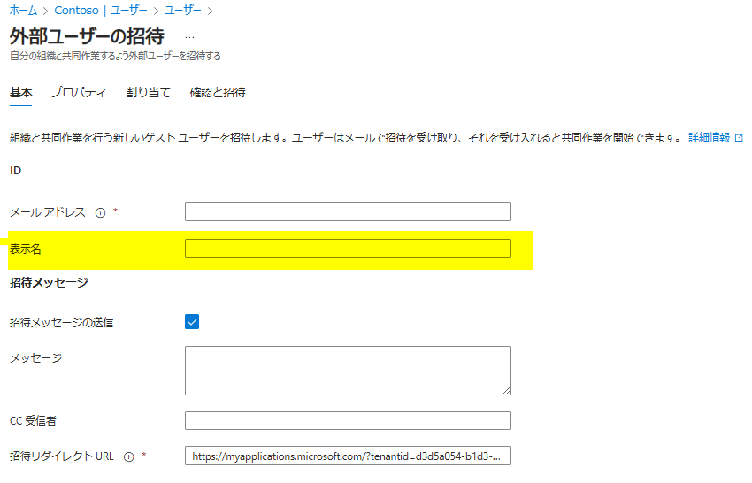
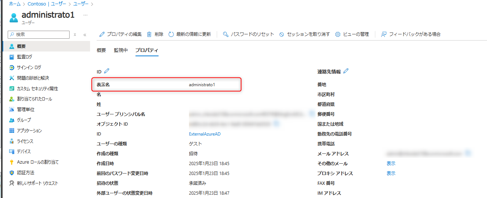
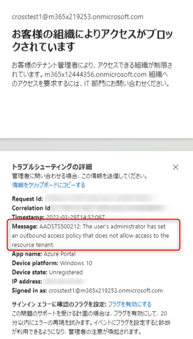
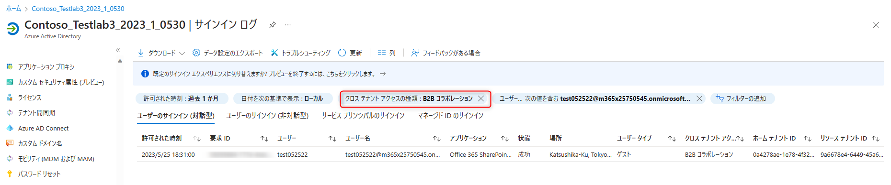
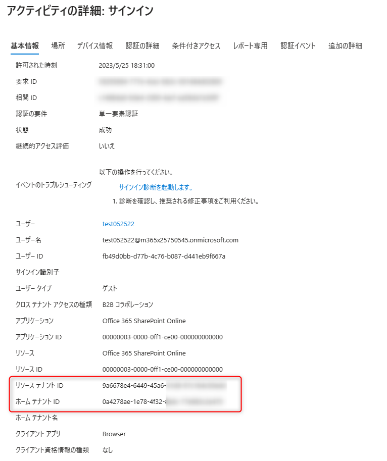
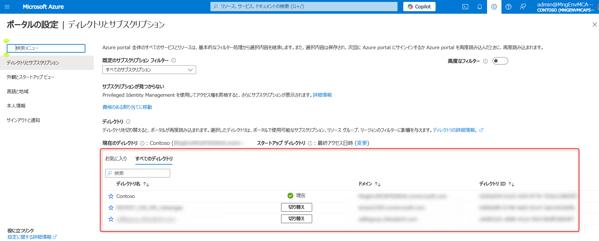

# Entra ID における ゲスト ユーザー招待 (B2B) のよくある質問

こんにちは。 Azure Identity サポート チームです。こちらのブログでは、Azure における ゲスト ユーザー招待 (B2B) のよくある質問をおまとめいたしました。

招待操作をするリソース テナント側（管理者側） と 招待されたホーム テナント側（ユーザー側） に分けて記載をしておりますので、それぞれ参照いただけますと幸いです。

なお、B2B についてのご説明は以下のブログにもおまとめしておりますので、機能のご紹介は以下を参照ください。

- [Azure AD B2B とは | Japan Azure Identity Support Blog](../azure-active-directory/what-is-b2b.md)

また、本ブログでは ユーザーが元々所属している Entra ID を "ホーム ディレクトリ（ホーム テナント）"、そのユーザーが招待された先の Entra ID を "招待先ディレクトリ（リソース テナント）" と記載します。


## 1.招待操作を行ったリソース テナント側のよくある質問


### Q. ゲスト ユーザーを招待した際に名前 (表示名) を指定しましたが、後日確認すると違う名前が表示されました。なぜですか?

A. ゲスト ユーザーの名前は、ユーザーが招待に承諾した際にホーム ディレクトリ側の情報で上書きします。そのため、招待時に指定した名前は 招待への承諾時に変更されます。



ホーム ディレクトリとは異なる、招待先ディレクトリ独自の名前を設定する場合には、招待への承諾後に再度変更します。




### Q. ゲスト ユーザーを 2 人招待したはずなのに、 1 人分しかゲスト ユーザー オブジェクトが作成されませんでした。なぜですか？

A. ホーム テナント側で招待に使用した 2 つの E メール アドレスが同じ 1 つのアカウントに紐づいているために、 新しいゲスト ユーザー オブジェクトが作成されなかったことが考えられます。

たとえば、user1@adatum.com と user1_tokyo@adatum.com という二つの異なる E メール アドレスが、どちらも同じユーザー アカウントに紐づいているとします。具体的には、どちらの E メール アドレスに E メールを送信しても同じユーザーに届く状態です。このような状態で、まず user1@adatum.com を招待するとそのテナント上にゲスト ユーザー オブジェクトが作成されます。その後、同じテナント上でさらに user1_tokyo@adatum.com を招待しても、新しいゲスト ユーザー オブジェクトは作成されません。これはこれら二つの E メール アドレスの実体が一つのユーザー オブジェクトであるからです。

より詳細には、user1@adatum.com のゲスト ユーザーがいる状態で、Azure ポータルの画面から user1_tokyo@adatum.com のアドレスを招待すると、以下のような動作となります (2025/2/12 現在)。

- 「メール」属性の値は user1@adatum.com のまま変更されません。
- 「その他のメール」属性に、user1_tokyo@adatum.com が追加されます。その他のメールは複数登録が可能なため、 user1@adatum.com も引き続き登録されています。 
- 「プロキシ アドレス」属性のプライマリ（SMTP）は既存のまま user1@adatum.com となり、セカンダリ（smtp）に新しく招待した user1_tokyo@adatum.com のアドレスが追加されます。

なお、上記のとおり、この動作はホーム テナント側でユーザー アカウントがどのような状態になっているかで決まります。そのため、アドレスのドメイン名や名前のみで一概に決まるものではございません。例えば、test1@contoso.com と test@contoso.jp という一見似たような E メール アドレスであっても、これらの E メール アドレスがホーム テナントで別々のユーザーに登録されていれば、ゲスト ユーザー オブジェクトは通常どおり 2 つ作成されます。

「ホーム テナント側でアカウントが紐づいているかどうか」は、招待するリソース テナント側からのお問い合わせでは確認できないため、招待されるホーム テナントの管理者様に確認を依頼ください。

### Q. 招待したゲスト ユーザーからサインインができないと連絡がありました。対処方法を教えて下さい

A. ゲスト ユーザーであっても、サインインはホーム ディレクトリにて行われます。そのため、まずはゲスト ユーザーがホーム ディレクトリにサインインができるかを切り分けてください。また、「Azure ポータルにはサインインできるが Teams にサインインできない」など、特定のサービスでのみ事象が発生するかも併せて確認してください。ホーム ディレクトリにもサインインができない場合には、ホーム ディレクトリ側での対応が必要となりますので、招待した側のディレクトリ（リソース テナント）の管理者では対応できません。一方で、ホーム ディレクトリにはサインインができるが、招待したディレクトリにはサインインができない場合には、招待した側のディレクトリにて調査します。

ゲスト ユーザーのよくある サインインができない問題については、[2.招待された側のよくある質問](#2-招待された側のよくある質問) に記載しています。

もしお客様自身で解決ができない状況の場合には、上記切り分けをもとに「サインインできない」事象が発生しているテナントを紐づけてお問い合わせを発行してください。


### Q. 招待したいユーザーが E メールを受信できないアカウントです。E メールを受信できなければゲスト ユーザーとして招待できませんか？

A. いいえ、 E メールを受信できないユーザーであっても招待することが可能です。(E メールを受信できないユーザーとは xxx@contso.onmicrosoft.com のような Entra ID 上のユーザーも含みます)。E メールを受信できないアカウントの場合、招待 E メールを受け取ることができないため、直接リンクを利用して招待に承諾します。以下の URL をゲスト ユーザーに送付し、招待への承諾を依頼ください。

```
https://portal.azure.com/<招待先ディレクトリのテナントID>
```

E メールを利用しない招待については、 [B2B コラボレーションの招待の利用](https://learn.microsoft.com/ja-jp/entra/external-id/redemption-experience#redemption-process-through-a-direct-link) を参照ください。(直接リンクによる引き換えプロセスの項目に記載があります)

### Q. 招待するユーザーの UPN と Mail 属性の値が違います。どちらを利用するべきですか?

A. UPN を指定して招待してください。

[Q. 招待したいユーザーがメールを受信できないアカウントです。](#Q-招待したいユーザーがメールを受信できないアカウントです。メールを受信できなければ、ゲスト-ユーザーとして招待できませんか) の項のとおり、E メールを受信できないユーザーであっても招待が可能です。Mail 属性にて招待をした場合も招待に承諾することができ、ゲスト ユーザーとしてアクセスできますが、一部で 正常にサービスが利用できないという過去事例があります。そのため、より安全に機能をご利用いただくためには、UPN を指定し招待ください。


### Q. ゲスト ユーザー招待時に E メールを送信したくありません。E メールを送らずに招待する方法はありますか？

A. Azure Portal の画面でも E メールを送らずに招待することが現在は可能です。PowerShell コマンドで E メールを送らずに招待をしたい場合は以下のようにします。

```powershell
# コマンドのインストール
Install-Module Microsoft.Graph.Identity.SignIns, Microsoft.Graph.Users

# ユーザーで認証
Connect-MgGraph -Scopes 'User.ReadWrite.All'

# メールを送らずに招待
New-MgInvitation -InvitedUserDisplayName <ゲスト ユーザーの表示名> -InvitedUserEmailAddress <招待するユーザーのUPN(メールアドレス形式)> -InviteRedirectUrl  <招待へ承諾後、アクセスするURL> -SendInvitationMessage:$false

```

> [!NOTE]
> 最新の Azure ポータル上でもメールの送付有無を選択できるようになりました。下記チェックボックスをオフにすると、メールを送付せず Azure ポータルから招待を行えます。
> 


### Q. 招待を実施すると "グループ電子メール アドレスはサポートされていません" とエラーになる


A. 招待時に指定したメールアドレスが 、Microsoft 365 (Entra ID) 上でグループの E メール アドレスとして登録されています。ゲスト ユーザーとして招待が行えるのは ユーザー アカウントのみとなるため、ユーザーに紐づいた E メール アドレスを指定ください。

> (補足)
> グループを指定して招待することで、そのグループに所属しているユーザーを一括で招待するといった機能もありません。
> そのため、必ずホーム ディレクトリにてユーザー アカウントとして作成されているアカウントを招待ください。

### Q. ゲスト ユーザーの招待に有効期限はありますか？

A. Azure Portal や Teams からの招待では 、特に有効期限はありません。ただし、SharePoint Online で招待した場合は既定で 90 日間の有効期限となります。


### Q. "お客様の組織によりアクセスがブロックされています" と表示されアクセスできないとゲストから問い合わせがありました。何をすればいいですか？



A. テナント間アクセス設定（クロス テナント アクセス設定）の設定を確認してください。必要に応じて、ゲストが所属しているテナントの管理者とも協力する必要があります。

まずは、「ほかに招待されているテナントにはアクセスできるか」を問題が発生しているゲスト ユーザーにヒアリングしてください。もしくは、上記のようなエラー画面を連携してもらい、受信アクセス・送信アクセスのどちらが問題となっているか確認してください。

ほかのテナントにはアクセスできる場合、今回招待を行ったテナント側のテナント間アクセス設定（クロス テナント アクセス設定）で、ゲストがテナントにアクセスしてくることを拒否していることがあります。
通常の B2B コラボレーションの場合、受信アクセスが許可されているか確認してください。

ほかのテナントにもすべてアクセスできない場合、ゲストが所属しているホーム テナント側で、そもそも「外部テナントにアクセスしてはいけない」というルールが構成されていることがあります。
招待を行ったテナントではなく、招待されたゲストがもともと所属するテナントの管理者に確認を依頼し、テナント間アクセス設定（クロス テナント アクセス設定）の 送信アクセスが許可されているか確認してください。


### Q. ゲスト ユーザーを招待した後、正しく承諾され、その後正常に利用できているか分からず心配です。管理者側からサインイン ログを確認する方法はありますか？

A. はい、あります。サインイン ログで、[クロス テナント アクセスの種類] フィルターを活用し、B2B コラボレーションをオンにする方法です。



すると、B2B コラボレーション関連のサインイン ログが表示できます。

「自社テナントのユーザーが他のテナントへアクセスした時」「外部ユーザーが自社テナントへアクセスしてきたとき」の 2 パターンのログが主に出力されますが、ホーム テナント ID とリソース テナント ID を確認すると、どちらに該当するかが確認できます。

「外部ユーザーが自社テナントへアクセスしてきたとき」のログを確認したい場合、ホーム テナント ID が他のテナントの ID、自社テナントのテナント ID がリソース テナント ID に表示されているものを確認します。





## 2.招待されたホーム テナントのユーザー側のよくある質問


### Q. "お客様の組織によりアクセスがブロックされています" と表示されアクセスできない

A. 「お客様のテナント管理者により、アクセスできる組織が制限されています。 xxxx.onmicrosoft.com 組織へのアクセスを要求するには、 IT 部門にお問い合わせください。」と表示されている場合、テナント間アクセス設定（クロス テナント アクセス設定）が原因であることが考えられます。他に招待されているテナントがあればそちらにもアクセスを試してみてください。

特定のテナントのみアクセスできない場合は、リソース テナント（招待してくれたテナント）の管理者へお問い合わせください。
どのテナントにもアクセスできない場合は、ホーム テナント（自身のテナント）の管理者へお問い合わせください。


### Q. "ネットワーク管理者によってアクセスがブロックされました / 外部アクセスがポリシーによってブロックされています。アクセスするには、IT 部門にお問い合わせください。" と表示されアクセスできない


A. 原因として、ゲスト ユーザーが利用している社内のネットワーク機器によってアクセスできるディレクトリが制限されてると考えられます。対処としては、利用しているネットワークの管理者に依頼の上、ネットワーク機器の設定にアクセス先のテナント ID を追加します。

> 補足:
> このエラーは "テナント制限" と呼ばれる機能による制限です。
> [テナント制限を使用して SaaS クラウド アプリケーションへのアクセスを管理する](https://docs.microsoft.com/ja-jp/azure/active-directory/manage-apps/tenant-restrictions) をご覧ください。

### Q. "アカウントがブロックされました / お客様のアカウントについて、疑わしいアクティビティが検出されました。" と表示されアクセスできない

この場合、画面上に "申し訳ございません。アクセスしようとしている組織では危険なユーザーを制限しています。Contoso の管理者にお問い合わせください。" と表示されアクセスできない状態と想定されます。


> 補足 : 
> サインインログには以下が記録されます。
> エラー 530032
> Failure reason : User blocked due to risk on home tenant.
 
A. 原因として、ゲスト ユーザーのアカウントにてリスクが検知されています。対処としては、<https://passwordreset.microsoftonline.com> にアクセスし、パスワード リセットを行い リスクをクリアします。

自身でパスワード リセットができない場合、ホーム ディレクトリの管理者に依頼し、パスワード リセットかリスクのクリアを依頼します。なお、オンプレミス Active Directory から同期しているユーザーは、オンプレミス側からパスワード リセットを実施してもリスクがクリアされません。パスワード ライトバックを構成のうえクラウド側 (Entra ID) の管理者へ依頼しパスワードをリセットしてもらうか、事前に SSPR やリスク ベースのポリシーを構成し、リスクを自己修復する必要があります。

リスクをクリアするには、Azure Portal (https://portal.azure.com) から [Azure Active Directory] > [セキュリティ] > [危険なユーザー] にアクセスします。対象のユーザーにチェックをつけ、"ユーザー リスクを無視する"を実行します。

> [!IMPORTANT]
> 本当にリスクを無視していいかの判断は管理者様が実際のユーザーに確認するなど、セキュリティ リスクを考慮の上でご実施ください。


> 補足: こちらは Microsoft Entra ID Protection という機能にて制限しています。
> アクセスをブロックするかはそれぞれのテナント毎の設定になるため、このエラーが表示された場合には招待先ディレクトリ にてブロックの設定がされています。

なお、リスクの検出はそれぞれのホーム ディレクトリで行われます。ホーム ディレクトリで検出されたリスクが、招待先ディレクトリ の Identity Protection で検知される仕組みとなります。[こちらの公開情報](https://learn.microsoft.com/ja-jp/entra/id-protection/concept-identity-protection-risks) の資料もご覧ください。

### Q. "これに対するアクセス権がありません / サインインは完了しましたが、このリソースへのアクセス許可がありません。" と表示されアクセスできない


A. 原因は "招待先ディレクトリ" での 条件付きアクセスと呼ばれる設定にて、許可されていないアクセスをしているためです。対処としては、"招待先ディレクトリ" の管理者 に依頼の上、条件付きアクセスの設定を変更するか、適切な条件下でアクセスを行うようにします。

> 補足:
> このエラーの詳細は、[「アクセス権がありません」のエラーについて | Japan Azure Identity Support Blog](../azure-active-directory/azuread-access-denied.md) を参照ください。


### Q. ゲストとして招待されたテナントにサインインすると、 MFA が求められてしまいます。

A. MFA は、ホーム テナント側とリソース テナント側でそれぞれ設定されています。ホーム テナントで MFA が有効になっていなくても、リソース テナントで有効の場合、ゲストとしてアクセスしようとしたときに MFA の登録や試行を求められます。


### Q. "xxxx ディレクトリには Azure サブスクリプションがありません。ここをクリックして、別のディレクトリに切り替えてください。" と表示され、Azure サブスクリプションにアクセスできない


A. 原因はサインインしたユーザーが、Azure サブスクリプションに対しての閲覧権限がないか、アクセスしている ディレクトリが異なっている可能性があります。対処としては、Azure サブスクリプションの管理者に依頼し 権限を付与するか、アクセスしている ディレクトリを確認ください。

ディレクトリの変更 は Azure Portal 右上の設定（歯車マーク）をクリックし、"ディレクトリとサブスクリプション" のメニューから行います。



> 補足:
> このエラーの詳細は、[サブスクリプションが見えない | Japan Azure Identity Support Blog](https://jpazureid.github.io/blog/azure-active-directory/subscription-azuread) を参照ください。

### Q. "このデータへのアクセス権がありません。"が表示される と表示され、ユーザー一覧にアクセスできない


A. 既定では、ゲスト ユーザーは "招待先ディレクトリ" のユーザー情報を閲覧することができないためにこの画面が表示されます。対処としては、招待したディレクトリの管理者によって ゲスト ユーザーへのアクセス権を変更をするか、個別に "ディレクトリ閲覧者" などのロールの付与を依頼ください。

> 補足:
> 既定でのゲスト ユーザーによる権限については、[既定のユーザー アクセス許可 - Azure Active Directory | Microsoft Docs](https://docs.microsoft.com/ja-jp/azure/active-directory/fundamentals/users-default-permissions) と[こちらのブログ](https://jpazureid.github.io/blog/azure-active-directory/external-collaboration-setting-b2b-access/)を参照ください。
