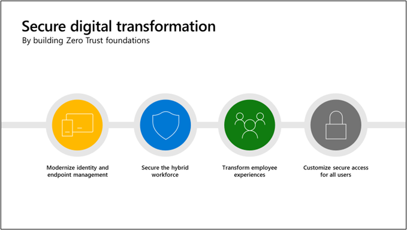
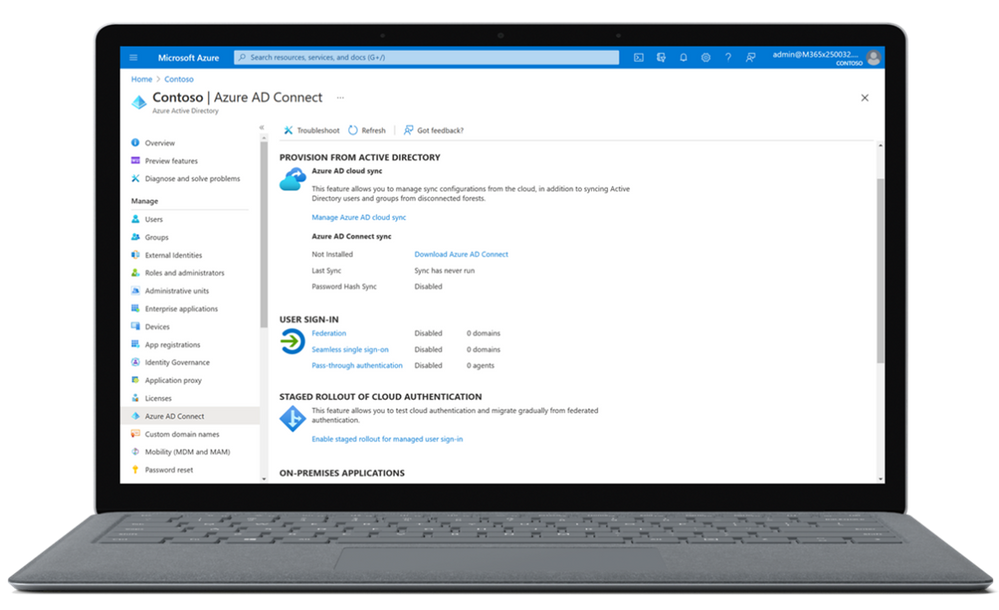
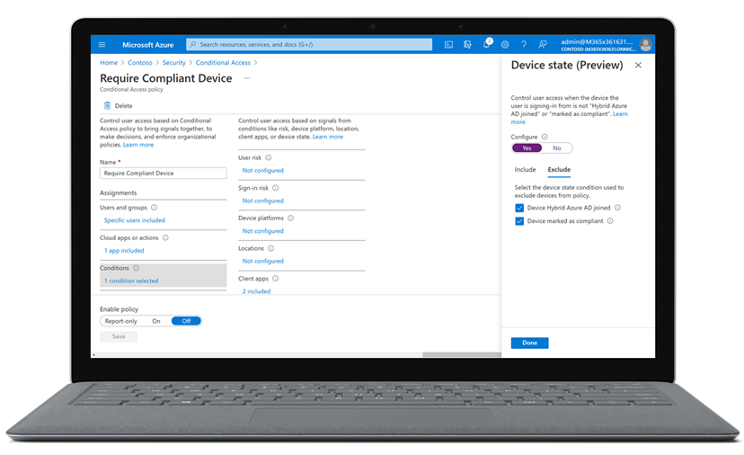
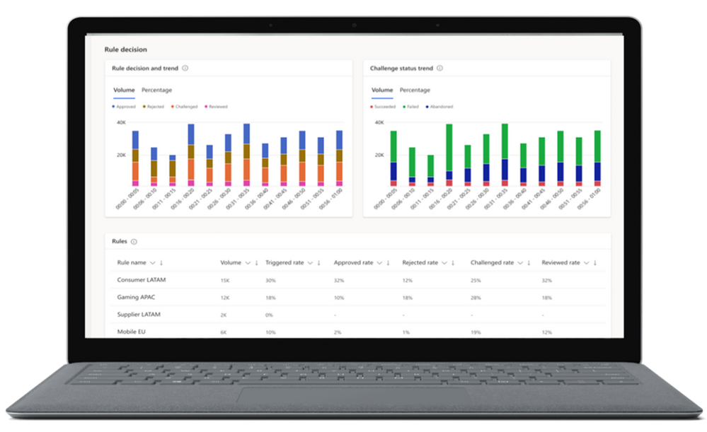

---
title: アイデンティティとエンドポイント管理から始まる強固なゼロトラスト基盤の構築
date: 2021-07-18 10:00
tags:
  - Azure AD
  - US Identity Blog
---
# アイデンティティとエンドポイント管理から始まる強固なゼロトラスト基盤の構築

こんにちは、Azure Identity サポート チームの 竜 です。
本記事は、2021 年 7 月 14 日に米国の Azure Active Directory Identity Blog で公開された [Build a strong Zero Trust Foundation starting with identity and endpoint management](https://techcommunity.microsoft.com/t5/azure-active-directory-identity/build-a-strong-zero-trust-foundation-starting-with-identity-and/ba-p/2520420) を意訳したものになります。ご不明点等ございましたらサポート チームまでお問い合わせください。
----

昨年の Microsoft Inspire では、お客様のリモートワークへの迅速な移行に支援いただいたパートナー企業に感謝の意を表しました。世界が進化し続け、新しい現実が定着する中、今年は 2 つのトレンドがお客様の優先事項を形成しています。それは、ハイブリッド ワークへの移行とサイバー脅威の高度化です。これらの変化に適応するために、お客様は、引き続き弊社のパートナー エコシステムを活用しています。お客様の適応を援助する方法の一つとして、弊社のパートナー企業はお客様がゼロトラスト セキュリティ戦略を採用することを支援しています。 

ゼロ トラストへの移行を始めるのは大変なことかもしれませんが、何もしないという選択肢はもはやありません。私たちは、パートナー企業とともに、すべてのお客様にこの道のりを案内する責任があると考えています。どこから始めればよいかの指針を求めている企業には、[アイデンティティ](https://www.microsoft.com/ja-jp/security/business/identity-access-management/azure-ad-pricing)と[エンドポイント](https://www.microsoft.com/ja-jp/security/business/microsoft-endpoint-manager)を保護することで強固な基盤を構築することをお勧めしています。今週の [Microsoft Inspire](https://myinspire.microsoft.com/home) では、このような基盤を構築するための主要な戦略を紹介します。

**アイデンティティとエンドポイント管理の近代化**
高度なセキュリティと包括的なゼロ トラスト戦略を実現するために、まずアイデンティティとエンドポイント管理のソリューションを近代化することで、クラウドへの移行を加速させることができます。これは、ビジネス リーダーの間でも優先度が高まっています。

近代化は、一見すると大変な作業のように見えます。しかし、クラウドから重要なアクセス決定を管理し、一般的な攻撃経路を排除することに焦点を当てることで実現可能なものになります。[認証をレガシー フェデレーションから近代化する](https://docs.microsoft.com/ja-jp/azure/active-directory/hybrid/choose-ad-authn)ことで、ビジネスに最適なアクセス パスを選択することができます。また、[レガシー認証をブロックする](https://docs.microsoft.com/ja-jp/azure/active-directory/conditional-access/block-legacy-authentication)ことによって、多要素認証を確実に施行できるようになり、さらに、条件付きアクセスによって多要素認証をデフォルトのポリシーとして設定できます。

クラウドへの移行において、コントロール グループを用いた導入を始めとし、[段階的にロールアウトする](https://docs.microsoft.com/ja-jp/azure/active-directory/hybrid/how-to-connect-staged-rollout)ことで、シームレスな移行が可能になります。アクセス管理を一元化するために、[Azure AD クラウド同期](https://docs.microsoft.com/ja-jp/azure/active-directory/cloud-sync/what-is-cloud-sync)などのツールを利用してオンプレミスのすべてのアイデンティティをクラウドに同期することができます。Azure AD クラウド同期は、数百の Active Directory フォレストがあるような複雑な環境にもご利用いただけます。

エンドポイント管理を近代化するために、 お客様の需要に合ったペースでクラウドの計画を立てられる [Microsoft エンドポイント マネージャー](https://www.microsoft.com/ja-jp/security/business/microsoft-endpoint-manager)の利用をお勧めしています。Microsoft エンドポイント マネージャーは、Configuration Manager と Microsoft Intuneを 1 つのエンドポイント管理プラットフォームに統合しています。それぞれのツールを個別で使用することも、共同で管理することもできます。

最後に、アイデンティティとエンドポイント管理を近代化するために、1 つのクラウド ID とクラウド エンドポイント管理のソリューションを用いてアプリ管理を統一します。[すべてのアプリを 1 つの ID システムに接続する](https://www.microsoft.com/ja-jp/security/business/identity-access-management/secure-app-access)ことで、使用されているアプリの可視性と制御が向上します。また、1 つの認証情報を用いて接続することで、リソースへのアクセスが簡素化されます。弊社のソリューションは、クラウド アプリからオンプレミス アプリ、デスクトップ アプリやモバイ ルアプリまで幅広く対応しています。

**ハイブリッド ワークフォースの保護**
すべての従業員がハイブリッドな環境で働く場合、アイデンティティとエンドポイントの保護はさらに重要になります。ハイブリッド ワークフォースのセキュリティを確保するための最初のステップは、[強力な認証](https://www.microsoft.com/ja-jp/security/business/identity-access-management/mfa-multi-factor-authentication)でユーザーのアイデンティティを確認することです。パスワードは、セキュリティ チェーンの中で最も弱いリンクです。自分自身のセキュリティを守るために 1 つのことしかできないとすれば、 99.9% の ID 攻撃を防ぐことができる多要素認証から始めることをお勧めします。私たちは、さらに強力な認証のために、より安全で便利な[パスワードレス](https://www.microsoft.com/ja-jp/security/business/identity-access-management/passwordless-authentication)を採用しています。

次に、脆弱なデバイスや危殆化したデバイスからリソースへのアクセスを不可とするポリシーを適用することで、準拠した信頼できるデバイスからのみアクセスできるように制限します。まずエンドポイントをデバイス管理に登録し、デバイスにデータ保護ポリシーを適用します。そして [Microsoft Defender for Endpoint](https://www.microsoft.com/ja-jp/security/business/threat-protection/endpoint-defender) のような脅威保護ソリューションを使用して危険なデバイスを検出することで、エンドポイントを保護することができます。

アイデンティティとデバイスの制御ポイントを確立した後は、コンテキストとリスク評価に基づいて適応性のあるアクセス ポリシーを設定します。[条件付きアクセス](https://www.microsoft.com/ja-jp/security/business/identity-access-management/conditional-access-azure-ad)では、ユーザー、デバイス、場所、セッションのリスク評価に基づいてアクセス ポリシーを微調整することができます。私たちは継続的に条件付きアクセスを改善しており、さらにきめ細やかなアクセス ポリシーも可能にしています。たとえば、認証コンテキストに基づいてポリシーを構築したり、アクセス条件が満たされているかどうかを常に再評価し、変化が検出された場合はセッションを中断することができる継続的なアクセス評価などが可能です。

リソースへのアクセスの可否を決定するもう一つの重要な要素に、ユーザーの権限があります。ユーザーの権限は、お客様が従業員やパートナー企業に割り当てる役割、プロジェクト、その他の属性に基づいて設定されます。これらの権限を付与するのは簡単ですが、追跡したり、不要になったときにアクセスを取り消したりするのは非常に困難です。従業員の増加に伴い、全員のアクセス権を管理するソリューションがますます重要になっています。重要なリソースへのアクセスを保護、監視、監査をするために、Azure AD に組み込まれた [Identity Governance](https://www.microsoft.com/ja-jp/security/business/identity-access-management/identity-governance) のご利用をお勧めします。

**従業員の体験を変える**
ビジネスリーダーにとって、従業員の満足度を高めることは重要な課題となっていますが、リモートワークにより従来の IT ヘルプデスクに頼ることがさらに難しくなってきています。たとえば、米国内だけでも、4,900 万人のリモートワーカーが、IT の問題を解決するのに何日も、時には何週間もかかると報告しています1。

優れた従業員体験をつくるプロセスは、新入社員の入社時から始まります。[Azure AD のプロビジョニング](https://www.microsoft.com/ja-jp/security/business/identity-access-management/lifecycle-management-software)、Microsoft エンドポイント マネージャー、および [Windows Autopilot](https://www.microsoft.com/ja-jp/microsoft-365/windows/windows-autopilot) を使用することで、このプロセスを数日から数時間、あるいは数分に短縮し、初日から適切なアプリケーションとデバイスへのアクセスを付与することができます。[Azure AD の検証可能資格情報](https://www.microsoft.com/ja-jp/security/business/identity-access-management/verifiable-credentials)を使用すると、このプロセスをさらに簡素化できます。たとえば、新入社員の個人データを収集して保存することなく、学歴や専門資格などの情報を数分で確認できます。

入社時から[シングル サインオン](https://www.microsoft.com/ja-jp/security/business/identity-access-management/single-sign-on)を使うことにより、従業員が必要なアプリにアクセスする方法を合理化できます。従業員の生産性を向上させる最も簡単な方法の 1 つは すべてのアプリケーションを Azure AD に接続することです。Workday、ServiceNow、さらには AWS などの[クラウド アプリケーション](https://www.microsoft.com/ja-jp/security/business/identity-access-management/integrated-apps-azure-ad)から、[オンプレミスのアプリケーション](https://www.microsoft.com/ja-jp/security/business/identity-access-management/application-management-services)やカスタム ビルドのアプリケーションまで、すべてのアプリケーションを Azure AD に接続することができます。アプリケーションを Azure AD に接続することで、エンド ユーザーは、一元化されたアプリケーション起動ポータルである [My Apps](https://www.microsoft.com/ja-jp/security/business/identity-access-management/user-self-service-portals) から、すべてのアプリケーションを容易に見つけて起動することができます。

**ユーザーに合わせた安全なアクセスのカスタマイズ**
私たちは、すべてのユーザーに安全なアクセスと快適な体験を提供したいと思っています。たとえば、第一線で働く人々を例に挙げてみましょう。昨年、私たちは、彼らが社会で果たす重要な役割を目の当たりにしましたが、75％ の人はまだ仕事をするための適切なツールを持っていません2。私たちはパートナー企業やお客様と協力して、彼らの仕事環境に適応した体験を作ることで、この状況を変えようとしています。まずは、[ワンタイム SMS コード](https://docs.microsoft.com/ja-jp/azure/active-directory/authentication/howto-authentication-sms-signin)を使ってサインインプロセスを合理化し、ユーザーの資格情報管理を強化することから始めています。そのために、たとえば [マイ スタッフ ポータル](https://docs.microsoft.com/ja-jp/azure/active-directory/roles/my-staff-configure) から電話番号の追加やパスワード リセットの承認などを可能にしました。また、第一線で働く人々が使うツールとしてキオスクが一般的になっています。そのため、[共有デバイス モード](https://docs.microsoft.com/ja-jp/azure/active-directory/develop/msal-shared-devices)を利用することで、キオスクのようなデバイス上ですべてのアプリやブラウザ セッションに安全にサインインおよびサインアウトすることを可能にしています。

 
お客様にとって、もう一つの重要な優先事項は、顧客との長期的な関係を築くことです。[Azure AD B2C](https://docs.microsoft.com/ja-jp/azure/active-directory-b2c/overview) を利用することで、企業や開発者は顧客向けアプリケーションのサインイン エクスペリエンスをカスタマイズし、きめ細かなアクセス ポリシーを構築することができます。さらに、[Azure AD B2C を Dynamics Fraud Protection と統合する](https://cloudblogs.microsoft.com/dynamics365/bdm/2021/05/12/fraud-trends-part-4-balancing-identity-authentication-with-user-experience/)ことで、不正利用や詐欺から顧客アカウントや収益を保護します。この統合により、偽のアカウントの作成、アカウントの乗っ取り、不正なアカウント アクセスを防ぐことができます。また、不正行為による損失やチェックアウト時の摩擦に対する収益機会のバランスを考慮したインサイトにより、トランザクションの受理率を向上させることができます。

**Microsoft Inspire にてバーチャル、ライブ、またはオンデマンドでご参加ください**
仕事のやり方や場所が変化し、セキュリティ上の脅威が増大していることから、新たなセキュリティ アプローチが必要とされています。アイデンティティとエンドポイントを基盤としたゼロ トラストこそが、そのアプローチとなりえます。統合されたセキュリティ アプローチと併せて、Azure AD と Microsoft エンドポイント マネージャーを利用することで、適切な人が適切なレベルのアクセスを得られるようになり、セキュリティとエンドユーザーの生産性の両方を向上することができます。

世界のどこにいても、Microsoft Inspire の期間中、私たちのセッションに参加していただけることを願っています。[Twitter](https://twitter.com/azuread/status/1278418103903363074) や [LinkedIn](https://www.linkedin.com/showcase/microsoft-security/) でハッシュタグ 「#MSInspire」をつけて会話に参加してください。

- [TS03](https://myinspire.microsoft.com/sessions/a5411f0e-7928-41c2-850f-c7dfbed207a3)：信頼とセキュリティの基盤を構築する
- [BRK122](https://myinspire.microsoft.com/sessions/af379ebd-9be9-4985-9443-068f4a584344)：アイデンティティとエンドポイントの管理 - ゼロ トラストと収益性のための強固な基盤の構築
- [OD122](https://myinspire.microsoft.com/sessions/8f6f4cf4-3712-4e74-bd31-9efeb249298c)：ゼロ トラスト フレームワークに向けて顧客を支援するビジネスを構築する
- [ATEBRK122](https://myinspire.microsoft.com/sessions/b9f77c58-b8c7-4e95-992b-6875efa7da68)：エキスパートに聞こう：アイデンティティとエンドポイント管理 - ゼロ トラストと収益性のための強固な基盤

よろしくお願いします。
イリーナ・ネチャエバ
アイデンティティ製品マーケティング担当シニアディレクター

参照文献:

1. 1E American Remote Work Survey, July 20, 2020
2. Equip Firstline Workers with Better Tools to Drive Engagement, Forrester Opportunity Snapshot: A Customer Study Commissioned by Microsoft, December 2018