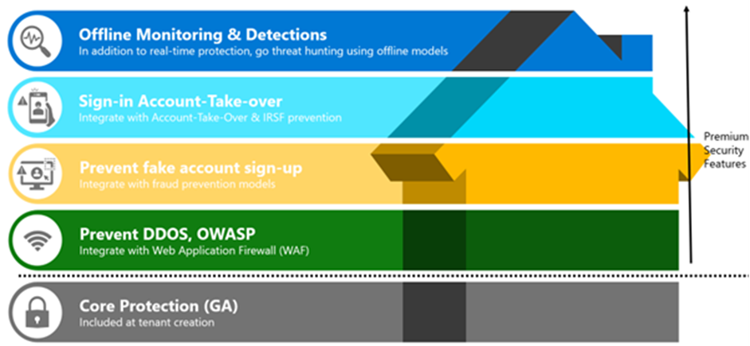
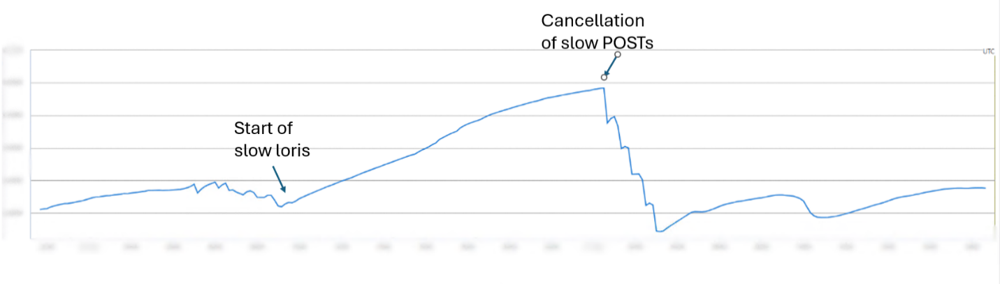
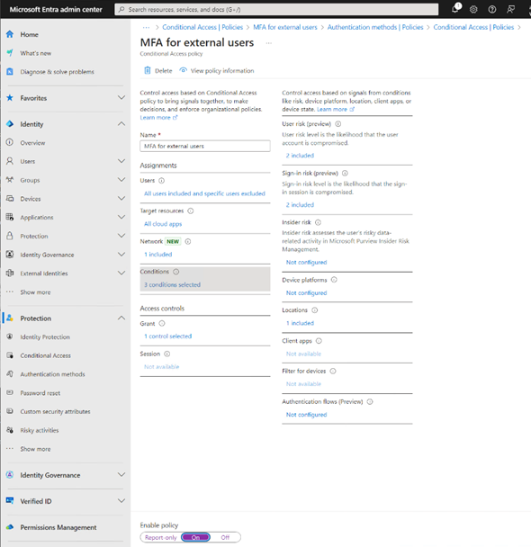
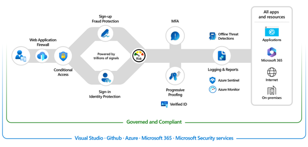

# 外部公開しているアプリに適用可能な Entra ID のセキュリティ制御

こんにちは、Azure Identity サポート チームの 高田 です。

本記事は、2024 年 11 月 6 日に米国の Microsoft Entra Blog で公開された [Built-in security controls for external-facing apps](https://techcommunity.microsoft.com/blog/identity/built-in-security-controls-for-external-facing-apps/4175879) を意訳したものになります。ご不明点等ございましたらサポート チームまでお問い合わせください。

----

今年の初めに、[Microsoft Entra External ID](https://www.microsoft.com/ja-jp/security/business/identity-access/microsoft-entra-external-id) の一般提供を発表しました。これは、次世代の CIAM ソリューションであり、組織は完全にカスタマイズ可能なコンシューマー向けのユーザー体験をアプリに組み込むと共に、エンタープライズ レベルのセキュリティとコンプライアンスを享受することが可能です。弊社は、お客様からのフィードバックに基づいて革新的な機能を定期的に展開し、管理者と開発者の日常の業務をより簡素にし、改善することに取り組んでいます。例えば、完全にカスタマイズ可能なモバイル アプリケーションを作成できるようにする [ネイティブ認証の一般提供](https://devblogs.microsoft.com/identity/native-auth-for-external-id-ga/) に関する最近の発表もぜひご覧ください。

本日は、Microsoft Entra External ID を使用したエンドツーエンドの ID セキュリティ戦略の構築に関し、包括的な分析情報を提供するという、セキュリティの中でも重要な側面に焦点を絞ってお話ししたいと思います。これらの堅牢なセキュリティ対策を行うことで、ビジネスを守るというだけでなく、アプリのエンドユーザーの信頼と満足度も高め、ユーザー体験がシームレスで安全であるという安心感をも与えることができるということを弊社は目指しています。では、プリンシパル プロダクト マネージャーの Pawan Nrisimha より、External ID に組み込まれたエンタープライズ レベルのセキュリティ制御について詳しく説明してもらいます。 

## Microsoft Entra External ID に組み込まれているエンタープライズ レベルのセキュリティ制御

Microsoft Entra External ID のエンドツーエンドかつ幾層にも及ぶセキュリティ戦略は、全体の機能を支える基盤としての Core Protection 層から始まり、Microsoft Entra ID を活用している従業員だけでなく、外部ユーザーに対しても核となるセキュリティ機能を拡張していくというものです。わずかワンクリックで、リアルタイムおよびオフラインの堅牢な保護機能を有効化し、すべてのユーザーをエンタープライズ レベルのセキュリティで保護することが可能になります。現時点では、ブルート フォース保護、一般的なネットワーク周りの HTTP 保護、アカウント保護、アクセス制御などの核となる保護機能に注力しており、これらの保護は External ID のテナントを作成すると既定で有効になります。
 

ID に関連するサービスを提供する最大のプロバイダーの 1 つとして、弊社はお客様のアプリケーションに対してますます多くの攻撃が行われていることを目の当たりにしています。例えば、DDoS 攻撃が増え続けており、6 月にはすべてのお客様で 1 日あたり約 4,500 件の攻撃がありました。External ID を使用すると、大量の要求でサービスをダウンさせようとする試みを効果的に防ぐことが可能です。Microsoft Entra External ID を使用して外部テナントを作成すると、このような堅牢なセキュリティ対策が **既定で有効** になり、これらの増大するサイバー空間の脅威からアプリケーションを保護できます。既定では、External ID はパスワード スプレー攻撃からエンドユーザーを保護する機能も提供しています。パスワード スプレー攻撃は今年に入り、1 秒あたり 7,000 件に達しています。機密性の高いユーザー データを危険にさらす不正アクセスの試みがあったとしても、すべてのコア セキュリティ制御によりアプリケーションが保護されます。

このグラフから、お客様が実際に大規模な DDoS 攻撃に直面しており、攻撃者は膨大なリクエストをサーバーに送信していることが分かります。Microsoft Entra External ID に [組み込まれた DDoS 保護](https://azure.microsoft.com/ja-jp/products/ddos-protection) は、異常なトラフィック パターンを検出し、攻撃を緩和する処理を有効化することで、悪意のあるトラフィックを除外し、正当な要求を許可してサービスが中断されないようにします。

同様に、次のグラフに示されている Slow Loris 攻撃では、Microsoft Entra External ID は、実害が生じる前にアイドル状態の接続を特定して破棄することで攻撃を防いでいます。このような堅牢な保護により、サービス品質に影響を与えることなく大量の同時リクエストが処理され、アプリの安全性だけでなくエンド ユーザーの信頼も保たれることになるのです。(Microsoft 内部データ)

 

弊社は、潜在的な脅威に先手を打つべくシステムを継続的に更新していますのでご安心ください。

### 条件付きアクセスでリスクを検出および解消する

ここまでで、外部テナントの作成時に既定で有効になる保護機能について説明してきました。お客様のアプリのセキュリティをさらに強化するために、[条件付きアクセス](https://learn.microsoft.com/ja-jp/entra/identity/conditional-access/concept-conditional-access-policies) ポリシーをカスタマイズして多要素認証 (MFA) を求めることで、侵害のリスクが 99.22% と大幅に減少し ([2023 年 Microsoft デジタル防衛レポート](https://www.microsoft.com/ja-jp/security/security-insider/microsoft-digital-defense-report-2023))、不正アクセスが防止されるだけでなく、フィッシングやアカウント乗っ取りなどの脅威に対する堅牢な防御が提供されます。外部テナントで構成できるさまざまな MFA 方法の詳細については、[弊社ドキュメント](https://learn.microsoft.com/en-us/entra/external-id/customers/concept-multifactor-authentication-customers) をご覧ください。

 

## 次のステップ: エンドツーエンドの CIAM セキュリティ戦略を構築する
 
ここまでで、テナント作成時から有効な既定のセキュリティ機能についてご理解いただけたと存じます。次に、お客様が自社の ID に関するセキュリティ要件について確認され、さらに高度な脅威が存在しているという点についても理解が得られましたら、ぜひ以下に紹介します External ID のプレミアム セキュリティ機能についてもご検討ください。今後数か月の間に、包括的な外部 ID セキュリティ ブログの連載を開始し、Web Application Firewall (WAF) の統合、不正サインアップの防止、サインイン アカウントの乗っ取り保護、そして最後にオフラインでの脅威ハンティングのための SIEM/SOAR ツールに関する情報を公開する予定です。

Microsoft Entra External ID を使用して、安全で美しく、使い心地の良いアプリを数分で構築できます。今すぐ [aka.ms/TryExternalID](https://aka.ms/TryExternalID) にアクセスしてお試しください。
