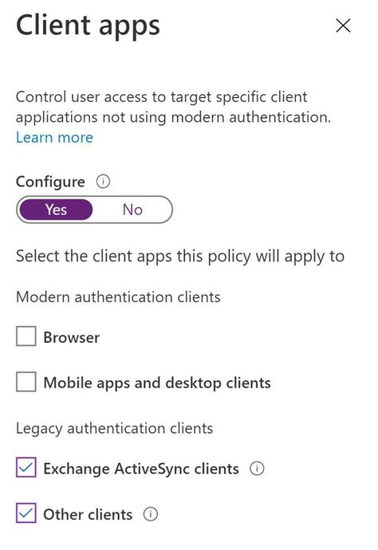
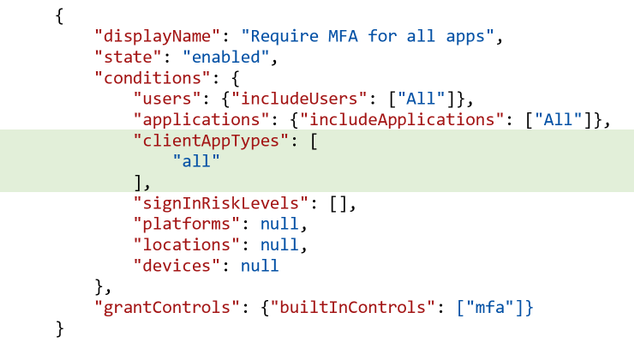
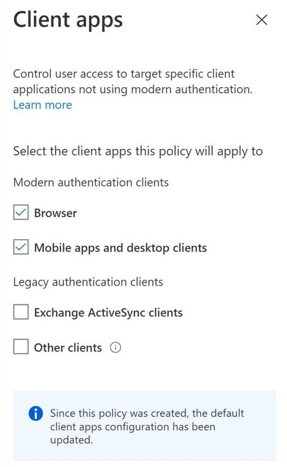

# Conditional Access policies now apply to all client applications by default
## 条件付きアクセスポリシーがデフォルトですべてのクライアントアプリケーションに適用されるようになりました。

組織の安全性を確保するためには、ユーザーに対して多要素認証 (MFA) を有効にすることが効果的です。

電話やトークンコードのような従来の方法でも、Authenticator、Windows Hello、FIDO のような最新のパスワードレスの方法でも、MFA を使用することでアカウントの不正アクセスを 99.9% 以上減少させることができます。
MFA の採用を検討するうえで、MFA をサポートできないレガシ認証エンドポイントをブロックすることも併せて検討するべきです。
POP、SMTP、IMAP、および MAPI などのレガシ認証プロトコルは、MFA を強制施行することができないため、あなたの組織を攻撃する者にとって好ましい侵入口になってしまうからです。

そこで Azure AD の条件付きアクセスを使用して、ゼロトラストの最小権限アクセスポリシーを構成します。
条件付きアクセスを適用すれば、クライアントアプリ、デバイスの健全性、セッションリスク、または IP アドレスなど、ユーザーのサインイン中に収集された明示的に検証されたシグナルに基づいてアクセスを決定することができます。
レガシー認証については、ブロックすることが最良ですが、最新の分析によると、レガシー認証プロトコルを使用したサインインに条件付きアクセス ポリシーを適用している組織は、条件付きアクセスを導入している組織の 16% 未満と僅かであることが判明しています。
そこで、お客様がより簡単に安全なゼロトラストセキュリティを構築できますよう、レガシー認証をブロックできるようにするための 2 つのアップデートを発表します。

1. 新しく作成した条件付きアクセスポリシーは、既定でレガシー認証クライアントに適用されます。
2. クライアントアプリという条件において、どのアプリを対象としているかが視覚的にわかりやすくなりました。

Conditional Access チームのプログラムマネージャーである Daniel Wood が、これらの変更が組織のセキュリティ確保にどのように役立つかを説明するブログを書いてくれました。
以下でフィードバックを共有するか、質問があれば intelligentaccesspm@microsoft.com までご連絡ください。

ーーーーーーーーーーーーーーーーーーーーーーーーーーーーーーーーーーーーーーーーーーーーーーーーーーーーーーーーーー

管理者が最新の認証クライアントとレガシ認証クライアントを対象としたポリシーを簡単に作成できるように、管理者の操作性を簡素化しました。
既定では、クライアントアプリの条件が構成されていない場合、新しく作成する条件付きアクセスポリシーでは、すべてのクライアントアプリが対象になります。
レガシー認証クライアントからのサインインは、MFA をサポートしておらず、デバイスの状態情報を Azure AD に渡しません。そのため、MFA や準拠デバイスを要求するなどを条件付き アクセス ポリシーのアクセス制御の要件に含めた場合には、レガシー認証はブロックされます。
レガシー認証を使用しなければならないアカウントがある場合は、明示的に例外をポリシーで設定し、ブロックされないようにすることができます。
レガシー認証クライアントのみを対象とする条件付きアクセスポリシーを作成する場合は、クライアントアプリの構成の  「はい」、  「いいえ」  を切り替える箇所を 「はい」 に切り替え、Exchange ActiveSync クライアントと他のクライアントを選択したまま、ブラウザーとモバイルアプリとデスクトップクライアントの選択を解除します。

また、Microsoft Graph API を使用してポリシーを管理している方のために、v1.0 の新しい Conditional Access API のリリースに伴い、新しい既定値の変更と UI の変更に合わせてクライアントアプリのスキーマを簡素化しました。以下は、API を使用して新しいポリシーを作成したときのクライアントアプリの条件の新しいデフォルト設定の例です。

## 既存の条件付きアクセスポリシーはどうなりますか？
既存の条件付きアクセスポリシーがある場合、ポリシーは変更されることなく同じクライアントアプリに適用され続けます。ただし、既存のポリシーを表示する場合は、[構成] という項目にありました  「はい」、  「いいえ」 の切り替えを削除することで、どのクライアント アプリが選択されているかを簡単に確認できるようになりました。クライアント アプリの条件が設定されていない既存のポリシーは、次のように表示されます。

## 組織でのクライアントアプリの使用状況を理解しましょう
新しいポリシーを作成する前に、組織で誰がレガシー認証を使用しているかを理解しておくとよいでしょう。サインイン時に組織で使用されているクライアントアプリとプロトコルを確認するには、「サインイン」ページに移動し、クライアントアプリの種類で結果をフィルタリングします。

## フィードバックを共有してください
今回の変更により、レガシ認証をブロックすることで、管理者が組織のセキュリティを確保しやすくなることを願っています。以下でフィードバックを共有するか、以下の連絡先までご連絡ください。
daniel.wood@microsoft.com ご質問があれば、お気軽にお問い合わせください。

