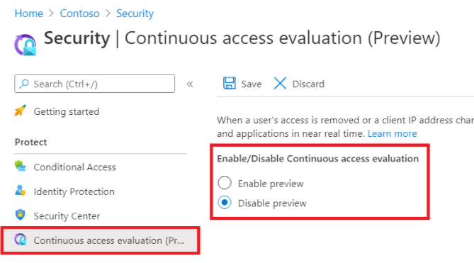

こんにちは。Azure Identity チームの金森です。

みなさんは CAE (Continuous Access Evaluation: 継続的アクセス評価) という機能をご存知でしょうか。
2021 年 5 月現在、以下のようなお知らせがあり、目にされた方も多いのではないかと思います。

* Microsoft 365 管理ポータルのメッセージ センターに MC255540 (Continuous access evaluation on by default) として情報が公開
* 送信元 : Microsoft Azure <azure-noreply@microsoft.com> から TRACKING ID: 5T93-LTG として以下の件名のメールでお知らせ
  -> Continuous access evaluation will be enabled in premium Azure AD tenants beginning on 15 June 2021

CAE とは、簡単に言いますと **あるサービスを利用しているクライアントの状態が変わった際、ほぼリアルタイムでその変化を検知してアクセス制御を行う** ことができる機能、です！
実は以下のような技術情報、Blog にてお伝えしてきた通り、2020 年から機能自体は実装が進んでいました。

[ポリシーとセキュリティのリアル タイムな適用に向けて](https://jpazureid.github.io/blog/azure-active-directory/moving-towards-real-time-policy-and-security-enforcement/)

[継続的アクセス評価を使用して回復性を強化する](https://docs.microsoft.com/ja-jp/azure/active-directory/fundamentals/resilience-with-continuous-access-evaluation)
 
[継続的アクセス評価](https://docs.microsoft.com/ja-jp/azure/active-directory/conditional-access/concept-continuous-access-evaluation)

この CAE 機能が、Azure AD Premium を有効にしているテナントについても2021 年 9 月 30 日から 2021 年 11 月の終わりにかけて順次有効になります、というお知らせが MC255540 であり 5T93-LTG の通知となります。

> ![NOTE]
> 当初 2021 年 6 月 15 日から 9 月 30 日での展開を予定しておりましたが MC273937 にて、2021 年 9 月 30 日から 2021 年 11 月の終わりの間に展開されとアナウンスされました。

## CAE とは具体的にどんな機能なの？

これまで、条件付きアクセス (CA) によるアクセス制御を行われている環境では [Azure AD (AAD) に対してクライアントがアクセス トークンの新規取得、もしくは取得済みアクセス トークンの更新] を行うタイミングで、CA ポリシーの評価が行われていました。これは、逆に言うと [クライアントの取得済みアクセス トークンの有効期限内であれば、AAD へのアクセスが行われず CA ポリシーの評価もその間は行われない] ことを意味しています。

通常、あるリソース (Exchange Online や SharePoint Online 等) へクライアントがアクセスするために、AAD が発行しているアクセス トークンの有効期限は既定では 60 分です。つまり、アクセス トークンを取得してから 60 分間は、該当クライアントはリソースに対してアクセスし続けることが可能です。
もしその 60 分間に、該当 AAD ユーザー自体が (運用によって適切に) 無効もしくは削除されたり、セキュリティ リスクに伴いパスワードの変更や発行済みトークンの失効が行われたり、アクセスが許可されていない場所にクライアントが移動したりしたとしても、これまでは [アクセス トークンの更新タイミング = 前回取得から約 60 分後] までは、リソースへのアクセスが継続して行えてしまいました。

ここで、CAE が有効な AAD テナントでは、CAE に対応しているリソースに対して AAD から状態変化の Event がほぼリアルタイム (\*) で通知されるようになります。また、CA ポリシーがリソースにも共有され、クライアントのアクセス元 IP アドレスのチェックがリソース側でも行われるようになり、アクセスが許可されていない場所にクライアントが移動した場合の検知がほぼリアルタイム (\*) に行えることになります。

> [!NOTE]
> (\*) クラウド サービス間の処理となるため、数分～十数分程度のバッファはあるものとしてお考えください
 
CAE が有効に動作した際の、実際の処理フローのシナリオ例は、前述の技術情報 [継続的アクセス評価](https://docs.microsoft.com/ja-jp/azure/active-directory/conditional-access/concept-continuous-access-evaluation) の [フローの例](https://docs.microsoft.com/ja-jp/azure/active-directory/conditional-access/concept-continuous-access-evaluation#example-flows) をぜひご覧ください。以下にそれぞれのシナリオを解説します。

### ユーザー失効イベントのフロー

こちらは管理者が意図して、ある AAD ユーザーの更新トークンを失効させた、というシナリオになります。
CAE が提供される前では、何らかの理由 (セキュリティ要因に関する理由が主なものでしょう) で更新トークンを失効させても、アクセス トークンが有効な 60 分間は、継続してユーザーはリソース アクセスが可能でした。
しかし、管理者としては、更新トークンの失効と併せて一刻も早くアクセス トークンの利用も停止させ、その AAD ユーザーに早く再認証を求めさせたい、と思うのが自然です。
再認証を求めることができれば、改めて CA によるアクセス制御が行えるため、CA のアクセス制御を突破した場合のみリソースにアクセスできるようにすることが可能です。

AAD は、ある AAD ユーザーの更新トークンが失効されると、Events として CAE に対応しているリソース (Exchange Online や SharePoint Online 等) に失効されたことを通知します。
この通知を受けたリソース側は、クライアントがまだ期限内のアクセス トークンを保持していても、クライアントからのアクセスを拒否して 401+ 認証チャレンジをクライアントに返します。
つまり [手持ちのトークンが期限内かどうかはさておき、クライアントに AAD に更新トークンの妥当性をチェックさせに行く] 応答を返します。
ここでクライアントは AAD に向かい、改めて認証が行われて、CA によるアクセス制御の評価を受けることになります。

### ユーザー状態変更のフロー (プレビュー)

こちらは、[CA ポリシーで場所 (クライアントの接続元 IP アドレス) によるアクセス制御] を行っている場合に有効なシナリオになります。
例えば、CA ポリシーで [信頼された場所 A (送信元 IP アドレス範囲) からのアクセスは許可するが、それ以外の場所からのアクセスはブロックする] というアクセス制御を行っていたとします。
信頼された場所 A からアクセスしたクライアントは、もちろんその時点ではリソース (Exchange Online や SharePoint Online 等) に対してアクセスが可能です。

ここでクライアントが [CA ポリシー上、信頼されていない場所] に移動したとします。
前述の通り、これまではクライアントが取得しているアクセス トークン (基本的に 60 分) の更新タイミングが来るまでは、信頼されていない場所からのアクセスも行えていました。
しかし、AAD で CAE が有効になっていると、CAE に対応しているリソースへも CA ポリシーが同期され内容を評価できるようになります。
つまり、リソース側もクライアントの送信元 IP (場所) の情報を元に、CA ポリシーで許可された送信元 IP アドレスかどうか、をチェックすることができます。

CA ポリシーで許可されていない送信元 IP アドレスからクライアントがアクセスしてきていると判断したリソース側は、クライアントがまだ期限内のアクセス トークンを保持していても、クライアントからのアクセスを拒否して 401+ 認証チャレンジをクライアントに返します。
ここでクライアントは AAD に向かい、改めて認証が行われて、CA によるアクセス制御の評価を受けることになります。

CAE とは、上記のように [クライアント/ユーザーの変化に応じて、”改めて AAD でのアクセス制御の評価を受けてほしい” 状態になったタイミング] で、今までよりも速やかにアクセス制御 (=AAD への認証に伴う CA ポリシーの評価) を受けることが可能になる機能です。

## CAE が有効になるとどんな影響があるの？

先に記載した通り、今までよりもほぼリアルタイムに、クライアント/ユーザーの状態変化に応じてアクセス トークンの有効期間内であってもユーザーのアクセスの失効がおこなわれた場合に反映させることができたり、 CA ポリシーの評価を受けられるようになります。つまり有効になることで困ることは基本的には無いのですが、注意が必要な点として CAE が有効になりますとアクセス トークンの有効期限が最大 28 時間になります。
前述の技術情報 [継続的アクセス評価](https://docs.microsoft.com/ja-jp/azure/active-directory/conditional-access/concept-continuous-access-evaluation) の [トークンの有効期間](https://docs.microsoft.com/ja-jp/azure/active-directory/conditional-access/concept-continuous-access-evaluation#token-lifetime) をご覧ください。

最大 28 時間というアクセス トークンの有効期間は長すぎじゃないか？！という印象を持たれるかもしれません。
しかし、前述の機能の説明のとおり、セキュリティという観点ではアクセス トークンの有効期間内であっても、クライアント/ユーザーの状態変化に応じて速やかに CA ポリシーの評価を受けることができるようになるので、むしろ向上するとお考えいただければと思います。

運用面において、 CAE のデメリットとなりうるところとしては、ユーザー アカウントのグループ メンバーシップや条件付きアクセス ポリシーに変更を加えても、その変更が反映されるまでに 1 日 (正確には最大 28 時間) 要することが挙げられます。これは、ユーザーのグループメンバーシップの更新や、ポリシーの更新については、特に CAE による発行済みアクセス トークンの再確認対象にならないためです。
技術情報 [継続的アクセス評価](https://docs.microsoft.com/ja-jp/azure/active-directory/conditional-access/concept-continuous-access-evaluation) の [トラブルシューティング](https://docs.microsoft.com/ja-jp/azure/active-directory/conditional-access/concept-continuous-access-evaluation#troubleshooting) の項目にあります **グループ メンバーシップとポリシー更新が有効になる時間** もご参照ください。

なお、条件付きアクセスのサインインの頻度の設定は CAE よりも優先されます。仮に CAE が有効になってもサインインの頻度で設定したタイミングで再認証を求めるようにすることができますのでご安心ください。

## CAE はどのリソースおよびクライアントでも実現できるの？

現時点では、リソースとしては Exchange Online と SharePoint Online、アクセス元のクライアントとしてはブラウザと Office アプリが対象になります。
なお、Exchange Onine や SharePoint Online が併用されている Teams も対象になります。

CAE に対応していないリソース、クライアント アプリの場合は、アクセス トークンの考え方はこれまで通りです。

## CAE は無効にできるの？

はい、CAE を無効にすることは、Azure ポータル上の操作にて可能です。
前述の技術情報 [継続的アクセス評価](https://docs.microsoft.com/ja-jp/azure/active-directory/conditional-access/concept-continuous-access-evaluation) [CAE を有効または無効にする (プレビュー)](https://docs.microsoft.com/ja-jp/azure/active-directory/conditional-access/concept-continuous-access-evaluation#enable-or-disable-cae-preview) をご覧ください。

既定では `一般提供の後に自動で有効にする` が選択されており、2021 年 9 月 30 日から 2021 年 11 月の終わりの間に CAE が有効化される予定になります。

もし CAE を自動で有効化させたくない場合には、2021 年 9 月 30 日までに `プレビューを無効にする` に変更ください。

上記内容が CAE の理解に向けて、皆様の参考となりますと幸いです。
どちら様も素敵な AAD ライフをお過ごしください！
