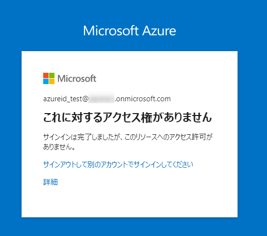
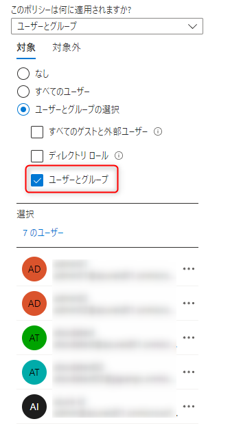
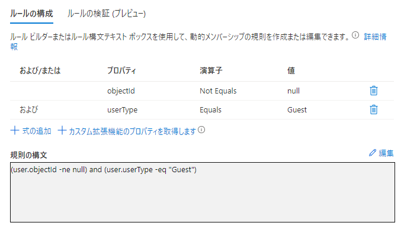
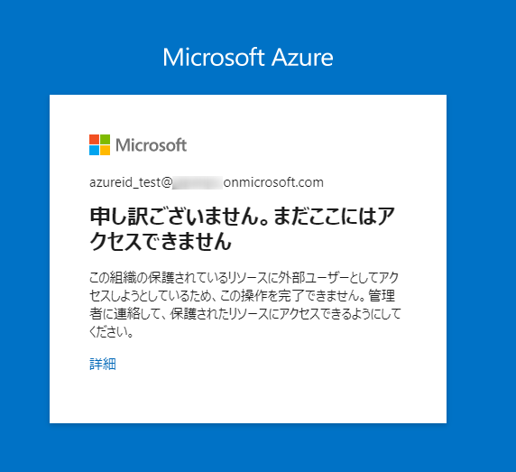

# CSP プログラムにおけるパートナーセンターから顧客テナントにアクセスする際の条件付きアクセス ポリシーについて

こんにちは、Azure & Identity サポート チームの栗井です。
本記事では、クラウド ソリューション プロバイダー プログラム パートナー (以下 CSP パートナー) のご利用者様から多くいただくご相談について、情報をおまとめいたしました。

## よくある事例 : パートナー センターから顧客のテナントにアクセスすることができません
CSP パートナー テナントに所属するアカウントは、代理管理者権限を持つ場合、パートナー センター (https://partner.microsoft.com) 経由で、リセラー関係を結ぶ顧客のテナントに対しての特権アクセス (グローバル管理者相当) が可能です。
> [!NOTE]
> 本記事内では、顧客テナントに対して代理管理者権限を持つ、CSP パートナー テナントのアカウントことを、「CSP アカウント」と記載します。

さて、この「CSP アカウントによる顧客テナントへのアクセス」について、CSP パートナーの方から、下記のようなご相談をよく頂きます。

- お問い合わせ内容 : ある時を境に、パートナーセンターを経由した顧客テナントへのアクセスが、下記画面によって、ブロックされるようになった。この事象は特定の顧客 (1 社) のみで発生しており、他の顧客テナントへのアクセスは問題なく可能です。
    

上記の画面は、**条件付きアクセス ポリシー**と呼ばれる Azure AD の機能によって、アクセスがブロックされたことを示します。

※ 条件付きアクセスは、多くのお客様にご好評いただいているセキュリティ機能です。機能の詳細については、[Azure Active Directory の条件付きアクセスとは - Microsoft Entra](https://docs.microsoft.com/ja-jp/azure/active-directory/conditional-access/overview) をご参照ください。

顧客のほとんどは、自分のテナントで条件付きアクセス ポリシーを構成する際に、CSP アカウントによるアクセスへの影響を意識しません。そのため、作成したポリシーによって、意図せずに CSP アカウントによるアクセスをブロックしてしまう場合があります。

CSP アカウントに対してのポリシー適用は、通常のユーザーを制御する場合とは仕組みが異なります。ご留意点ならびに回避策について、本記事でご紹介します。

## CSP アカウントに条件付きアクセス ポリシーが適用される場合
顧客のテナント上で、条件付きアクセス ポリシーのユーザー 割り当て設定を開き、CSP アカウントを検索しても、結果には表示されません。なぜなら、**CSP アカウントは、顧客のテナント上にユーザー オブジェクトが存在しない、特殊なアカウント**であるためです。

  


それではどのような設定をすると、CSP アカウントによるアクセスにポリシーが適用されるのか？それは、**割り当て対象に "すべてのユーザー" もしくは "すべてのゲストと外部ユーザー" のいずれかを選択した場合**です。

- "すべてのユーザー" を選択 : すべてのユーザーのサインインに対して、一律にポリシーの制御が適用されるため、CSP アカウントによるアクセスも制御対象となります。
- "すべてのゲストと外部ユーザー" を選択 : Azure AD B2B で招待されたゲスト ユーザー、ならびに CSP アカウントによるアクセスが制御対象となります。

上記の動作となるため、下記内容のお問い合わせを、CSP パートナーの方から頻繁にいただきます。

### 【よくある事例 : CSP アカウントがブロックされてしまう】
- お問い合わせ内容 (再掲) : ある時を境に、パートナーセンターを経由した顧客テナントへのアクセスが、ブロックされるようになった。この事象は特定の顧客 (1 社) のみで発生しており、他の顧客テナントへのアクセスは問題なく可能です。
- 原因 : 顧客のテナントで、下記内容のポリシーが有効化されたこと。
  ```
  
  [名前] : "社内 IP のみアクセス許可"

  [割り当て] 

    [ユーザーとグループ] : すべてのユーザー

    [クラウド アプリまたは操作] : すべてのクラウド アプリ

  [条件] 

    [場所] : すべての場所 (対象外 : 社内ネットワークのグローバル IP アドレス)

  [アクセス制御] 
  
    [許可] : アクセスのブロック
  
  ```

## CSP アカウントへの条件付きアクセス ポリシーの適用を回避する方法
前述の「よくある事例」のようなパターンにおいて、CSP パートナーの方からは「CSP アカウントを、条件付アクセス ポリシーの適用対象から除外することは可能か ?」というご要望をいただきます。本項目では解決方法をおまとめしました。

### 前提 : [ユーザーとグループ] > [対象外] の項目はご利用いただけません
条件付きアクセス ポリシーでは、割り当て対象ユーザーの設定画面において [対象外] の項目があります。通常であれば、特定のユーザーをポリシーの割り当て対象から除外したい場合は、[対象外] の項目で該当のユーザーを指定する方法が適切です。

しかし、CSP アカウントの場合は、この方法を利用することができません。前述の通り、CSP アカウントは顧客のテナント上にユーザー オブジェクトが存在しない、特別なアカウントです。 そのため、[対象外] の項目で選択することができません。


したがって、割り当て対象ユーザーの設定では、CSP アカウントを明示的にポリシーの適用対象外に指定することはできません。以下では代替案としての、3 通りの回避策をご紹介いたします。
1. CSP アカウントのアクセス元 IP アドレスを、ポリシーの割り当て対象外に指定
2. "ディレクトリ ロール : グローバル管理者" を、ポリシーの割り当て対象外に指定
3. "すべてのユーザー" "すべてのゲストと外部ユーザー" のオプションの利用を止める

> [!NOTE]
> いずれの回避策も、顧客テナント上で設定されている条件付きアクセス ポリシーの設定を変更します。そのため、操作は顧客テナントの Azure ポータル上で実施ください。

### 回避策 1 : CSP アカウントのアクセス元 IP アドレスを、ポリシーの割り当て対象外に指定
CSP アカウントによるアクセス元が、特定の IP アドレス (群) に限定される場合に、ご利用いただける方法です。アクセス元の IP アドレスを、ポリシーの適用対象外に指定ください。

- **【手順 1 : CSP アカウントによるアクセス元 IP を、ネームドロケーションに登録】**
  1. Azure ポータル > Azure Active Directory > セキュリティ > 条件付きアクセス > [ネームドロケーション] に進みます。
  2. [+ 新しい場所] を選択して、下記のネームド ロケーションを登録します。

      [名前] : 任意 (例 : CSP 接続ポイント)

      [次を使用して場所を定義します] : IP 範囲

      [IP 範囲] : <CSP 様の事業所のグローバル IP アドレス範囲>

  3. [作成] を選択し、ネームド ロケーションを保存します。下記の【手順 2】に進みます。

- **【手順 2 : 登録したネームド ロケーションを、ポリシーの対象外に指定】**

  4. 該当の条件付アクセス ポリシーの設定画面を開きます。
  5. . [条件] - [場所] に進み、[構成] を "はい" にします。
  6. "対象" の構成で "すべての場所" を選択します。
  7. "対象外" の構成で "選択された場所" を選択し、手順 2 で登録したネームド ロケーションを指定します。
  8. ポリシーの変更を保存します。

上記の通り、ポリシーを変更するくことで、CSP アカウントが [IP 範囲] で指定したネットワーク ロケーションからアクセスする際には、ポリシーによる制御は行われなくなります。

### 回避策 2 : "ディレクトリ ロール : グローバル管理者" を、ポリシーの割り当て対象外に指定
条件付きアクセス ポリシーでは、特定の Azure AD ロールを持つユーザーを、ポリシーの割り当て対象外に指定可能です。

グローバル管理者をポリシーの割り当て対象外に指定いただくことで、顧客テナント上でグローバル管理者ロールを持つアカウント、ならびに CSP アカウントに対しては、ポリシーが適用されない動作になります。


### 回避策 3 : "すべてのユーザー" "すべてのゲストと外部ユーザー" のオプションの利用を止める
前述の通り、"すべてのユーザー" "すべてのゲストと外部ユーザー" を割り当て対象とするポリシーは、CSP アカウントによるアクセスに対しても一律に適用されます。

これらの割り当てオプションを利用せずに、**ポリシーを適用するユーザーを個別に指定**することで、CSP アカウントに対してのポリシー適用を回避が可能です。


「ポリシーを適用するユーザーを個別に指定」とは、[対象]  > [ユーザーとグループ]  の項目において、ポリシー適用対象ユーザー (もしくはユーザー グループ) を、1 個ずつ指定する方法です。

 

しかし、テナント上に 1000 人単位のユーザーが登録されているような大規模な組織では、ユーザー アカウントを 1 個ずつ選択するという操作は、現実的ではないかもしれません。

このような場合は、次の項目でご紹介する "動的グループ" の機能によるユーザーグループの作成をご利用が便利です。

### 動的グループを利用したユーザーグループの作成方法
"動的グループ" とは、ユーザーのプロパティ (属性値) に基づくルールを記述することで、ユーザー グループに自動でユーザーを追加する機能です。

動的グループの機能の詳細については、[Azure Active Directory で動的グループを作成または更新する | Microsoft Docs](https://docs.microsoft.com/ja-jp/azure/active-directory/enterprise-users/groups-create-rule) をご覧ください。 

以下では、条件付きアクセス ポリシーにおける "すべてのユーザー" ならびに "すべてのゲストと外部ユーザー" の代わりとしてご利用可能な、動的グループ メンバーシップルールをご紹介いたします。いずれのグループも、CSP アカウントは含まれません。

- 「すべてのユーザー (除外 : CSP アカウント)」 に該当する、動的メンバーシップ ルール
    
  ```
  (user.objectId -ne null)
  ```

- 「すべてのゲストと外部ユーザー (除外 : CSP アカウント)」 に該当する、動的メンバーシップ ルール
   
  ```
  (user.objectId -ne null) and (user.userType -eq "Guest")
  ```

上記 2 つのルールはいずれも「オブジェクト ID が null ではない」という条件を含みます。従って、ユーザー オブジェクト自体が存在しない CSP アカウントは、グループのメンバーシップには含まれない動作になります。

上記の手順で作成したユーザー グループは、条件付きアクセス ポリシーの [ユーザーとグループの選択] において選択することができます。

## Q&A

- **<span style="color:blue">Q </span>.** [対象外] に "すべてのゲストと外部ユーザー" を指定することで、CSP アカウントへのポリシー適用を回避できますか？
  
  **<span style="color:red">A </span>.**  はい、回避可能です。

- **<span style="color:blue">Q </span>.** "すべてのユーザー" に対して多要素認証 (MFA) を要求するポリシーを作成した場合、CSP アカウントは MFA 要求を満たすことができますか ? それともアクセスが失敗しますか ?
  
  **<span style="color:red">A </span>.**  CSP アカウントは MFA 要求を満たすことができます。そのため、MFA を要求するポリシーを CSP アカウントに対して適用しても、CSP アカウントのアクセスがブロックされることはございません。

- **<span style="color:blue">Q </span>.** "すべてのユーザー" に対して、アクセス許可条件として "準拠済みデバイス" "Hybrid Azure AD Join 済みデバイス" を要求するポリシーを作成した場合、CSP アカウントはこの条件を満たすことができますか？

    
  
  **<span style="color:red">A </span>.**  いいえ。"準拠済みデバイス" "Hybrid Azure AD Join 済みデバイス" の条件は、テナントに直接所属するユーザーのみが満たすことができる条件です。ゲストユーザーならびに外部ユーザー (CSP アカウント含む) に対してこの条件が適用された場合は、下記画面によって、アクセスがブロックされます。

    
  

- **<span style="color:blue">Q </span>.** CSP アカウントによる顧客テナントへのアクセスは、顧客テナントのサインイン ログに記録されますか ?
  
  **<span style="color:red">A </span>.**  はい、記録されます。
  
  CSP アカウントによるアクセスは、通常のテナント ユーザーと同様に、Azure ポータル > Azure Active Directory > サインイン ログ から確認可能です。
  
  CSP アカウントによるアクセスをフィルターする場合、[+ フィルターの追加] から "クロス テナントの種類 : サービス プロバイダー" を指定ください。
  
  各行を選択すると、サインイン ログの詳細が表示されます。[条件付きアクセス] タブから、適用されたポリシーと制御内容を確認できるので、トラブルシューティングの際にご活用ください。
  
    - ユーザー名は "[パートナーテナント名] technician" という文字列が表示されます。
    - CSP アカウントによるアクセス元の IP アドレスは、下 3 桁がマスクされます。
  
  
上記内容が少しでも皆様の参考となりますと幸いです。ご不明な点がございましたら、弊社サポートまでお気軽にお問い合わせください。
