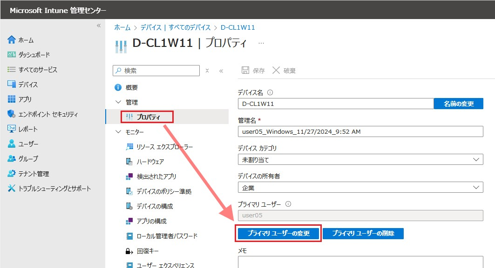

# デバイス オブジェクトの所有者を変更する

こんにちは、Azure & Identity サポート チームの長谷川です。

本記事では Microsoft Entra ID 上に登録されたデバイス オブジェクトの所有者を変更する方法を紹介します。この方法では、Microsoft Entra 参加済みデバイスおよび Microsoft Entra ハイブリッド参加済みデバイスのデバイス オブジェクトの所有者を変更することができます。対象デバイスが Microsoft Intune に登録されているか否かで手順が変わりますので、それぞれ紹介します。

なお、Microsoft Entra registered デバイスの所有者は変更できませんのでご注意ください。

## デバイスが Microsoft Intune に登録されている場合の手順

Microsoft Intune に登録している場合、以下の手順で Microsoft Intune デバイスのプライマリ ユーザーを変更することで Microsoft Entra ID 上に登録されたデバイス オブジェクトの所有者を変更することができます。
 
1. Microsoft Intune 管理センター (intune.microsoft.com) に Intune 管理者でサインインします。
2. [デバイス] - [すべてのデバイス] へ移動します。
3. 対象のデバイスを選択します。
4. [管理] から [プロパティ] を押下します。

    

5. [プライマリ ユーザーの変更] を押下して、新たにそのデバイスの所有者にする Entra ユーザーに変更します。
6. [保存] を押下します。

## デバイスが Microsoft Intune に登録されていない場合の手順

デバイスを Microsoft Intune に登録していない場合、Microsoft Entra ID 上に登録されたデバイス オブジェクトの所有者を GUI から簡単に変更する方法はありません。この場合、Microsoft Graph PowerShell を利用した次の手順で変更することができます。
 
1. PowerShell を管理者権限で起動します。
2. 以下のコマンドを実行し、Microsoft Graph PowerShell モジュールを作業端末にインストールします。

    ```powershell
    Install-Module Microsoft.Graph -Force
    ```
 
3. 以下のコマンドを実行し、表示されるユーザー認証画面で、テナントのグローバル管理者のユーザーで認証を行います ([要求されているアクセス許可] という画面が表示された場合は、[承諾] を押下します)。もしグローバル管理者を利用しない場合は、実行するユーザーに二つのロール (クラウド アプリケーション管理者と Intune 管理者) が付与されていれば実行可能です。

    ```powershell
    Connect-MgGraph -Scopes "Directory.AccessAsUser.All"
    ```

4. 以下のコマンドを順番に実行して、対象のデバイス オブジェクトから所有者情報を変更します。

    ```powershell
    $userId="新たに所有者にしたいユーザーの ObjectId を指定"
    $deviceObjectId="対象のデバイスの ObjectId を指定"
    $params = @{
        "@odata.id" = "https://graph.microsoft.com/v1.0/directoryObjects/" + $userId
    }
    Get-MgDeviceRegisteredOwner -DeviceId $deviceObjectId | %{Remove-MgDeviceRegisteredOwnerByRef -DeviceId $deviceObjectId -DirectoryObjectId $_.Id}
    New-MgDeviceRegisteredOwnerByRef -DeviceId $deviceObjectId -BodyParameter $params
    ```

    

5. 作業が終わりましたら以下のコマンドで PowerShell セッションを切断します。

    ```powershell
    Disconnect-MgGraph
    ```

## 免責事項

本サンプル コードは、あくまでも説明のためのサンプルとして提供されるものであり、製品の実運用環境で使用されることを前提に提供されるものではありません。本サンプル コードおよびそれに関連するあらゆる情報は、「現状のまま」で提供されるものであり、商品性や特定の目的への適合性に関する黙示の保証も含め、明示・黙示を問わずいかなる保証も付されるものではありません。マイクロソフトは、お客様に対し、本サンプル コードを使用および改変するための非排他的かつ無償の権利ならびに本サンプル コードをオブジェクト コードの形式で複製および頒布するための非排他的かつ無償の権利を許諾します。

但し、お客様は以下の 3 点に同意するものとします。

1. 本サンプル コードが組み込まれたお客様のソフトウェア製品のマーケティングのためにマイクロソフトの会社名、ロゴまたは商標を用いないこと
2. 本サンプル コードが組み込まれたお客様のソフトウェア製品に有効な著作権表示をすること
3. 本サンプル コードの使用または頒布から生じるあらゆる損害（弁護士費用を含む）に関する請求または訴訟について、マイクロソフトおよびマイクロソフトの取引業者に対し補償し、損害を与えないこと

## おわりに

本記事では Microsoft Entra ID 上に登録されたデバイス オブジェクトの所有者を変更する方法を紹介しました。製品動作に関する正式な見解や回答については、お客様環境などを十分に把握したうえでサポート部門より提供しますので、ぜひ弊社サポート サービスをご利用ください。
