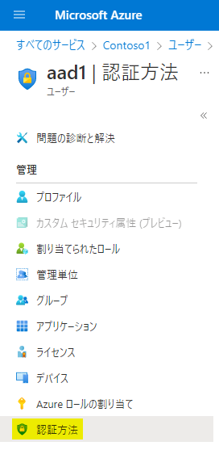
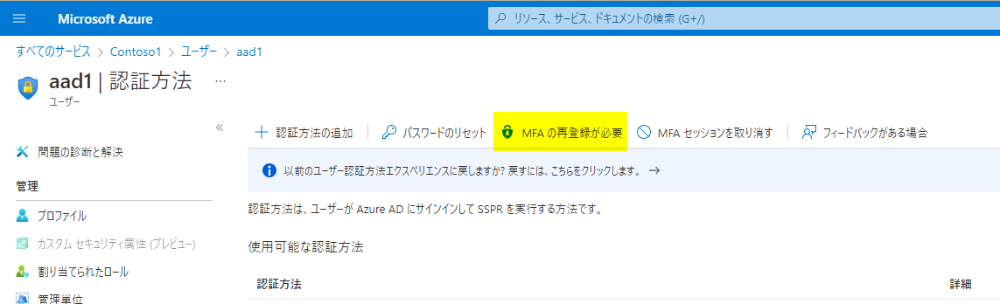
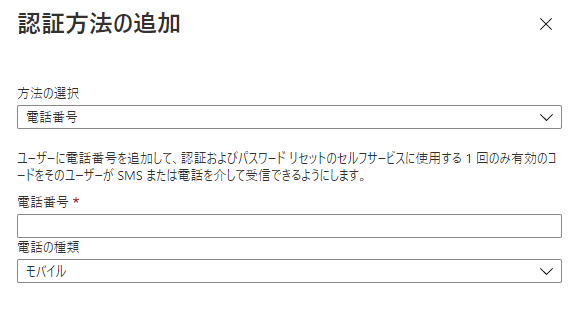

# MFA 認証方法を、変更 / 再登録 / 追加 したい！
こんにちは。Azure Identity サポート チームの栗井です。

弊社サポートチームでは、 Azure Active Directory に関して、以下のようなご要望に関するお問い合わせをよくいただきます。
- スマートフォンを買い替えたので、MFA 認証方法を変更したい。
- スマートフォンを紛失したので、MFA 認証方法を再登録したい。
- 社用のスマートフォンに加えて、私用スマートフォンを、MFA 認証方法として追加したい。

このブログでは、こういったご要望に答えるために、MFA 認証方法の変更 / 再登録 / 追加 するための方法と手順を、ご紹介いたします。

**読者のターゲット :** テナントの管理者。組織内のユーザーが、MFA 認証方法の変更 / 再登録 / 追加 が必要となった際に、ご参考になれば幸いです。

操作の手順は、以下の場合ごとに異なるため、それぞれ別項目でご説明します。
- 現在登録されているモバイル デバイスで、MFA 認証ができる場合 (モバイル デバイスの買い替え、追加など)
- 現在登録されているモバイル デバイスで、MFA 認証ができない場合 (モバイル デバイスの紛失、故障など)

## 現在登録されているモバイル デバイスで、MFA 認証ができる場合
この場合、MFA 認証方法の変更 / 追加は、ユーザー自身の操作のみで行うことができます。ユーザーには以下の方法で、MFA 認証方法の変更 / 追加を行ってもらってください。

### MFA 認証方法の変更 / 追加手順
ユーザーに、任意のデバイス (※) で https://aka.ms/mfasetup にアクセスしてもらいます。

(※作業の途中で、新しいモバイル デバイスのカメラで読みこむための、QR コードが表示されます。PC やタブレットなど、新しいモバイル デバイス以外の端末にしましょう。)

サインインと MFA が要求されます。それぞれ認証を行いましょう。

この先は、2 パターンに分かれます。
#### パターン 1 : 以下の画面が出てきた場合 (URL : https://mysignins.microsoft.com/security-info)

[+ 方法の追加] を選択してください。画面の表示に従って、新しいモバイル デバイスを、MFA 認証方法として登録しましょう。

#### パターン 2 : 以下の画面が出てきた場合 (URL : https://account.activedirectory.windowsazure.com/proofup.aspx)

SMS もしくは 音声通話認証の場合 : [認証用電話] の番号を変更し、保存してください。
Microsoft Authenticator をご利用の場合 :  [Authenticator アプリの設定] を選択し、画面の指示に従ってください。

いずれの画面も、登録済みの MFA 認証方法を一覧で確認できます。
もし、「既存のデバイスでは、もう MFA 認証を行わない！」と決まっている場合、一覧から削除してしまいましょう。

※ 複数端末を MFA 認証方法として登録する場合 : 認証方法としては、SMS / 電話は 1 つの電話番号のみ、Microsoft Authenticator は複数の端末が登録可能です。複数モバイル デバイスによる MFA 認証を行いたい場合は、Microsoft Authenticator をご利用ください。

## 現在登録されているモバイル デバイスで、MFA 認証ができない場合
この場合、以下のいずれかの方法によって、管理者がユーザーの MFA 認証方法をリセット / 変更ください。

【 1 】管理者による MFA 認証方法のリセット

【 2 】管理者が直接 MFA 認証用電話番号を指定

### 【 1 】管理者によるMFA 認証方法のリセット
管理者によって現在の MFA 認証方法をリセットした上で、ユーザーが再登録を行う方法です。

1. 特権認証管理者、もしくはグローバル管理者のアカウントで Azure Portal (https://portal.azure.com) へアクセスします。

2. [すべてのサービス] > [Azure Active Directory] > [ユーザー] に移動します。
   
3. ユーザー一覧から、該当ユーザーの行を選択して開きます。 

4. 画面左側のメニューから [認証方法] タブを選択します。

      

5. [MFA の再登録が必要] を押下します。

      
  

管理者によって、ユーザーの MFA 認証方法がリセットされたら、ユーザーは MFA 認証方法を再登録する必要があります。
前述の「現在登録されているモバイル デバイスで、MFA 認証ができる場合」の手順に従って、新しいデバイスを MFA 認証方法として登録して下さい。

### 【 2 】管理者が直接 MFA 認証用電話番号を指定
管理者は Azure Portal 上で、ユーザーの MFA 認証のための電話番号を、直接指定することができます。

[Azure Portal](https://portal.azure.com/) > [Azure Active Directory] > [ユーザー] > (一覧からユーザーを選択) > [認証方法]

[ + 認証方法の追加] から、[電話番号] を選択し、ユーザーのモバイル デバイスの電話番号を追加して下さい。

※ 電話番号の入力は "+81 8099999999" のように、「国番号の指定が必須」かつ「ハイフン不要」である点にご留意ください。

※ [方法の選択] で選択可能な [メール] は、MFA ではなく セルフサービス パスワード リセットの連絡先追加のための項目です。ここでは選択しないでください。

次回からは、指定した電話番号に MFA の要求が届くようになります。

## 例外 : テナント管理者の MFA 認証方法をリセットする必要がある場合
MFA 認証方法の再登録には、テナントの管理者による、MFA 認証方法のリセットが必要です。

ただし、テナントの管理者自身のモバイル デバイスの紛失 / 故障などにより、MFA 認証方法の再登録したい場合、上記の手順を進めることができない場合がございます。

「Azure Portal、Azure MFA Portal のいずれにも、MFA が必要な設定をしているので、アクセスすることができない！」といった場合です。

このようなときの、対処法をご案内いたします。
### I. テナントに管理者が複数存在する場合
MFA 認証方法を再登録する必要がある管理者以外に、別の管理者が存在する場合は、その管理者によって、前述の [管理者による MFA 認証方法のリセット方法] を行ってください。

その後、MFA 認証方法を再登録する必要がある管理者によって、前述の [MFA 認証方法の変更 / 追加手順] の手順を行ってください。

### II. Azure のサブスクリプションを クラウド ソリューション プロバイダー パートナー (CSP パートナー) からご購入頂いている場合
CSP パートナーのアカウントは、お客様のテナントにアクセスする権限を持っています。

CSP パートナーに連絡を取り、お客様のテナントにアクセスができる CSP アカウントによって、前述の [管理者による MFA 認証方法のリセット方法] を行ってもらいましょう。

その後、MFA 認証方法を再登録する必要がある管理者によって、前述の [MFA 認証方法の変更 / 追加手順] を行ってください。

### III. I と II のいずれにも当てはまらない場合
これは、これまでご紹介した方法がいずれも実行不可能場合のみに行っていただく、最終手段です。

テナントのすべての全体管理者がサインイン不可能になった場合には、弊社データセンター側で、管理者の MFA を、一時的に解除させていただきます。

その間に管理者自身の MFA の再セットアップ (前述の [MFA 認証方法の変更 / 追加手順] の手順) を、行っていただく必要があります。

解除には、数営業日いただくことになりますので予めご留意ください。

この場合、弊社サポート チームまでお問い合わせください。必要な手順をご案内いたします。

お問い合わせ時には下記の情報を予めお知らせください。
- テナント名 (~.onmicrosoft.com) またはテナント ID
- 全体管理者の UPN
- 状況 (何かしら操作をした日時、操作内容など)

Azure Portal にログインできない場合は、https://aka.ms/AzurePortalHelp からリクエストをご起票ください。

## 参考文献やリンクなど
本記事に関連する公開情報、サポート ブログ、サービスの URL をご紹介いたします。ご参考になれば幸いです。

### 参考文献
- 公開情報「Azure Multi-factor Authentication のユーザー設定の管理」: https://docs.microsoft.com/ja-jp/azure/active-directory/authentication/howto-mfa-userdevicesettings

- 公開情報　「追加の確認方法を変更する」: https://support.microsoft.com/ja-jp/office/%e8%bf%bd%e5%8a%a0%e3%81%ae%e7%a2%ba%e8%aa%8d%e6%96%b9%e6%b3%95%e3%82%92%e5%a4%89%e6%9b%b4%e3%81%99%e3%82%8b-956ec8d0-7081-4518-a701-f8414cc20831?ui=ja-JP&rs=ja-JP&ad=JP

- サポート ブログ 「多要素認証 (MFA) のリセット手順」: https://jpazureid.github.io/blog/azure-active-directory/mfa-reset/

### サービスの URL
- Azure Portal : https://portal.azure.com/
- Azure MFA Portal (管理者専用) : https://account.activedirectory.windowsazure.com/usermanagement/multifactorverification.aspx
- MFA 認証情報確認 / 登録ページ : https://aka.ms/mfasetup
