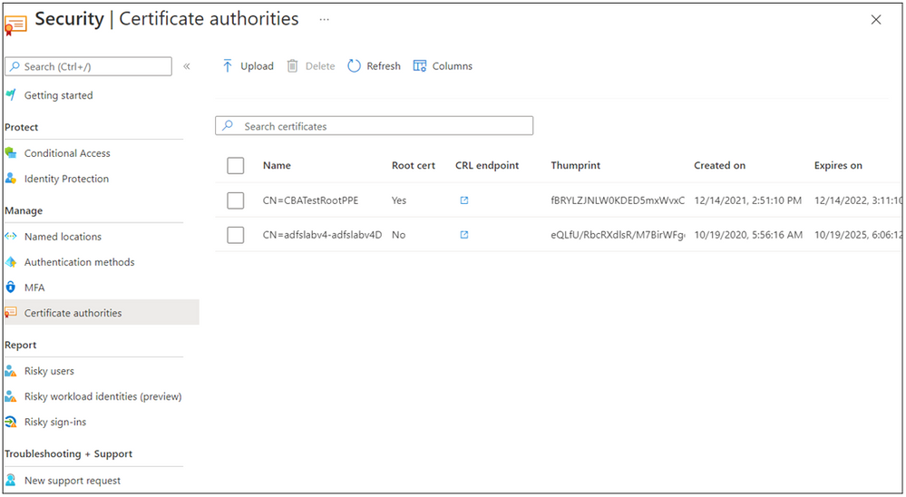

こんにちは、Azure Identity サポート チームの夏木です。
本記事は、2022 年 7 月 26 日に米国の Azure Active Directory Identity Blog で公開された [Check out new Azure AD Certificate-Based Authentication (CBA) enhancements](https://techcommunity.microsoft.com/t5/microsoft-entra-azure-ad-blog/check-out-new-azure-ad-certificate-based-authentication-cba/ba-p/2365682) を意訳したものになります。ご不明点等ございましたらサポート チームまでお問い合わせください。

-----

# Azure AD Certificate-Based Authentication (CBA)の新しい機能拡張のご紹介

2022年2月、私たちはMicrosoftの「[Executive Order 14028,Improving the Nation’s Cybersecurity](https://www.whitehouse.gov/briefing-room/presidential-actions/2021/05/12/executive-order-on-improving-the-nations-cybersecurity/)」へのコミットメントの一環として、[Azure AD Certificate-Based Authentication](https://techcommunity.microsoft.com/t5/microsoft-entra-azure-ad-blog/azure-ad-certificate-based-authentication-now-in-public-preview/ba-p/2464390) のパブリックプレビューを発表しました。

パブリックプレビューのプロセスにて、プライベートプレビューに参加しなかったお客様からも素晴らしいフィードバックを得ることができました。今回も、素晴らしいフィードバックをいただき、既存のパブリック プレビューにいくつかの重要な機能を追加しました。お客様からのフィードバックによって改善された Azure AD Certificate Based Authentication  (CBA) の項目は以下のとおりです:

- Azure AD アプリケーションおよびリソースへのシングルサインオン  (SSO) と Windows ログオンに対する Azure AD CBA のサポート 
- マネージド デバイスと非マネージド デバイスで Microsoft 製アプリケーションにアクセスするためのモバイル プラットフォーム (iOS、Android) に対する Azure AD CBA のサポート 
- Azure AD で信頼された証明機関の構成を管理するための管理機能の向上 
- Active Directory Federated Server からの移行を容易にするための CBA の段階的展開のサポート

以下では、Senir Product Manager である Vimala Renganathan より詳細をお知らせいたします。

Alex Weinert, Director of Identity Security, Microsoft   
(Twitter: [@Alex_t_weinert](https://techcommunity.microsoft.com/t5/user/viewprofilepage/user-id/15847#profile))  

----

みなさんこんにちは。
Identity PM チームの Vimala と申します。今回、Azure AD (CBA) のパブリックプレビューに対して追加された新機能をお話しできることをうれしく思います。

## Windows ログオンのサポート 

Windows 11 (22H2) において、Azure AD ユーザーが、スマートカード上の X.509 証明書を使用して、Windows ログオン時に Azure AD に対して直接認証することができるようになりました。Azure AD参加デバイスおよび Hybrid Azure AD 参加デバイスでは、ユーザーが証明書を使用してWindowsにログインすると、Azure AD と統合されたすべてのアプリケーションに対し SSO の恩恵を得ることができるようになります。

今後、Windows 10 や Windows Server でもこの機能に対応する予定です。

## モバイル デバイス (Android、iOS) のサポート 

iOS および Android デバイスにおいて、ユーザーのデバイスにプロビジョニングされた証明書を使用して、Azure AD CBA をもちいて Azure AD に対する認証を行うことができるようになりました。ネイティブ ブラウザと Microsoft アプリケーション (下記一覧) の両方がサポートされています。企業は、Microsoft Intune などのモバイル デバイス管理 (MDM) ソリューションを使用して、管理するデバイスにクライアント証明書または派生する個人識別情報の検証 (PIV) をプロビジョニングすることができます。 

以下は、サポートされるMicrosoftアプリケーションのリストです。 

|||
| ---- | ---- |
|Azure Information Protection app|  |
| Intune Company Portal |  |
| Microsoft Teams |  |
| Office (mobile) |  |
| OneNote |  |
| OneDrive |  |
| Outlook |  |
| Power BI |  |
| Skype for Business |  |
| Word / Excel / PowerPoint |  |
| Yammer |  |

## 管理者体験の向上 

お客様が CBA の設定を簡単に設定し、管理できるようにすることが何よりも重要です。これまでは、PowerShell コマンドを使用して認証局を Azure AD にアップロードする必要がありましたが、今後は Azure ポータルを使用してシームレスに認証局を設定できるようになりました。 

Azureポータルを使って、以下のことができるようになりました：

- 認証局 (ルート CA とすべての中間 CA) を Azure AD にアップロードする 
- Azure AD にアップロードされたすべての信頼された認証機関を表示する
- CA が有効でない場合は削除する。
- 証明書の有効期限に基づき、証明書の有効性を簡単に確認することができる

## 今後の展開 

[Azure Active Directory Community](https://feedback.azure.com/d365community/forum/22920db1-ad25-ec11-b6e6-000d3a4f0789) に引き続きご意見をお寄せください。第二認証要素としての CBA や、証明書失効リスト (CRL) の制限の撤廃、ルーティング不可能な UPN のサポート、モバイル デバイスでの外部スマートカードサポートなど、さらなる機能拡張を実現を目指しています。 
 
マイクロソフトの [Executive Order 14028 here](https://www.microsoft.com/en-us/federal/CyberEO.aspx) に対するコミットメントについては、こちらをご覧ください。
