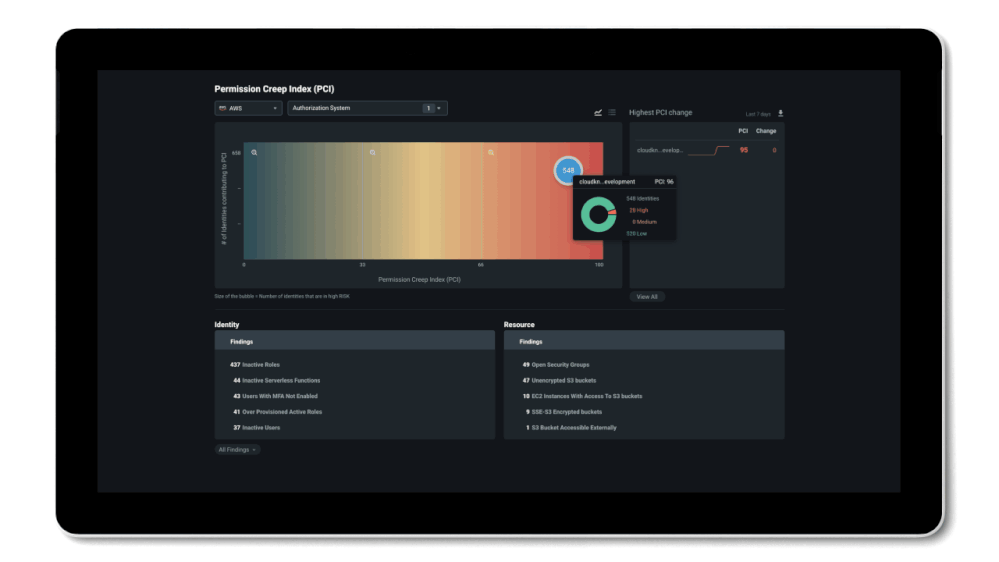
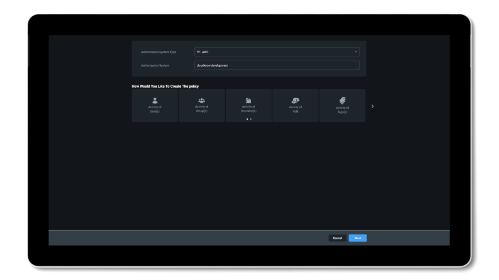
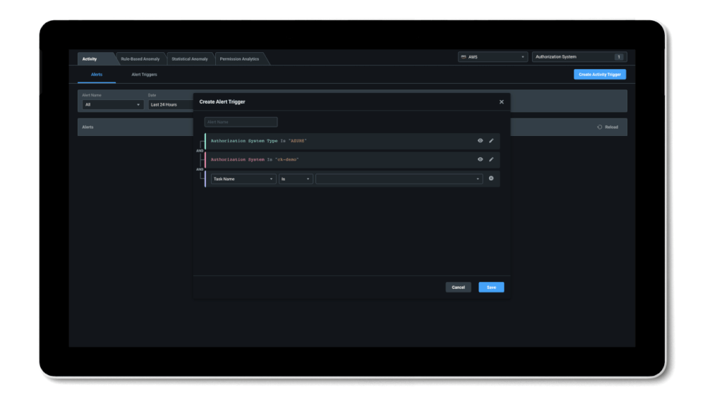

こんにちは、 Azure Identity サポート チームの高田です。

本記事は、 2022 年 2 月 23 日に米国の Azure Active Directory Identity Blog で公開された [CloudKnox Permissions Management is now in Public Preview](https://techcommunity.microsoft.com/t5/azure-active-directory-identity/cloudknox-permissions-management-is-now-in-public-preview/ba-p/2464391) を意訳したものになります。ご不明点などございましたら、サポート チームまでお問い合わせください。

---

# CloudKnox Permissions Management がパブリック プレビューに

昨年 7 月、Microsoft は [Cloud Infrastructure Entitlement Management (CIEM)](https://docs.microsoft.com/azure/active-directory/cloud-infrastructure-entitlement-management) 分野のリーダーである CloudKnox Security の [買収を発表](https://blogs.microsoft.com/blog/2021/07/21/microsoft-acquires-cloudknox-security-to-offer-unified-privileged-access-and-cloud-entitlement-management/) しました。当社が思い描くマルチクラウドのセキュリティの重要な取り組みとして、CloudKnox を当社のテクノロジーに統合するべく取り組んでまいりました。本日、[CloudKnox Permissions Management](https://microsoft.com/security/business/identity-access-management/permissions-management) のパブリック プレビューを発表することができ、大変うれしく思います。

皆様もご存じのとおり、クラウドでは ID とアクセス許可の数が爆発的に増加しており、新たなセキュリティ上の課題が生まれています。社内 IT チームは、ID とそのアクセス許可を可視化することが大変難しい状況にあり、さらに増え続けるアクセス許可と利用実態の乖離に格闘している状況です。これらの課題には、完全な可視化とリスクの是正を実現する包括的な統合ソリューションが必要です。

以下では、重要なクラウド リソースを保護するために、CloudKnox Permissions Management がアクセス許可のリスクを継続的に監視して是正する方法の概要をまとめました。CloudKnox Permissions Management の詳細については、[当社のドキュメントをご覧](https://docs.microsoft.com/en-us/azure/active-directory/cloud-infrastructure-entitlement-management/) ください。

## アクセス許可に関わるリスクを包括的に把握する

CloudKnox Permissions Management は、クラウド基盤全体のすべての ID とそれらに付与されたアクセス許可および実際に使用されたアクセス許可の内容を詳細に可視化することができ、これによりどの ID が何のリソースに対してどのような操作を実行したかを確認することが可能となります。これには、ユーザー ID に限らず、仮想マシン、アクセス キー、コンテナ、スクリプトなどのワークロード ID も含まれており、Amazon Web Services (AWS)、Google Cloud Platform (GCP)、Microsoft Azure の 3 つの主要クラウド プロバイダーで確認可能です。ダッシュボードでは、組織のアクセス許可状況の概要を確認し、基盤全体で最もリスクの高い ID とリソースがどこにあるのかを特定できます。これには、与えられたアクセス許可と使用されたアクセス許可との間の乖離を計算する 0 から 100 までの単一の指数である **Permission Creep Index** が活用いただけます。未使用のアクションや手つかずのリソースが多いほど、その乖離と指数は高くなります。

これにより、Permission Creep Index が高い特定の ID を簡単に特定し、付与されたアクセス許可と実際に使用されたアクセス許可、およびアクセス可能なリソースを確認することができます。最も高いリスクがどこにあるかを特定し、そのリスクを解消するためには、このレベルの可視化機能が必要です。

## 最小特権アクセスを自動的に実現する

基盤全体の最も重要なアクセス許可のリスクが特定できたら、CloudKnox Permissions Management により過剰なアクセス許可を適正化し、**自動的に最小特権のポリシーを強制** することが可能です。このソリューションは、各 ID の過去のアクセス許可の利用状況データを継続的に分析しており、その ID のアクセス許可を日々の運用に使用されている権限にのみに適正化することができます。また、未使用でリスクの高いアクセス許可はすべて削除することもできます。

ID が特定のリソースに対して特定のアクションを実行する必要がある場合、その ID はセルフサービス ワークフローを使用して、期間限定でこれらの **アクセス許可を適宜要求** することができます。ビルトインのワークフロー エンジンに加えて、お気に入りの ITSM ツールを使用することも可能です。ID の種類 (人に紐づくものならびに人に紐づかないもの)、ID のソース (ローカル、エンタープライズ ディレクトリ、フェデレーション)、クラウドに関係なく、同じように操作が可能です。

## 異常検知を効率化してインシデント対応を加速させる

アクセス許可の悪用や発生しうるデータ漏洩を防ぐため、**機械学習を活用した異常値と特異動作の検出アラート** により、疑わしい動きがあった場合に管理者に通知が可能です。また、特定のアクションやリソース、または任意の組み合わせに対してカスタム アラート トリガーを設定し、監視を自動化してインシデント レスポンスを実行することも可能です。

基盤を監視して迅速な改善をサポートするもう一つの方法として、カスタム フォレンジック レポートを生成するもできます。例えば、Permissions Analytics Report では、クラウド環境全体の主要なアクセス許可リスクの概要を確認可能です。これらのレポートは、特定のクラウド アカウントを対象にカスタマイズすることができ、事前に設定した間隔で電子メールで配信することもできます。

CloudKnox Permissions Management を是非お試しください。ご質問やパブリック プレビューにご興味のある方は、[こちらのフォームにご記入](https://aka.ms/CloudKnoxPublicPreview) ください。また、2 月 24 日に開催されるイベント [What's Next in Security](https://mssecurityinnovationevent.eventcore.com/?ocid=AID3043366_QSG_563806https://mssecurityinnovationevent.eventcore.com/?ocid=AID3043366_QSG_563806) にて、Balaji Parimi と Joseph Dadzie がお客様を交えて講演を行いますので、こちらもお見逃しなく。

Alex Simons (Twitter: [@Alex_A_Simons](https://twitter.com/Alex_A_Simons))  
Corporate Vice President  
Microsoft Identity and Network Access Division
