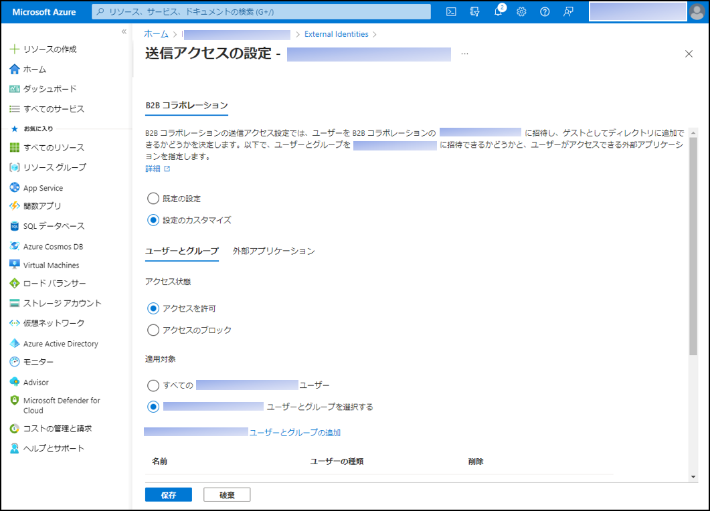
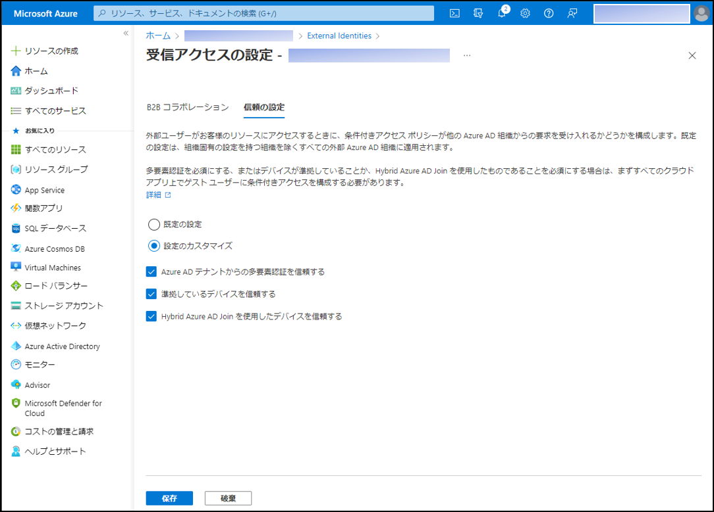
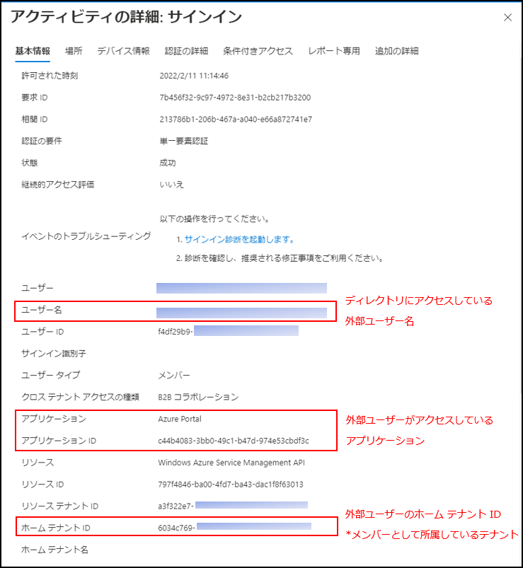

---
title: クロス テナントのアクセス設定により、よりセキュアなコラボレーションを実現
date: 2022-02-14 09:00
tags:
  - Azure AD
  - US Identity Blog
---

# クロス テナントのアクセス設定により、よりセキュアなコラボレーションを実現

こんにちは、Azure Identity サポート チームの 村上 です。

本記事は、2022 年 2 月 7 日に米国の Azure Active Directory Identity Blog で公開された [Collaborate more securely with new cross-tenant access settings](https://techcommunity.microsoft.com/t5/azure-active-directory-identity/collaborate-more-securely-with-new-cross-tenant-access-settings/ba-p/2147077) を意訳したものになります。ご不明点等ございましたらサポート チームまでお問い合わせください。

---

皆さん、こんにちは。

先日の [External Identities のアップデート](https://jpazureid.github.io/blog/azure-active-directory/external-identities-b2c-supports-authenticator-apps-and-new-data/) に続き、外部コラボレーションのための、クロス テナントのアクセス設定がパブリック プレビューで利用可能となったことをお知らせいたします。

クロス テナントのアクセス設定により、組織内のユーザーが外部の Azure AD 組織のメンバーとどのように共同作業を行うかを制御することが可能となります。組織、ユーザー、グループおよびアプリケーションごとに、きめ細かなインバウンドおよびアウトバウンドのアクセス制御の設定が可能になりました。また、これらの設定により、多要素認証 (MFA)、デバイス準拠、ハイブリッド Azure AD 参加デバイスなど、外部の Azure AD 組織からのセキュリティ クレームを信頼できるようになります。

外部との連携に関しては、お客様から以下のようなご意見をいただいていました。

1. 承認された外部ユーザーのみがアプリとリソースにアクセスでき、組織の承認されたユーザーのみが外部アプリとリソースにアクセスできるようにしたい。 
2.  パートナーからの MFA クレームを信頼し、ホーム ディレクトリ (外部ユーザーがメンバーとして所属するディレクトリ) で MFA を実行した外部ユーザーが、リソース ディレクトリ (外部ユーザーがゲストして招待されたディレクトリ) で再び MFA を要求されないようにしたい。
3. ユーザーが外部からアクセスしているアプリと、外部ユーザーが組織内でアクセスしているアプリを把握したい。

このようなご意見を反映させ、以下のような機能を開発しました。それぞれの詳細について、ご紹介いたします。

## クロス テナントのアクセス設定手順  

### ユーザーとコラボレーションできる外部ユーザーと組織をコントロールする 

**インバウンドの設定** では、アプリやリソースにアクセスできる外部ユーザーを制御することができます。すべての外部ユーザーとのコラボレーションを許可することも、特定の組織の特定のユーザーやグループのみにアクセスを許可するように制限することもできます。また、これらのユーザーがアクセスできる組織内のアプリを指定することもできます。 クロス テナントのアクセス設定についての詳細は、[公開情報](https://docs.microsoft.com/en-us/azure/active-directory/external-identities/cross-tenant-access-overview) をご覧ください。

### ユーザーがコラボレーションを行える外部組織を管理する

**アウトバウンドの設定** では、ユーザーがコラボレーションできる外部組織を制御することができます。ユーザーがすべての外部組織とコラボレーションできるようにしたり、特定のユーザーやグループが、特定の外部組織の特定のアプリにアクセスすることだけを許可したりすることができます。

### Azure AD の外部組織からのセキュリティ クレームを MFA とデバイスのために信頼する

**インバウンドの信頼設定** では、外部ユーザーがホーム ディレクトリで実行する MFA を信頼することができます。これは、外部ユーザーがホーム ディレクトリとリソース ディレクトリの両方で複数回 MFA を実行しなければならないという、お客様からいただいたフィードバックに対応するものです。外部ユーザーがホーム ディレクトリで実行した MFA を信頼することで、外部ユーザーがリソース ディレクトリで MFA を完了する必要がなくなり、シームレスな認証体験を実現できます。また、組織で発生する MFA の費用も削減できます。
 
さらに、インバウンドの信頼設定により、ホーム ディレクトリにて準拠したデバイス、または Azure AD に参加したハイブリッド デバイスを信頼することができます。以前は、外部ユーザーに対して、準拠デバイスまたはハイブリッド Azure AD 参加デバイスを要求するなど、デバイス ベースの条件付きアクセス ポリシーを実施することはできませんでした。インバウンドの信頼設定を使用して、外部の Azure AD 組織からのデバイス クレームを受け入れることで、外部ユーザーが準拠デバイスまたはハイブリッド Azure AD 参加デバイスを使用することを要求することにより、アプリとリソースへのアクセスを保護できるようになりました。 インバウンドの信頼設定が条件付きアクセスでどのように機能するかについては、[こちら](https://docs.microsoft.com/en-us/azure/active-directory/external-identities/authentication-conditional-access) をご覧ください。

### 組織のリソースに誰がアクセスしているかを把握する

サインイン ログから、ユーザーがアクセスしている外部アプリや、リソースにアクセスしている外部ユーザーを確認できます。詳細は [公開情報](https://docs.microsoft.com/en-us/azure/active-directory/external-identities/cross-tenant-access-overview#identify-inbound-and-outbound-sign-ins) をご覧ください。

## まずはどのようにコラボレーションを実現するかを決めましょう

クロス テナントのアクセス設定をカスタマイズする前に、どの外部組織がアプリやリソースにアクセスする必要があるのか、またどのユーザーが外部アプリやリソースにアクセスする必要があるのかを確認し、進行中のコラボレーションを間違って止めてしまわないようにすることが重要です。この [ワークブック](https://aka.ms/cross-tenant-signins-workbook) を使用して、組織がどのように外部組織とコラボレーションしているかを理解し、ビジネスへの影響を回避することをお勧めします。

## お客様からの声をご紹介

Bupa 社は、全世界で 3,100 万人以上の顧客を持つ国際的な健康保険およびヘルスケア グループです。この機能をテストしてきた中で、以下のような感想をいただきました。 
 
"弊社の大規模で複雑な組織においても、この機能を利用することでより活発なコラボレーションが実現し、何より重要なセキュリティを強化するための基礎を築くことができました。" 
 
さらに、最も規制の厳しい業界のお客様においても、オープンなコラボレーションを今回可能にしたことで、このようなフィードバックをいただきました。 
 
"クロス テナントのアクセス設定によりリスクを大幅に削減し、セキュリティを向上させることができました。さらに、外部テナントへのアクセスやコラボレーションのニーズにおいても、より良いビジネス サポートが可能になりました。セキュリティ部門に加えビジネスの面でも、そして重要なことですが監査官や規制当局からもが嬉しく思っています。" 

皆様からのご意見をお待ちしております。これらの新機能に関するご意見は、Azure フォーラムまたは Twitter で [@AzureAD](https://twitter.com/azuread) 宛てにお寄せください。

Robin Goldstein  
Twitter: [@RobinGo_MS](https://twitter.com/RobinGo_MS)

