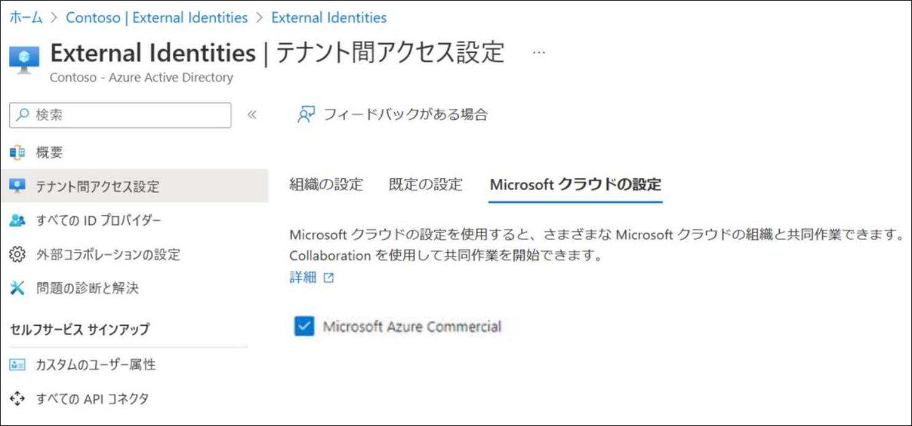
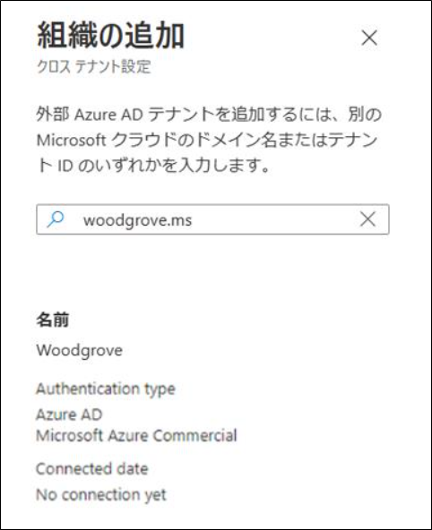
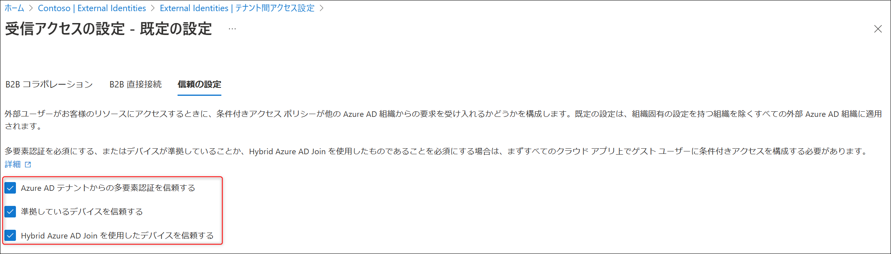

こんにちは、Azure Identity サポート チームの 張替 です。

本記事は、2023 年 2 月 23 日に米国の Azure Active Directory Identity Blog で公開された [Collaborate securely across organizational boundaries and Microsoft clouds](https://techcommunity.microsoft.com/t5/microsoft-entra-azure-ad-blog/collaborate-securely-across-organizational-boundaries-and/ba-p/3094109) を意訳したものになります。ご不明点等ございましたらサポート チームまでお問い合わせください。

-- 

今日、Microsoft のクラウド間でのコラボレーション機能が GA になったことを発表いたします！Azure Active Directory (Azure AD) の B2B コラボレーションが、以下の Microsoft クラウド間でサポートされるようになりました。

- Azure Commercial および Azure Government クラウド 
- Azure Commercial および Azure China クラウド（21Vianet）

Microsoft Entra の一部である [Azure AD B2B](https://learn.microsoft.com/en-us/azure/active-directory/external-identities/what-is-b2b) を利用して、Microsoft クラウド内で、サプライヤーやパートナー、ベンダーなどの外部ユーザーとコラボレーションしている方は、すでに多くいらっしゃると思います。また、自身の組織をホストしているクラウドとは異なる Microsoft クラウドでホストされている組織と共有および連携する必要があるお客様もいるでしょう。これまでは、複数のクラウドにテナントを設定し、同じユーザーに異なるアカウントを発行するという複雑なプロセスを踏む必要がありました。しかし現在、組織が Azure Commercial、Government、または China クラウドのいずれであっても、ユーザーは自身のプライマリとなる ID を使用して Microsoft クラウド間でシームレスに連携できるようになりました。

## 3つの簡単なステップで Microsoft のクラウド間でのコラボレーションを開始する

Azure Government クラウドを使用している組織である Contoso Industries が、Azure Commercial クラウドのパートナーとどのようにコラボレーションしているかを例にとって説明します。

Contoso Industries は、政府機関や商業組織にミッション クリティカルな機器を供給しています。ビジネスの機密性を考慮し、政府は Contoso Industries を Azure Government Cloud でホスティングすることを求めています。

Contoso Industries には、Contoso Industries が製造する機器にソフトウェアを提供する Woodgrove のような商業パートナーもいます。現在は Microsoft のクラウドを横断してコラボレーションを行うことができるため、Contoso Industries のユーザーは Woodgrove のユーザーを招待してコラボレーションを行い、在庫管理のアプリケーションや SharePoint のドキュメントにアクセスできるようにすることが可能になっています。

では、実現方法について見ていきましょう。 

### ステップ 1：External Identities の Microsoft クラウド設定を有効にする 

Contoso Industries の管理者である Dean は、Azure ポータルの External Identities -> テナント間アクセス設定 に移動して、Azure Commercial cloud と連携する設定を有効にします。

Dean は次に、[クロス テナント アクセス設定](https://techcommunity.microsoft.com/t5/microsoft-entra-azure-ad-blog/cross-tenant-access-settings-for-secure-collaboration-now/ba-p/3575844) で、Woodgrove のテナントをパートナーのリストに追加します。Woodgrove の管理者は、Azure ポータルで同様の変更を行います。

Dean は、特定のユーザーに特定のアプリケーションへのアクセスのみを許可するような、きめ細かい制御を行うこともできます。これによって、外部コラボレーションをさらに安全にすることができます。これらの変更が完了すると、Contoso Industries のユーザーは、Woodgrove からユーザーを招待して、Contoso Industries がホストしている業務系アプリ、SaaS アプリ、Power BI レポート、SharePoint Online サイト、ドキュメント、ファイルでのコラボレーションを行うことができるようになります。

Microsoft クラウド間でのコラボレーションを実現する方法については、[B2B コラボレーションの Microsoft クラウド設定を構成する](https://learn.microsoft.com/ja-jp/azure/active-directory/external-identities/cross-cloud-settings) をご覧ください。

### ステップ 2: まず他の Microsoft クラウドからの外部ユーザーを管理する 

Contoso Industries では、異なるクラウドからのユーザーを適切に管理し、外部ユーザーが Contoso Industries のリソースに限られた時間だけアクセスできるようにしたいと考えています。Dean は、信頼できる組織としてWoodgrove を追加します。

Dean は、特定のリソース、アクセス レビュー、承認のためのスポンサーを含むアクセス パッケージを割り当てます。これにより、Woodgrove のユーザーは、セルフ サービスによるオンボーディングが容易になり、Contoso Industries のアクセス ポリシーが即座に適用されるようになりました。

接続された組織とアクセス パッケージを使用して、異なる Azure AD テナントのユーザーをオンボードし管理する方法については、[エンタイトルメント管理で外部ユーザーのアクセスを管理する](https://learn.microsoft.com/ja-jp/azure/active-directory/governance/entitlement-management-external-users) をご覧ください。 

### ステップ 3: Microsoft クラウド間の外部コラボレーションを保護および監視する 

Dean は Woodgrove のユーザーと共有されるリソースを保護したいと考えています。Woodgrove のユーザーは Contoso Industries のゲスト ユーザーなので、Contoso Industries のリソースにアクセスする前に多要素認証 (MFA) を要求するなど、すべての [条件付きアクセス ポリシー](https://learn.microsoft.com/ja-jp/azure/active-directory/external-identities/authentication-conditional-access) を Woodgrove のユーザーに適用することが可能です。

また、Contoso Industries は、[クロス テナント アクセス設定](https://learn.microsoft.com/ja-jp/azure/active-directory/external-identities/cross-tenant-access-settings-b2b-collaboration#to-change-inbound-trust-settings-for-mfa-and-device-claims) を利用して、Woodgrove から MFA や準拠済みの Azure AD の参加デバイスを信頼することができ、Woodgrove ユーザーのセキュリティをそのままに、シームレスなコラボレーション体験を実現することができます。

Woodgrove 社のユーザーが Contoso Industries のリソースにアクセスする場合、Dean はサインイン ログを使用してユーザーのアクティビティを監視することができます。また、[クロス テナント アクセス アクティビティ ワークブック](https://learn.microsoft.com/en-us/azure/active-directory/reports-monitoring/workbook-cross-tenant-access-activity) を使用し、Woodgrove ユーザーがアクセスしているリソースを可視化することもできます。

## お客様の声

プレビューの際に、お客様のようなお客様から頂いた素晴らしいフィードバックを以下にご紹介します。

" マイクロソフト クラウド間のコラボレーションにより、いくつものアプリを AD FS から Azure AD に移行可能となりました。AD FS はこれまで、本社ユーザーと中国ユーザーの両方が必要とするアプリへの SSO を提供するためのソリューションでした。この移行が完了すれば、AD FS を廃止し、コストを大幅に削減するとともに、信頼性を高め、セキュリティの工数を最小化することができます。" - 金融サービス業のお客様

"連携機能の不足でユーザーを政府系テナントに移動させることができなかったのですが、この機能でその移動の障害が解除されます！" -エンジニアリングと建設業界のお客様 

皆様からのフィードバックをお待ちしております。本発表に対するフィードバックは Azure フォーラムか [@AzureAD](https://twitter.com/azuread) のタグをつけて Twitter にお寄せください。
