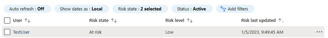
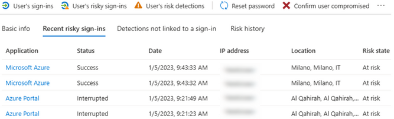

# Azure Active Directory における危険なサインインへの対策 

こんにちは、Azure Identity サポート チームの 星野です。

本記事は、2023 年 1 月 30 日に米国の Azure Active Directory Identity Blog で公開された [Combatting Risky Sign-ins in Azure Active Directory](https://techcommunity.microsoft.com/t5/microsoft-entra-azure-ad-blog/combatting-risky-sign-ins-in-azure-active-directory/ba-p/3724786)  を意訳したものになります。ご不明点等ございましたらサポート チームまでお問い合わせください。

---

クラウドの利用が進む現代において、貴社のクラウド アプリケーションが悪意あるサインイン試行の標的となるのは、ほぼ避けられないことでしょう。従業員が業務用アカウントで使用したパスワードを個人アカウントでも使用しているケースはよくあります。仮に自社と関係のない組織からパスワードが漏えいした場合、E メール アドレスや UPN が異なっていても、貴社の従業員がパスワードの漏洩したアプリで同じパスワードを使用している場合は、脅威となりえます。より多くのアプリがクラウドに移行する中、このような悪意のあるサインイン試行を見逃さず、正しい対処をすることは必要不可欠となっています。Azure の ID 管理とアクセス制御のベストプラクティスについては、[こちらのリンク](https://learn.microsoft.com/ja-jp/azure/security/fundamentals/identity-management-best-practices) を参照ください。

## リスク レベルの把握

[Azure AD Identity Protection](https://www.microsoft.com/ja-jp/security/business/identity-access/azure-active-directory-identity-protection) は、Azure AD P2 ライセンスを使用しているテナントの Azure AD で追加構成なく利用できるサービスです。[Azure AD P2 ライセンスがない場合](https://learn.microsoft.com/ja-jp/azure/active-directory/identity-protection/overview-identity-protection#required-roles)、Identity Protection の機能は制限付きで動作します。Azure AD Identity Protection は、匿名 IP アドレスの使用、特殊な移動、マルウェアにリンクされた IP アドレス、通常とは異なるサインイン プロパティ、漏洩した資格情報、パスワード スプレーなどのリスクを検出することができます。  

Identity Protection は、リスクのあるサインインごとに、低、中、高のいずれかのリスク レベルを割り当てます。リスク レベルが高いほど、Identity Protection はこのユーザーまたはサインインが侵害されている可能性が高いと判断します。

Identity Protection が作成するレポートは以下の 4 種類があります:

- 危険なユーザー - リスクのあるユーザー、ユーザーのリスク履歴を集計。
- 危険なワークロード ID - サービス プリンシパルのリスク レベルを集計。
- 危険なサインイン - サインインのリスク レベル、サインイン情報 (デバイス、アプリケーション、場所など)、検出の種類を集計。  
- リスク検出 - 過去 90 日間のリスク検出と検出の種類およびその他の詳細を集計。

これらのレポートは、Azure Active Directoryの [セキュリティ] タブで確認することができます。図 1 は、危険なサインインのレポートです。サインインの一つをクリックすると、リスク レベルとそのサインインがリスクありと判断された理由の詳細が表示されます。図 2 では、このサインインのリスク レベルは「低」で、匿名の IP アドレスが使用されているため危険と分類されたことがわかります。


危険なユーザーのレポートは、危険と分類されたユーザーを表示します。図 3 は危険なユーザーのレポートで、図 4 はそのユーザーに関連する危険なサインインを示しています。危険なユーザーのレポートでユーザーをクリックすることで、ユーザーのパスワード リセット、危険なユーザーとしてのマーク、ユーザーのサインインのブロック、リスクの無視が可能です。ユーザーを危険とマークすると、そのユーザーのリスク レベルは「高」になり、Azure AD はそのユーザーを危険度「高」として扱います。これは、ユーザーのリスク レベルを条件として自動化を構成しているか、条件付きアクセス ポリシーを使用している場合に便利です。逆に、ユーザー リスクを無視すると、そのユーザーに関連するすべてのリスク レベルが削除されます。どちらのアクションも元に戻すことはできません。





Identity Protection がユーザーとサインインに設定するリスク レベルは、自動化されたアクションを実行する際にも活用できます。これを行うには、ユーザーとサインインに設定されたリスク レベル基づく条件付きアクセス ポリシーを作成します。たとえば、サインインしたユーザーのリスクレベルが「高」の場合、パスワードのリセットを強制的に実行するといったポリシーです。リスク レベルに基づく条件付きアクセス ポリシーに関する推奨事項については、[こちら](https://learn.microsoft.com/ja-jp/azure/active-directory/identity-protection/howto-identity-protection-configure-risk-policies#microsofts-recommendation) を参照ください。

## 危険なサインインを調査する

危険なサインインを調査する際には、リスクのレベルを決定するいくつかの要素に注目ください。そのユーザーの過去のサインインに基づいて、サインインに異常な属性があるかどうかを理解することが重要です。たとえば以前のサインインを見ると、サインインしたアプリケーション、場所、デバイス、IP アドレス、ユーザー エージェントが同じような値になっているかどうかをご確認いただけます。サインインに使用されたデバイスが [Azure AD 参加済みデバイス](https://learn.microsoft.com/ja-jp/azure/active-directory/devices/concept-azure-ad-join) の場合や、 [ハイブリッド Azure AD 参加済みデバイス](https://learn.microsoft.com/ja-jp/azure/active-directory/devices/concept-azure-ad-join-hybrid) の場合は、デバイスを特定する情報も確認可能です。以下の事項を確認ください:

- このユーザーは、以前にもこの場所と IP アドレスからサインインしたことがあるか？
- このユーザーは、以前にもこのアプリケーションにサインインしたことがあるか？
- デバイスは Azure AD に登録されているか？
- そのデバイスは「準拠済み」とマークされているか？

サインインの詳細を調査することで、サインインの真のリスク レベルが明確になり、どのような対応を取るべきかがわかります。例えば、ロンドンに住む 1 名ユーザーから 2 種類のサインインが成功したとします。どちらのサインインも、匿名 IP アドレスを使用しているため、リスクレベルは「低」と認定されました。

| 属性 | シナリオ 1 | シナリオ 2 |
| ------------ | ------------ |	------------ |		
|サインインしたアプリケーション | Outlook モバイル | Azure ポータル|  
|デバイス  | iPhone | Windows 10 |
|場所 | スペイン マドリード |米国 コネチカット州 | 
|ユーザー エージェント | Mozilla/5.0 (iPhone; CPU iPhone OS 16_1 like Mac OS X) AppleWebKit/605.1.15 (KHTML, like Gecko) Mobile/15E148 |Mozilla/5.0 (Windows NT 10.0; Microsoft Windows 10.0.9200; ja-US) PowerShell/7.1.0|  
|Azure AD の状態  | Azure AD登録済み | 未参加| 
|準拠済みデバイス |	準拠済み	| N/A |

**上記シナリオ 1** より、ユーザーが iPhone から Outlook Mobile にサインインしたことがわかります。ユーザー エージェントは OS のバージョンに関する詳細な情報を提供します。この情報をより読みやすい形式に変換するツールがオンライン上で数多く提供されていますので、必要に応じご使用ください。また、このデバイスは Azure AD に登録されている、かつ準拠済みデバイスとわかります。匿名の IP アドレスが使用されているのは、Outlook Mobile へのサインイン時にユーザーがモバイルで VPN を使用していたためと思われます。おそらく危険なサインインではありませんが、念のためユーザーに確認を行うことが必要です。
  
**シナリオ 2** では、Azure ポータルへのサインインが発生したことを示しています。このユーザーの仕事として Azure ポータルでの管理作業が含まれない限り、Azure ポータルへのサインインは疑わしいと判断できます。また、このデバイスは Azure AD に参加していません。ユーザー エージェントは、PowerShell を使用してサインインしたことを示しています。このサインインの真のリスク レベルを判断する前に、このユーザーが本当に侵害されているかどうか、さらに調査する必要があります。このユーザーが侵害されている場合、そのユーザーのセッションを失効させ、パスワードをリセットする必要があります。攻撃者が MFA 設定 (電話番号、アプリ登録、セカンダリの E メールなど) を変更した場合は、これらを削除し、ユーザー自身に MFA を再登録させるようにします。

## リスクの高いサインインの監視

Azure AD のサインイン ログを [Log Analytics](https://learn.microsoft.com/ja-jp/azure/azure-monitor/logs/log-analytics-overview) ワークスペースまたは [Microsoft Sentinel](https://learn.microsoft.com/ja-jp/azure/sentinel/overview) に転送すると、[ログを検索する](https://learn.microsoft.com/ja-jp/azure/azure-monitor/logs/queries) ことで更なる調査を行い、攻撃を追跡することができます。Sentinel の **SigninLogs** テーブルには、サインインのリスク レベルに関するデータが格納されています。次のクエリを実行すると、どのリスク検出の種類が最も多かったかを確認できます。

```kusto
SigninLogs  
| where RiskLevelDuringSignIn != "none"  
| mv-expand todynamic(RiskEventTypes)  
| summarize ["Type Count"] = count() by tostring(RiskEventTypes)  
| sort by ['Type Count'] desc  
| render columnchart with(title="Count of Risk Detection Type") 
```

リスクのあるサインインをレベルに基づいて分類し、サインインが成功したかどうかを確認するには、次のクエリを実行します。

```kusto
SigninLogs  
| where RiskLevelDuringSignIn != "none"  
| extend ResultType = iif(ResultType == "0", "Successfull Logon", "Failed Logon")  
| summarize Count = count() by ResultType, RiskLevelDuringSignIn  
| render columnchart with(title = "Risk Levels Count per Successfull and Failed Sign-ins")  
```

貴社においても上記のような悪意のあるサインインに直面することがあるでしょう。Azure AD Identity Protection を利用することで、ユーザーおよびサインインにリスク レベルを割り当て、悪意のあるサインインに対処することができます。さらに、改善のためのアクションを自動化し、収集されたリスクの詳細に関するデータを調査に生かすことが可能です。
