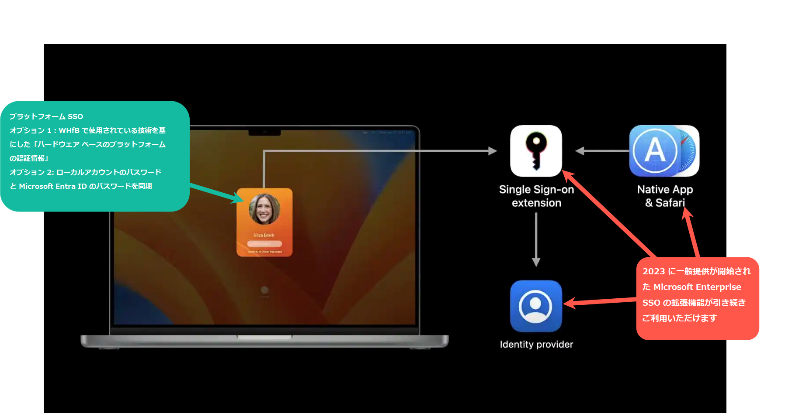

---
title:  近日公開予定: "macOS 向けの プラットフォーム SSO" 機能について
date: 2023-09-03 12:00
tags:
  - Azure AD
  - US Identity Blog
---

#  近日公開予定: "macOS 向けの プラットフォーム SSO" 機能について
 

こんにちは、Azure Identity サポート チームの 竜 です。
本記事は、2023 年 08 月 29 日に米国の Azure Active Directory Identity Blog で公開された [Coming Soon – Platform SSO for macOS](https://techcommunity.microsoft.com/t5/microsoft-entra-azure-ad-blog/coming-soon-platform-sso-for-macos/ba-p/3902280) を意訳したものになります。

----
今年の初め、[Apple デバイス向けの Microsoft Enterprise SSO プラグイン](https://learn.microsoft.com/ja-jp/azure/active-directory/develop/apple-sso-plugin)を企業に提供し、Apple デバイスを使用するお客様のエクスペリエンスを向上させるための大きな一歩を踏み出しました。このプラグインにより、Microsoft Entra ID ユーザーは、すべてのアプリと Web サイトに対して、一貫した、安全でシームレスな方法にて、デバイス全体でシングルサインオン (SSO) を行うことができます。そして何より、最新のMicrosoft の技術に常に対応することができます。

本日、これらの機能を強化する強力な機能となる "macOS 向けのプラットフォーム SSO" を発表します。この機能強化により、macOS デバイスをこれまで以上にシームレスかつ安全にご利用いただけるようになります。

##### プラットフォーム SSO  は、macOS の既存の SSO 拡張機能を強化したもので、ユー ザーは「パスワードレスの資格情報」または「Microsoft Entra ID によって管理および検証されたパスワード」を使用して Mac にサインインすることができます。

プラットフォーム SSO と Microsoft の Enterprise SSO プラグインが組み合わさることで、macOS のプラットフォーム資格情報により、ユーザーは Touch ID を使用してデバイスのロックを解除することでパスワードレスを実現し、さらにデバイスにバインドされた暗号鍵を使用して、Microsoft Entra ID にサインインすることもできるようになります。内部では、Windows Hello for Business で使用している技術を基にしたフィッシングに強い認証情報を使用しており、さらに Apple のハードウェアに搭載されている技術も活用しています。これにより、セキュリティ キーやその他のハードウェアが不要になり、コストを削減することができます。サインイン後は、既存の Microsoft Enterprise SSO プラグインが引き続き機能し、より安全に認証情報を保護しつつ、業務で使用するアプリケーションへのサインイン状態を維持することができます。

Microsoft Entra ID のサインインでパスワードを全く使用しない準備がまだ整っていない場合でも、macOS 向けのプラットフォーム SSO を使用することで、ローカル アカウントのパスワードと Microsoft Entra ID のパスワードを同期することができます。これで、別々にパスワードを覚える必要がなくなります。

また、macOS 向けのプラットフォーム SSO では、管理者はエンドユーザーの認証方法を設定することも可能です。フィッシングに強い認証方法または従来のパスワードのどちらかを指定することができます。

## 管理の簡素化 

今回のアップデートの一環として、Microsoft Intune のユーザー向けに、Mac 上での利用者のオンボード体験を刷新しました。macOS 向けのプラットフォーム SSO により、Mac ユーザーが使い慣れた macOS のユーザー体験を活用できるようになり、Microsoft Intune のオンボード体験がよりシンプルになります。この一例として、Intuneが 管理する Mac 上で、条件付きアクセスで保護されたリソースにアクセスするために Company Portal アプリを起動する必要がなくなります。Microsoft Intune により Apple のデバイス管理がどのように刷新されるかにつきましては、[10 ways Microsoft Intune improves Apple device management](https://techcommunity.microsoft.com/t5/microsoft-intune-blog/10-ways-microsoft-intune-improves-apple-device-management/ba-p/3766718) をご覧ください。

今後公開されるパブリック プレビューでは、macOS 向けのプラットフォーム SSO は Microsoft Intune と連携して機能します。また、macOS 向けのプラットフォーム SSO と連携して機能するその他の MDM プロバイダーも近日公開予定です。

## ゼロ トラストを実現するための支援

最新の Mac に搭載されている Secure Enclave との統合により、パスワードレスの認証方法は、企業がゼロ トラストのセキュリティ目標を達成するための強力な手段となります。パスワードという主たる攻撃対象を排除することで、企業はセキュリティ体制を大幅に強化することができます。

パスワードレス システムで使用される認証情報は、物理的なハードウェアにバインドされます。このため、攻撃者はログイン情報を盗むのではなく、特定のハードウェアに物理的にアクセスする必要があり、不正アクセスはさらに困難となります。

## 本機能の利用に向けて準備するために

現在、一部のお客様を対象としたプライベート プレビューを実施しており、パブリック プレビューは近日中に開始の予定です。プライベート プレビューへの参加をご希望の方は、 [Platform SSO for macOS feedback](macos-sso-feedback@microsoft.com) までご連絡ください (参加可能人数に限りがあるのでご了承ください)。

macOS 向けのプラットフォーム SSO の利用にあたり、以下のとおり準備を進めることが可能です:
 
1. [Microsoft Enterprise SSO プラグイン](https://learn.microsoft.com/ja-jp/azure/active-directory/develop/apple-sso-plugin)を展開します
2. ユーザーが [Microsoft Entra ID 多要素認証](https://learn.microsoft.com/ja-jp/azure/active-directory/authentication/howto-mfa-getstarted)に登録されていることを確認します: Microsoft Authenticator の利用をお勧めします。
3. macOS デバイスを macOS 13(Ventura) 以降にアップデートします

## まとめ 

macOS 向けのプラットフォーム SSO  は、組織内の Mac の SSO 体験とセキュリティを強化するための大きな一歩です。ユーザーは、ハードウェアにバインドされたキーまたは Microsoft Entra ID 上のパスワードを使用して Mac にサインインすることで、SSO を実現することができます。さらに、Secure Enclave との統合により、macOS デバイス上でハードウェアにバインドされた、パスワードレスかつ、フィッシングに強いの認証が可能になり、企業のゼロ トラスト セキュリティへの移行を推進します。パブリック プレビューでは、macOS 向けのプラットフォーム SSO を Microsoft Intune でネイティブに管理することが可能となり、他の MDM プロバイダーも近日中にサポートされる予定です。

