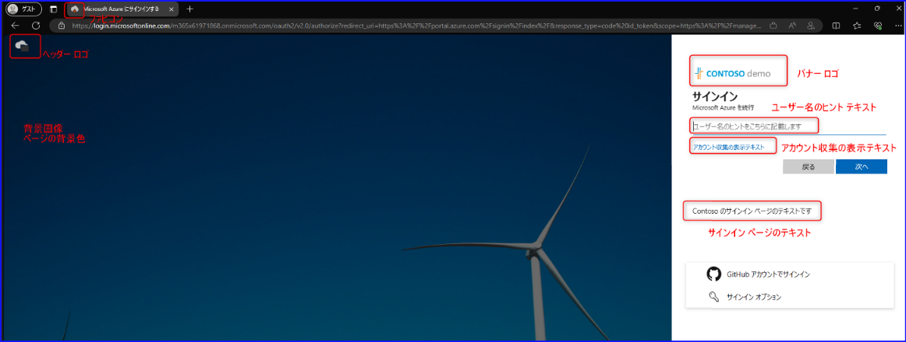
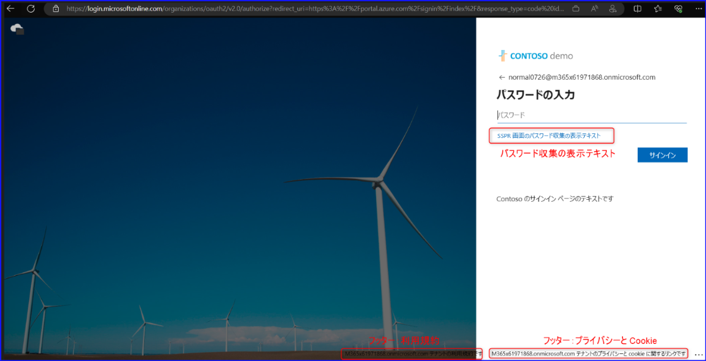
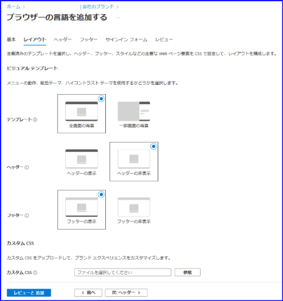
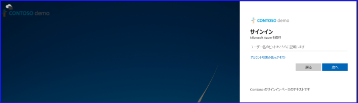
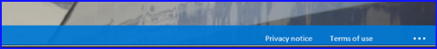
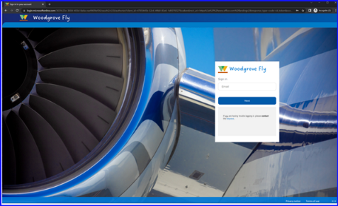

こんにちは。 Azure ID チームの小出です。

本記事は、2023 年 7 月 25 日に公開されました  [Enhanced Company Branding for Sign-in Experiences Now Generally Available](https://techcommunity.microsoft.com/t5/microsoft-entra-azure-ad-blog/enhanced-company-branding-for-sign-in-experiences-now-generally/ba-p/3823765) の記事をもとに、分かりやすく日本語におまとめしなおした記事となります。ご不明点などございましたらお気軽にサポートまでお問い合わせください。

今回の記事では、新しく一般公開 (GA) された「強化された新しい会社のブランド機能」について、詳細をご紹介いたします。

---

会社のブランド機能は、2022 年 12 月頃に新しい機能が追加され、以前 [こちら](https://jpazureid.github.io/blog/azure-active-directory/introducing-enhanced-company-branding-for-sign-in-experiences/) にてパブリック プレビューの開始をお知らせしました。今回、こちらの機能が一般公開されましたので、これまでプレビューを利用していなかった、もしくは利用できなかったお客様もぜひご利用ください。

新しい会社のブランド機能について少し下記にて紹介します。具体的に表示をカスタマイズできる項目は下記赤枠および赤文字記載の部分です。

## レイアウトの構成

サインイン ページにおける各要素の配置を指定することができます。

たとえば、上記にて「テンプレート」の項目を「一部画面の背景」とすると、通常画面真ん中に表示されるユーザー名入力画面が右側に表示されるようになります。AD FS ではこの右寄りのデザインが既定であるため、AD FS のサインイン画面と一貫性を持たせたい場合は「一部画面の背景」をご利用いただくのも手です。

**全画面の背景**

**一部画面の背景**

CSS を利用できるお客様は、下記を利用してカスタム CSS をアップロードすることも可能です。弊社サポートでは、 CSS を代理で作成するようなご支援などは恐縮ながら承っていないため、[こちらのリファレンス ガイド](https://learn.microsoft.com/ja-jp/azure/active-directory/fundamentals/reference-company-branding-css-template) を利用しお客様側で CSS を作成ください。

## カスタムのセルフ サービス パスワード リセットのハイパーリンク

この機能により、サインイン ページでのセルフ サービス パスワード リセットのリンクを表示したり、隠したり、カスタマイズすることが可能です。

下記設定にて「パスワード収集の表示テキスト」に指定した文字列を表示させたり、 URL をカスタマイズしたりすることができます。

## フッターのハイパーリンクのカスタマイズ

サインイン ページのフッターに表示されるプライバシーと利用規約の URL および表示文字列をカスタマイズいただけます。

## Favicon の設定

ウェブ ブラウザーのタブに表示されるアイコンを設定いただけます。

設定がアップロードされると、最終的なユーザー体験をご覧いただくことができます。

Azue AD Premium もしくは Office 365 を利用して、会社のブランド機能をぜひ利用ください。
