# よくわかる アカウント ロックアウト

こんにちは、 Azure Identity サポート チームの小出です。
今回は、スマート ロックアウトの機能とアカウントがロックアウトしてしまったときの対処策について、シナリオ別にご案内します。

## はじめに
Azure AD や Microsoft 365 サービスをご利用いただくなかで、利用者様より、"サインインできません" や "アカウントがロックアウトされてしまいました" といった連絡をもらうことがあると思います。
これは Azure AD では総当たり攻撃などを防ぐために、パスワードを一定の回数連続して間違えると、しばらくの間アカウントがロックされる機能があるためです。これによりサインインできない状況が考えられます。

ほとんどのお客様はパスワードを使用してサインインしている状況かと思います。そのような中、パスワードの設定や機能について、どのようなことができるのかについてお問い合わせいただくことがあります。
今回は、以前ブログとして公開しました[パスワード ポリシーの機能](https://jpazureid.github.io/blog/azure-active-directory/comprehend-password-policy/) と併せて、 Azure AD のスマート ロックアウトに関する内容についてご案内します。

## 目次

1. [ロックアウトの概要](#idx1)
2. [スマート ロックアウトの確認方法](#idx2)
3. [シナリオ別の対処方法](#idx3)
	- [同期ユーザーがオンプレミス側でロックアウトしたとき](#idx3-1)
	- [パスワード ハッシュ同期環境で、同期ユーザーが Azure AD 側でロックアウトしたとき](#idx3-2)
	- [パススルー認証環境の同期ユーザーが、 Azure AD 側でロックアウトした時](#idx3-3)
	- [AD FS 環境の同期ユーザーが、 Azure AD 側でロックアウトした時](#idx3-4)
	- [クラウド ユーザーがロックアウトしたとき](#idx3-5)
	- [ゲスト ユーザーからロックアウトの連絡があったとき](#idx3-6)

4. [攻撃されていると思ったら](#idx4)
5. [ユーザーの属性を更新する](#idx5)
6. [補足情報（よくある質問）](#idx6)

---

<h2 id="idx2">1. ロックアウトの概要</h2>

サインイン時にパスワードを複数回間違えると、アカウントを一時的にロックする機能が用意されています。
オンプレミス AD やコンピューターにサインインするときには、以下のようなメッセージを目にすることがあると思います。

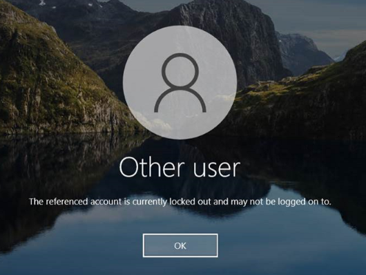

このメッセージが表示されたときは、一般的にヘルプデスクなどに依頼し、オンプレミス AD からロックアウトを解除してもらう、または ロックアウトが解除されるまで待つといった対処となりますが、Azure AD にも同様の機能が用意されており、Azure AD ではスマート ロックアウトと呼ばれています。

スマート ロックアウトの機能は、オンプレミス AD のロックアウト機能と似ていますが、一定時間のみロックアウトされ、時間がたてば解除される点にご留意ください。
オンプレミス AD のロックアウト機能のように、"ロックアウトされたら必ず管理者が解除する" ように構成することはできません。その代わりロックアウトは自動的に解除されますが、必要に応じて再度ロックされる動作があるため、ロックアウトを解除するというヘルプデスクの負荷を減らすことにつながります。

<h2 id="idx1">2. スマート ロックアウトの確認方法</h2>

次に、スマート ロックアウトの機能でアカウントがロックされると、どのような動作となるかご案内します。

通常、間違ったパスワードを入力すると、以下のようなメッセージが表示されます。

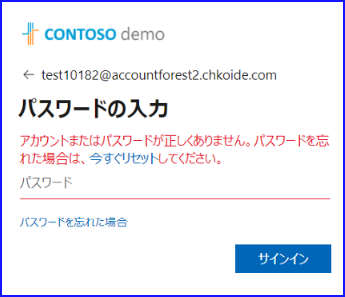

このときのサインイン ログには、上記のメッセージと同様に、誤ったユーザー名もしくはパスワードが使用されているエラーであることが分かります。

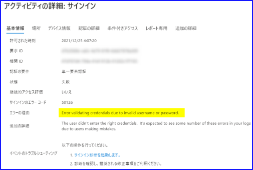

一方、スマート ロックアウトによって一時的にロックされているときは、以下のようなメッセージに変わります。
このメッセージが表示されている間は、正しいパスワードを入力してもサインインできません。

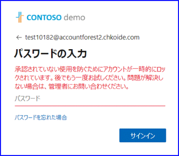

このとき、サインイン ログには、エラーの理由に "The account is locked (アカウントがロックされています)" と記載されます。

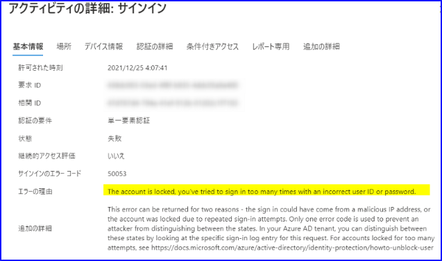

<h2 id="idx3">3. シナリオ別の対処方法</h2>

テナントには同期ユーザー・クラウド ユーザー・ゲスト ユーザーなど様々な種類のユーザーが存在するため、ロックアウトしたときの対処策はそれぞれ異なります。特に、Azure AD 側とオンプレミス AD 側のどちらでロックアウトされているかという点は混乱しやすいです。
どちらに該当するかは、 "ユーザーがどこにサインインしようとしていて、その認証はどこで行われるか" という点が重要です。
それぞれシナリオごとに対処方法を記載しておりますのでご確認ください。

<h3 id="idx3-1">シナリオ 1: 同期ユーザーが、オンプレミス AD 側でロックアウトされた場合</h3>

ドメイン コントローラーやコンピューターにサインインする際にロックアウトされるシナリオです。
この場合、オンプレミス AD 側のロックアウト ポリシーでアカウントがロックされています。
そして通常、このシナリオの場合は、ヘルプデスクなどに依頼してオンプレミス側でアカウント ロックを解除してもらうことも多いと思います。
管理者はドメイン コントローラーにサインインし、以下の手順にてアカウント ロックを解除できます。

1. ドメイン コントローラーにサインインします。
2. [Active Directory ユーザーとコンピューター] を開きます。
3. ロックアウト状態を解除させたいユーザーを検索し、右クリック - [プロパティ] を選択します。
4. [アカウント] タブ内、下記アカウント ロックアウトを解除するためのチェックをオンにして、変更を反映させます。

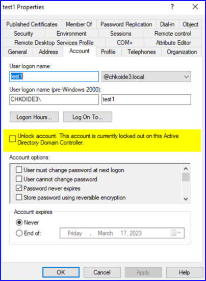

管理者は、例えば Default Domain Policy 内、 [アカウント ポリシー] - [アカウント ロックアウトのポリシー] にて、アカウントのロックアウトのしきい値やロックアウト期間を設定することができます。

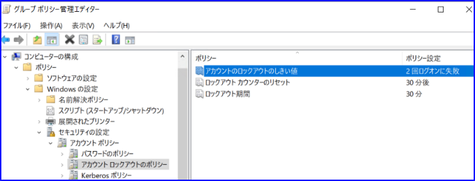

<h3 id="idx3-2">シナリオ 2: パスワード ハッシュ同期環境の同期ユーザーが、 Azure AD 側でロックアウトされた場合</h3>
パスワード ハッシュ同期の環境では、 Azure ポータルや Microsoft 365 サービスにサインインする際、同期ユーザーであっても Azure AD 側で認証されます。
そのため、この場合は、スマート ロックアウトの機能でアカウントがロックされます。
既定ではロックアウト時間は 1 分のため、オンプレミス AD のロックアウトのように管理者に依頼する間もなく、ロックアウト状態が解除されます。

なお、公開情報にも記載がありますが、ロックアウトの最中に管理者がロックアウトを解除することはできません。
代わりに、ユーザーが SSPR にてパスワードをリセットすることで、ロックを解除することが可能ですので、以下に手順を記載します。

1. http://aka.ms/sspr へアクセスします。
2. https://passwordreset.microsoftonline.com/ の画面に遷移し、下記の画面が表示されるので、UPN と文字列を入力します。

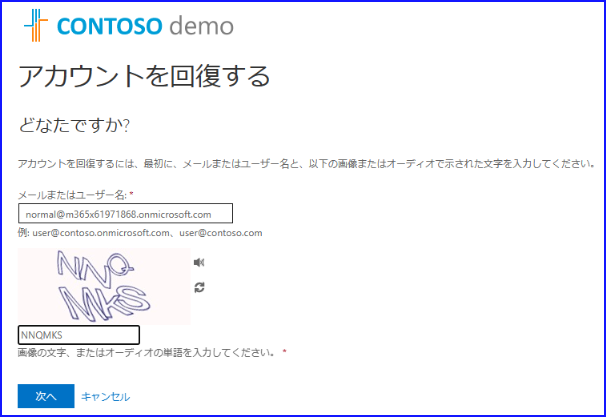

3. パスワード リセットを行うために、事前に登録した電話番号などを入力して認証します。

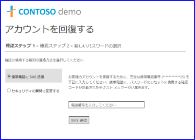

4. 新しいパスワードを入力します。

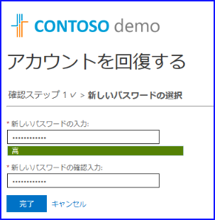

5. 下記画面が表示されたら、パスワードのリセットは完了です。

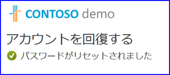

なお、時間が経過してロックアウトが解除された場合（既定では、ロックアウトから 1 分経過した場合）、次のサインイン時にもパスワードを間違えると、アカウントは即座にロックアウトされます。
このときは、 1 分より長い時間アカウントがロックアウトされるような動作となります。
具体的に何分ロックアウトされるかなどの詳細はセキュリティ上公開しておりませんが、ロックアウト回数が増加するたびにロックアウト時間を延長するため、攻撃者がパスワードの総当たりを行うことを抑止することに役立ちます。

<h3 id="idx3-3">シナリオ 3: パススルー認証環境の同期ユーザーが、 Azure AD 側でロックアウトされた場合</h3>
パススルー認証（PTA） をご利用いただいている場合、Azure AD 側とオンプレミス AD 側のロックアウト ポリシーの両方を考慮する必要があります。
これは、このシナリオでサインインしようとする場合、下記のようなフローを辿るためです。

1. 利用者がユーザー名とパスワードを入力します。
2. Azure AD は、「今ロックアウトしているのか？」を判断します。
3. Azure AD が「今ロックアウトしている」と判断した場合、認証はオンプレミス AD 側には要求されずに、Azure AD 側でロックアウトされている旨が表示され、以降の処理が行われません。
4. Azure AD が「今ロックアウトしていない」と判断した場合、オンプレミス AD 側で認証が行われます。
5. オンプレミス AD 側のロックアウト ポリシーに抵触していなければ、 認証に成功した結果が Azure AD に返されます。
6. Azure AD にサインインします。

上記のようなフローを辿るため、Azure AD のスマート ロックアウトの機能と、オンプレミス AD のロックアウトの機能が両方関連します。
このとき、スマート ロックアウトを構成するときの「回数しきい値」にご留意ください。

具体的には、 Azure AD のスマート ロックアウトのしきい値が 10 回、オンプレミス AD のアカウントのロックアウトのしきい値が 20 回など、オンプレミス AD の回数の方が 2 から 3 倍程度多くなるように設定します。
これは、仮にクラウド側で攻撃を受けた場合に、同じ回数でロックアウトしてしまうと、利用者がオンプレミス AD 側のリソースへもアクセスできなくなってしまうためです。
攻撃を受けた場合に先に Azure  AD 側のアカウントをロックアウトしておけば、上記 3 にて「今ロックアウトしている」と判断されるため、オンプレミス AD 側に認証が要求されず、オンプレミス AD 側の影響を少なくすることができます。

<h3 id="idx3-4">シナリオ 4: AD FS 環境の同期ユーザーが、 AD FS 側でロックアウトされた場合</h3>

AD FS を利用している場合、認証は Azure AD 側ではなくオンプレミス AD 側で行われます。
例えば、「パスワードを 10 回間違えたら、オンプレミス AD 側のアカウントも含めてロックアウトしたい」という要望の場合、オンプレミス AD 側のロックアウト ポリシーを構成することのみで実現することが可能ですが、「10 回の試行でオンプレミス AD 側のアカウントもロックアウト」するように構成している場合、攻撃を受けて 10 回サインインに失敗すると、オンプレミス AD のリソースへもアクセスできなくなってしまいます。
 
一般的な要望として、「オンプレミス AD 側はロックアウトさせず、先に Azure AD 側のアカウントをロックアウトさせたい」という要望の場合、パススルー認証の場合と同様にロックアウトのしきい値の回数の考慮が必要です。
なお、AD FS の場合、下記 AD FS エクストラネット スマートロックアウトの機能を併せて利用します。
https://learn.microsoft.com/ja-jp/windows-server/identity/ad-fs/operations/configure-ad-fs-extranet-smart-lockout-protection
  
事前に AD FS エクストラネット スマートロックアウトの機能と併用し、エクストラネット スマートロックアウトでしきい値を 10 回、オンプレミス AD 側のロックアウトのしきい値は 20 回などと設定しておくと、アカウントが攻撃された場合でも、先に AD FS 側でロックアウトさせることが可能です。
先に AD FS 側でロックアウトさせることができると、「AD FS 側はロックアウトされてしまったが、オンプレミス AD 側のリソースにはアクセスできる」状態となるため、攻撃によりオンプレミス AD 側のリソースへもアクセスできなくなることを防ぐことが可能です。 

<h3 id="idx3-5">シナリオ 5: Azure AD に直接作成したクラウド ユーザーがロックアウトされた場合</h3>

同期ユーザーと異なり、クラウド ユーザーはオンプレミス AD 側にアカウントがないため、オンプレミス AD 側でロックアウトされることはありません。
そのため、このシナリオの場合、 シナリオ 2 のパスワード ハッシュ同期のユーザーと同様に、スマート ロックアウトの機能でロックされます。対処策もシナリオ 2 と同様です。

なお、ロックアウトのしきい値やロックアウト期間は、 Azure ポータル上より、以下の手順で変更することができます。

手順
1. Azure ポータルにサインインします。
2. [Azure Active Directory] - [セキュリティ] - [認証方法] - [パスワード保護] を選択します。
3. 以下のような画面が表示されることを確認します。
 

 
4. "ロックアウトのしきい値" と、 "ロックアウト期間（秒単位）" の値をカスタマイズします。
 
項目	設定可能な値	説明
ロックアウトのしきい値	1 - 50
(回数)	何回パスワードを間違えたときにロックアウトするか設定します。
		上記では、 3 回パスワードを間違えるとロックアウトするよう設定しています。
ロックアウト時間（秒単位）	5-18000
(秒単位)	ロックアウトされたときに、どれくらいの時間ロックアウトを行うのか秒単位で指定します。
		上記では 60 秒 （= 1分）ロックアウトされる設定となります。

<h3 id="idx3-6">シナリオ 6: ゲスト ユーザーから、ロックアウトされた旨の連絡が来た場合</h3>

ゲスト ユーザーのパスワード管理や認証は、ゲストがもともと登録されているホーム テナント側で行われています。
そのため、ゲスト ユーザーの場合は、そのユーザーがメンバーとして登録されているテナントの管理者に別途対応を依頼ください。

<h2 id="idx4">4. 攻撃されていると思ったら</h2>

基本的には上記スマート ロックアウトの機能で一時的にサインインできないようになります。
また、一定時間でロックアウトが解除された後も、直後のサインインでパスワードを間違えると、再度ロックアウトされる動作があるため、侵害される可能性は低くなります。
しかしながら、攻撃を受け続けている場合、いつか突破される可能性もありますので、下記のような対処を実施いただければと思います。

・ 推測されやすいパスワードであれば、パスワードを推測されにくいものに変更またはリセットする
・ MFA を設定し、パスワードのみではサインインできないようにする
・ いったんアカウント自体を無効化し、パスワードが合っていてもサインインできないようにする（攻撃を受け続けている場合の一時的な対応です）

<h2 id="idx5">5. 補足情報（よくある質問）</h2>

最近よくお問い合わせいただく内容を以下に補足します。

Q. 設定されたしきい値以上連続でパスワードを間違えました。 10 回連続で間違えたのに、11 回目でロックアウトされません。

A. 間違ったパスワードを入力する際、同一のパスワードを複数回入力していると、カウントが増えません。毎回異なる誤ったパスワードを入力した場合はカウントが増えます。
なお、毎回異なる誤ったパスワードを入力してもロックアウトされない場合は、以下もご確認ください。

Q. ロックアウトの検証をしています。実行するタイミングによって、ロックアウトされたりされなかったりします。確実にロックアウトされないのはなぜですか。

A. ロックアウトのカウントは、以前は各データーセンターごとに個別に管理していたため、別のデータセンターでカウントされた分は反映されませんでした。
現在はデータセンター間で同期が行われるようになっていますが、サインインのタイミングによってはロックアウトに時間を要することがあります。
そのため、 10 回でロックアウトするよう設定していても、必ず 11 回目にロックアウトするとは限りません。

Q. 上記の動作は確認しましたが、どうしても 10 回で確実にロックアウトする必要があります。方法はありませんか？

A. いいえ、確実に 10 回でロックアウトするという方法はありません。
スマート ロックアウトの機能は、ユーザーがパスワード入力を間違えたシナリオよりも、「攻撃から保護する」ことに重点を置いて実装された機能であるため、例えば同じパスワードで間違えたときはカウントしないなど、厳密な回数を重視するよりもアカウントを保護することに重点を置いています。スマート ロックアウトはアカウントを保護するための１つの機能でしかないため、回数カウントよりも MFA を併用する方が効果的です。

Q. ロックアウトのしきい値を 10 回に設定しています。 5 回パスワードを間違えました。時間をおいて再度サインインを試行した際は、 6 回目のカウントとなりますか？それとも時間をおくと、試行回数がリセットされて 1 回目のカウントになりますか？

A. 誠に恐れ入りますが、セキュリティの観点より詳細な情報をお伝えすることができません。
仮にこのような動作をお伝えすると、「特定の時間を置いてから再度攻撃しよう」などと、攻撃者への参考情報となってしまいます。
スマート ロックアウトは、攻撃者に対してのセキュリティ保護の機能となりますため、詳細な情報を公開していない点をご了承ください。

Q. スマート ロックアウト機能を無効にしたいです。可能ですか？

A. いいえ、スマート ロックアウト機能を無効にすることはできません。

Q. スマート ロックアウトのしきい値やロックアウト期間をカスタマイズしたいです。設定がグレーアウトされてしまっています。

A. スマート ロックアウト設定のカスタマイズを行いたい場合、 Azure AD Premium P1 以上のライセンスが必要です。対象テナントのライセンスの保有状況をご確認ください。
なお、カスタマイズする場合、テナントに存在する全員分のライセンスが必要となるためご留意ください。
