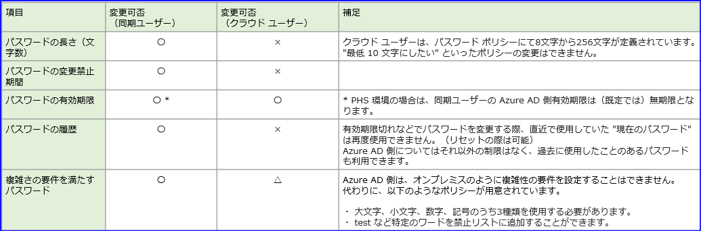
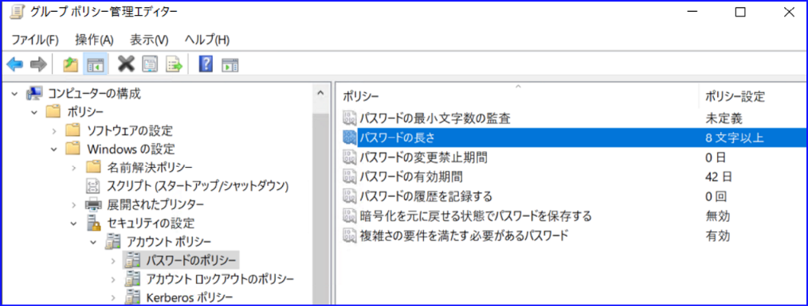
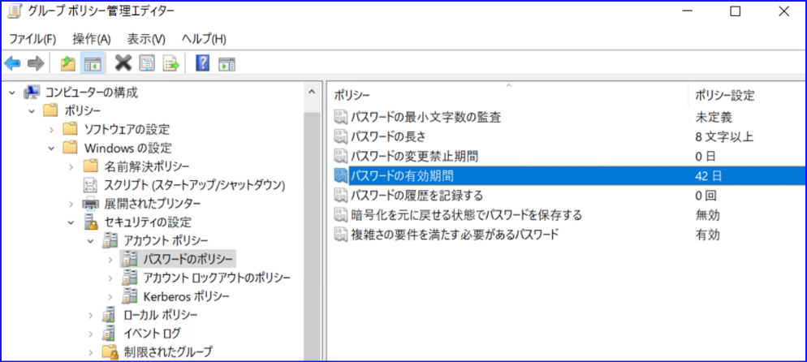
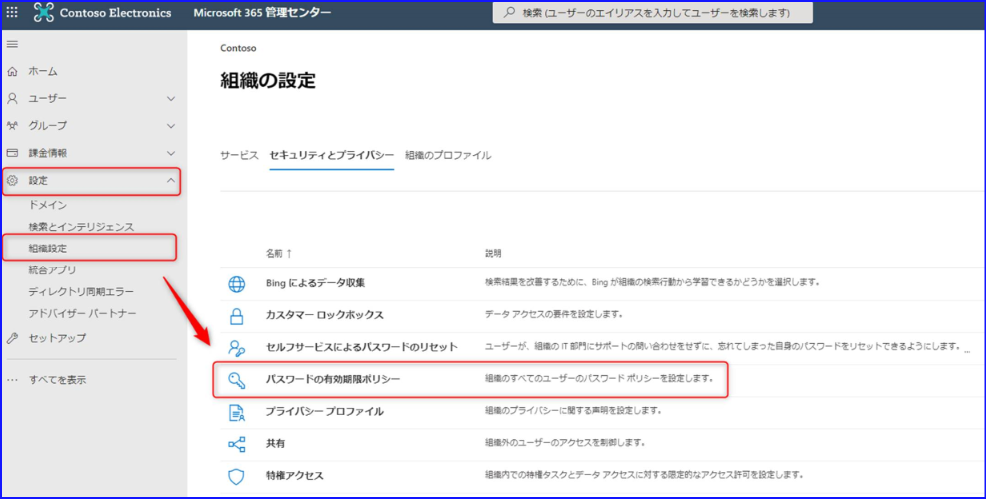
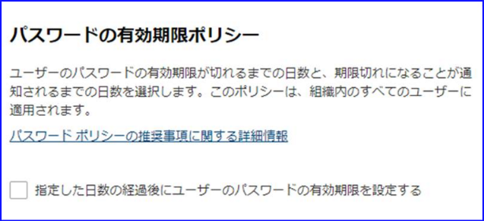
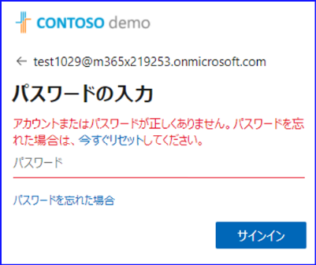
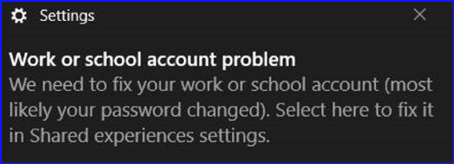
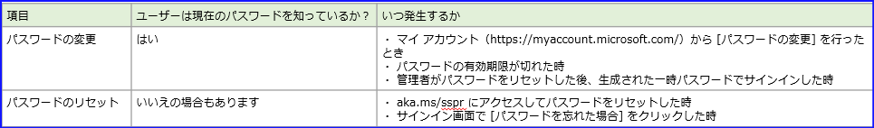
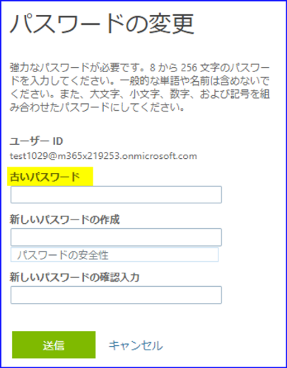
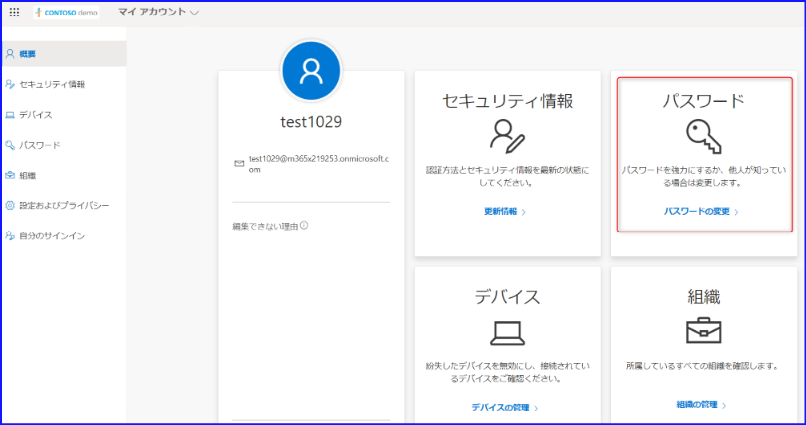

こんにちは、 Azure ID チームの小出です。  
今日は、混乱しやすい Azure AD のパスワード ポリシーについて、どのユーザーにどの項目が該当するか、同期ユーザーとクラウド ユーザーの観点からそれぞれご案内します。
 
## はじめに
多くの企業では、 Azure AD Connect を使用して、オンプレミス側からユーザー アカウントを同期して Azure AD や Microsoft 365 を利用していることと思います。
Azure AD には、クラウド上に直接作成したクラウド ユーザーや、ほかのテナントから招待したゲスト ユーザーなど、多くの種類のアカウントも登録されている場合もあります。

最近では、MFA などパスワード以外の方法も併用してサインインする方法も増えてきましたが、パスワードを使用して Azure AD やオンプレミス環境にサインインしている方がほとんどと思います。
こうした様々なユーザー アカウントを管理するうえで、Azure AD や Microsoft 365 の管理者は、どのユーザーにどういったパスワード ポリシーが割り当たっているか確認する必要がありますが、ユーザーの種類や環境の多さにより、どの設定が適用されているのかわかりにくい場面が多くありました。

こうしたパスワード ポリシーについて、「公開情報を確認しても混乱している、認識を確認したい」といったお問い合わせを多く頂戴していることから、今回は各設定の詳細についてご案内します。

目次  
A. ユーザー種類別パスワード ポリシー早見表  
B. パスワードの文字数、複雑性などについて  
C. パスワードの有効期限について  
 - C-1. パスワード ハッシュ同期環境の同期ユーザー    
 - C-2. パススルー認証や AD FS 環境など、オンプレミス側で認証を行う同期ユーザー    
 - C-3 クラウド ユーザー    
 - C-4. ゲスト ユーザー 

D. 補足情報（FAQ）  

## A. ユーザー種類別パスワード ポリシー早見表
パスワード ポリシーの詳細に入る前に、まずはパスワード ポリシー早見表をユーザー種類別にご案内します。




## B. パスワードの文字数、複雑性について
パスワードの文字数や複雑性は、同期ユーザーかクラウド ユーザーかの観点で判断することができます。
同期ユーザーの文字数や複雑性のポリシーには、オンプレミス側のパスワード ポリシーが適用されます。

同期ユーザーに適用されるオンプレミス AD 側のポリシーは、有効期限と同様、[アカウント ポリシー] 内の [パスワードのポリシー] から変更できます。
たとえば、以下の [パスワードの長さ] を変更することで、長さを 6 文字以上などと短縮したり、 10 文字以上などより厳しいポリシーに設定したりすることも可能です。




クラウド ユーザーに適用される Azure AD のパスワード ポリシーは、有効期限を除いてポリシーを変更することができません。
Azure AD のパスワード ポリシーの詳細は、[以下の公開情報](https://docs.microsoft.com/ja-jp/azure/active-directory/authentication/concept-sspr-policy#azure-ad-password-policies) もご利用ください。  

ゲスト ユーザーについては、ゲストがもともとメンバーとして登録されている "ホーム テナント" の設定に準じます。
そのため、ゲスト ユーザーに対しどのようなポリシーが適用されているか確認したい場合は、ホーム テナント側の管理者様に確認を依頼してください。


## C. パスワード有効期限について
有効期限は、 1 つのパスワードを最大何日間使用できるかを指定する項目です。この期限が切れると、ユーザーは次回サインインする際に、パスワードを新しいものに変更する必要があります。  
有効期限について考える時は、同期ユーザー or クラウド ユーザーなのかという観点のほかに、 "オンプレミス側 or クラウド側のどちらで認証が行われているか" を考慮するとわかりやすくなります。
それぞれのシナリオごとに詳細を記載しておりますので、確認されたいユーザーの種類と環境が該当する項目をご確認ください。


### シナリオ C-1: パスワード ハッシュ同期環境の同期ユーザーの場合
同期ユーザーの場合、オンプレミス側の有効期限がそのまま Azure AD 側に同期されていると誤解されていることがあります。しかしながら、同期ユーザーのパスワード有効期限は、オンプレミス側・ Azure AD 側のそれぞれで値を持っています。  
このシナリオの場合、パスワードの情報はオンプレミス側、 Azure AD 側の双方にあるため、「ユーザーがどこにサインインするか（どこで認証されるか）」によって、適用される有効期限が異なります。

例えば、ドメイン参加しているクライアント端末にログオンする際は、認証はオンプレミス側のドメイン コントローラーにて行われるため、オンプレミス側の有効期限設定が適用されます。
Azure ポータルや Microsoft 365 にサインインする際は、Azure AD 側の有効期限設定が適用されます。  
オンプレミス側のパスワード有効期限が切れると、次のサインインの際オンプレミス側でパスワードの変更が要求されます。変更すると、そのパスワードが Azure AD にも反映され、新しいパスワードでサインインできるようになります。

しかしながら、パスワード ハッシュ同期では、同期ユーザーの Azure AD 側パスワード有効期限は無期限とするよう個別に設定されているため、既定では Azure AD 側のパスワードは有効期限が切れません。
そのため、オンプレミス側のパスワード有効期限が切れたあとも、オンプレミス側で新しいパスワードに変更するまでの間、 Azure AD 側には有効期限切れのパスワードでサインインできます。  
オンプレミス側では有効期限が切れているパスワードで Azure AD 側にサインインさせたくない場合は、EnforceCloudPasswordPolicyForPasswordSyncedUsers のオプションをオンにして、 Azure AD 側のパスワード ポリシーを無期限にしないよう設定します。（詳細を補足 D にて記載しています。）


### シナリオ C-2: パススルー認証など、オンプレミス側で認証を行う同期ユーザーの場合
パススルー認証や AD FS を利用している場合、Azure ポータルや Microsoft 365 にサインインする際の認証は Azure AD 側ではなく、オンプレミス AD 側にて行われます。そのため、Azure ポータルにサインインした際などにも、適用されるのはオンプレミス側の有効期限ポリシーです。

また、パスワードの有効期限を確認したい場合は、オンプレミス側のパスワード ポリシーを確認します。
グループ ポリシー管理コンソールより、 Default Domain Policy を編集し、[アカウント ポリシー] - [パスワード ポリシー] を開くことで確認できます。  
なお、アカウント ポリシーは、ドメインにリンクされた GPO のみが処理されるため、ドメイン内で 1 つのみ定義することができます。
そのため、以下のように Default Domain Policy を編集して設定します。  



### シナリオ C-3: Azure AD に直接作成したクラウド ユーザーの場合
Azure AD で直接作成したクラウド ユーザーには、Azure AD 側のパスワード ポリシーで指定された日数が、パスワードの有効期限として適用されています。
この日にちを過ぎると、サインインを行う際に、パスワードの変更要求が表示されます。

Azure AD のパスワード有効期限は、Microsoft 365 管理センターもしくは PowerShell から変更できる設定です。

手順
1. Microsoft 365 管理センターを開きます。
2. [設定] - [組織設定] - [セキュリティとプライバシー] タブ内の [パスワードの有効期限ポリシー] を選択します。  

 
3. 設定値を確認します。以下の画像では、パスワードの有効期限が 90 日に設定されています。  

 
4. パスワードの有効期限を無期限にしたい場合は、以下のようにチェックボックスをオフにします。  

 
 
### シナリオ C-4: ゲスト ユーザーの場合
ゲスト ユーザーのパスワード有効期限は、ゲストがもともと登録されているホーム テナントの組織で管理されています。
そのため、ゲストを招待したテナント側（リソース テナント側）では管理する必要がなく、ゲストがもともと登録されているホーム テナント側の組織の設定を確認します。  
ゲスト ユーザーが user@outlook.com などの Microsoft アカウントの場合は、各サービスで定義されているパスワード ポリシーが適用されます。


## D. 補足情報（FAQ）
パスワード ポリシー関連でよくある質問をおまとめしております。  

**Q. パスワード ハッシュ同期の環境で、オンプレミス側の有効期限が切れたときに、 Azure AD 側に引き続き古いパスワードでアクセスできてしまいます。同期ユーザーのパスワードの有効期限を無期限から変更することはできますか。**   

A. はい、テナント側のEnforceCloudPasswordPolicyForPasswordSyncedUsers オプションを適用することで可能です。 Azure AD 側からパスワードを変更するためには、パスワード ライトバックを有効にする必要があります。
以下のコマンドを実行すると、Azure AD 側のユーザーにもパスワード有効期限を設定することができます。

実行コマンド：
```{PowerShell}
Set-MsolDirSyncFeature -Feature EnforceCloudPasswordPolicyForPasswordSyncedUsers -Enable $true
```

> [!WARNING]  
> 同期ユーザーのパスワード有効期限自体は、オンプレミス側から Azure AD 側に同期されていません。  
> この機能を有効にすると、オンプレミス側にサインインする際はオンプレミス側のポリシー、 Azure AD 側で認証を行う際は Azure AD 側のポリシーが適用されるなど、ユーザーが "どこにサインインするか" で適用される有効期限ポリシーが変わります。  
> オンプレミスと Azure AD の各ポリシーで異なる日数（例: オンプレミス側ポリシーは 30 日、Azure AD 側は 90 日）を設定していると、パスワードがいつ有効期限切れとなるかがわかりにくくなるため、オンプレミス側のポリシーと Azure AD 側のポリシーで設定する有効期限は、同じ日数にすることをお勧めします。
> 
> たとえば、両方ともポリシーで 90 日後にパスワードを変更するように設定されていれば、ほぼ同じタイミングで両方のパスワードが切れる動作となります。
> また、オンプレミス側・ Azure AD 側のどちらかでパスワードを変更すれば、それぞれ変更内容が同期（書き戻し）され、経過日数がリセットされます。


**Q.  [次回ログオン時にパスワードの変更が必要] をオンプレミス側で設定すると、Azue AD 側にサインインした時に "パスワードが間違っている" 旨のエラーが表示されてしまいます。Azure AD 側で一時パスワードから新しいものに変更させることはできますか?**    

A. はい、テナント側の ForcePasswordChangeOnLogOn オプションを有効化することで可能です。 Azure AD 側からパスワードを変更するために、パスワード ライトバックの機能を有効にしてください。

実行コマンド：
```{PowerShell}
Set-ADSyncAADCompanyFeature -ForcePasswordChangeOnLogOn $true
```

既定では一時パスワードの機能は無効のため、事前にオンプレミス側でパスワードを変更しないと、以下のようにエラーになってしまいます。
上記のコマンドを実行すると、新しいパスワードへの変更要求画面が表示されるようになります。    
この機能については、[公開情報の記載](https://docs.microsoft.com/ja-jp/azure/active-directory/hybrid/how-to-connect-password-hash-synchronization#enforcecloudpasswordpolicyforpasswordsyncedusers) もご確認ください。  
  


**Q. Microsoft 365 管理センターで確認できるパスワード有効期限の既定値は何日ですか？**  
A. 以前は 90 日に設定されていましたが、 2021 年の春頃以降新しく作成されたテナントは、既定値が無期限となりました。（そのため、既定値が無期限のテナントと、 90 日のテナントがあります。）  

**Q. Azure AD のパスワード ポリシーがいつのまにか無期限（90 日）になっています。誰が変更したか確認する方法はありますか？**  
A. 直近でポリシーが変更されている場合は、 Azure AD の監査ログで確認することが可能です。Set password policy のアクティビティでフィルターをかけたのちに、開始者（アクター）に記載のユーザーを確認してください。  

**Q. PowerShell で Get-MsolPasswordPolicy コマンドを実行し、テナントに設定されているパスワード有効期限を調べました。2147483647 日と表示されるのですが、どのような意味ですか？**  
A. テナントのパスワード有効期限が無期限になっていることを示しています。  


**Q. Microsoft 365 管理センターや PowerShell からパスワード ポリシーを編集しましたが、期限切れの通知が来ません。**  
A. 以前は Microsoft 365 ポータルの右上にベル アイコンが表示されていたのですが、通知設定自体が廃止されたため、"もうすぐ期限切れ" の通知は現在受信しません。  


**Q. Azure AD Join している端末にサインインしています。パスワードが切れているのに、端末にサインインできてしまうのですが、いつパスワード変更が求められますか？**  
A. 端末にログオンし、Windows のデスクトップを表示するところまでは、パスワードが切れていても実施できます。 Azure ポータルや Microsoft 365 管理センターにサインインした時に変更が求められます。 

端末に UPN (例: user@contoso.onmicrosoft.com) などでサインインした場合には、端末ログオン後、右下に以下のメッセージが表示される動作を現時点で確認しております。こちらもパスワード変更の際の目安となりましたら幸いです。




**Q. テナントに設定されている値ではなく、各ユーザーのパスワード有効期限を知りたいです。方法はありますか？**  
A. Azure ポータル上から簡単に確認することはできません。 PowerShell で取得した値をもとに計算してください。  

▼ テナントに設定されている有効期限を確認する  
1. Connect-MsolService コマンドを実行します。
2. Get-Msoldomain コマンドを実行し、正しいテナントに接続できているか確認します。
3. 下記のコマンドを実行し、テナントのパスワード有効期限ポリシーを確認します。この例では、パスワードの有効期限が切れるまでの日数（ValidityPeriod）は 90 日となります。

実行コマンド：
```{PowerShell}
Get-MsolPasswordPolicy -DomainName contoso.onmicrosoft.com
```

コマンド実行結果：
```{PowerShell}
ExtensionData                                    NotificationDays ValidityPeriod
-------------                                    ---------------- --------------  
System.Runtime.Serialization.ExtensionDataObject               14             90
```

▼ ユーザーが最後にパスワードを変更した日時を取得する  
4. 引き続き、 PowerShell より、以下のコマンドを実行します。  
 
実行コマンド：
```{PowerShell}
Get-MsolUser -UserPrincipalName user@contoso.onmicrosoft.com | ft UserPrincipalName, LastPasswordChangeTimestamp
```

コマンド実行例：
```{PowerShell}
UserPrincipalName                   LastPasswordChangeTimestamp
-----------------                   --------------------------- 
user@consoto.onmicrosoft.com        2021/02/02 16:11:54
```

5. 現在の日付を確認し、パスワードを最後に変更した日付、パスワード有効期限の日数と比較し、有効期限を確認します。


**Q. "パスワードの変更" と"パスワード リセット" は同じ意味ですか？どのような違いがありますか？**  
A. パスワードの管理において混乱しやすいポイントの一つですが、パスワードの変更とリセットには、以下のような違いがあります。  



パスワードの変更は、ユーザーが現在のパスワードを知っている場合に、新しいパスワードに変更するものです。変更を行う際は、現在のパスワード（古いパスワード）を入力する必要があります。  
たとえば、下記の要求画面も、パスワード変更に該当します。  
  


また、パスワードの有効期限が切れていない状態でも、以下のように、マイ アカウントの画面からパスワードを明示的に変更することが可能です。  



一方、パスワードのリセットは、ユーザーが現在のパスワードを必ずしも知っている必要はありません。  
パスワードを知っている場合でもリセットを行うことはできますが、パスワードがわからない、忘れた場合などにリセットを行うシナリオが一般的です。
（その他、発生したリスクへの対応を行うために、パスワードのリセットが必要なシナリオなどもあります。）

ユーザーが自身でパスワードのリセットを行う際は、以下のように、 [アカウントを回復する] の画面が表示されます。  


**Q. ユーザーに "パスワードの変更" をさせない方法はありますか？**  
A. いいえ、ユーザーは自身のパスワードをいつでも変更できます。 ユーザー自身がパスワードをリセットする SSPR の機能は、管理者が無効にすることもできます。  


**Q. 特定の文字列をパスワードに使用させたくありません。何か方法はありますか？**  
A. 会社名などをパスワードに入れることを禁止したい場合は、カスタム禁止パスワード リストに文字列を追加してください。  
なお、Admin や Password など明らかに脆弱なパスワードは、グローバル禁止リストで拒否されているため、別途の登録は不要です。
（グローバル禁止リストは、全テナントに自動で適用されているリストです。具体的な禁止リストの一覧はセキュリティ上公開できません。）
