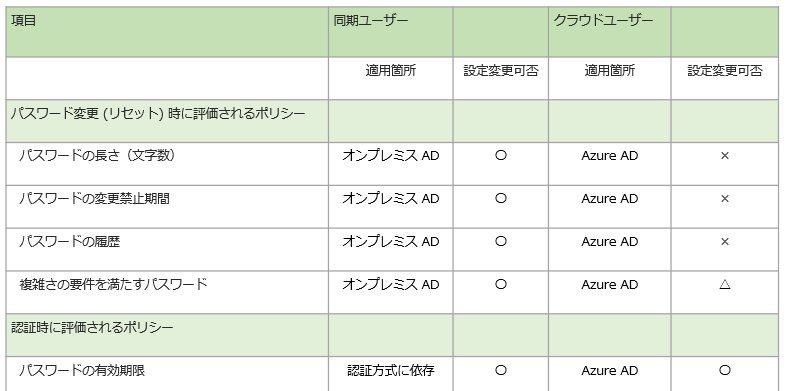
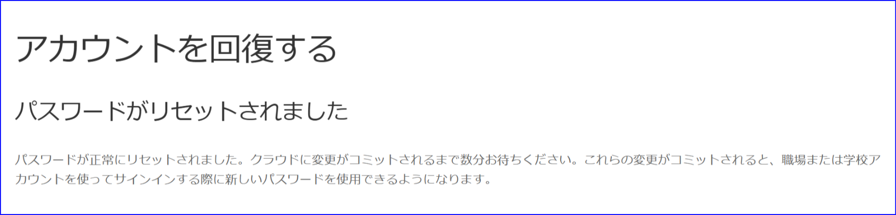

こんにちは、 Azure ID チームの小出です。

今日は、混乱しやすい Azure AD のパスワード ポリシーについて、どのユーザーにどの項目が該当するか、同期ユーザーとクラウド ユーザーの観点からそれぞれご案内します。
 
## はじめに

多くの企業では、Azure AD Connect を使用し、オンプレミス側からユーザー アカウントを同期して Azure AD や Microsoft 365 を利用していることと思います。Azure AD には、クラウド上に直接作成したクラウド ユーザーや、ほかのテナントから招待したゲスト ユーザーなど、多くの種類のアカウントも登録されている場合もあります。

最近では、MFA などパスワード以外の方法も併用してサインインする方法も増えてきましたが、パスワードを使用して Azure AD やオンプレミス環境にサインインしている方がほとんどと思います。こうしたパスワードを利用する様々なユーザー アカウントを管理するうえで、Azure AD や Microsoft 365 の管理者は、どのユーザーにどういったパスワード ポリシーが割り当たっているか確認する必要がありますが、ユーザーの種類や環境の多さにより、どの設定が適用されているのかわかりにくい場面が多くあります。

こうしたパスワード ポリシーについて、「公開情報を確認しても混乱している、認識を確認したい」といったお問い合わせを多く頂戴していることから、今回は各設定の詳細についてご案内します。

最後の FAQ ではマイクロソフトが推奨するパスワード ポリシーについても記載してありますので併せてご覧ください。

## 目次

A. ユーザー種類別のパスワード ポリシー早見表  
B. パスワード変更およびリセット時に評価されるポリシー (文字数と複雑性)  
C. 認証時に評価されるポリシー (有効期限)

 - C-1. パスワード ハッシュ同期環境の同期ユーザー    
 - C-2. パススルー認証や AD FS 環境などオンプレミス側で認証を行う同期ユーザー    
 - C-3. クラウド ユーザー    
 - C-4. ゲスト ユーザー

D. 補足情報 (FAQ)

## A. ユーザー種類別のパスワード ポリシー早見表

パスワード ポリシーの詳細に入る前に、まずはパスワード ポリシー早見表をユーザー種類別に案内します。



## B. パスワード変更およびリセット時に評価されるポリシー (文字数と複雑性)

パスワードの文字数や複雑性は、同期ユーザーかクラウド ユーザーかの観点で判断することができます。同期ユーザーの文字数や複雑性のポリシーには、オンプレミス AD 側のパスワード ポリシーが適用されます。

### 同期ユーザー

同期ユーザーに適用されるオンプレミス AD 側のポリシーは、有効期限と同様、[アカウント ポリシー] 内の [パスワードのポリシー] から変更できます。
たとえば、以下の [パスワードの長さ] を変更することで、長さを 6 文字以上などと短縮したり、 10 文字以上などより厳しいポリシーに設定したりすることも可能です。


なお、 Azure AD Connect のパスワード ライトバック オプションを利用されている場合、同期ユーザーであっても、Azure AD 上からのパスワード変更・リセットを行うことができます。
この場合、オンプレミス側のパスワード ポリシーのチェックが入る前に、 Azure AD 側でもチェックが入るため、推測が容易なパスワードに変更することはできません。

お客様の環境によっては、同期ユーザーであっても、 Azure AD 側のグローバル禁止リスト等の制限を受けるため、Azure AD 上からのパスワード変更画面でエラーが表示される場合などは、より複雑なパスワードへの変更を検討ください。
この章では詳細には触れていませんが、詳細は下記 Q&A を確認ください。


### クラウド ユーザー

クラウド ユーザーに適用される Azure AD のパスワード ポリシーは、有効期限を除いてポリシーを変更することができません。Azure AD のパスワード ポリシーの詳細は、[こちらの公開情報](https://docs.microsoft.com/ja-jp/azure/active-directory/authentication/concept-sspr-policy#azure-ad-password-policies) もご利用ください。  

クラウド ユーザーのパスワードの複雑性 (図の△部分) については、オンプレミス側と同じような設定が用意されているわけではありませんが、グローバル禁止リスト・カスタム禁止リストの機能が用意されています。グローバル禁止リストは、どのテナントでも有効になっており、無効化することはできません。 admin や baseball などの脆弱なパスワードを排除します。カスタム禁止リストは、お客様の会社名や会社の略称などを登録し、パスワードに使用できないよう禁止する機能です。詳細につきましては、[本公開情報](https://docs.microsoft.com/ja-jp/azure/active-directory/authentication/concept-password-ban-bad#global-banned-password-list) をご確認ください。  

### ゲスト ユーザー

ゲスト ユーザーについては、ゲストがもともとメンバーとして登録されている "ホーム テナント" の設定に準じます。そのため、ゲスト ユーザーに対しどのようなポリシーが適用されているか確認したい場合は、ホーム テナント側の管理者に確認を依頼ください。

## C. 認証時に評価されるポリシー (有効期限)

有効期限は、1 つのパスワードを最大何日間使用できるかを指定する項目です。この期限を迎えると、ユーザーは次回サインインする際にパスワードを新しいものに変更する必要があります。有効期限について考える時は、同期ユーザー or クラウド ユーザーなのかという観点のほかに、 "オンプレミス側 or クラウド側のどちらで認証が行われているか" を考慮するとわかりやすくなります。それぞれのシナリオごとに詳細を記載しておりますので、確認されたいユーザーの種類と環境が該当する項目をご確認ください。

### シナリオ C-1: パスワード ハッシュ同期環境の同期ユーザー

同期ユーザーの場合、オンプレミス AD 側の有効期限がそのまま Azure AD 側に同期されていると誤解されていることがあります。しかしながら、同期ユーザーのパスワード有効期限は、オンプレミス AD 側と Azure AD 側のそれぞれで値を保持しています。パスワードの情報はオンプレミス AD と Azure AD の双方にあるため、「ユーザーがどこにサインインするか (どこで認証されるか)」によって、適用される有効期限が異なります。

例えば、ドメイン参加しているクライアント端末にログオンする際は、認証はオンプレミス AD にて行われるため、オンプレミス AD のパスワード有効期限が適用されます。Azure ポータルや Microsoft 365 にサインインする際は、Azure AD 側の有効期限設定が適用されます。オンプレミス AD のパスワード有効期限を迎えると、次のオンプレミス AD へのサインインの際にオンプレミス側でパスワードの変更が要求されます。パスワードを変更すると、そのパスワードが Azure AD にも反映され、新しいパスワードで Azure AD にもサインインできるようになります。

しかしながら、パスワード ハッシュ同期では、同期ユーザーの Azure AD 側のパスワード有効期限は無期限とするよう個別に設定されています。このため、オンプレミス AD のパスワード有効期限が切れたあとも、オンプレミス側で有効期限切れのパスワードにて Azure AD 側にサインインできます。オンプレミス側で新しいパスワードに変更し、それが Azure AD に同期されると、Azure AD にその新しいパスワードでサインイン可能となります。オンプレミス側で有効期限が切れているパスワードで Azure AD にサインインさせたくない場合は、CloudPasswordPolicyForPasswordSyncedUsersEnabled のオプションをオンにして、 Azure AD 側のパスワード ポリシーを無期限にしないよう設定します (詳細を補足 D にて記載しています)。

### シナリオ C-2: パススルー認証や AD FS 環境などオンプレミス側で認証を行う同期ユーザー

パススルー認証や AD FS を利用している場合、Azure ポータルや Microsoft 365 にサインインする際の認証は Azure AD ではなく、オンプレミス AD にて行われます。そのため、Azure ポータルにサインインした際などにも、適用されるのはオンプレミス AD の有効期限ポリシーです。

また、パスワードの有効期限を確認したい場合は、オンプレミス AD のパスワード ポリシーを確認します。オンプレミス AD のパスワード ポリシーは、グループ ポリシー管理コンソールより Default Domain Policy を編集し、[アカウント ポリシー] - [パスワード ポリシー] を開くことで確認できます。

なお、アカウント ポリシーは、ドメインにリンクされた 1 つの GPO でのみ定義することが可能です。そのため、以下のように Default Domain Policy を編集して設定ください。


### シナリオ C-3: Azure AD に直接作成したクラウド ユーザーの場合

Azure AD で直接作成したクラウド ユーザーに対しては、パスワードの有効期限として Azure AD のパスワード ポリシーで指定された日数が適用されます。この日数を過ぎると、Azure AD にサインインする際にパスワードの変更要求が表示されます。

Azure AD のパスワード有効期限は、Microsoft 365 管理センターもしくは PowerShell から変更可能です。手順は以下のとおりです。

1. Microsoft 365 管理センターを開きます。
2. [設定] - [組織設定] - [セキュリティとプライバシー] タブ内の [パスワードの有効期限ポリシー] を選択します。

3. 設定値を確認します。以下の画像では、パスワードの有効期限が 90 日に設定されています。  

4. パスワードの有効期限を無期限にしたい場合は、以下のようにチェックボックスをオフにします。  


> [!TIP]  
> 上記の設定でパスワード有効期限を 90 日などに設定している環境でも、システム用アカウントなど、一部のユーザーだけ無期限にしたいシナリオがあるかと思います。  
> この場合は、上記の設定に加え、そのアカウントに対してのみ Update-MgUser コマンドで DisablePasswordExpiration を設定することで、個別に無期限にできます。  
> 詳細は、[個別のユーザーのパスワードを無期限に設定する](https://docs.microsoft.com/ja-jp/microsoft-365/admin/add-users/set-password-to-never-expire?view=o365-worldwide) の情報をご確認ください。  
 
### シナリオ C-4: ゲスト ユーザー

ゲスト ユーザーのパスワード有効期限は、ゲストがもともと登録されているホーム テナントの組織で管理されています。そのため、ゲストを招待したテナント側 (リソース テナント側) では管理する必要がなく、ホーム テナント側の組織の設定を確認します。ゲスト ユーザーが user@outlook.com などの Microsoft アカウントの場合は、各サービスで定義されているパスワード ポリシーが適用されます。

## D. 補足情報 (FAQ)

パスワード ポリシー関連でよくある質問をおまとめしております。  

### <span style="color: blue; ">Q:</span> パスワード ハッシュ同期の環境で、オンプレミス AD 側の有効期限が切れたときに、 Azure AD 側に引き続き古いパスワードでアクセスできてしまいます。同期ユーザーの Azure AD 側のパスワードの有効期限を無期限から変更することはできますか。  

<span style="color: red; ">A:</span> はい、テナント側の CloudPasswordPolicyForPasswordSyncedUsersEnabled  オプションを適用することで可能です。 Azure AD 側からパスワードを変更するためには、Azure AD Connect でパスワード ライトバックを有効にする必要もあります。

以下のコマンドを実行すると、Azure AD 側のユーザーにもパスワード有効期限を設定することができます。

```PowerShell
$OnPremSync = Get-MgDirectoryOnPremiseSynchronization
$OnPremSync.Features.CloudPasswordPolicyForPasswordSyncedUsersEnabled = $true

Update-MgDirectoryOnPremiseSynchronization `
  -OnPremisesDirectorySynchronizationId $OnPremSync.Id `
  -Features $OnPremSync.Features 
```

> [!WARNING]  
> 同期ユーザーのパスワード有効期限自体は、オンプレミス側から Azure AD 側に同期されていません。  
> この機能を有効にすると、オンプレミス側にサインインする際はオンプレミス側のポリシー、 Azure AD 側で認証を行う際は Azure AD 側のポリシーが適用されることとなり、ユーザーが "どこにサインインするか" で適用される有効期限ポリシーが変わります。  
> オンプレミスと Azure AD の各ポリシーで異なるパスワード有効期限の日数 (例: オンプレミス側ポリシーは 30 日、Azure AD 側は 90 日) を設定していると、パスワードがいつ有効期限切れとなるかがわかりにくくなるため、オンプレミス側のポリシーと Azure AD 側のポリシーで設定する有効期限は、同じ日数にすることをお勧めします。
> 
> たとえば、オンプレミスと Azure AD の両方のポリシーで 90 日後にパスワードを変更するように設定されていれば、ほぼ同じタイミングで両方のパスワードが期限切れとなる動作となります。
> また、オンプレミス側もしくは Azure AD 側のどちらかでパスワードを変更すれば、パスワードハッシュ同期およびパスワード ライトバック機能により変更内容が同期され、経過日数がリセットされます。

### <span style="color: blue; ">Q:</span>  [次回ログオン時にパスワードの変更が必要] をオンプレミス側で設定すると、Azue AD 側にサインインした時に "パスワードが間違っている" 旨のエラーが表示されてしまいます。Azure AD 側で一時パスワードから新しいものに変更させることはできますか?    

<span style="color: red; ">A:</span> はい、テナント側の ForcePasswordChangeOnLogOn オプションを有効化することで可能です。 Azure AD 側からパスワードを変更するために、Azure AD Connect でパスワード ライトバックの機能を有効に設定ください。

```PowerShell
$OnPremSync = Get-MgDirectoryOnPremiseSynchronization
$OnPremSync.Features.UserForcePasswordChangeOnLogonEnabled = $true

Update-MgDirectoryOnPremiseSynchronization `
  -OnPremisesDirectorySynchronizationId $OnPremSync.Id `
  -Features $OnPremSync.Features 
```

既定では上記機能は無効のため、事前にオンプレミス側でパスワードを変更しないと、以下のようにエラーになってしまいます。上記のコマンドを実行すると、Azure AD 側で新しいパスワードへの変更要求画面が表示されるようになります。この機能については、[公開情報の記載](https://docs.microsoft.com/ja-jp/azure/active-directory/hybrid/how-to-connect-password-hash-synchronization#enforcecloudpasswordpolicyforpasswordsyncedusers) もご確認ください。

  

### <span style="color: blue; ">Q:</span> Microsoft 365 管理センターで確認できるパスワード有効期限の既定値は何日ですか？

<span style="color: red; ">A:</span> 以前は 90 日に設定されていましたが、 2021 年の春頃以降新しく作成されたテナントは、既定値が無期限となりました (そのため、既定値が無期限のテナントと、 90 日のテナントがあります)。

### <span style="color: blue; ">Q:</span> Azure AD のパスワード ポリシーがいつのまにか無期限になっています。誰が変更したか確認する方法はありますか？

<span style="color: red; ">A:</span> 直近でポリシーが変更されている場合は、Microsoft Entra ID の監査ログで確認することが可能です。Set password policy のアクティビティでフィルターをかけたのちに、開始者（アクター）に記載のユーザーを確認ください。

### <span style="color: blue; ">Q:</span> PowerShell で Get-MgDomain コマンドを実行し、テナントに設定されているパスワード有効期限を調べました。2147483647 日と表示されるのですが、どのような意味ですか？

<span style="color: red; ">A:</span> そのドメインについては、テナントのパスワード有効期限が無期限になっていることを示しています。  

### <span style="color: blue; ">Q:</span> Microsoft 365 管理センターや PowerShell からパスワード ポリシーを編集しましたが、期限切れの通知が来ません。

<span style="color: red; ">A:</span> 以前は Microsoft 365 ポータルの右上にベル アイコンが表示されていましたが、通知設定自体が廃止されたため、"もうすぐ期限切れ" の通知は現在送信されません。

### <span style="color: blue; ">Q:</span> Azure AD Join している端末にサインインしています。パスワードが切れているのに、端末にサインインできてしまうのですが、いつパスワード変更が求められますか？

<span style="color: red; ">A:</span> 端末にログオンし、Windows のデスクトップを表示するところまでは、パスワードが切れていても実施できます。Azure ポータルや Microsoft 365 管理センター、Exchange Online など Azure AD と連携するクラウド上のリソースにサインインした時にパスワード変更が求められます。 

端末に UPN (例: user@contoso.onmicrosoft.com) などでサインインした場合には、端末ログオン後、右下に以下のメッセージが表示される動作を現時点で確認しております。こちらもパスワード変更の際の目安となりましたら幸いです。


### <span style="color: blue; ">Q:</span> テナントに設定されている値ではなく、各ユーザーのパスワード有効期限を知りたいです。方法はありますか？

<span style="color: red; ">A:</span> Azure ポータル上から簡単に確認することはできません。 PowerShell で取得した値をもとに計算ください。  

テナントに設定されている有効期限を確認するには以下のように実施ください。

1. Connect-MgGraph コマンドを実行します。
2. Get-MgContext コマンドを実行し、正しいテナントに接続できているか確認します。
3. 下記のコマンドを実行し、テナントのパスワード有効期限ポリシーを確認します。この例では、パスワードの有効期限が切れるまでの日数（PasswordValidityPeriodInDays）は 90 日となります。

```PowerShell
Get-MgDomain -DomainId contoso.onmicrosoft.com | select Id,PasswordNotificationWindowInDays,PasswordValidityPeriodInDays
```

例として、以下のようにコマンド実行結果が表示されます。

```PowerShell
Id                            PasswordNotificationWindowInDays PasswordValidityPeriodInDays
--                            -------------------------------- ----------------------------
contoso.onmicrosoft.com                                   14                   90
```

ユーザーが最後にパスワードを変更した日時を取得するには以下のようにします。

4. 引き続き、PowerShell より以下のコマンドを実行します。  
 
```PowerShell
Get-MgUser -UserId admin@contoso.onmicrosoft.com -Property UserPrincipalName, LastPasswordChangeDateTime | fl UserPrincipalName, LastPasswordChangeDateTime
```

コマンドの実行結果の例は以下のとおりです。

```PowerShell
UserPrincipalName          : admin@M365x61971868.onmicrosoft.com
LastPasswordChangeDateTime : 2024/02/27 4:51:12
```

5. 現在の日付を確認し、パスワードを最後に変更した日付とパスワード有効期限の日数と比較し、有効期限を確認します。

### <span style="color: blue; ">Q:</span> "パスワードの変更" と"パスワード リセット" は同じ意味ですか？どのような違いがありますか？

<span style="color: red; ">A:</span> パスワードの管理において混乱しやすいポイントの一つですが、パスワードの変更とリセットには、以下のような違いがあります。  


パスワードの変更は、ユーザーが現在のパスワードを知っている場合に、ユーザーが自ら新しいパスワードに変更するものです。変更を行う際は、現在のパスワード (古いパスワード) を入力する必要があります。  
たとえば、下記の要求画面もパスワード変更に該当します。

  

また、パスワードの有効期限が切れていない状態でも、以下のように、マイ アカウントの画面からパスワードを明示的に変更することが可能です。


一方、パスワードのリセットは、ユーザーが現在のパスワードを必ずしも知っている必要はありません。パスワードを知っている場合でもリセットを行うことはできますが、パスワードがわからない、忘れた場合などにリセットを行うシナリオが一般的です (その他、発生したリスクへの対応を行うために、パスワードのリセットが必要なシナリオなどもあります)。

ユーザーが自身でパスワードのリセットを行う際は、以下のように、[アカウントを回復する] の画面が表示されます。


### <span style="color: blue; ">Q:</span> ユーザーに "パスワードの変更" をさせない方法はありますか？

<span style="color: red; ">A:</span> いいえ、ユーザーは自身のパスワードをいつでも変更できます。 ユーザー自身がパスワードをリセットする SSPR の機能は、管理者が無効にすることもできます。  

### <span style="color: blue; ">Q:</span> 特定の文字列をパスワードに使用させたくありません。何か方法はありますか？

<span style="color: red; ">A:</span> 会社名などをパスワードに入れることを禁止したい場合は、カスタム禁止パスワード リストに文字列を追加ください。なお、Admin や Password など明らかに脆弱なパスワードは、グローバル禁止リストで拒否されているため、別途の登録は不要です (グローバル禁止リストは、全テナントに自動で適用されているリストです。具体的な禁止リストの一覧はセキュリティ上公開できません)。

### <span style="color: blue; ">Q:</span> グローバル禁止リストやカスタム禁止パスワードはいつ評価されますか？

<span style="color: red; ">A:</span> パスワード変更時およびリセット時に評価されます。ただし、カスタム禁止リストに登録したワードであっても、[公開情報](https://docs.microsoft.com/ja-jp/azure/active-directory/authentication/concept-password-ban-bad#how-are-passwords-evaluated) に記載のパスワード評価の結果によっては、パスワードが受け入れられる可能性があります。  

### <span style="color: blue; ">Q:</span> 同期ユーザーが Azure AD 側からパスワードを変更しようとしています。毎回「数分お待ちください」 の画面が表示されるのですが、なぜですか？

<span style="color: red; ">A:</span> Azure AD のパスワード ポリシーを満たしていないものの、オンプレミス AD のパスワード ポリシーを満たしているパスワードを指定しているためです。たとえば、オンプレミス AD のパスワード ポリシーで、文字数を 7 文字以下にしていたり、複雑性の設定を無効にしていたりする場合に発生します。  

同期ユーザーのパスワード ポリシーは、基本的にオンプレミス側の設定で制御していますが、パスワード変更およびリセットを Azure AD 側から行う場合は、Azure AD 側でもポリシーのチェックが行われています。Azure AD のパスワード ポリシーも満たすようなパスワードに変更した場合 (例: 8 文字以上、大文字・小文字・数字・記号のうち 3 つ以上使うなど）は、即座に Azure AD 側のパスワードが変更されるため、「数分お待ちください」の画面は表示されません。  

しかしながら、オンプレミス AD 側のポリシーが Azure AD のポリシーより「緩く」設定されている環境で、オンプレミス側のポリシーのみを満たすパスワードに変更すると、この Azure AD 側のチェックをパスせず、 Azure AD 側のパスワードを直接変更することができません。オンプレミス側ではパスワードが受け入れられているため、 Azure AD Connect 経由でパスワード ハッシュ同期 (2 分毎) が行われると、Azure AD 側でも新しいパスワードに正常に変更されます。特にエラー メッセージではないため対処の必要はありませんが、次回のパスワード ハッシュ同期までの最大 2 分程度、パスワードが完全に反映されるまでに時間がかかる点にご留意ください。


### <span style="color: blue; ">Q:</span> 同期ユーザーが Azure AD 側からパスワードをリセットしようとしています。毎回「数分お待ちください」 の画面が表示されるのですが、なぜですか？
 
<span style="color: red; ">A:</span> 上記と同様に、Azure AD のパスワード ポリシーを満たしていないものの、オンプレミス AD のパスワード ポリシーを満たしているパスワードを指定しているためです。理由や動作の詳細はパスワード変更時と同様ですが、少々表示される画面が異なります。





### <span style="color: blue; ">Q:</span> マイクロソフトが推奨するパスワード ポリシーはありますか？

マイクロソフトが推奨するパスワード ポリシーは、[パスワード ポリシーの推奨事項](https://docs.microsoft.com/ja-jp/microsoft-365/admin/misc/password-policy-recommendations?view=o365-worldwide) にまとめられています。以下に概要をおまとめします。

- 最小文字数を 8 桁にする
- 文字構成 (複雑さ) の要件を求めない (たとえば、*&(^%$ などを必須としない)
- ユーザーに定期的なパスワード変更を求めない
- よく使われるパスワードの文字列を禁止する
- 業務以外の目的で組織のパスワードを再利用しない

頻繁なパスワード変更や記号を用いた複雑なパスワードを強制したいというお客様は少なくありません。しかしながらそのような厳しいポリシーでは反対にセキュリティが低下することが研究により明らかになっています。これは、ユーザーが似たパスワードを使いまわしたり、推測しやすいパスワードを使う傾向にあるためです。頻繁なパスワード変更や記号を用いた複雑なパスワードを強制するという古い常識にとらわれず、上記資料をベースにした適切なパスワード管理に取り組んでいただければ幸いです。

Azure AD ではパスワードを利用しないサインインも推奨しておりますので、[Azure AD のパスワードレス認証](https://docs.microsoft.com/ja-jp/azure/active-directory/authentication/concept-authentication-passwordless) についても今後ご検討いただければと思います。
