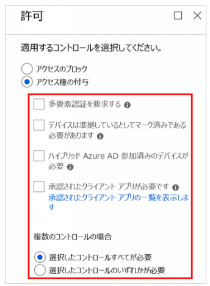

> 本記事は Technet Blog の更新停止に伴い https://blogs.technet.microsoft.com/jpazureid/2018/09/27/ca-basic/ の内容を移行したものです。
> 元の記事の最新の更新情報については、本内容をご参照ください。

# 条件付きアクセスの基本的な考え方

こんにちは、Azure & Identity サポート チームの栗井です。

この記事では条件付きアクセスポリシー設定の基本的な考え方について解説します。

## 条件付きアクセスの基本的な考え方は、アクセスを制限すること

条件付きアクセスポリシーは、アクセスを許可する条件の設定ではなく、アクセスをブロック / または制限 (特定の条件を満たさなければブロック) する条件を設定します。

基本的にはすべてのアクセスが許可された状態で、「ブロック、もしくは制御したいアクセスパターンのブラックリストを作成する」とイメージすると、分かりやすいかもしれません。条件付きアクセスポリシーを 1 つも設定していない場合や、それぞれのポリシーの「割り当て」で設定した対象に合致しない場合は、特に制限無くアクセスできる動作となります。ポリシーの「割り当て」で設定した対象に合致した場合には、「アクセス制御」で設定した内容が適用されます。

例えば、アクセスがブロックされたり、あるいは 多要素認証が要求されるなど、アクセスするための制限が加わります。

## 条件付きアクセスのポリシーに、順序による優先順位はありません

条件付きアクセスポリシーを複数定義した場合、定義した順番 (画面表示上の上下) で優先順位はありません。すべてのポリシーが評価対象であり、以下のように動作します。

- どれか１つのポリシーでブロックの対象となった場合、アクセスはブロックされます。
- 複数のポリシーでアクセスを制限された場合、すべての条件を満たさないかぎり、アクセスはブロックされます。
- どのポリシーの対象にもならない場合、あるいはすべての条件を満たした場合、アクセスが許可されます。

## 条件付きアクセスのポリシーの設定とアクセス可否の図

以下に、条件付きアクセスのポリシーの設定とアクセス可否の関係を簡潔なチャートで示します。

1. ポリシーの「割り当て」に該当するか

    最初に、ポリシーの割り当て対象に該当するかどうかが評価されます。割り当て対象に該当しない場合は、アクセスは許可されます。割り当て対象に該当する場合、以下の 2 の評価に続きます。

2. ポリシーの「アクセスのブロック」対象か「アクセス権の付与」対象か

    すべてのポリシーには、「アクセスのブロック」「アクセス権の付与」のいずれかのコントロールが設定されています。「アクセスのブロック」が設定されている場合、アクセスはブロックされます。「アクセス権の付与」である場合、以下の 3 の評価に続きます。

3. 「アクセス権の付与」条件を満たすかどうか

    「アクセス権の付与」のコントロールが設定されているポリシーでは、アクセス権の付与条件が少なくとも一つ以上設定されています。

    

この項目によって設定される条件を満たした場合、アクセスが許可されます。条件を満たさない場合には、アクセスはブロックされます。

上記の 1 から 3 の評価を、すべてのポリシーに対して行います。その中で、1 つでもブロックの対象となるポリシーが存在する場合には、アクセスは許可されません。すべてのポリシーで「割り当て」が対象外、あるいは「アクセス権の付与」条件を満たした場合にのみ、アクセスすることができます。

## 条件付きアクセスポリシー設定の例と挙動

以下に、主な設定例をいくつか示します。

- ポリシー A

      
    「全体管理者以外のすべてのユーザーに対して、いずれのクラウドアプリにログインする場合にも、スマートフォン (iOS、Android、Windows Phone) からのアクセスを禁止したい」場合の設定です。

- ポリシー B

    

    「特定のユーザーがアクセスする際に、多要素認証を要求したい」場合の設定です。

- ポリシー A と B がどちらも適用されるアクセスの場合

    「アクセス権をブロック」 は 「アクセス権を付与する」 よりも強力にはたらくため、ポリシー A と B がどちらも適用されるアクセスはブロックされます。

> 注意
> 割り当て対象を「すべてのユーザー」「すべてのクラウドアプリ」といたしますと、管理者を含めてすべてのユーザーがポータルにアクセスできない状態となり、ポリシーを変更することもできない状況となります。
> ポリシーを変更する管理者についてはアクセスできるように、対象外に該当のユーザーを登録してください。

## 関連サイト

条件付きアクセスに関する公式ドキュメントのリンクです。ぜひご覧ください。

- [Azure AD の条件付きアクセスのドキュメント](https://docs.microsoft.com/ja-jp/azure/active-directory/conditional-access/)
- [Azure Active Directory の条件付きアクセスとは](https://docs.microsoft.com/ja-jp/azure/active-directory/conditional-access/overview)
- [Active Directory 条件付きアクセスの条件の概要](https://docs.microsoft.com/ja-jp/azure/active-directory/conditional-access/conditions)
- [Azure Active Directory の条件付きアクセスのベスト プラクティス](https://docs.microsoft.com/ja-jp/azure/active-directory/conditional-access/best-practices)
- [Azure Active Directory の条件付きアクセスに関する FAQ](https://docs.microsoft.com/ja-jp/azure/active-directory/conditional-access/faqs)
などの公式情報が公開されています。

[Japan Azure Identity Support Blog: Azure AD の条件付きアクセスに関する Q&A]((../azure-active-directory/qanda-conditional-access.md))

上記内容が少しでも参考となりますと幸いです。製品動作に関する正式な見解や回答については、お客様環境などを十分に把握したうえでサポート部門より提供させていただきますので、ぜひ弊社サポート サービスをご利用ください。

※本情報の内容（添付文書、リンク先などを含む）は、作成日時点でのものであり、予告なく変更される場合があります。
