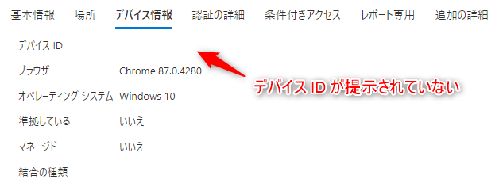
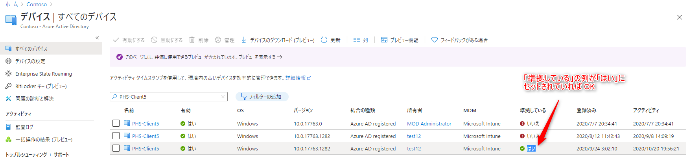
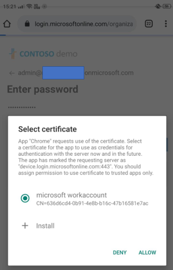
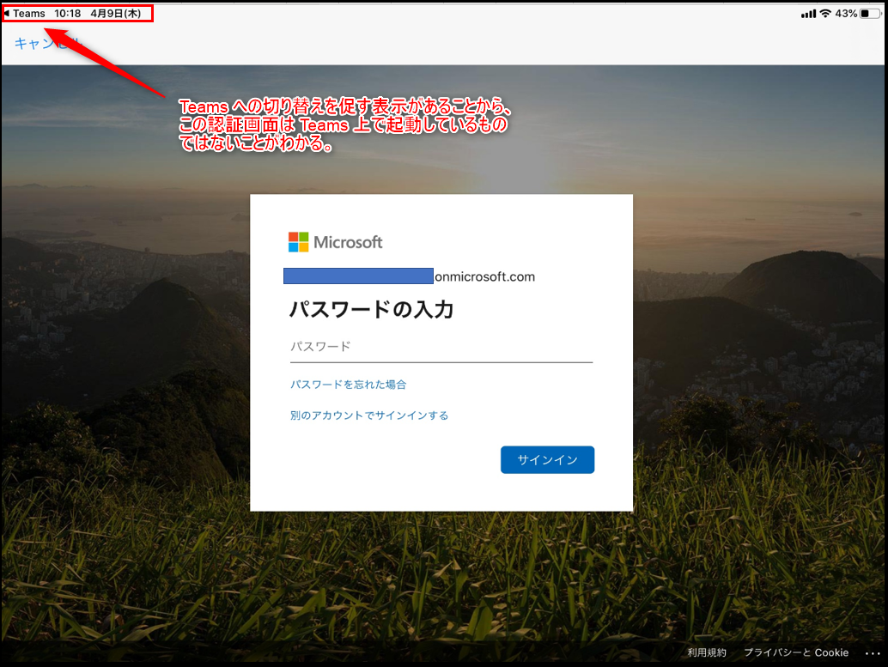
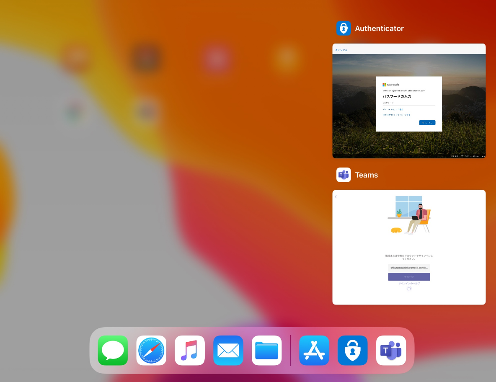

# [2026 年度版] 条件付きアクセスで 「準拠済み」 でブロックされる場合の対処法 (iOS / Android 編)

> [!NOTE]
> 本記事は 2021 年 2 月に公開した内容を、2026 年 6 月時点の最新情報に基づきリニューアルしたものです。リニューアル前の記事は [条件付きアクセスで 「準拠済み」 でブロックされる場合の対処法 (iOS / Android 編)](https://jpazureid.github.io/blog/azure-active-directory/conditional-access-compliant-ios-android/) をご参照ください。

こんにちは、Azure & Identity サポート チームの上出です。

条件付きアクセスで「デバイスは準拠しているとしてマーク済みである必要があります」の許可を設定しているにもかかわらず、準拠済みの端末からのアクセスがブロックされてしまうことがあります。今回は、iOS / Android でこの事象が発生した場合の原因と対処方法をご紹介します。

<エラー コード例>
>"errorCode": 53000, "failureReason": "Device is not in required device state: {state}. Conditional Access policy requires a compliant device, and the device is not compliant. The user must enroll their device with an approved MDM provider like Intune.", "additionalDetails": "Your administrator might have configured a conditional access policy that allows access to your organization's resources only from compliant devices. To be compliant, your device must be either joined to your on-premises Active Directory or joined to your Azure Active Directory.            More details available at https://docs.microsoft.com/azure/active-directory/active-directory-conditional-access-device-remediation

>"errorCode": 530003, "failureReason": "Your device is required to be managed to access this resource."
"additionalDetails": "The requested resource can only be accessed using a compliant device. The user is either using a device not managed by a Mobile-Device-Management (MDM) agent like Intune, or it's using an application that doesn't support device authentication. The user could enroll their devices with an approved MDM provider, or use a different app to sign in, or find the app vendor and ask them to update their app. More details available at https://docs.microsoft.com/azure/active-directory/active-directory-conditional-access-device-remediation

 

## <なぜブロックされるのか？>

条件付きアクセスの「準拠済み」の設定でブロックされる原因は、大きく以下の 2 つに分けられます。

1. **そもそも端末が準拠済みになっていない**
2. **端末は準拠済みだが、サインイン時にデバイス情報を Microsoft Entra ID に提示できていない**

弊社の過去事例では、2 のケース (端末は準拠済みだがデバイス情報を提示できていない) を多く確認しています。以下では、まずデバイス情報の提示がなぜ必要なのかを説明します。

条件付きアクセスの「準拠済み」の設定は、デバイス ベースのアクセス制御となるため、"どの端末からのアクセスか？" を Microsoft Entra ID が判断する必要があります。この判断のために、ご利用のデバイスは Microsoft Entra ID に対して "デバイス情報" を提示する必要があります。

ご利用の端末がデバイス情報を Microsoft Entra ID に提示できない場合、Microsoft Entra ID は "どの端末からのアクセスか？" を判断することができません。つまり「準拠済み」であるかも判断することができず、ブロックされてしまいます。
ブロックされたアクセスをサインイン ログで確認すると、以下のようにデバイス ID の情報が表示されていないことがわかります。

 

このように、端末が準拠済みであっても、デバイス情報を提示できていなければブロックされてしまいます。そのため、まず端末が準拠済みかどうかを確認したうえで、準拠済みであればデバイス情報を提示できない原因を切り分けていくのがスムーズです。

 

## <対処方法>

前述の 2 つの原因に沿って、以下の観点で確認を行います。まず確認ポイント A で端末が準拠済みかどうかを確認し (原因 1)、準拠済みであればデバイス情報を提示できない原因 (原因 2) として B 以降を確認していきます。
それぞれの項目ごとに解説します。

| No.                      | 確認ポイント                                                                                                                                      |
| ------------------------- | ----------------------------------------------------------------------------------------------------------------------------------------- |
| A                       | 準拠済み？                                                                                                         |
| B                       | サポートされたブラウザーを使用している？                                                                                                                 |
| C                       | Microsoft Edge を使用している場合、ブラウザーにサインインできている？                                                                               |
| D                      | 証明書を提示できていない |
| E | Microsoft Authenticator をインストールしていない                                               |
| F       | アプリの実装によりデバイス情報を提示できないこともある  
| G       | その他                             |

 

## A. 準拠済み？

利用している端末が準拠済みとなっているかを確認します。
Microsoft Entra 管理センターのデバイス一覧で、対象の端末の「準拠している」の列が「はい」にセットされていれば OK です。

対象の端末が準拠していない場合は、Microsoft Intune の観点で、なぜ準拠済みとならないのかを調査する必要があります。

 

## B. サポートされたブラウザーを使用している？

OS によってサポートされるブラウザーは異なるため、以下の公開情報を元にご利用のブラウザーがサポートされているかご確認をお願いします。

[条件付きアクセス: 条件 - サポートされているブラウザー | Microsoft Learn](https://learn.microsoft.com/ja-jp/entra/identity/conditional-access/concept-conditional-access-conditions#supported-browsers)

 

## C. Microsoft Edge を使用している場合、ブラウザーにサインインしている？

Microsoft Edge を利用してデバイス情報を提示するためには、ブラウザーにサインインしている必要があります。

[Microsoft Edge と条件付きアクセス | Microsoft Learn](https://learn.microsoft.com/ja-jp/deployedge/ms-edge-security-conditional-access)

>Microsoft Entra ID (旧称 Azure Active Directory) 資格情報を使用して Edge プロファイルにサインインすると、条件付きアクセスを使用して保護されたエンタープライズ クラウド リソースへのシームレスなアクセスが Microsoft Edge によって許可されます。

 

## D. 証明書を提示できていない

iOS / Android がデバイス情報を提示する仕組みは、ブラウザー アクセスの場合と、クライアント アプリの場合で異なります。

ブラウザー アクセスの場合は、iOS も Android も Microsoft Entra ID に証明書を提示することでデバイス情報を渡します。
Android の場合、以下のように端末内に保持している証明書一覧が表示されて、どの証明書を使用するのか促されます。(既に使用する証明書が決まっていると判断されれば促されない場合もあります)
ここで適切な証明書を選択すれば、証明書の中に保存されているデバイス情報を提示し、Microsoft Entra ID でデバイス ベースの条件付きアクセスの制御が可能となります。

なお、ここで使用する証明書 (上記画面の証明書) は、Intune ポータル サイトからインストール可能です。以下の公開情報をご参照の上、記載された画面と同様のメッセージが表示されている状況であれば、本公開情報の「ブラウザー アクセスを有効にする」手順をお試しください。

[Android のデバイス設定の要件 - 証明書がありません | Microsoft Learn](https://learn.microsoft.com/ja-jp/intune/user-help/compliance/update-settings-android#missing-certificate)

iOS の場合、Intune によるプロファイル設定が行われる際に証明書もあわせてインストールされることが想定されます。

> [!NOTE]
> iOS (Apple デバイス) では、Entra ID へのデバイス登録に紐づくデバイス ID の格納先がキーチェーンから Secure Enclave に変更されています。この変更により、非 MSAL 対応アプリやブラウザー (Safari など) でデバイス情報を提示できなくなる場合があります。詳細および対処方法については、以下のブログ記事をご参照ください。
> [Apple デバイスでキーチェーンから Secure Enclave 利用へ](https://jpazureid.github.io/blog/azure-active-directory/Keychain-to-SecureEnclave-for-Apple-device/)

iOS / Android を使用したブラウザー アクセスは、上記のように証明書を使用したデバイス情報の提示が可能となります。

一方で、モバイル アプリ (クライアント アプリ) の場合は、Microsoft Authenticator を使用して PRT を Microsoft Entra ID に提示する必要があります。詳細は 「E. Microsoft Authenticator をインストールしていない」で説明します。

 

## E. Microsoft Authenticator をインストールしていない

iOS / Android を使用してモバイル アプリ (ネイティブ アプリ) にアクセスする際は、基本的に Microsoft Authenticator を使用して PRT を Microsoft Entra ID に提示する必要があります。アプリの実装によっては、ブラウザーを経由してデバイス情報を提示する場合もあるため、その場合は Microsoft Authenticator を用いずにデバイス情報を提示可能です。

以下は iPad を使用した動作サンプルとなりますが、こちらを見ていただくと Microsoft Authenticator を使用してデバイス情報を提示するシナリオのイメージが湧くかと思います。

Microsoft Teams のモバイル アプリにサインインするために資格情報を入力すると、パスワード入力画面に遷移しています。画面左上に Teams の表示がありますが、これは Microsoft Teams が呼び出した画面ではないことがわかります。なぜなら、このパスワード入力画面が Microsoft Teams が呼び出した画面であれば、画面左側に Teams への切り替えを促す表示は出ないからです。

実際に、起動アプリを確認すると Microsoft Authenticator がパスワード入力画面を呼び出していることが確認できます。

このことから、Microsoft Teams から Microsoft Authenticator にリダイレクトされ、この動作でパスワード入力、および PRT を Microsoft Entra ID に渡しているように思われます。

※ なお、Android の場合は、このような画面遷移が行われていることを明示的に確認できませんが、同様の動作が行われているとお考えください。

 

## F. アプリの実装によりデバイス情報を提示できないこともある

3rd Party 製のアプリケーションの場合、デバイス情報を直接 Microsoft Entra ID に提示できるような実装か、Microsoft Authenticator 経由で提示できるように実装されている必要があります。具体的には、アプリケーションが Microsoft Authentication Library (MSAL) を使用して開発されていれば、MSAL にブローカー (Microsoft Authenticator) 連携の仕組みが組み込まれているため、自動的に Microsoft Authenticator 経由でデバイス情報を提示できます。3rd Party 製のアプリケーションが MSAL を使用しているかどうかは、アプリケーション ベンダーに直接ご確認いただく必要があります。

基本的に、Microsoft 製のアプリケーションは MSAL を使用しており、Microsoft Authenticator をブローカーとしてデバイス情報を提示するとお考え下さい。(Outlook などは Microsoft Authenticator を使用しなくてもデバイス情報を提示できるシナリオがあることを確認していますが、基本的には Microsoft Authenticator が使用されるとお考えください)

なお、モバイル デバイスに Microsoft Authenticator をインストールするだけでは不十分で、アプリケーション側が MSAL を使用し、Microsoft Authenticator をブローカーとして利用するように実装されている必要があります。上記の動作については、以下のアプリケーション開発者用の公開情報に記載がありますのでご参照ください。

[ブローカーを使用するようにアプリケーションを構成する | Microsoft Learn](https://learn.microsoft.com/ja-jp/entra/identity-platform/scenario-mobile-app-configuration#configure-the-application-to-use-the-broker)

> [!NOTE]
> iOS / iPadOS (Apple デバイス) では、MDM 経由で [Microsoft Enterprise SSO プラグイン](https://learn.microsoft.com/ja-jp/entra/identity-platform/apple-sso-plugin) を有効化することで、MSAL に対応していないアプリケーションでもデバイス情報の提示が可能になります。Enterprise SSO プラグインは Microsoft Authenticator アプリに組み込まれており、MDM で構成することで非 MSAL アプリにも SSO とデバイスベースの条件付きアクセスを拡張できます。構成方法の詳細は [iOS/iPadOS デバイスで Microsoft Enterprise SSO プラグインを使用する | Microsoft Learn](https://learn.microsoft.com/ja-jp/mem/intune/configuration/use-enterprise-sso-plug-in-ios-ipados-with-intune) をご参照ください。

 

## G. その他

その他サポート チームで確認できている事象や仕様についてです。

・ 3rd Party 製品によってデバイス情報が提示できない

クライアント端末から Microsoft Entra ID にデバイス情報を提示する経路上に、プロキシなど一部 3rd Party 製品の動作 (仕様) によって、デバイス情報が提示できない場合があることを確認しております。
もし切り分けの結果、ご利用の 3rd Party 製品を経由する場合のみ事象が発生するということであれば、該当のベンダーに確認のお問い合わせをいただければと思います。

 

## 関連ブログ

[Japan Azure Identity Support Blog: 条件付きアクセスで 「準拠済み」 や 「Hybrid Azure AD 参加が必要」 でブロックされる場合の対処法 (Windows 編)](https://jpazureid.github.io/blog/azure-active-directory/conditional-access-compliant-windows)
[Japan Azure Identity Support Blog: Apple デバイスでキーチェーンから Secure Enclave 利用へ](https://jpazureid.github.io/blog/azure-active-directory/Keychain-to-SecureEnclave-for-Apple-device/)

上記内容が少しでも参考となれば幸いです。製品動作に関する正式な見解や回答については、お客様環境などを十分に把握したうえでサポート部門より提供させていただきますので、ぜひサポートサービスまでお問い合わせください。
